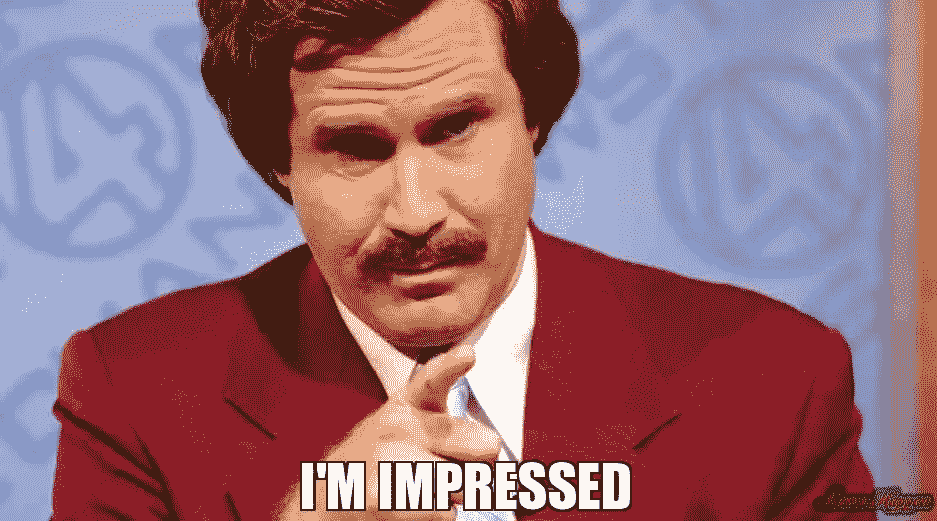

# 招聘软件架构师和工程师

> 原文：<https://levelup.gitconnected.com/recruiting-architects-and-engineers-b40c6eac9d86>

史蒂夫·哈拉马在 [Unsplash](https://unsplash.com/s/photos/interview?utm_source=unsplash&utm_medium=referral&utm_content=creditCopyText) 上拍摄的照片

现在换一种风格的文章:)。

十多年前，我开始为咨询行业(为我曾经工作过的公司)和企业(为我们参与过咨询项目的公司)的技术团队招聘人才。这是一篇简短的文章，写了我在寻找什么，我构建这个过程的方式，我通常会被哪种类型的人吸引，以及我会逃离哪种类型的人。

我*没有*招募成千上万的人，所以请记住，这是一篇观点文章，考虑了我多年来的学习。换句话说，这是博客可能达到的最主观的程度。我确信，再过五年，这篇文章将会根据我自己的学习所做的调整而有所变化。希望这个博客能加速我的学习，不管你站在哪一边，都有像你一样的读者的反馈

虽然我有几次机会招聘业务分析师、业务架构师、项目经理和主管，但我通常会接管技术团队的招聘流程。这篇文章主要关注我通常参与的两种角色——软件工程师和架构师。

# 共同点

在我深入探讨某些只留给工程师和架构师的问题之前，让我们首先记住一些共同的东西(这可能适用于所有的角色)。

## 我最看重的两件事:

**1)求知欲:**个人对学习事物的好奇程度，无论是对新领域感兴趣的横向范围还是对候选人已经熟悉的事物的纵向深度。

让我们现实一点——在我们的行业中，没有什么地方我们不希望人们在没有可搜索的知识库的情况下进入。个人有多努力去寻找不仅仅是为了完成手头的任务的东西，他们有多努力去理解不仅仅是他们工作的基本领域？

它与“成长心态”的概念有着松散的联系。这主要是在面试中评估的，是整个互动的微妙暗示——当他们解释他们取得了什么成就时，他们是如何找到信息的；他们如何让自己跟上行业发展的步伐，如果他们有机会重做这个“今天”，会发生什么变化？等等。

**2)认知:**将基于多个看似不相关的场景的点连接起来，形成完整画面的能力。“接通”是用来表示这一特性的常用表达。这是通过面试中一系列相连的问题。将会有候选人不知道答案的问题(或者解决方案将会在没有一次性提供所有条件的情况下被创建)；后续问题(通常不会紧接着前一个问题)会有提示，对遗漏的问题进行扩展。发现这种关系并回过头来回答前面问题的候选人会脱颖而出。

候选人的这两项技能几乎保证了你在大多数组织经历的不断变化的技术环境中导航所需的多功能性。你最终会拥有一个学习他人经验而不仅仅是自己经验的团队。

## 我最关注的两件事:

1.  **虚张声势:**和人生一样，并不指望你知道所有问题的答案。利用过去的经验(或上面提到的第二点)通过有根据的猜测来探索未知的能力是面试小组寻找的东西。另一方面，一个自信的诈唬是错误的，会到处出现危险信号。想一想——面试官问了一个他/她不知道答案的问题的概率有多大？如果仅仅依靠信心生存的可能性很小，你为什么要冒险虚张声势呢？同样，信心可以用[邓宁-克鲁格](https://en.wikipedia.org/wiki/Dunning%E2%80%93Kruger_effect)效应来解释。
2.  这是一次工作面试，所以很明显，候选人正在从他/她目前拥有的东西中寻找其他东西。然而，对多个前雇主的管理实践或工程实践进行攻击，不太可能让面试小组满意。现实情况是，面试时间太短，无法充分了解问题的细节——面试小组很容易认为候选人管理冲突或为自己的观点赢得支持的能力有限。

# 工程(开发人员):

## 面试方法:

*   根据职位的不同，准备了一系列问题，从候选人有经验的框架，到已经用于目标员工技术堆栈的框架。将会有与安全性和开发运维实践特别相关的问题。大多数问题都是基于场景的。
*   面试本身是根据应聘者的经历来引导的。例如，每一次面试都是以“告诉我们你的自我和职业生涯”开始的——大多数问题都是深入挖掘这里提到的东西(或者简历上提到的)。关键的意图是确保简历不仅仅是对之前公司项目的夸大描述，相反，它反映了候选人在其中的具体角色。

## 我远离的那种人:

*   那些对他们不了解的事情不必要的不屑一顾的人。它可以是一个框架，一种语言或者一个平台。我曾经有一个候选人，他从来没有在 Go 中构建过任何东西，却声称这是有史以来最糟糕的语言，没有任何条件。显然这是绝对糟糕的！

## 最擅长的人是:

*   那些能够清楚地描述他们所做的具体事情以及他们在之前的工作中对实践所做的改进的候选人会脱颖而出。除了我之前提到的“求知欲”，那些根据行业现状回答“如果你今天被要求重做这件事”的候选人会脱颖而出。

# 建筑:

在我们讨论我如何雇用架构师之前，先详细说明一下我所说的架构师是什么意思。这个特殊的头衔被过度使用到了这样一个程度:一个人是某个技术主题(产品、平台或框架)的绝对权威，而另一个人将业务需求松散地解释为序列图或流程交互，根据他们工作的组织，他们都会得到相同的头衔！

我通常招募的是技术人员，他们理解语言、框架和工具，足以进行适合性评估(但他们不会是交付团队中的编码员)，并能理解全局——企业试图做什么？我们现在在哪里？实现这一愿景的最佳架构是什么？我们如何构建一个可行的路线图来实现这一目标？

## 面试方法:

*   与工程师角色面试类似，我准备了一系列关于架构模式(例如 SCS 与微服务)、预算管理、安全性和 DevOps 原则等问题。这将与候选人的简历和具体的计划相一致，他们被雇用是为了了解适合度(他们不需要在他们被招募的计划堆栈中有经验——“有根据的猜测与虚张声势”将会清楚这一点)。
*   面试本身反映了工程师的面试。它从“告诉我们关于你自己和你的职业”开始，然后开始仔细检查细节。主要目的是了解候选人的全局可视化能力以及他们为之前的项目带来的价值。
*   架构师肯定会被问到更多关于冲突管理、涉众参与等方面的问题。，在技术(横向范围包括领域范围的知识，如 MDM、CRM 等)之上。)问题。

## 我远离的那种人:

*   “这只是一个实现细节”,在高层次上，比如平台的选择(让我们以消息传递为例——消息队列与 Kafka 等等。).我通常有这样的经验，这些人是著名的“象牙塔”理论家，他们对实际推进软件交付增加了有限的价值

## 最擅长的人是:

*   候选人不仅阐明了目标远景战略，而且还定义了路线图步骤，以渐进地将现有系统带到目标远景战略。了解实际限制—预算、时间、交付团队的技能等。然而，使用多步骤路线图创建健壮的目标状态是架构师的主要优势

最近与另一个团队的招聘经理的讨论让我开始思考这个问题。我故意把博客写得很短，只关注关键的事情。显然还有其他方面，如小组成员本身、面试地点、评估流程等。我不知道细节。我也有意地避开了诸如谦逊、傲慢等潜在的互动。可能下次吧。

凯特·卡尔瓦什在 [Unsplash](https://unsplash.com/s/photos/talking?utm_source=unsplash&utm_medium=referral&utm_content=creditCopyText) 上的照片

我渴望获得更多关于其他人寻找的关键性格特征的观点。如果你雇佣工程师和/或建筑师，你希望(雇佣和远离)什么？如果你更倾向于另一端——你希望这个过程是什么样的？

 [## 组合 API -轻松发展您的编码事业| gitconnected

### 消除在每个单独位置手动更新您的详细信息的痛苦。只需在您的中更改一次数据…

gitconnected.com](https://gitconnected.com/portfolio-api)