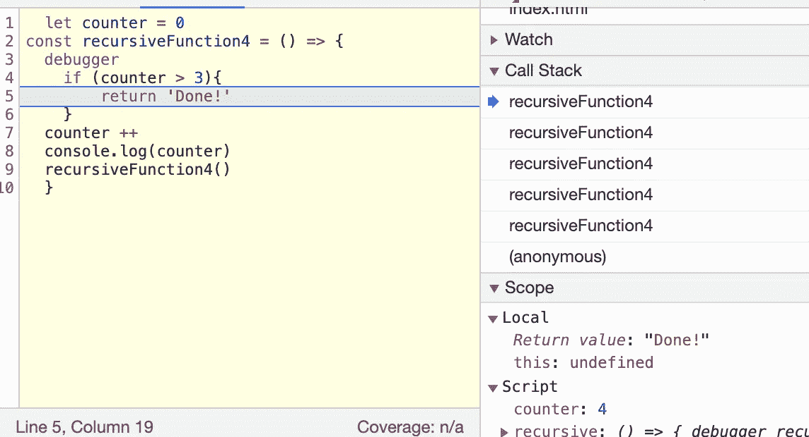

# 递归

> 原文：<https://levelup.gitconnected.com/recursion-3b3956eaffad>

超跳跃？或者只是堆栈内部溢出？

算法。一个听起来很美的词，立刻让你听起来好像你知道你在做什么。这个词过去常常让学生感到害怕(或高兴)。然而，算法只是程序员编写的一个函数。两行函数在技术上是一种算法。简单的求和函数就是一种算法。算法允许我们使用所有类型的数据结构来对数据执行操作。随着您的公司越来越大，您处理的数据也越来越多，在您的代码中有效地使用算法对于您公司的可伸缩性变得更加重要。算法允许你把你的大 O 复杂度变成更有效的复杂度。

> *算法是描述如何执行任务的一套准则*。—加州大学洛杉矶分校的约翰·比利亚塞诺尔— [链接](https://slate.com/technology/2016/02/whats-the-deal-with-algorithms.html)

好吧，那么什么是递归？函数直接或间接调用自身的过程称为递归，相应的函数称为递归函数。[链接](https://www.geeksforgeeks.org/recursion/)。本质上，递归函数在函数内部调用自己。

这是一个递归函数

递归是常用的，在 Javascript 中，当一个对象嵌套在另一个对象中时，就会用到递归。

但是上面的函数是做什么的呢？这个算法让我更多地了解了一个我并不太熟悉的问题。堆栈溢出。

什么是堆栈溢出？

当你第一次开始编码时，我敢肯定你以前在你的控制台中遇到过这个屏幕。

这是一种保障。它不是通过不断地一遍又一遍地调用这个函数来使浏览器崩溃，而是在到达一个极限时自动停止。

如果我们在内部 recursiveFunction 调用上面的行中添加一个调试器，它会将您带到我们的调试器控制台。如果我们使用从左到右的小箭头点击函数，我们的堆栈将会增加，每次增加一个新的递归函数。

当我点击它时，我每次都添加到我们的调用堆栈中

本质上，我们耗尽了内存，堆栈溢出！所以递归的一个缺点是，我们可能会一遍又一遍地运行一些东西，当我们在堆栈中持有每个被调用的函数时，就会占用内存。

现在我们知道了递归是如何工作的，它是将一个函数调用叠加到下一个函数调用上，你认为这个函数的结果会是什么？

等一下。我们的柜台变成了 4…但是还没有完成吗？为什么？这就是我们之前在控制台中看到的筹码发挥作用的地方。

如果我们在浏览器中再看一遍。你会看到，当我们计数到 4 时，我们的值确实表示“完成！”。然而，当我们继续播放递归函数时，它开始从栈顶弹出。

这里我们的计数器是 4，所以我们应该完成！

完美！让我们继续点击我们的功能

这里是堆栈中的最后一个函数调用！但是我们的返回函数在哪里呢？！

这是为什么呢？好吧，如果我们分解我们的堆栈，这就是它看起来的样子。

因此，我们可以通过简单地添加一个额外的返回，使用冒泡技术简单地解决这个问题。

这将显示“完成！”一旦你到了 4。

这就把我们带到了由 [Runestone](https://runestone.academy/runestone/books/published/pythonds/Recursion/TheThreeLawsofRecursion.html) 提出的递归的 3 个法则上:

1.  递归算法必须有一个**基案例。**(我们的 if 语句)。
2.  递归算法必须改变其状态，并向基本情况移动。(2 返回朝向返回“完成！”)
3.  递归算法必须递归地调用自身。(调用自身内部的函数)。

好了，我们把学习放到一个常见的问题里。这个词是回文吗？(从后到前读起来一样吗？例如赛车)。

所以，我们在这里做的是设置我们的基数，也就是如果我们的 word.length 等于 0，或者 1(因为这取决于单词的长度是奇数还是偶数)。如果是这样，这意味着我们已经到达了我们的基地，这个词必须是一个回文。

然而，如果我们的长度还不是 0 或 1，我们就进入改变状态的第二定律。如果第一个元素等于最后一个元素，那么它们匹配！这意味着我们可以再次返回我们的函数，但是这次我们去掉了第一个和最后一个字母(因为我们刚刚确认它们是相同的)。然后返回到顶部，检查我们的基本 if 函数。

但是，如果我们输入 ispalindome(' dog ')，函数会发现第一个和最后一个元素不匹配，因此返回 false！

这是递归函数的一个很好的用途！