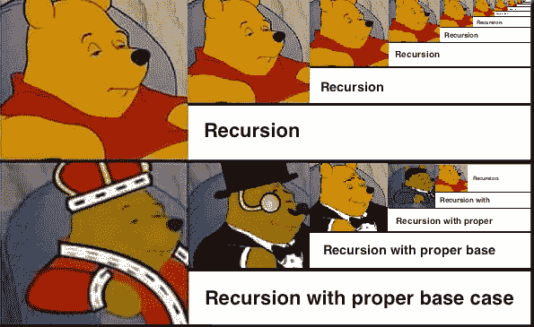
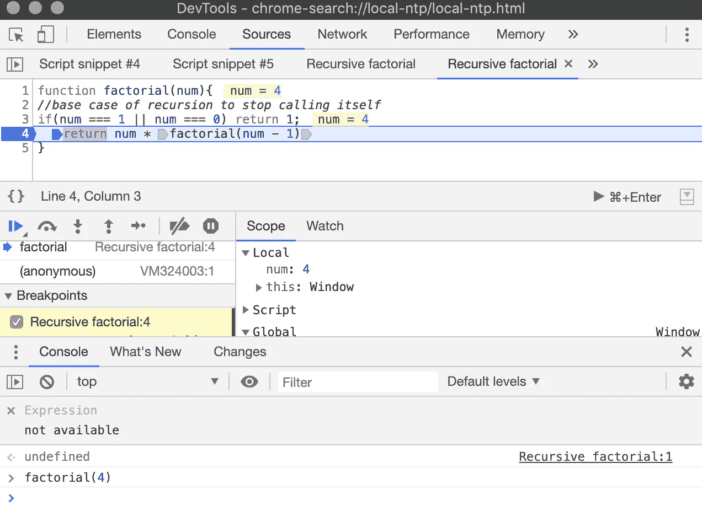
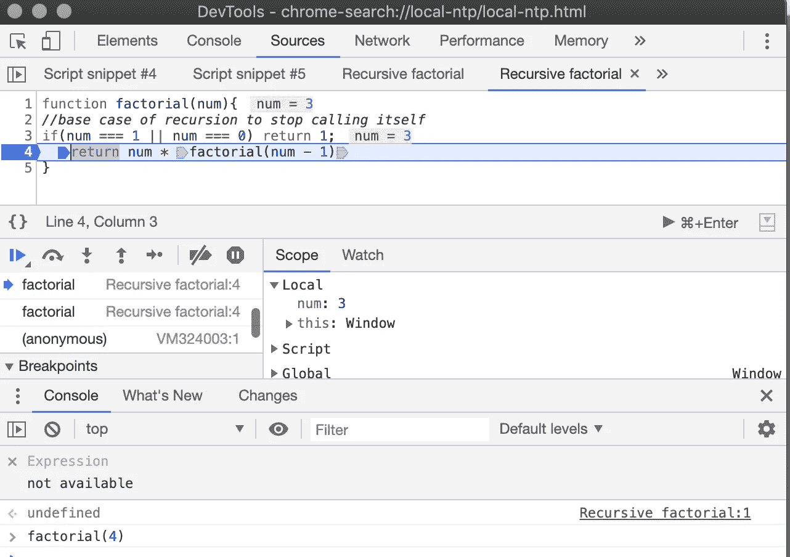
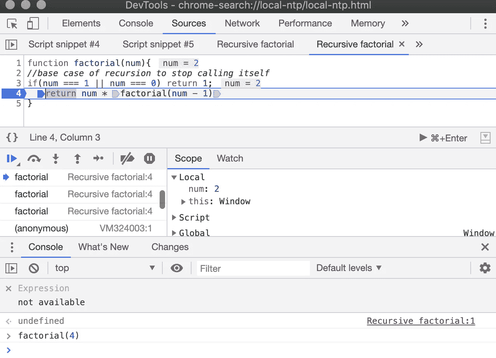
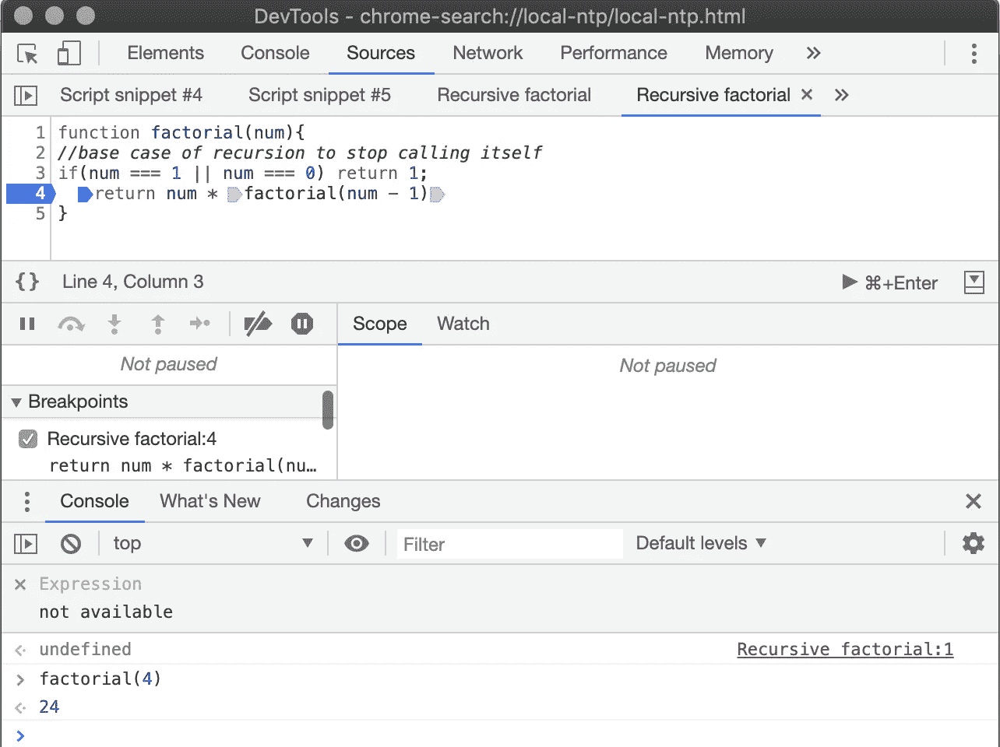

# JavaScript 中的递归

> 原文：<https://levelup.gitconnected.com/recursion-in-javascript-5c49b722f1d6>



如果你刚刚开始学习递归，它看起来是如此的费解和复杂。但是当你一步一步地分解它，并试图理解引擎盖下发生的事情时，你就会明白了。一旦你得到了它，它将永远伴随着你；).

那么简单来说什么是递归呢？

这是一个函数调用自身的过程。换句话说，您在每次迭代中使用不同的值调用同一个函数，直到您到达一个基本情况。这也意味着你**总是**需要有使用递归的基本情况。

现在的问题是**递归**的基本情况是什么？

基本上，基本情况是你用来告诉你的函数停止的条件。如果没有一个基本用例，你的函数将无限循环，这是不好的。

使用递归的一个著名例子是寻找**阶乘(！)**。

```
**n! = n × (n−1)!, where 0! = 1.**To find 4! we need to find 3! then 2! then 1!4! = 4 × 3!3! = 3 × 2!;2! = 2 × 1!;1! = 14! = 4 × 3 × 2 × 1 => **24**
```

以下是使用递归查找阶乘的解决方案:

```
**function factorial(num){** //base case of recursion to stop calling itself **if(num === 1 || num === 0) return 1;**//recursivly calling itself with new value **
  return num * factorial(num - 1)
}**factorial(4) // => 24
```

*递归的时间复杂度为 O(n)，空间复杂度为 O(n)。*

现在让我们试着理解在我们函数的每次迭代中发生了什么，例如 factorial(4)。如果我们数到 4！答案是 24，所以函数应该返回 24。

使用浏览器中的调试器，我们可以检查每个调用中 num 的值。

> 调用#1，num = 4，那么我们的函数应该用值 num-1 调用自己。

```
function **factorial(4)**{
//base case of recursion to stop calling itself
if(4 === 1 || 4 === 0) return 1; // =>false
  return 4 * **factorial(3)**
}
```



调用函数 factorial(4)

当我们从阶乘(3)中得到结果时，阶乘(4)被搁置。

> Call #2，factorial(3)调用 factorial(2)，当我们从 factorial(2)中获取结果时，它处于暂停状态。

```
function **factorial(3)**{
 if(3 === 1 || 3 === 0) return 1; // => falsereturn 3 * **factorial(2)** 
}
```



函数用阶乘(3)调用自身

> 在调用 factorial(1)之后，调用#3，factorial(2)。

```
function **factorial(2)**{
 if(2 === 1 || 2 === 0) return 1; // => falsereturn 2 * **factorial(1)** 
}
```



函数用阶乘(2)调用自身

> 调用#4 时，最后一个调用被 factorial(1)调用返回 1，因为基本情况已经这样设置了。

```
function **factorial(1)**{
 if(1 === 1 || 1=== 0) return 1; // => truereturn 1 * **factorial(0)** 
}
// => 1
```



函数用阶乘(1)调用自身

> 让我们想象一下调用 factorial(4)时发生了什么。

```
//Visualization of invoking function factorial(4)function factorial(4){
//base case of recursion to stop calling itself
if(4 === 1 || 4 === 0) return 1; // => false

 return 4 * factorial(3){ // => 4 * 3 * 2 * 1
            if(3 === 1 || 3 === 0) return 1; // => false

              return 3 * factorial(2){ // => 3 * 2 * 1

                  if(2 === 1 || 4 === 0) return 1;

                     return 2 * factorial(1){ // => 2 * 1

                      if(1 === 1 || 1 === 0) return 1; // => true
                       return 1 * factorial(0)}
                  }}
}// factorial(4) = 4 * factorial(3) = 4 * (3 * factorial(2)) =
// 4 * (3 *(2 * factirial(1))) = 4 * (3 * (2 * (1))) = 
// 4 * (3 * (2)) = 4 * (6) = 24 **// => 4 * 3 * 2 * 1 => 24**
```

阶乘(4) = 4 * 3 * 2 * 1 = 24，是正确答案。

正如您所看到的，递归函数创建了 n 个临时值，直到它到达基本情况。一旦迭代是在基本情况下，存储的值被用来计算答案。

寻找阶乘的非递归解决方案可以使用 for 循环迭代:

```
**function factorial(num){
   let result = 1;
   if(num === 0) return 1;
   while(num){
      result = result * num;
      num--;
   }
   return result;
}**
```

这里时间复杂度为 O(n)；空间复杂度为 O(1)。

递归需要更少的编码行，代价是占用空间。所以如果你关心空间的话，递归并不好。因此，根据具体情况，你应该决定是否使用递归。

希望这篇帖子对你理解递归有帮助。我将感谢任何反馈！

*更具体的资源:*

[](https://www.mathsisfun.com/numbers/factorial.html) [## 阶乘！

### 例子:我们通常说(比如)4！作为“4 阶乘”，但有些人说“4 尖叫”或“4 爆炸”,我们可以很容易…

www.mathsisfun.com](https://www.mathsisfun.com/numbers/factorial.html) [](https://en.wikipedia.org/wiki/Recursion_%28computer_science%29) [## 递归(计算机科学)

### 计算机科学中的递归是一种解决问题的方法，它的解依赖于更小的…

en.wikipedia.org](https://en.wikipedia.org/wiki/Recursion_%28computer_science%29)