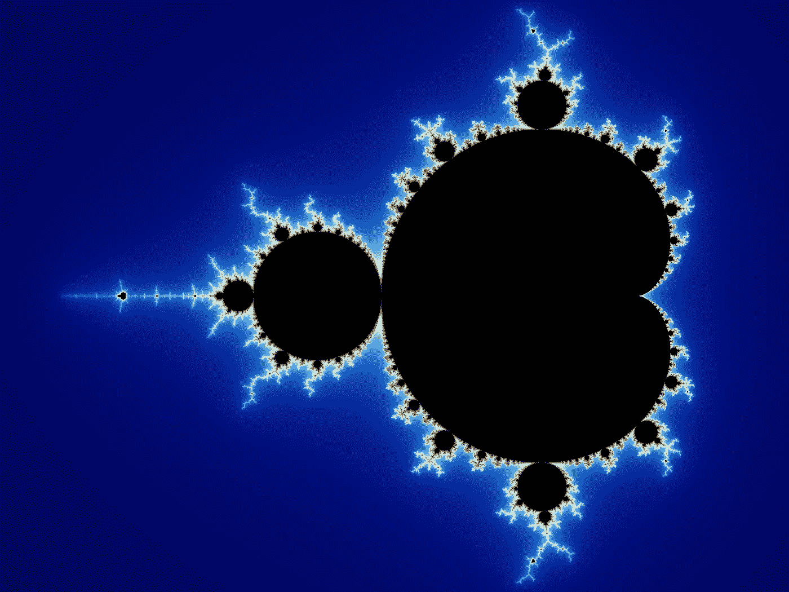
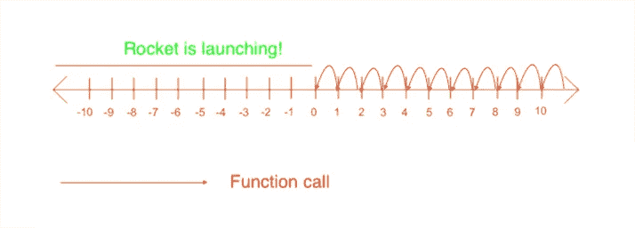
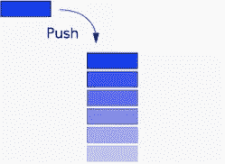
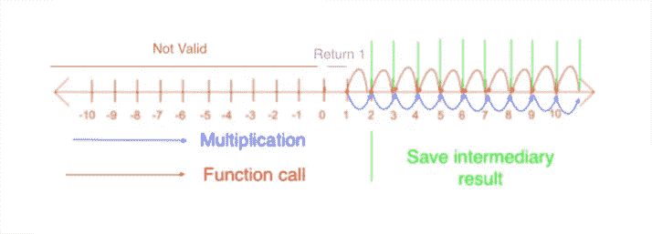
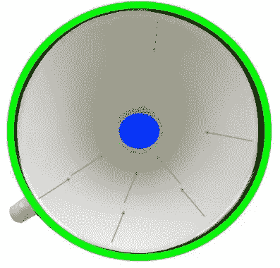
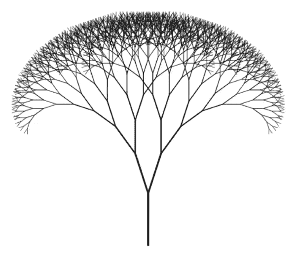

# 递归:通俗地说

> 原文：<https://levelup.gitconnected.com/recursion-in-laymans-terms-32100fe92c79>

曼德勃罗集合

啊…递归…

计算机科学本科生在成为伟大程序员的旅程中遇到的第一个大概念之一。可视化递归非常容易，这是我在这篇文章中的目标。

## 为什么我应该使用递归？

递归及其背后的概念是计算机系统的核心和力量。电脑真的很擅长为我们自动化事情。

> 递归可以很好地做一件事:稍微改变一下就重复同样的函数。

递归和循环之间也有特殊的联系。

## 火箭发射器。

你是埃隆·马斯克，想为你的火箭发射设定一个计时器。假设您想将其设置为 10，因为您想在 YouTube 上庆祝倒计时。

我们用 Python 做吧。

这个剧本说了什么？

1.  这是一个叫做火箭发射器的功能
2.  它由一个 *if-else* 结构组成。它根据 NumbersLeft 是否为正数进行选择
3.  如果 NumbersLeft 是正数，*打印并再次调用相同的函数*，NumbersLeft 减 1
4.  对于其他情况(如果 NumbersLeft 小于零)，打印“火箭正在发射”

想象一下，它看起来像这样。假设函数是用大于 0 的整数调用的。然后，它将调用一个递减的参数，直到数字为零。每个红色箭头都是一个函数调用。一句话。基本情况是零或更小的所有整数。

你能在这上面做一个变化吗？这在哪里也能派上用场？

## 阶乘

你们大多数人都知道阶乘函数。5!(感叹号表示阶乘)，是 *5*4*3*2*1。* 3！就是 *3*2*1* 。你开始看到模式了吗？这是递归的经典例子。

除了一点之外，这段代码看起来和前面的几乎一样。else 分支将当前整数乘以一个函数调用，而不只是再次调用自身。这个中间表达式被保存。

中间结果是*保存在栈*上，想象一个书栈。每次在 else 分支中再次调用该函数时，堆栈都会变高一点。

一个堆栈，可视化

当达到基本情况时，计算中间结果。

阶乘函数可以总结如下。真的试着理解这一点。这种模式反复出现。

我们来解构一下这个。

*   从一个整数**开始**(大于零)。
*   **将当前结果**(绿线)保存在堆栈上，再次调用当前函数。(红色箭头)
*   直到达到 1(紫色)。然后计算结果。
*   结果被重新构造，直到你开始的那个整数。(如果你从 5 开始，蓝色箭头，乘法返回到 5)
*   所有其他结果无效(棕色)

## 递归的定义。漏斗功能

我已经给出了两个递归派上用场的例子。现在，是时候下一个定义了。

递归是一个函数稍微改变一下就调用自己。递归由两部分组成:递归情况和基本情况。

*   **递归用例**:向基本用例调用自身
*   **基本情况**:通话到此结束。(注意:在阶乘的情况下，返回值还有待构造)

漏斗，递归的一个类比

最好想象成一个漏斗。在**漏斗功能**(是的，我刚刚发明了这个)中的每一个输入都是有效的，并确保呼叫流向中心。基本情况结束了这一切。

## 最优化

递归算法可能会耗尽内存。当堆栈不够大，无法容纳所有中间结果时，就会出现这种情况。然后，发生堆栈溢出(没错，这就是著名站点的名字)。

优化可以是*尾递归，或者迭代*。与基本递归的最大区别是结果保存在函数调用的参数中。因此，中间结果不再存储在堆栈中，而是存储在函数调用中。大多数现代(函数式)语言都实现了这种优化。在这种情况下，Python 没有。

> 在这个例子中，函数参数 *prod* 保存最终结果。这是存储在内存中的一个地方，这是非常有效的！

我已经包括了两个额外的例子。 **While 和 for 循环**。这些本质上是迭代结构。结果未保存。Python 是一种相当高级的语言，但是一旦你使用低级语言，你必须自己构建这些结构。

注意:第一个函数(Elon Musk 的火箭发射器)是一个迭代函数。

## 无限循环和分形

这一部分对于理解这个概念来说并不重要，但是很有趣。

**无限循环**是一种永远不会到达基本情况的递归。这可能是因为基础用例不存在，或者功能从来没有朝向基础用例。这将导致可怕的堆栈溢出！

无限循环是可能自相似的循环。并且自相似性存在于:**分形**！分形是自相似的结构。当你放大一个分形，你会看到同样的东西。这是非常了不起的。树木是自然界中自相似性的完美例子之一。你越放大，你就越能反复看到同样的东西。这对大脑有一种相当平静的效果，因为我们天生适合模式识别。

## 摘要

*   递归使得实现*循环*变得非常容易
*   递归是*函数调用自己*
*   递归由**基本案例和一个递归案例**组成
*   迭代改进了递归:*需要更少的内存*。

## 结论

这是我的第一个技术作品。我当然想做得更多。

您可以采取的行动

*   用递归和迭代实现斐波那契
*   实现分形树

问题

*   你在现实生活中哪里看到递归？(提示:无处不在，尽量注意)

你对更多感兴趣吗？你想要什么？

跟我来:

[Github](https://github.com/SimonVervisch)

[YouTube](https://www.youtube.com/watch?v=_n7YjGSDIWs&t=1s)

[推特](https://twitter.com/the_simon_v)