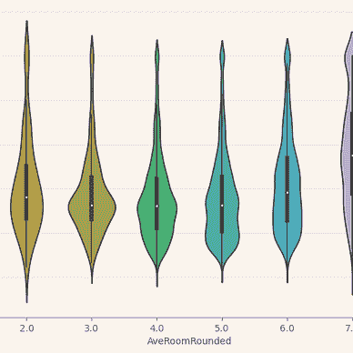

# Python 中的递归——用简单的代码解决复杂的问题

> 原文：<https://levelup.gitconnected.com/recursion-in-python-solve-complex-problems-with-simple-code-f6101fa2b65a>

## 计算机编程语言

## 举例介绍 Python 中的递归函数。

图像由[雅各布·费罗斯](https://medium.com/@dreamferus)使用 Midjourney 生成。

一个**递归函数**是一个调用自身的函数。当一个程序使用相同的重复命令重复使用*未知*次时，这很有用。

当你听到*迭代*时，你可能认为这听起来很像一个循环，你是对的。所有递归函数都可以用循环来执行，特别是 *while-* 循环*、*，因为我们有未知的迭代次数。那么递归有什么意义呢？在适当的时候，递归可以更加简洁、易读和易于理解。让我们举个例子来说明我的意思。假设我们想要*扁平化*一个列表，也就是把一个列表变成一个列表。这可以很容易地通过循环或使用列表理解来完成:

简单吧？这里我们不需要递归或 while 循环。这是因为迭代次数是预定义的，即列表中列表的数量，以及深度，即列表的列表(2)。同样，展平列表的列表也不难，我们只需要另一个循环:

但是如果嵌套列表的深度是未知的，并且数组中的每个元素都不相同，那该怎么办呢？比如`[1, [[[3]]]]`。现在事情变得有点困难了。对于 for 循环，没有直接的方法可以做到这一点。让我们先用 while 循环来做这件事:

你觉得这个片段简单吗？我不知道，这不是很直观。请注意，我对“*end condition”*的注释不是针对导致循环中断的原因，而是针对阻止我们迭代深入列表的原因，即元素不再是列表。

让我们看看递归是什么样子的:

让我们解开这里发生了什么。首先，有一个结束条件。如果参数不再是列表，只需返回一个只包含该元素的列表。递归函数总是需要一个结束条件来避免无限递归。返回列表的原因是稍后使用`+=`可以连接它。

*否则*，我们循环遍历列表，并在递归调用每个元素上的函数本身后连接结果。

*   如果循环的元素*不是*列表，结束条件将被调用，元素将被添加到列表中。
*   如果元素*是*列表，将再次执行相同的“*否则*”，将*列表中的元素收集到一个扁平列表中。*

因此，该函数将继续被调用，直到满足结束条件。然后，结果被收集并迭代返回，直到我们返回到顶层函数调用，得到一个包含所有结果的平面列表。例如，对于

`flatten_list_with_recursion([1,[[2]]])`

发生了以下情况:

很优雅，不是吗？通过递归定义函数来调用自身，代码变得更加简洁易读。当你开始递归思考时，它们也变得更容易创建。开始时可能很难理解它，但是一旦你对它越来越熟悉，就会更容易看到它何时能简化功能。

# 使用递归有什么缺点吗？

是的，有。首先，你可以调用递归函数的次数是有限制的，也就是说*的深度*是有限的。无论何时调用一个方法，关于该方法的信息，比如返回地址，都必须存储在一个所谓的**调用栈**中，直到该方法被完全执行。问题在于，在递归函数中，越来越多的信息被添加到调用堆栈的顶部。如果调用堆栈变得太大，就会出现名为*堆栈溢出*的错误。下面我用 Python 模拟了一个由此产生的错误:

生成的错误称为 **RecursionError** ，是真正的堆栈溢出前的保护性错误。您可以使用以下方法增加回调:

但是如果增加太多，就会发生实际的堆栈溢出。那么一个可管理的异常将不会被抛出，相反，整个程序将会崩溃。一些语言有所谓的*尾部调用优化，*来处理这个，但是 Python 不是其中之一。

另一个缺点是递归可能比循环慢，因为添加到调用堆栈会比其他方式消耗更多的内存。也就是说，速度差在许多情况下可以忽略不计。但是，如果你想最大限度地优化你的代码，迭代将是一条路要走。

## 摘要

递归函数在适当的情况下，对于编写更容易维护的易读、简洁的代码是很实用的。但是要意识到它的缺点；它比使用循环要慢，而且过多的函数调用会导致堆栈溢出。感谢阅读。

如果您有兴趣阅读更多关于 Python 的文章，请查看我下面的阅读列表:

[雅各布·费罗斯](https://medium.com/@dreamferus?source=post_page-----f6101fa2b65a--------------------------------)

## 计算机编程语言

[View list](https://medium.com/@dreamferus/list/python-c8e4719d93da?source=post_page-----f6101fa2b65a--------------------------------)32 stories

如果你想成为中级会员，你可以使用我的推荐链接。祝你有愉快的一天。