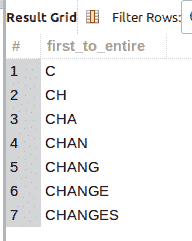
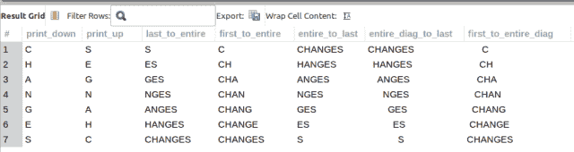

# 用 MySQL 中的 SUBSTRING()实现递归 CTE

> 原文：<https://levelup.gitconnected.com/recursive-cte-fun-with-substring-in-mysql-3a06fab881cd>

虽然这些天我主要在后端 web 开发项目中使用 MySQL/MariaDB，但我正在学习 Oracle SQL，最终目标是获得认证。我最近看了一个很棒的 YouTube 视频，并决定尝试将 Oracle SQL 查询移植到类似的 MySQL 进行学习。这篇博文详细描述了我对最终结果的查询。继续阅读一些有趣的递归 CTE 使用`SUBSTRING()`字符功能和有趣的输出显示变化。

自我推销:

如果你喜欢这里写的内容，尽一切办法，把这个博客和你最喜欢的帖子分享给其他可能从中受益或喜欢它的人。既然咖啡是我最喜欢的饮料，如果你愿意，你甚至可以给我买一杯！

## 信用资源与启示

在下面的视频中，作者提供了几个使用 Oracle SQL 的`CONNECT BY`子句和`ROWNUM`伪列以不同输出格式显示特定单词的例子。Siva Academy 是了解 Oracle SQL 的绝佳渠道。作者知识渊博，总是有有趣的例子来证明。如果您对 Oracle SQL 感兴趣，我强烈推荐您查看这个频道。因为这个视频，我受到了写这篇博客的启发，并想对海报给予赞扬。

[Siva 学院的励志视频](https://youtu.be/0wPqz4GqB_w?list=PLb1qVSx1k1VpEqAXgoFn5p7kFVzgsvUgM)。(非现场链接)

## 递归 CTE、用户定义的会话变量、SUBSTRING()和 LENGTH()函数

为了使*处理*更加容易和方便，我将使用一个用户定义的会话变量来表示单词“CHANGES ”,这里用`SET`命令显示:

在撰写本文时，MySQL 不支持 Oracle SQL 中的`CONNECT BY`子句或`ROWNUM`伪列。因此，为了复制两个*构造*的功能，我实现了一些*变通方法*。

幸运的是，MySQL 8 引入了`WITH`子句(也称为公共表表达式)。更重要的是，`RECURSIVE WITH`子句在模拟`ROWNUM`伪列*的过程中扮演着重要的角色，因为它具有递归的特性。因此，如果您计划遵循示例查询，您需要 MySQL 8 或更高版本。*

在这篇文章和随后的查询中，假设递归 CTE， **rownum_generator，**(如下所示)在*作用域*中:

从 **rownum_generator** CTE 中检索所有行会返回一组以 7 结尾的递增的整数值，这是目标字符串“CHANGES”的长度:

rownum_generator CTE 的查询结果。

在整篇文章中，我将使用另外两个 MySQL 函数:`SUBSTRING()`和`LENGTH()`。`SUBSTRING()`最多接受 3 个参数；2 个必需，1 个可选。两个必需的参数是*目标 _ 字符串*和*起始 _ 位置*。唯一的可选参数是*长度*值。

`SUBSTRING()`根据支持参数的*返回字符串的一部分(或缺少参数)。如何使用递归 CTE 操作`SUBSTRING()`决定了独特的输出显示。*

相关:阅读帖子， [Oracle SQL SUBSTR()字符函数—中跨帖子](https://joshuaotwell.com/oracle-sql-substr-character-function-medium-cross-post/)，(站外链接)了解更多关于 Oracle 类似字符函数的信息。

## 递归 CTE 和 SUBSTRING():每个字符每行 1 个字符

回顾第一个查询，目标是为单词“CHANGES”中的所有字符每行返回 1 个字符。

每行 1 个字符的输出显示。

*start_position* 参数是基于 **rownum_generator** CTE 列、 **rownum** 的动态参数。因此，每个起始位置都是变化的。此外,*长度*参数仅指定 1 个字符用于提取该显示变化。一个更直观的例子可以通过返回查询结果中每一行的*间隔*的 **rownum** 值来实现:

每行的动态 rownum 值。

## 递归 CTE 和 SUBSTRING():每行 1 个字符，表示从字符串末尾开始的每个字符

在下一个例子中，我被*抛出了一个循环*，直到我在查询结果中再次返回移动的 **rownum** 值和`SUBSTRING()`函数调用。在这里，我从每行的目标字符串中查询 1 个字母，但是由于负的 **rownum** 数字，从“CHANGES”字符串的末尾开始提取(如后续查询所示):

每行一个字符，从目标字符串的末尾开始。

**子串()**的负*起始位置*值

## 递归 CTE 和 SUBSTRING():每行的动态字符数，从字符串末尾开始

下面的输出显示与上一个非常相似，只是从 *target_string* 中只提取了 1 个字符，现在我根据特定行的 **rownum** 的值提取动态数量的字符:

动态*起始 _ 位置*和*长度*参数为**子串()**。

同样，将 *start_position* 参数设置为 *rownum * — 1* 表达式值在 *target_string* 的末尾开始提取，因为它是负数。但是，不是只提取 1 个字符，而是由 **rownum** 列值决定字符数。这与提取“CHANGES”字符串的剩余部分所需的数字相同。

我坚持每周写一封关于我正在学习并感兴趣的 SQL/PHP 的邮件。如果这听起来像是你想参与的事情，使用这个[注册](https://digitalowlsprose.ck.page/1b35a06295)(异地链接)表格并订阅。谢谢大家！

## 递归 CTE 和 SUBSTRING():每行的动态字符数，从第一个字符开始

在我看来，最简单的例子是下面的查询结果。我简单地将 *start_position* 参数设置为 1，将 *length* 参数设置为 **rownum** 列值。

**SUBSTRING()** 结果的 *start_position* 为 1，动态 rownum 值的 *length* 参数。

例如，在检查最后一行时，查询结果中会返回整个单词“CHANGES”。为什么？

由于 *start_position* 为 1，并且 *length* 参数值的 **rownum** 列值为 7(在执行的这一点上)，文本的所有 7 个字符都由`SUBSTRING()`返回。够简单吧？

## 递归 CTE 和 SUBSTRING():所有字符到最后一个字符

在没有向`SUBSTRING()`提供*长度*参数的情况下，该函数从 *start_position* 返回在 *target_string* 中找到的剩余字符数，这正是下一个示例查询的工作方式，它使用 **rownum** 列值来设置提取应该从哪里开始:

## 递归 CTE 和 SUBSTRING():用空格替换缺失的字符

我必须坦白地说。到目前为止，在所有的问题中，最后两个例子给了我最大的痛苦。如果没有使用`CASE`表达式，我不确定我是否能够解开最后两个*谜语*，尽管 YouTube 作者在演示的例子中没有使用`CASE`。

相关:查看帖子，[使用 CASE 表达式的动态 RPAD()函数— Oracle SQL 示例](https://joshuaotwell.com/dynamic-rpad-function-using-a-case-expression-oracle-sql-example/)，(场外链接)另一个动态`CASE`表达式的示例*我大量借用了*:)。

相似:对`CASE`表情不熟悉？别担心。我写了 2 篇文章来介绍你。请参阅 [MySQL 简单案例表达式—示例](https://joshuaotwell.com/mysql-simple-case-expression-with-examples/)和 [MySQL 搜索案例表达式—示例](https://joshuaotwell.com/mysql-searched-case-expression-with-examples/)(非现场链接)了解更多信息。

以下是查询结果:

用一个空格字符填充 **SUBSTRING()** 返回值。

总体目标是用长度等于且不超过 7 的空格字符数填充`SUBSTRING(@changes, 1, rownum)`表达式(“变化”字符串的长度)，我使用*动态* `CASE`表达式作为第二个`LPAD()` 参数。这是一旦所有的*填充*被应用时要被填充的串的最终长度。

让我们执行查询，并在`LPAD()`函数输出旁边显示`CASE`表达式值，以便更加清晰:

动态 **CASE** 表达式的查询结果作为 **LPAD()** 的第二个参数。

注意 **cse_lt** 列的值是一致的 7。这是`LPAD()`应用任何填充后字符串的期望长度。以这种方式，根据基于 **rownum** 列值提取的部分，正确数量的空格字符被填充到`SUSTRING()`的返回值。

到了最后一个查询示例，除了 1 用于`SUBSTRING()` *start* 参数，我们提取的字符数等于**rownum**value*length*参数之外，它与前面的示例基本相同。

## 递归 CTE 和 SUBSTRING():显示所有输出

我在一个查询中提供了以下所有解决方案:

我希望你喜欢这篇文章。我知道我在学习不同的模式和写这些模式的过程中获得了很多乐趣。尝试一些你自己的，让我在评论中知道它们。感谢您的阅读

如果您有任何问题或在代码中看到任何错误，请在评论部分提供评论。这样做，我可以继续提供有价值和准确的博客文章。

喜欢你读过的？看到什么不正确的吗？请在下面评论，感谢阅读！！！

# 行动的号召！

感谢你花时间阅读这篇文章。我真心希望你发现了一些有趣和有启发性的东西。请在这里与你认识的其他人分享你的发现，他们也会从中获得同样的价值。

访问[投资组合-项目页面](https://wp.me/P28ctb-3KD)查看我为客户完成的博文/技术写作。

[**热黑咖啡真好！给我买一杯！**](https://ko-fi.com/joshlovescoffee)

要在最新的博客文章发表时收到来自本博客(“数字猫头鹰散文”)的电子邮件通知(绝不是垃圾邮件)，请点击“点击订阅！”按钮在首页的侧边栏！(如有任何问题，请随时查看 [Digital Owl 的散文隐私政策页面](https://wp.me/P28ctb-3gI):电子邮件更新、选择加入、选择退出、联系表格等……)

请务必访问[“最佳”](https://joshuaotwell.com/where-blog_post-in-digital-owls-prose-best-of/)页面，收集我的最佳博文。

[Josh Otwell](https://joshuaotwell.com/about/) 作为一名 SQL 开发人员和博客作者，他热衷于学习和成长。其他最喜欢的活动是让他埋头于一本好书、一篇文章或 Linux 命令行。其中，他喜欢桌面 RPG 游戏，阅读奇幻小说，并与妻子和两个女儿共度时光。

免责声明:本文中的例子是关于如何实现类似结果的假设。它们不是最好的解决方案。所提供的大多数(如果不是全部)示例都是在个人发展/学习工作站环境中执行的，不应被视为生产质量或就绪。您的特定目标和需求可能会有所不同。使用那些最有利于你的需求和目标的实践。观点是我自己的。

*原载于 2021 年 7 月 14 日*[*【https://joshuaotwell.com】*](https://joshuaotwell.com/recursive-cte-fun-with-substring-in-mysql/)*。*