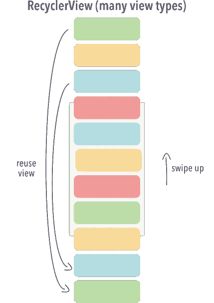
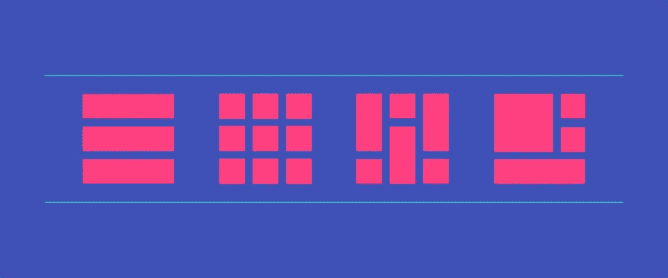
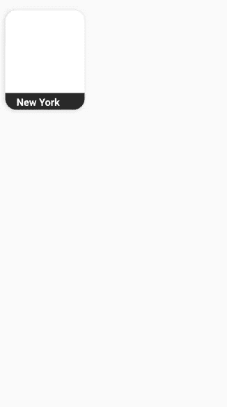
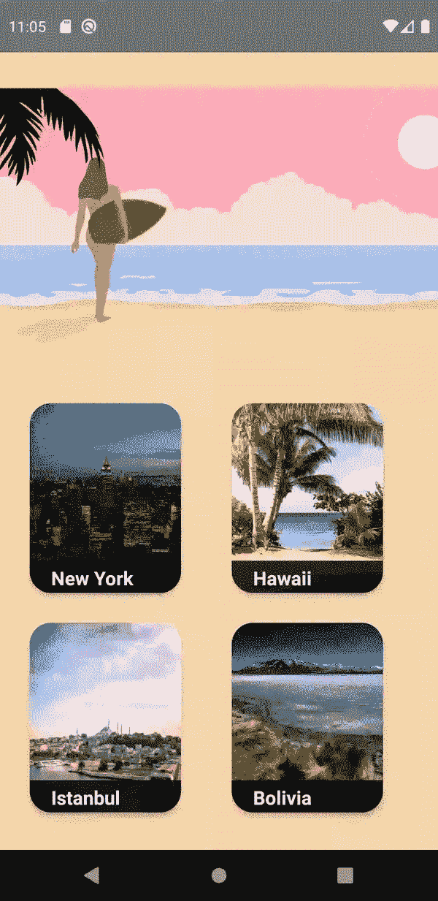
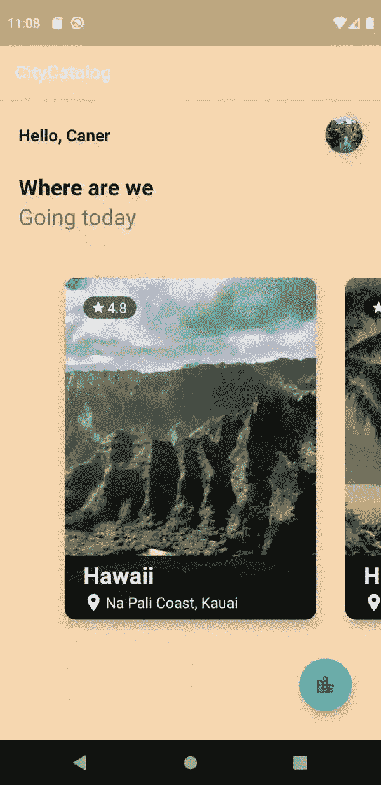

# Kotlin | Android 中的回收器视图

> 原文：<https://levelup.gitconnected.com/recycler-view-in-kotlin-android-4f1c00d82e72>

# 回收器视图的解释

Recycler view 是 android 开发中的一个组件，用于向屏幕列出大量数据。在这个故事中，我将尝试进一步解释这个概念。

当然，您也可以使用 ListView 或其他工具，但 Recyclerview 在性能方面更胜一筹。我说的“性能”是什么意思？当 Listview 试图加载整个数组时，Recycler 视图只加载显示所需的数据。这意味着，例如，您在一个数组中有 20 个项目，而您的屏幕大小仅够数组中的 5 个项目，Recyclerview 将在缓存中保存 9 个项目。这些数字可能令人困惑，但它们只是一个例子。你会明白的，请看下图。

*   向下滚动时；如果您滚动回顶部，2 个项目仍将保留在缓存中。如果您滚动更多，这 2 个项目将被删除，数组中接下来的 2 个项目将保存在缓存中。
*   屏幕底部的 2 个项目；当您向下滚动时，除了我们示例中屏幕上的 5 个项目之外，接下来的 2 个项目将被保留到屏幕上。

两个顶视图和底视图被回收器视图反复使用，它只是由适配器加载数据。因此，系统不会加载更多的视图，也不会损失任何性能。

回收器视图还具有布局管理器功能。你可以用不同的形状列出你的物品。比如横向布局，网格布局，或者更有趣的是无序布局。您可以查看下图中的示例布局。

# 活生生的例子

我们现在对回收者的观点有了一个大致的看法。让我们从一个实际的例子开始。现在我正在开发一个应用程序来实践我的知识。它是关于旅行的，你可以得到一些特定地点的一般信息。感谢这个项目，我可以向你展示回收视图和布局管理器(网格，水平)的实现。

要使回收器视图工作，您需要项目视图、模型、模拟数据或远程服务器连接，将回收器视图放置到活动、适配器和视图容器。

首先，您需要将依赖项添加到 Gradle，以便使用 recycler 视图。

之后，我们需要一个项目的蓝图来填充它和加载数据。我在这个项目中使用了卡片视图。

这是代码。

很好，我们创建了我们的卡，接下来我们需要向 activity_xml 添加一个回收器视图。这需要在某个地方展示，对吗？:)

我们已经完成了可视化部分，接下来我们需要创建一个模型来保存数据。

现在适配器和取景器。这里重要的是我们需要实现 3 个方法。它们是不可避免的，IDE 会警告您覆盖它们。这些是:

*   onCreateViewHolder:需要新布局时调用。它基本上连接布局和视图。
*   getItemCount:保存数组中的项数。
*   onBindViewHolder:您将获得新的未使用的视图持有者，并且您必须用您想要显示的数据填充它们。但是当你向下滚动时，你会开始看到屏幕外的旧视图持有者，你需要用新的数据替换他们的数据。

让我们创建模拟数据，并在 main 中连接我们的回收器视图和适配器。

我们已经连接了适配器和回收器视图，还创建了模拟数据。我使用了网格布局和水平布局。你可以根据需要使用其中的任何一个。示例中有 4 个模拟项目。我添加了更多来展示滚动。我们的回收器视图已经可以运行了。

带有网格视图的回收器视图

带水平视图的回收器视图

如果你想在 Github 上查看我的项目，链接如下:

[https://github.com/CanerGures/CityCatalog](https://github.com/CanerGures/CityCatalog)

最后，是时候为我们心爱的回收者鼓掌了。