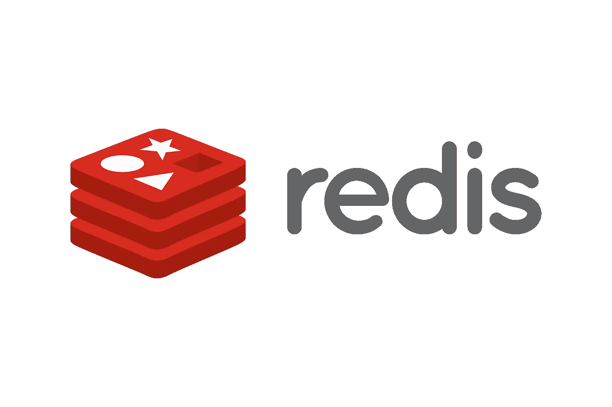
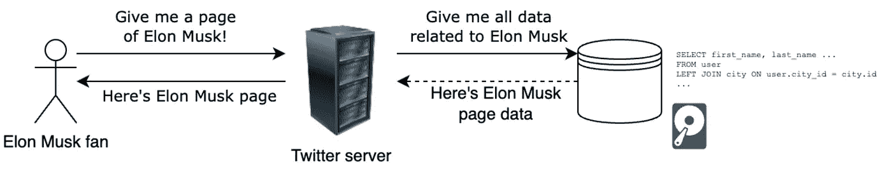
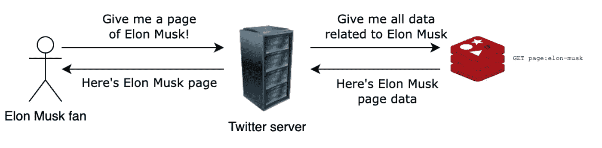
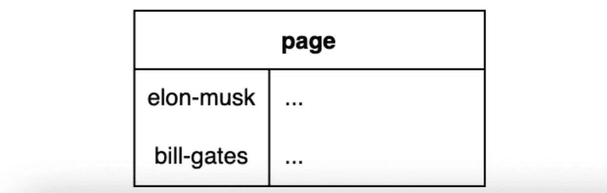
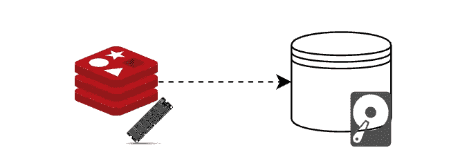

# Redis:介绍、缓存和事务

> 原文：<https://levelup.gitconnected.com/redis-introduction-caching-and-transactions-aa32d385aa2b>

## Redis 为什么这么受欢迎？



Redis 徽标

# 介绍

什么是 **Redis** ？

Redis 是一个开源的，**内存数据存储**，以速度极快而闻名，因为它将东西存储在内存中(即 RAM 中)，而不是磁盘中(例如 SSD)。

最初 Redis 被用作**键-值数据库**，但是现在它提供了[更多的特性](https://redis.io/docs/modules/)。在本文中，我将只讨论作为键值数据库的 Redis，这是它最常用的方式。

本文假设您对关系数据库和客户机-服务器模型有所了解。我的目的是帮助解释为什么以及如何在应用程序中使用 Redis。

# 键值

什么是**键值数据库**？

基本上就是 ***(key，value)*** *对*的集合。这种数据结构现在更普遍地被称为*字典*或*散列表。*

换句话说，这是一个结构，其中有许多对，每一对都包含:

*   一个 ***键*** —一个值的标识符；
*   一个 ***值***——我们要存储的实际东西。


来源: [Fireship.io](https://www.youtube.com/watch?v=G1rOthIU-uo&ab_channel=Fireship)

假设我们在终端中打开 Redis(即 [Redis CLI](https://redis.io/docs/manual/cli/) ):

```
>
```

现在让我们通过使用`SET`命令并给出一个键名来存储值`1`，例如`x`:

```
> SET x 1
OK
```

我们已经储存了`x=1`！让我们用`GET`命令得到这个值:

```
> GET x
“1”
```

并删除它:

```
> DEL x
(integer) 1 // ***key is deleted***
```

其实你可以把[很多不同的数据结构](https://redis.io/docs/data-types/)存储为*值* : 字符串、数字、哈希、JSON 文档等等。

有些数据结构有特定的命令，但它们非常相似:

*   [哈希](https://redis.io/docs/data-types/hashes/) : `HGET`，`HSET` …
*   [JSON](https://redis.io/docs/stack/json/) : `JSON.GET`，`JSON.SET` …

极其简单，对吧？您可能想知道—为什么要为这样一个简单的数据库费心呢？嗯，它的强大之处在于它解决的问题——**缓存**。

# 什么是缓存？

**缓存**是在**缓存中存储一些数据的过程。**

**高速缓存**是一种高速数据存储器，它存储一些数据，以便将来对这些数据的请求能够比访问数据的主存储位置更快地得到响应。

# 为什么使用缓存？

## 问题是

想象一下，一个人访问了埃隆·马斯克的 Twitter 页面。客户机向服务器请求数据，服务器查询数据库。

这是它工作的基本方式:



基本客户端-服务器请求流

然而，有一个问题——埃隆·马斯克非常受欢迎，因此每分钟都有数百万次请求获取该页面。使用上面的解决方案，服务器会因请求而过载，查询数据库会花费很长时间。而且，这要花很多钱。这是因为请求:

*   调用数据库(这本身就很昂贵)；
*   需要高成本的 SQL 操作(如 JOIN)，这需要大量的计算时间；
*   从磁盘获取数据，读取速度很慢。

## 解决方案

相反，我们可以使用 Redis 并将这些数据存储在一个键中，例如`page:elon-musk`，所以:

*   我们不需要进行数据库调用；
*   这些数据将存储在内存中，因此服务速度会更快！

这意味着我们使用 Redis 作为缓存:



从 Redis 缓存提供的请求

请注意密钥格式— `page:elon-musk`。我使用两个值来创建一个**组合键**。这意味着我们基本上可以模拟一个关系数据库，其中`page`是一个表名，`elon-musk`是一个主键值:



关系数据库模拟

但是如果主数据库中的数据更新了呢？例如，埃隆·马斯克(Elon Musk)发了一篇新帖子或改变了他的描述。我们不可能永远在 Redis 中保持相同的值！我们需要以某种方式*使缓存*无效。

## 缓存失效

**缓存失效**意味着声明一个**缓存值无效**。我们可以在应用中实施几种缓存失效策略。例如，我们可以用两种方法**删除**键:

1.  按需删除`page:elon-musk`键(即当埃隆做出改变时)，或
2.  使用`[SETEX](https://redis.io/commands/setex/)`设置密钥的到期时间。然后，该密钥将在指定的时间后自动删除:

```
> SETEX x 30 "Hello"
OK // ***key is set with 30 seconds expiration time***
```

> 注:与同时使用`*SET*`和`*EXPIRE*`命令相同。

最后，当有人请求 Elon 的页面(现在已经失效)时，我们可以指示:

*   检查密钥是否存在
*   如果不是-从数据库中获取更新的值，并再次将其放入缓存中。

## 持久性

在幕后，Redis 不时地将数据从 RAM 复制到更持久的存储设备(如 SSD ),因此即使在服务器停机时，数据也是持久的。点击阅读更多[。](https://redis.io/docs/manual/persistence/)



Redis 将数据从 RAM 复制到磁盘

## 其他使用案例

除了缓存，Redis 还有许多其他的用例，例如:

*   [消息队列](https://redis.com/solutions/use-cases/messaging/)
*   [会话管理](https://redis.com/solutions/use-cases/session-management/)
*   [实时分析](https://redis.com/docs/real-time-analytics-redis/)

# Redis 中的交易

[**事务**](https://redis.io/docs/manual/transactions/) 对于任何想要保持数据一致性的数据库都很重要。它们保证一组操作将在没有其他操作干扰的情况下执行**，或者根本不执行。幸运的是，Redis 也给了我们实现事务的工具，尽管它们不是默认的[](https://www.databricks.com/glossary/acid-transactions)**。然而，我会告诉你如何实现一些酸的属性。****

**执行事务有两个主要命令:**

*   **`MULTI`标记一个事务块的**开始**(它之后的所有命令排队等待执行)；**
*   **`EXEC` **执行**事务块。**

**让我们也使用一个假想的 JavaScript 库，它有一个`send`函数用于向 Redis 发送命令，在这里我们可以提供一个字符串或多个字符串和值的命令:**

*   **`send('SET x 2')`**
*   **`send('SET x', 2)` —这将使我们更容易提供变量。**

**在下面的例子中，我将使用 [RedisJSON](https://redis.io/docs/stack/json/) 模块来启用 JSON 操作(`JSON.GET`、`JSON.SET`等)。).**

## **不正确的例子**

**假设比尔·盖茨想**往埃隆·马斯克的钱包里送 10 美元**。他们的钱包作为主数据库存储在 Redis 上，他们有一个`amount`属性。让我们试着简单地编写这个场景:**

1.  **我们**读取**钱包金额；**
2.  ****更新**吧；**
3.  **最后，**写下**它:**

**不正确的例子**

**但是如果在执行交易块的过程中，别人转了 100 美元给埃隆马斯克呢？我们会用我们的值(20 美元)覆盖数据(`JSON.SET`)并失去他的 100 美元！**

**换句话说，这个交易不是孤立的。**隔离**是指**没有两个事务相互混合或干扰**。我们如何解决这个问题？**

## **正确的例子**

**Redis 使用 [***乐观并发控制***](https://www.geeksforgeeks.org/difference-between-pessimistic-approach-and-optimistic-approach-in-dbms/) (又名*乐观锁定*)来实现隔离。这意味着事务不需要锁定它正在使用的值——它希望这些值不会被外部操作修改，但是如果它们被修改了——事务将被取消。**

**为了将这个策略付诸实施，我们将使用`WATCH`，它指示 Redis:**

*   **“看着”钥匙，和**
*   **如果自`WATCH`被调用后，键被一些不相关的操作修改，自动**取消交易**。**

**`WATCH`用法很简单:**

```
WATCH wallet:elon-musk
```

**让我们在代码中应用它:**

**正确的例子**

**此外，我们不需要在事务结束后执行`UNWATCH`(即告诉 Redis 刷新所有被监视的键)— `EXEC`和`DISCARD`会自动为我们完成这项工作。**

**然而，有一个问题。**我们** `**WATCH**` **的钥匙越多，我们的交易被取消的几率就越大。在大量请求更新相同数据的系统中(如社交媒体)，这种机会可能相当大，所以我们希望尽可能避免取消。因为如果 10 个不同的事务尝试更新同一个密钥，其中的 9 个将被取消，我们将不得不重试，但第二次会有 8 个失败，以此类推。****

**好吧，所以我们应该少用`WATCH`。我们可以通过优化这段代码来避免任何`WATCH`吗？是啊！**

## **优化的示例**

**我们只验证 Bill 的金额(它是否有足够的资金)，而不是 Elon 的— Elon 只需要他的钱包金额增加，而无需任何验证。因此我们不需要埃隆的数据——我们可以直接增加埃隆的数量。**

**然而，要移除`WATCH`，我们需要确保在我们增加 Elon 钱包金额的同时，不会有任何其他操作改变它。如果我们简单地移除`WATCH`并继续使用几个操作(1。**阅读** 2。**增加代码 3 中的**数量。**写**。然而，如果我们只使用一个，我们可以实现它！**

> **Redis 是单线程的，并且保证单个操作是原子的。这意味着当一个命令正在执行时，其他命令不会运行。"**

**Redis 为我们提供了直接在数据库中增加 JSON 值的`[JSON.NUMINCRBY](https://redis.io/commands/json.numincrby/)`。它递增(或递减，如果值为负)指定的值:**

```
send('JSON.NUMINCRBY wallet:elon-musk $.amount 10')
```

**下面是我们如何应用它:**

**优化示例**

**太好了！现在，我们有了一个隔离和优化的交易。**

# **几个 Redis 命令**

**这里还有几个命令，因此您可以更好地了解 Redis。**

****过期(设置按键超时)****

```
> EXPIRE x 20
(integer) 20 // ***20 seconds left to timeout***
```

****TTL(超时键剩余的总时间)****

```
> TTL x
(integer) 10 // ***10 seconds left to timeout***
```

****持续(从键中删除超时)****

```
> PERSIST x
(integer) 1 ***// key won't expire***
```

****重命名(重命名当前已有的键)****

```
> RENAME x y
OK // ***renamed the key 'x' as 'y'***
```

****FLUSHALL(删除目前保存的所有密钥)****

```
> flushall
OK // ***all keys are deleted***
```

# **摘要**

**那么我们为什么要使用 Redis 呢？**

1.  **它非常**快**；**
2.  **对数据的生命周期给予很大的控制；**
3.  **它在大多数语言中都支持**(见[此处](https://redis.io/docs/libraries/))；****
4.  ****Redis 是**开源**；****
5.  ****有很多模块用于不同的用例，我在这篇文章中没有详细介绍；****
6.  ****支持**交易**。****

****我希望你在这篇文章中学到了新的东西！****

****欢迎在 [LinkedIn](https://www.linkedin.com/in/ignas-pangonis/) 、 [GitHub](https://github.com/ignaspangonis) 上与我联系。****

# ****参考****

 ****[## 证明文件

### 欢迎阅读 Redis 文档。Redis 简介了解 Redis 开源项目入门…

redis.io](https://redis.io/docs/)****  ****[## 乐观和悲观记录锁定

### Rational ClearQuest 中乐观和悲观锁定实现的概述。

www.ibm.com](https://www.ibm.com/docs/en/rational-clearquest/7.1.0?topic=clearquest-optimistic-pessimistic-record-locking)**** ****[](https://redis.com/solutions/use-cases/caching/) [## Redis 缓存:内存缓存解决方案| Redis Enterprise

### 基本缓存层满足临时存储数据的最低要求，以便重复的数据库请求可以…

redis.com](https://redis.com/solutions/use-cases/caching/) 

火船. io****