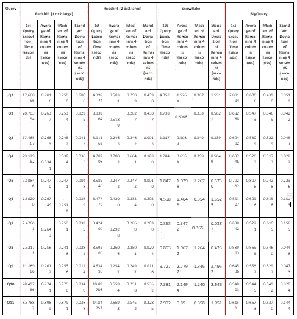

# 红移 vs 雪花 vs BigQuery:选择仓库

> 原文：<https://levelup.gitconnected.com/redshift-vs-snowflake-vs-bigquery-choosing-a-warehouse-dc3f096f73a3>

红移 vs 雪花 vs BigQuery

在我们之前的博客文章中，我们描述了使用 RudderStack、Apache SuperSet 和 Redshift 建立一个[开源分析栈](https://rudderstack.com/blog/open-source-analytics/)的经历。当谈到为开源分析堆栈选择数据仓库时，数据仓库之间相互竞争是非常常见的。红移 vs BigQuery，红移 vs 雪花等。是一些常见的例子。

在这篇文章中，我们将探讨选择 AWS Redshift 而不是其他流行的数据仓库解决方案(如 Google BigQuery 和 Snowflake)的原因。

# 背景

[AWS Redshift](https://aws.amazon.com/redshift/) 和 [Google BigQuery](https://cloud.google.com/bigquery/?utm_source=google&utm_medium=cpc&utm_campaign=japac-IN-all-en-dr-bkwsrmkt-all-super-trial-e-dr-1008074&utm_content=text-ad-none-none-DEV_c-CRE_300622148359-ADGP_Hybrid+%7C+AW+SEM+%7C+BKWS+~+T1+%7C+EXA+%7C+Big+Data+%7C+1:1+%7C+IN+%7C+en+%7C+google+bigquery-KWID_43700037527390287-kwd-63326440124&userloc_1007785&utm_term=KW_google%20bigquery&gclid=Cj0KCQiAvc_xBRCYARIsAC5QT9n7yerZcDbxUD8WM0SP7tVHfoCW7hbwDYOUZblXv1EhxBSa_3Tu5AwaAkkDEALw_wcB) 是目前基于云的数据仓库解决方案的市场领导者。因为它们都利用列存储，所以它们提供了优于传统 RDBMS 的性能。这些平台提供了成熟、直观的管理控制台和丰富的编程界面。另一方面， [Snowflake](https://www.snowflake.com/) 已经成为一种现代化的数据仓库解决方案，具有易于访问、即时可伸缩性以及强大的分析和安全性等特性。

为了进行比较，我们使用了一个由大约 2000 万条事件记录组成的数据集，这些事件记录是由一款[移动赌场游戏](https://rudderstack.com/blog/customer-case-study-casino-game/)的用户直接或间接触发的。该移动应用程序包含多个模拟赌场老虎机的免费和付费游戏。

# 用于比较的数据

我们使用了以下三个表中的数据:

*   `**revenue**` -购买活动详情
*   `**spin_result**` -自动或手动玩家旋转动作触发的事件详情
*   `**tracks**` -包含所有事件的通用详细信息的父表

# 评价方法

我们在两个主要方面比较了 Redshift vs big query vs snow flake——**性能**和**成本**。为了进行性能评估，我们运行了一组 11 个查询，这些查询被游戏应用程序的产品经理在每个数据仓库上广泛使用。由于三个数据仓库的定价模型各不相同，我们还尝试根据使用情况创建一个通用的成本评估标准。

指导这一性能比较工作的其他一些考虑因素是:

*   数据加载时间不被认为是本练习的一部分。
*   性能比较是使用两个红移集群配置完成的(一个使用单个 dc2.large 实例，另一个使用两个 dc2.large 实例)。更高的配置被认为对于给定的设置来说过于昂贵，这将在后面讨论。
*   所有的查询都是从 Python 程序中执行的。用于访问红移的模块是 **psycopg2** ，而我们将 **google.cloud** 模块用于 BigQuery。对于雪花，使用了 **SnowSQL** 即**雪花命令行接口**
*   进行多次读取以平衡一次性因素，如网络中断。
*   **在演习期间，没有实施任何平台优化，无论是供应商提供的还是其他方式。**

# 成本比较:红移 vs BigQuery vs 雪花

在比较运行查询的数据存储成本时，以下是每个数据仓库的关键要点:

# AWS 红移

*   对于 **dc2.large** 带**160GB/节点**存储，成本为**0.25 美元/节点/小时**，即**180 美元/月** + **无处理查询成本**。
*   由于我们为每个集群使用两个 dc2.large 节点，总成本达到每月 360 美元。

# 谷歌大查询

*   BigQuery 对存储收费**$ 20/TB/月**，对查询收费 **$5/TB** 。
*   运行这 11 个查询的总成本(仅**一次**)大约为**0.56 美元。**
*   被查询数据集的大小为 **39.30 GB，**即 **0.0393 TB。因此，每月的存储成本大约为 0.79 美元。**

# 雪花

根据我们的使用情况，雪花提供了不同种类的平台可供选择。在这个练习中，我们使用了**关键业务**平台来存储数据。它还提供两种类型的服务:

*   **按需**:雪花收费**40 美元/TB 每月**存储。虽然我们的存储总成本为 40 美元* 0.0393 TB = 1.57 美元/月，但按需客户每月的最低费用为**25 美元**T7。
*   **预购**:雪花提供**23 美元/TB/月**的数据存储预购方案。

对于查询，**雪花积分**用于支付超过计算资源日使用量 10%的云服务消费。用于执行 11 个查询的信用总数是 1.866761388。给定业务关键平台的每信用成本为 **$4** ，查询的总成本为$4*1.866761388 = **$7.5** 。

# 关键要点

*   如果查询在一个月内只运行**一次**，那么红移大约是 BigQuery 的 **267** **倍** **。**
*   与雪花相比，在 BigQuery 中存储和查询数据时，在前者中存储和运行一次查询的成本( **$1.35** )要比在后者中存储和运行一次查询的成本( **$7.5** )低得多。

# 性能比较:红移、大查询和雪花

下表显示了根据我们的练习，红移、大查询和雪花的性能比较:

红移 vs 雪花 vs BigQuery

# 关键要点

*   就查询执行时间而言，具有一个节点的红移的第一个读数**比具有两个节点的雪花和红移的第一个读数**高得多。
*   默认情况下，红移**似乎会缓存数据**，而 BigQuery 不会

# 结论

基于对这三个数据仓库的性能和成本评估，我们认为使用 Redshift 作为我们首选的数据仓库解决方案是有意义的。考虑到大量用户正在访问大量实时或接近实时的仪表板，Redshift 在性能和成本方面为我们提供了最佳的投资回报。

**有关捕获查询执行期间记录的实际时间的详细附录，请** [**单击此处**](https://rudderstack.com/wp-content/uploads/2020/03/Appendix.pdf) **。**

> *编者按:本文原载于 2019 年 12 月。为了准确起见，它被完全重写了。*