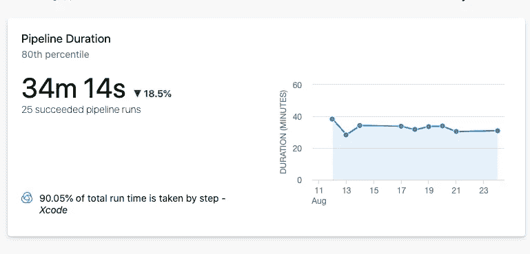
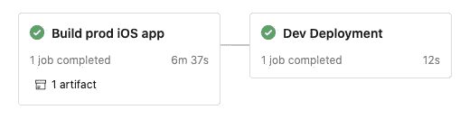

# 通过 CocoaPods 缓存将 Azure Pipelines Xcode 构建时间减少 80%

> 原文：<https://levelup.gitconnected.com/reduce-azure-pipelines-xcode-build-time-by-80-through-cocoapods-caching-5c2de0f657df>

如果你曾经在一个 [Azure 管道](https://docs.microsoft.com/en-us/azure/devops/pipelines/get-started/what-is-azure-pipelines?view=azure-devops)中使用 [Xcode 构建和发布任务](https://docs.microsoft.com/en-us/azure/devops/pipelines/tasks/build/xcode?view=azure-devops)用 CocoaPods 构建过一个 iOS 应用，你就会知道这需要很长时间。你添加的每一个额外的 pod 似乎都增加了构建任务的时间，在你知道它之前，你的 iOS 应用需要 30 分钟到一个小时以上的时间来构建。当您试图快速地推动和测试变更时，这既是一个不便，也是使用更多 pod 的巨大障碍。

我们的平均 iOS 应用构建时间

构建 Azure Pipeline 的基本 iOS 应用程序可能会做这样的事情:

1.  从`main`提取代码
2.  安装证书和预置描述文件
3.  更新`info.plist`以包含我们的管道变量(例如，包名、版本等。)
4.  安装 cocoa pods——从各自的远程 Git 存储库中下载所有的 pod 源文件，并集成到我们的项目中
5.  构建和归档应用程序
6.  上传`*.ipa`文件为神器

# 1.缓存盒安装

我们的第一个优化是使用[缓存任务](https://docs.microsoft.com/en-us/azure/devops/pipelines/tasks/utility/cache?view=azure-devops)来保存我们的 pod。我遵循了 Zaheer Moola 的指南。我不会在这里复制他们的代码，但本质上你想做的是保存 pods 文件夹，它在`pod install`之后包含所有的 pods 源文件。我们只在添加、删除或更新 pod 时再次运行`pod install`。

这花费了我们几分钟的构建时间，但是我知道我们可以做得更好。

# 2.缓存窗格编译

在故事的早期，我们看到构建平均需要 34 分钟，其中 90%是 Xcode 构建。所以我查看了日志，意识到 Xcode 必须构建所有的 CocoaPods，以及每个 pod 的所有依赖项。因为我们在项目中使用了 [Firebase SDK](https://firebase.google.com/docs/ios/setup#available-pods) ,所以我们有很多 pod。每一个都需要几个其他的 pod，它们也构建在我们的 Azure 管道中。

我认为，在我们项目的每个新构建中，我们最多接触十几个文件。考虑到我的更改可能实际上是在修复一个打字错误，为什么我们需要重建每个 pod 的每个源文件呢？

所以，我谷歌了一下“CocoaPods 构建缓存”,发现了[一个看起来像我想要做的结果](https://blog.takescoop.com/improve-ios-ci-build-time-with-cocoapods-caching-4a049ee45e63?gi=b939eac3ea19)——CI/CD 构建 CocoaPods 的缓存。不幸的是，本文没有使用 Azure 管道。我花了一点时间试图理解他们提到的构建系统，并将其转换为 Azure Pipelines land，但后来我意识到这篇文章来自 2018 年初，我的文件看起来不像他们的。

回到绘图板。后来又一次谷歌搜索，我偶然发现了官方 CocoaPods 网站上的[预编译依赖项](https://guides.cocoapods.org/plugins/pre-compiling-dependencies.html)。这是 CocoaPods 的一个插件，我将介绍它的功能:

> CocoaPods 二进制文件通过添加预安装阶段来工作，该阶段:
> 
> -取出您指定要预编译的 pods
> -编译这些 pods
> -切换用于引用源代码的 pods 规格，以引用新编译的框架

完美。这应该预先构建我们的 pod，并切换现有的 podspecs，这样我就不需要更改我们现有的缓存任务。它不使用下载的源文件，而是简单地指向构建的代码。

当我跳进 [CocoaPods 二进制 Github repo](https://github.com/leavez/cocoapods-binary) 并看到 2019 年 4 月的最新版本时，我有点担心。我希望这仍然可以工作，特别是考虑到我们是在 Xcode 12 上运行 iOS 14。

最初，我需要做的就是将插件添加到我们的 Podfile 中，并添加一行告诉它我希望我们所有的 pods 都预编译。我还需要将插件安装到我的电脑上，这是通过运行`gem install cocoapods-binary`完成的。

添加了 CocoaPods 二进制插件并设置了 all binary 标志的 Podfile

在**第 2 行**上，我们看到我已经添加了 CocoaPods 二进制插件，然后在**第 7 行**上，我使用`all_binary!`标志告诉 CocoaPods 我想要预编译该目标中的所有 Pods。

现在，下一次`pod install`运行时，安装后将运行一个额外的步骤来构建每个 pod。然后，当您的项目构建时，它将只需要构建您的项目部分，而不是所有的依赖项。这意味着你可以缓存 pods 的构建，只需要 Azure Pipelines 花费时间来构建你的应用，大大减少了构建时间。

我很想在这里结束这个故事，但自然地，这并不适合我。我面临三个问题。

# 重要提示

我建议在本地运行`pod install`命令，然后尝试构建 Xcode。当您不需要不断提交和推送您的更改时，调试问题会容易得多，并且您可能会发现您的本地机器下载和构建比 Azure Pipelines 代理更快。

# 错误

## pod install 正在为 SwiftI 的早期版本进行编译

## 多命令产品' */**/*。dysm

我收到的第二个错误与此类似，只是它有实际的文件路径:

`error: Multiple commands produce ‘*/**/*.dysm’`

我为我们的一些豆荚得到这个，但不是所有的豆荚。我不知道是什么导致了这个问题，但是在仔细研究了 CocoaPods 二进制文件的选项后，我找到了解决方案。这是为了给我们的 Podfile 添加以下标志，以确保`.dysm`文件不是为我们的 pod 构建的:

带有自定义 xcodebuild 选项的 Podfile。正在生成 dysm 文件

**第 8 行**显示我正在添加一个定制的`xcodebuild`选项来构建，但没有为我们的 pods 输出`.dysm`文件。

很好，问题解决了。

## 位代码问题

我遇到的最后一个问题是与位代码有关的错误。解决方案是向我们的 Podfile 添加第三个也是最后一个标志:

Podfile 为预构建框架启用位代码

这解决了最后一个问题。

# 把所有的放在一起

所以现在我知道我们的应用程序已经构建好了，我需要把我学到的一切都放到 Azure Pipelines YAML 文件中，然后我们就出发去比赛了。

我们 Firebase pods 的最终完整 pod 文件

我们 Azure 管道的最终代码

这个 iOS 构建管道 YAML 文件首先具有缓存任务，将我们预先构建的 pod 文件恢复(如果它们存在)到文件夹`Pods`。

接下来，我安装 CocoaPods 二进制插件，并将`xcodebuild`路径改为指向我们的 Xcode 测试版。

接下来，如果我们的缓存没有恢复(例如，如果我们还没有运行这个，或者一个 pod 发生了变化)，我们运行`pod install`，它不仅安装我们的 pod 源代码，而且还构建所有的源代码。

这使得我们的最终任务是构建我们的应用程序的唯一责任，仅此而已。

我们启用了 CocoaPods 构建缓存的新构建管道

总的来说，这将我们的应用程序构建时间从平均 **34 分钟**减少到不到 **10 分钟**。事实上，我们的一次跑步只花了 **7 分钟**。这是一个令人难以置信的节省，它减少了代理构建时间(并腾出时间来执行其他任务)，使我们能够更快地发布应用程序，并消除了添加额外 pod 的巨大障碍。这意味着我们可以引入新的库，而在以前，我们必须自己编写代码。太棒了。

如果你喜欢这个故事，给它一些掌声。否则，请随意留下您的任何问题，我会尽力回答。