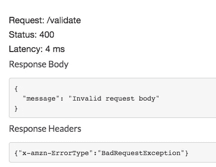

# 通过向 API 网关添加 JSON 模式验证器，减少 Lambda 调用和代码样板文件

> 原文：<https://levelup.gitconnected.com/reduce-lambda-invocations-and-code-boilerplate-by-adding-a-json-schema-validator-to-your-api-db7928690025>

如果你正在实现一个 RESTful API，很可能你需要**验证请求**参数或者请求体。

这可以通过多种方式实现。

# 手动验证处理程序中的所有内容

第一种方法是在处理程序中包含解析和验证方法:

*   我体内是否有一个属性 playerId？
*   那个属性是整数吗？
*   我的 URL 字符串中有参数游戏吗？
*   这是在一定的数值范围内吗？

如果不是，返回一个无效请求的错误。

你可以想象，根据有效载荷的大小及其约束，甚至在你到达你的处理程序的*果汁*之前，运行**就有很多样板代码。**

也许在你所有的处理程序中，都必须以类似的方式完成。

> 但是有中间件可以做到这一点！

真的！

# 替换为中间件

什么是中间件？它是一段代码，只要 lambda 处理程序被调用，就在它返回之前“神奇地”为您运行。通过这样做，您可以定义一组在之前运行的验证器(和一组在之后使用的错误响应)，并且您在处理程序中留下的只是您的业务逻辑所必需的代码。

如果您曾经使用过 Express，您应该已经习惯了中间件的概念，对于 Lambdas，一个非常有趣和有用的解决方案是[Middy](https://github.com/middyjs/middy/tree/master/packages/validator)——它附带了许多有用的中间件(从解析，到缓存，到[处理预热](https://dev.to/dvddpl/warming-up-your-lambdas-schedule-or-plugin--flo)，从 [SecretManager 和 ParameterStore](https://dev.to/dvddpl/where-do-you-keep-credentials-for-your-lambda-functions-5dno) 中检索值)

有了这样的中间件，样板文件验证的实现无疑更加结构化、优雅和可重用。

```
const schema = {
  required: ['playerId', 'game'],
  properties: {
    playerId: {
      type: 'integer'
    },
    game: {
      type: 'string'
    }
  }
}

handler.use(validator({
  inputSchema: schema
}))
```

尽管如此，它并没有解决一个主要问题:**具有无效请求的 lambdas 调用的成本**增加。

是的。

> *一旦你在你的 API 网关中收到一个请求，(你付费)它就被转发给你的 lambda(你付费)；但是，一旦您到达那里，您验证主体或参数，您意识到请求是无效的，并立即返回一个错误！*

真是浪费…

当然，执行速度很快，并且防止了无效请求被传递到队列或数据库……但是这难道不能改进吗？

## 如果我们已经知道请求是无效的，有办法阻止 lambda 被调用吗？

当然有，我们可以直接在 API 网关的层次上移动验证！！

# 用 JSON 模型模式验证 API 网关请求。

是的，您可以定义一个用 JSON 编写的验证，并将其交给 API 网关，这样如果主体不匹配，请求会立即被退回。
你仍然要为 APIGateway 的使用付费，但是你不会有任何不必要的 lambda 调用，你在 lambda 中的代码会更干净，你可以很容易地为多个类似的端点重用那些模式。

有很多有用的资源详细解释了这一点，

因为在几个项目中，我们决定试用 AWS CDK 来描述我们的堆栈(这很好，但我们还没有决定是否使用无服务器框架……)，所以我想在这里解释一下如何使用 [AWS CDK](https://docs.aws.amazon.com/cdk/latest/guide/home.html) 为您的 API 添加验证。

# 使用 AWS CDK 添加 JSON 验证

# 创建您的验证器

创建请求验证器的实例，并将其引用传递给网关 API:

```
const requestValidator = new apigateway.RequestValidator(this, "MyPayloadValidator", {
            restApi: API,  // <-- this is the reference to your API
            requestValidatorName: `myproj-${stage}-payload-validator`,
            validateRequestBody: true,
        })
```

# 创建您的模型:

```
const myModel = new apigateway.Model(this, "myValidationModel", {
            restApi: api,
            contentType: "application/json",  // <-- this is necessary - even thought they mention it's an optional param   VERIFY WITH LATEST VERSIONS OF CDK
            description: "Payload used to validate existing player and game",
            schema: {
                type: JsonSchemaType.OBJECT,
                properties: {
                    playerId: {
                        type: JsonSchemaType.INTEGER
                    },
                    game: {
                        description: "Codename of our games, usually 3 letters",
                        type: JsonSchemaType.STRING,
                        enum: ["AAA", "BBB "CCC"]
                    },
                    lang: {
                      description: "Language Code / Locale used by player, like it_IT or de_DE", 
                        type: JsonSchemaType.STRING
                    },
                },
                required: [
                    "game",
                    "playerId",
                    "lang"
                ]
            }
        })
```

这里有几件棘手的事情。

首先，我从检查 JSON 模式的外观开始，并创建了一个如下所示的 JSON 模式:

```
{
  "$schema": "http://json-schema.org/draft-07/schema#",
  "title": MyAwesomeValidation",
  "description": "Payload used to validate existing player and game",
  "type": "object",
  "properties": {
    "playerId": {
      "type": "integer"
    },
    "gameId": {
      "type": "string"
    }
  },
  "required": [
    "gameId",
    "playerId"
  ]
}
```

我认为有可能直接进口。

结果是你必须将 JSON 转换成 CDK 对象映射
并且[文档](https://docs.aws.amazon.com/cdk/api/latest/docs/@aws-cdk_aws-apigateway.JsonSchema.html)不是很清楚

其次，我得到了一个 ContentType 的错误，尽管[文档](https://docs.aws.amazon.com/cdk/api/latest/docs/@aws-cdk_aws-apigateway.Model.html#contenttype)声明 contentType 是一个可选参数

> *检测到 1 个验证错误:“createModelInput.contentType”处的值 null 无法满足约束:成员不能为 null*

通常，当我卡住时，我总是运行`CDK synth`来检查正在生成的云形成模板，然后我直接检查云形成的[文档。在那里，我发现您需要通过`"ContentType": "application/json",`,这在 UI 控制台上也是非常简单的。](https://docs.aws.amazon.com/AWSCloudFormation/latest/UserGuide/aws-resource-apigateway-model.html)

当我真的不知道如何使用 CDK、无服务器框架或 CloudFormation 创建特定资源时，我会在 UI 控制台中手动完成:浏览所有数百次点击，直观地看到所有必要的选项、步骤和属性，这对理解该过程非常有帮助。

# 将模型和验证器分配给资源

Rest API 的每个端点——通常称为资源——都可以有特定的方法(GET、POST 等)。要验证该方法中的有效负载或参数，请将对模型的引用和验证器分配给该 API 资源方法。

我认为这很简单，但这正是我发现自己浪费时间的地方。

方法选项的文档声明请求模型是验证模型的映射。

> *描述请求载荷数据结构的模型*

但是我应该添加什么作为密钥呢？

```
myEndpoint.addMethod("POST", myLambdaIntegration, {
                requestValidator: requestValidator,
                requestModels: {"????": myValidationModel}  <-- what is the key to be used here?
            }
        )
```

再次检查直接来自 CloudFormation 而不是 CDK 的[文档，给出了一些提示:](https://docs.aws.amazon.com/AWSCloudFormation/latest/UserGuide/aws-resource-apigateway-method.html)

> *用于请求内容类型的资源。将请求模型指定为键-值对(字符串到字符串的映射)，内容类型作为键，模型资源名称作为值。*

尽管这里的单词 *resource* 有点误导，因为它不是 API 网关资源(您的端点)而是更一般的**任何 AWS 资源**，这里重要的部分是:**作为键的内容类型**

[经过一番搜索](https://dev.to/dvddpl/am-i-an-expert-developer-or-just-an-expert-googler-4390)我在 AWS 上找到了[这篇文章](https://aws.amazon.com/it/premiumsupport/knowledge-center/model-api-gateway/) :
**我如何在 API Gateway 中将模型与我的 API 关联起来？我尝试直接从控制台添加模型，在那里我看到映射确实是用内容类型完成的，我添加的指定为键的确切内容是，嗯，如前所述，一个内容类型…**

```
requestModels: {"application/json": myValidationModel}
```

# 测试您的验证器

当我最终能够部署时，我在控制台中仔细检查了所有的东西都在它的位置上并且配置正确，我试图从 Postman 发送一个带有错误负载的请求。

….它通过了。Lambda 被触发，崩溃/从自身验证返回错误

为什么！？！


从测试控制台(API / Resources / your_method / Test)尝试时，我得到了预期的结果:



它在伐木

```
Request body does not match model schema for content type application/json: [object has missing required properties (["theRightOne"])]
```

在盯着 Postman 屏幕看了一会儿之后，我注意到由于某种原因，Body Type 和 Header Content-Type 被设置为`application/text`！！
更改为`application/json`后，请求被拒绝(不出所料！)

但这意味着，如果客户端用 fetch/axios 发送任何类型错误的请求，网关 API 会让它到达 lambda！！

我也尝试了这个选项`"passthroughBehavior": "never"`,但是它似乎不适用于代理集成。

目前，解决方案是在其他类型的内容之上添加键映射，我们希望对这些内容类型应用验证。
(虽然说实话。我更愿意有排除某些东西的可能性，或者拒绝除 json 之外的所有东西..将在下一个 CDK 版本中看到)

所以最后，这是您需要向 API 方法添加 JSON 模式验证器的地方:

```
const api = new apigateway.RestApi(this, "AwesomeApi", {  
            restApiName: `my-awesome-api`,  // <--- this is the name of the gateway api in Console
            description: "api to do awesome stuff"
        })
 const resource = api.root.addResource("doStuff")  // this is the endpoint!  otherwise lambda is called directly under api root )
 const awesomeIntegration = new apigateway.LambdaIntegration(myLambda)
 const requestValidator = new apigateway.RequestValidator(this, "AwesomePayloadValidator", {
            restApi: api,
            requestValidatorName: `my-payload-validator`,
            validateRequestBody: true,
        })
const model = new apigateway.Model(this, "AwesomeValidationModel", {
            modelName: "myValidationModel",//`myproject-${stage}-validate-payload-model`,
            restApi: api,
            contentType: "application/json",  // this is necessary - even thought they mention it's an optional param
            description: "Payload used to validate your requests",
            schema: {
                type: JsonSchemaType.OBJECT,
                properties: {
                    foo: {
                        type: JsonSchemaType.STRING
                    },
                     bar: {
                        type: JsonSchemaType.INTEGER,
                        enum: [1, 2, 3]
                    },
   fizz: {
                        type: JsonSchemaType.STRING
                    },
                },
                required: [
                    "foo",
                    "bar"                
                ]
            }
        })
        resource.addMethod("POST", awesomeIntegration, {
                requestValidator: awesomeValidator,
                requestModels: {"application/json": awesomeModel}
            }
        )
```

使用无服务器有点不那么简单。你需要几个插件，但这绝对是可行的。
[https://www . npmjs . com/package/server less-req validator-plugin](https://www.npmjs.com/package/serverless-reqvalidator-plugin)
[https://stack overflow . com/questions/49133294/request-validation-using-server less-framework](https://stackoverflow.com/questions/49133294/request-validation-using-serverless-framework)

所以，

## 您应该为您的 API 网关实现模型模式验证器吗？

当然可以！

## 为什么？

为了避免处理程序中的重复和笨拙的样板文件验证，最重要的是为了有更多的控制和防止不必要的(和昂贵的)lambda 调用。

想象一下，由于某种原因，您的前端出现了错误的更新，请求被错误地发送出去。您收到了一个请求高峰，所有请求都被退回，因为有效负载无效。至少通过 API 网关请求验证，您可以**降低服务器上的成本**。

或者更糟，想象一下某个**恶意攻击攻击您的端点**:您至少可以通过阻止无效请求到达 lambda 来减轻它。(当然，在恶意攻击的情况下，很可能会使用有效的有效载荷，所以如果您通过节流和 ACL 规则添加一些安全措施，那就更好了:请看一下 [AWS WAF](https://aws.amazon.com/it/waf/) )

希望有帮助。
如果您对 CDK 或无服务器的实施有任何建议或替代方案，请随时添加到评论中。

*原载于 2020 年 5 月 25 日*[*https://dev . to*](https://dev.to/dvddpl/reduce-lambda-invocations-and-code-boilerplate-by-adding-a-json-schema-validator-to-your-api-gateway-15af)*。*