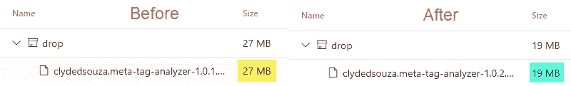

# 减小 Visual Studio 扩展(VSIX)文件的大小

> 原文：<https://levelup.gitconnected.com/reducing-a-visual-studio-extension-vsix-file-size-86ed72fbcf39>

并解决格式错误的 Azure DevOps 扩展包错误


[VSIX](https://docs.microsoft.com/en-us/visualstudio/extensibility/shipping-visual-studio-extensions) 标志放置在来自 [Unsplash](https://unsplash.com/photos/v7WyjiyXNr4) 的背景图片上

# 介绍

我最近更新了我在 Visual Studio Marketplace 上发布的 Azure DevOps 扩展。我上次对这个扩展进行更新是在 2019 年，但我已经做好了一切，包括 DevOps 管道，所以我认为这应该很容易。嗯，差不多了。当我开始发布扩展时，我遇到了一个错误。本文旨在揭示这个错误以及解决这个问题的方法。

# 问题

我做了修改，所有的单元测试都通过了，甚至构建管道生成了一个 VSIX 包——到目前为止一切顺利。但是，当发布管道启动时，它在尝试将 VSIX 包部署到 Visual Studio Marketplace 时失败，并出现以下错误。


如果上面的截图不是很清楚，文本版本如下:

```
error: Extension package is malformed/corrupted 0 [ 'error: Extension package is malformed/corrupted', '' ][error]tfx failed with error: Error: The process 'C:\hostedtoolcache\windows\tfx\0.7.11\x64\tfx.cmd' failed with exit code 4294967295
```

对这个问题进行快速搜索后，我转到了[对一个](https://github.com/microsoft/vscode-vsce/issues/153#issuecomment-281347656) [GitHub 问题](https://github.com/microsoft/vscode-vsce/issues/153)的评论。尽管它是针对 VS 代码扩展的，但潜在的问题似乎是当 VSIX 发布到市场上时有一个文件大小限制。[在](https://developercommunity.visualstudio.com/solutions/299439/view.html)[开发者社区论坛](https://developercommunity.visualstudio.com/content/problem/292454/the-extension-package-size-exceeds-the-maximum-pac.html)上的这个评论也确认了一个文件大小限制，尽管大小值略有不同。

我看了一下由 build pipeline 生成的 VSIX 的文件大小，你瞧，它是 26.6MB！这意味着尝试和解决这个错误的第一步是减小 VSIX 包的文件大小。


# 解决办法

那么，如何减小 VSIX 文件的大小呢？让我们一步一步来看看。

## 第一步:看看包装的是什么

在我们开始减小文件大小之前，理解 VSIX 文件中实际包含的内容是很重要的。要解包，只需下载生成的 VSIX 文件，并像解压缩 zip 文件一样解压缩内容。


在`buildAndReleaseTask`文件夹中，我可以看到我所有的开发文件和`node_nodules`文件夹。我不明白为什么这个任务需要打包的 VSIX 文件中的 tests 文件夹，例如，才能在 Azure DevOps 中准确运行，所以这需要调查。凭记忆，我还知道`node_modules`文件夹一般会占用很多磁盘空间。快速的谷歌搜索将会显示关于一个大的 node_modules 文件夹的多个问题和减小文件夹大小的建议。这给了我一个很好的起点。

## 步骤 2:让我们处理 node_modules 文件夹

在我们做任何事情之前，如果我检查 node_modules 文件夹的大小，它是一个巨大的 126MB 的磁盘。


在研究如何减小这个巨大文件夹的文件大小时，我偶然发现了这篇令人惊叹的博文，其中描述了一些你可以尝试的方法。引起我注意的是 node-prune 和 modclean 的使用。我决定尝试 modclean，因为他们通过 npm 提供了他们的 [CLI 工具。](https://www.npmjs.com/package/modclean)

在这个 [CLI 文档](https://github.com/ModClean/modclean/wiki/CLI)之后，我做了以下事情:

1.  我用 VS 代码打开了终端窗口，并全局安装了 CLI 工具。我用`npm install -g modclean`做到了这一点。
2.  尽管如此，在终端窗口中，我将目录更改为`Src\buildAndReleaseTask`，这是`node_modules`文件夹所在的位置，并键入命令`modclean -r`。这将在`node_modules`文件夹上执行 modclean，指定`-r`选项将在不提示任何警告或使其交互的情况下运行该实用程序。

这将 node_modules 文件夹在磁盘上的大小减少到 97.3MB。不太激烈，但现在还好。


然后我运行[命令](https://github.com/ClydeDz/meta-tag-analyzer/blob/master/Src/buildAndReleaseTask/package.json#L18) `npm run devtest`来运行我的测试，包括执行扩展和使用 Azure Pipelines 模拟运行器生成 Excel 报告。所有的单元测试都通过了，最终报告也准确地生成了。这给了我信心，即使从 node_modules 文件夹中删除了一些文件，任务仍然可以像预期的那样工作。

最后，为了检查 VSIX 包的文件大小，我在我的开发机器上运行了以下命令。点击查看 tfs-cli [的完整文档。](https://github.com/microsoft/tfs-cli/blob/master/docs/extensions.md)

```
tfx extension create --manifest-globs .\vss-extension.json
```

最终的 VSIX 包大小已经有了很大的改进，从 26.6MB 减少到了 19.8MB。


## 步骤 3:删除开发文件

当任务在 Azure 管道中运行时，它执行`index.js`文件中的`run()`方法。task.json 文件中的[执行代码块](https://github.com/ClydeDz/meta-tag-analyzer/blob/master/Src/buildAndReleaseTask/task.json#L34-L38)告诉管道这样做。这意味着，我们并不真正需要最终包中的 TypeScript 文件。


为了删除所有的 TypeScript 文件，我打开了解压 VSIX 包内容的`buildAndReleaseTask`文件夹，打开了一个命令提示符，然后执行命令`del /S *.ts`(在 Windows 上)递归删除所有的 TypeScript 文件。

类似地，我执行命令`del /S *.xlsx`递归删除所有 Excel 文件，执行命令`del /S *.xml`递归删除所有 XML 文件。我还使用命令`rmdir /S “tests” /q`删除 tests 文件夹的内容，因为我们不再需要它了。选项`/q`静默执行该命令。

在这个练习之后，解压缩后的`buildAndReleaseTask`文件夹的大小减少了 26.82%。


## 步骤 4:在 Azure DevOps 中测试

现在是时候在为我生成 VSIX 包的 Azure DevOps 构建管道中测试这些步骤了。就在单元测试结果发布到管道之后，VSIX 打包之前，我添加了三个命令行任务——全局安装 npm 包 modclean，执行 modclean 命令，最后是删除开发文件的命令。


对于“删除开发文件”步骤，我将所有四个命令合并成一行，用一个“与”符`&`分隔每个命令。

保存更改后，我运行管道并比较结果。VSIX 软件包的文件大小已经减少了 8MB，降至 20MB 以下。太好了！



## 第五步:家务

让我们将所有命令移到 [package.json 文件](https://github.com/ClydeDz/meta-tag-analyzer/blob/master/Src/buildAndReleaseTask/package.json#L20-L21)的脚本部分，而不是将所有命令直接写入构建管道的 GUI。


我现在可以使用命令`npm run modclean`和`npm run clean-dir`从构建管道中执行这些命令。

**注意:**如果您使用 YAML 作为您的管道，您可能不需要执行这个步骤，因为整个管道都是基于 YAML 文件的，并且与其余的代码一起受源代码控制。

# 结论

最后，我在构建包的主分支上运行构建管道，这触发了成功发布 VSIX 的发布管道。

如果你想看看 Azure DevOps 扩展，[这里有一个链接](https://marketplace.visualstudio.com/items?itemName=clydedsouza.meta-tag-analyzer)指向 Visual Studio Marketplace 中的 Meta Tag Analyzer。这个扩展的源代码在 [GitHub](https://github.com/ClydeDz/meta-tag-analyzer) 上。

希望你喜欢这本书。如果你经历过类似的旅程，请在下面的评论中告诉我。就是这样。感谢阅读！