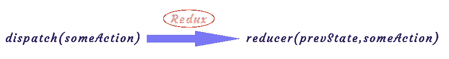

# Redux —鸟瞰图

> 原文：<https://levelup.gitconnected.com/redux-a-birds-eye-view-58925fc5ee8>

在本文中，我们将简要了解 Redux 是什么。

本文假设您熟悉 React，并且可能已经使用了一段时间，现在想要将 Redux 添加到您的工具集中。

# **Redux 是什么？**

简单来说，Redux 是一个**状态**管理库，帮助我们将整个应用的**状态**保存在一个地方。

Redux 帮助我们编写行为一致、在不同环境(客户机、服务器和本机)中运行、易于测试的应用程序。我们可以将 Redux 与 [React](https://reactjs.org/) 一起使用，或者与任何其他视图库一起使用。

# 改变(修改)状态

有时，我们需要在一个组件中修改**状态**。为了使用 redux 做到这一点，我们将`dispatch an action`。

一个**动作**基本上是一个具有**类型**属性的对象。一个**动作**也需要第二个属性，通常被称为**有效负载**(但是可以是任何东西，这就是我们如何将数据传递给 reducer)。

**类型**属性作为动作的名称。我们应该总是给我们的行为起一个描述性的、有意义的名字。

一旦一个**动作**被**调度**，Redux 调用**减速器**，以之前的状态和被调度的动作对象作为参数。

# 该减速器

一个**减速器**是一个函数(我们创建的)，它根据某个动作更新状态。它采用如上图所示的两个参数——应用于该状态的**前一状态**和**动作**——并返回**当前状态**。

在一个 nuts shell 中，我们**从我们的组件(视图层)中分派**一个动作，**缩减器**获得这个动作并相应地改变**状态**,**存储**通知视图层关于状态改变，视图层根据最新的状态改变重新呈现应用。每当我们需要再次改变状态时，这个循环就会重复。

# **商店**

一个**存储**是一个对象，它保存应用程序的状态，并提供使用它的 API。它允许我们读取状态并调度动作来改变状态。我们的应用程序应该有一个单一的商店。

# Redux 工具包

Redux toolkit 是官方推荐的编写 Redux 逻辑的方法。它围绕着 **Redux 核心**(如上所述)，包含构建 Redux 应用程序所必需的包和函数。它构建了最佳实践，简化了大多数 Redux 任务，防止了常见错误，并使编写 Redux 应用程序变得更加容易。

# 结论

在本文中，我主要用简单的术语解释 Redux 是什么。对于 redux 的一个实际用例，请查看[Redux Toolkit——一个简单的示例工作流](/redux-toolkit-a-simple-example-workflow-20efcee54635)。

— -

如果你还没有，点击**跟随**按钮，这样你就不会错过我的下一篇文章。谢谢