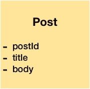

# Redux 和领域驱动设计

> 原文：<https://levelup.gitconnected.com/redux-and-doman-driven-development-29f818f60f2f>

## 简短的实用比较

Redux 的创造者 Dan Abramov 说他不知道什么是领域驱动设计。尽管如此，Redux 与 DDD 的相似程度还是令人印象深刻。在这篇文章中，我解释了什么是 DDD，一些关键概念，以及 Redux 如何实现它的想法。并且理解这两者，我们可以交付更好的实现；来自不同世界的两种方法相互冲突，并利用了相同的设计原则。

# 领域驱动设计

领域驱动设计是一种软件建模技术，旨在创建健壮的微服务架构以及集成多个现有解决方案。

Eric Evans 在 2003 年的《领域驱动设计:解决软件核心的复杂性》一书中首次提出了这一概念。目前，DDD 有更多的书，更多的例子，它已经被证明是有效的扩展和维护大型系统的高性能。如果你听说过事件采购或 CQRS，那么你就和 DDD 有过交集。

我们可以把 DDD 分成两个部分:战略和战术。该策略引入了无处不在的语言和有限的上下文。它在开发人员和业务之间创建了一种通用语言，但是这种语言不仅限于会议:所有文档、故事甚至代码都共享这种语言。每一个声明的变量、函数、类或包名都匹配这种无处不在的语言。

战术更多的是关于如何实现系统。主要目标是使系统能够跨越许多位置的许多微服务。使用的抽象是查询、命令、域事件和集合。应用程序将查询和命令指向聚合，聚合完成所有计算，域事件维护整个系统的最终一致性。

战术的相关概念是:

**查询**:你可以对系统做的任何问题。它不会改变其状态或任何数据。它是你要求的东西，它用信息来回应。没有副作用。查询示例:列出可用的帖子。


**命令**:请求突变。他们可能会成功，也可能会失败。系统执行它们并返回结果。一些变体，如 CQS，不允许命令返回值。命令示例:添加新帖子。


**域事件**:是关键；它们代表一个原因的结果；它们是事实，是已经发生的事情。事件不会失败，也不能取消。应用程序中的任何组件都可以监听任何事件；当它们中的任何一个接收到一个事件时，它们会自我更新并生成新的事件。域事件支持最终的一致性。领域事件的例子有:添加了一个新帖子，或者是五点钟。


**聚集体**:是 DDD 的主要模式。它代表模型的小部分(理想情况下只有一个实体和几个对象值)。模型被合理地隔离。聚合通过查询、命令和域事件相互通信。它们消耗域事件来保持它们的状态一致，同时，它们为每个突变生成新的域事件。聚合的例子:post。



不幸的是，许多人混淆了命令和域事件。两者都是动词，都可能暗示状态的突变，但又是不同的。命令是意图，领域事件是事实。这就是为什么命令可能会失败，但域事件不会。命令是我们希望发生的事情，而域事件是已经发生的事情。

如果你想更多地了解 DDD，我强烈推荐阅读弗农·沃恩的书*领域驱动设计精粹* (2016)。这本书快速介绍了所有的概念，并给出了如何开始做 DDD 的全面看法。

# Redux

Redux 与领域驱动设计惊人地相关。虽然它不共享相同的术语，但思想是存在的。Redux 几乎是 DDD 策略在功能范式中的一种实现。

我们用 Redux 对比一下之前的概念:

**查询**:它们是选择器。选择器从状态中获取一条信息。

**命令**:它们是动作。当我们分派一个动作时，我们提交一个新的命令。Redux 不提供结果，因为它实现了纯 CQS。

事件:它们也是行动。但是，当一个行动成为事实的时候呢？一旦减少。减少一个动作后，就变成了事实，一个不变的东西。

**聚合**:聚合是计算所有变更的人；这是减速器。

不幸的是，Redux 词汇表不容易区分命令和域事件。DDD 用不定式动词表示命令；和事件的过去分词。不过，常见的是 redux 动作类型，如命令“FETCH_POST”或事件“FETCH_POST_SUCCESSFUL”

# Redux 上的 DDD 模式

有两种模式让 DDD 很受欢迎:活动采购和 CQRS。两者都源于提高可伸缩性和性能的需要，并且两种技术通常都在 Redux 中应用。

**首先是事件采购**。事件源 DDD 的目标是提高数据库中的写入吞吐量。它不是将每个更改保存在数据库中，而是只存储每个聚合发出的域事件，如果可能的话，还存储聚合的快照。原因很简单:您可以通过重放事件来重建任何聚合的状态。

例如，您可以通过重放 PostAdded 事件来重建所有帖子。


你对 Redux 中的这个概念熟悉吗？几乎可以肯定，是的。在 Redux 中，这被称为时间旅行，可能你在开发工具中调试的时候经常使用它。

这种模式很棒；它不仅允许我们更快地修复错误，或者加速服务器上的写操作，而且有助于使应用程序更安全。数据丢失？没问题，重放事件，您可以重建状态。由于一个错误导致的数据损坏？解决 bug，重放事件，并获得原始状态。你在帮助其他用户吗？只要回放他们的事件就知道哪个是他们的状态。

**第二个是 CQRS** 。CQRS DDD 的目标是创建结合来自多个集合的数据的模型。不要执行大量缓慢的查询，而是对一个模型进行快速查询。如果事件源解决更新慢的问题，它就解决了查询慢的问题。这个想法是，一个独特的模型将消费多个事件，并将计算一个派生的状态，一致。然后，消费新模型。例如，我们可以创建一个模型来统计帖子。它接收添加后的事件，并递增每个事件的计数。


Redux 中的等价物是多个 reducers 在不同的地方更新相同的动作。尽管我们有带记忆功能的选择器，但有时我们更喜欢保留计算得出的数据以提高性能。例如，当我们有一个实体由键索引的对象，但是我们有一个包含键的数组。它加快了列表查询的速度。

```
**function** reducePosts(state, action) {
  **switch** (action.type) {
    **case** ADD_POST:
      return { ...state, [action.post.id]: action.post };
    ...
  }
}**function** reducePostList(state, action) {
  **switch** (action.type) {
    **case** ADD_POST:
      return [...state, action.post.id];
    ...
  }
}**function** getPostList(state) {
  // instead of Object.keys(state.post)
  **return** state.postList; 
}
```

**DDD 属地脱钩**。尽管这不是一种模式，但 DDD 很好地解耦了它们之间的聚合。除了性能上的可伸缩性，这也是 DDD 的主要优势之一。聚合的概念以及它与其他元素的交互方式提供了高度的可维护性和更好的实现。正是这种精确的特性防止了有害的大泥球的产生。

让我们看一个例子:我们有一家公司销售产品，并利用营销活动来提供优惠。商店中的现有单元最初被贴上相应产品销售价格的标签，但是当活动开始时，它用广告价格重新贴上单元标签。

没有 DDD，我们有如下代码:


```
// Without DDD
**class** Campaign {
  ...
  startCampaign() {
    product.relabelUnits(advertisedPrice);
  }
}**class** Product {
  ...
  relabelUnits(price) {
    units.forEach(unit => unit.relabelPrice(price));
  }
}**class** Unit {
  ...
  relabelPrice(price) {
    labeledPrice = price;
  }
}
```

如果我们应用 DDD，我们可以依靠域事件来更新其他聚合:


```
// With DDD
**class** Campaign {
  ...
  startCampaign() {
    emit(new CampaignStarted(..., productId, advertisedPrice));
  }
}**class** Unit {
  ...
  onCampaignStarted(event) {
    labeledPrice = event.advertisedPrice;
  }
}
```

你注意到区别了吗？现在产品已经消失了。产品不再依赖于该单元。我们已经降低了应用程序的耦合性，并且我们可以在不改变任何代码的情况下从我们的系统中插入和拔出这些单元。

Redux 做同样的解耦。每个组合的减速器就像一个集合体。当减速器接收到一个动作时，它会独立地减小该动作。

```
**function** reduceUnit(state, action) {
  **switch** (action.type) {
    **case** START_CAMPAIGN:
      return { ...state, labeledPrice: action.advertisedPrice };
    ...
  }
}
```

# 结论

Redux 和 DDD 有很多相似之处，并且都有很多优点。尽管它们是从不同的抽象和不同的背景中创建的，但是它们都受益于相同的架构原则。

主要区别是域事件。这个概念在 Redux 中并不明确存在。这是有后果的，可能会在以后的文章中研究。

了解更多信息:

*   [https://martinfowler.com/eaaDev/EventSourcing.html](https://martinfowler.com/eaaDev/EventSourcing.html)
*   [https://www . Amazon . com/Domain-Driven-Design-distilted-Vaughn-Vernon/DP/0134434420](https://www.amazon.com/Domain-Driven-Design-Distilled-Vaughn-Vernon/dp/0134434420)