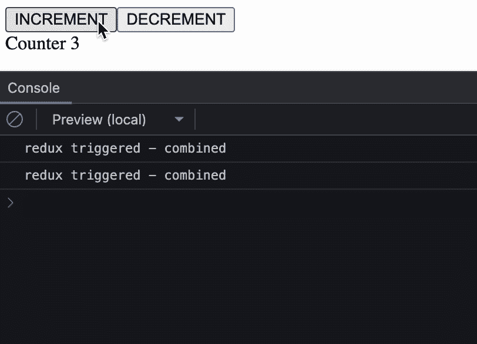
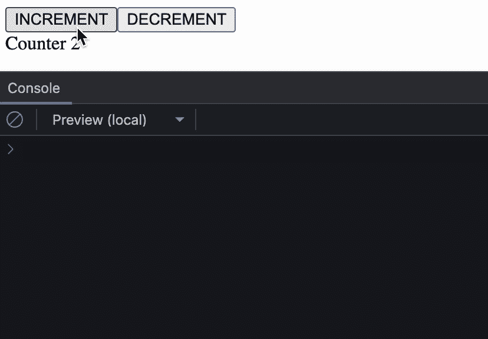

# Redux Gotchas —使用选择器

> 原文：<https://levelup.gitconnected.com/redux-gotchas-useselector-8f2aeb8973c9>

## 防止意外的重新渲染和潜在的错误


## 介绍

Redux 自 2015 年以来一直存在，多年来一直是事实上的状态管理解决方案。它伴随着 React 生态系统从基于类到函数的时代，并从 v7.1.0 开始通过引入 redux 挂钩来适应新的标准。

本文将指出使用`**useSelector()**`时的一些常见陷阱和技巧。

## 样品反应应用

这是一个简单的 react 应用程序，我已经建立来演示这个问题:


用 Redux provider 包装组件的应用程序容器

呈现最新计数器并监听 redux 存储的显示容器

在这个例子中使用的根缩减器

这个简单的应用程序有 2 个按钮，用于更新计数器状态并发出信号***display container . tsx***进行 UI 渲染。

注意状态属性 **randomArray** 默认为 **undefined** ，默认为选择器函数中的**空数组**

我们还在***display container . tsx***中创建了一个`**useEffect()**`钩子，用于在生命周期钩子检测到变化时打印出一些文本。

## 问题是

现在，你可能想知道为什么 **randomArray** 会触发`**useEffect()**`钩子，如果状态不会被任何 redux 动作更新的话。让我们看看控制台:


我们已经观察到，在增量和/或减量按钮点击时:

1.  每当订阅的属性发生状态变化时，就会调用选择器函数 **stateSelector** 。
2.  状态属性— **计数器** —因重复操作而更新。
3.  状态属性 **randomArray** 的值没有变化，但是它向`**useEffect()**`发出信号表示已经有了更新。

对于第 2 点，这并不奇怪，因为这是预期的行为。基于 [***useSelector 文档***](https://react-redux.js.org/api/hooks#useselector) ，一开始就指出我们应该预料到 **stateSelector** 函数会被多次调用**:**

****

**用户选择器文档中信息部分的屏幕裁剪**

> **`useSelector()`也将订阅 Redux store，并在一个动作被调度时运行您的选择器——Redux Team**

**这里有趣的是**随机数组**导致`**useEffect()**`重新运行。但是这种行为的原因是什么呢？让我们再次参考文档中的一些相关信息:**

*   **`**useSelector()**`将对之前的选择器结果值和当前结果值进行参考比较。**
*   ****`**useSelector()**`默认使用严格的`===`引用等式检查，而不是浅等式。****

## ****罪犯已确认****

****基于这些指示，基于对`**useSelector()**`如何工作的理解，我们可以推断出以下代码行是罪魁祸首:****

```
**...
return {
    counter: state.counter,
 **randomArray: state.randomArray ?? [],** };**
```

****鉴于`**useSelector()**`中订阅的状态改变将导致**状态函数**被重新求值，并且 **state.randomArray** 在整个过程中是**未定义的**，回退到空数组`[ ]`赋值是这里的根本原因。****

> ****每当调用 state 函数时，都会创建一个新的数组对象并将其分配给属性。****

****尽管数组的值是相同的，但我们不应该忘记这一点****

> ******数组是 JavaScript 世界中的一个对象**。新对象的创建将导致不同的引用****

****当 redux 比较先前和当前状态函数的结果时，这将导致**falsy**参考相等检查。****

## ****快速修复-全局范围默认变量****

****这个问题的快速解决方法是简单地分配一个默认的回退值，这个值是在**全局作用域**中创建的:****

****更新了回退值，以使用在全局范围内创建的空数组****

********

****最后，未改变的属性不再在每个不相关的状态改变时触发`**useEffect()**`。****

## ****多用途和小用途选择器用途****

****将所有需要的状态组织到一个状态函数中，并用一个`**useSelector()**`返回，这看起来很方便，但这并不是 redux 团队推荐的方法****

> ****我们可以在一个组件中多次调用`useSelector`。事实上，这实际上是一个好主意——每次调用`useSelector`应该总是返回尽可能少的状态——Redux Team****

****[](https://redux.js.org/tutorials/fundamentals/part-5-ui-react#using-multiple-selectors-in-a-component) [## 基础知识，第 5 部分:UI 和 React

### 在第 4 部分:存储中，我们看到了如何创建一个 Redux 存储、分派动作以及读取当前状态。我们还看了…

redux.js.org](https://redux.js.org/tutorials/fundamentals/part-5-ui-react#using-multiple-selectors-in-a-component) 

让我们重构前面的代码示例，使用多个`**useSelector()**`,看看这在处理状态函数评估问题时是否有所不同——

## 全局范围默认值的替代

那么前面的 multiple `**useSelector(**` **)** 方法解决对象引用问题了吗？


我们仍然观察到`**useEffect()**`再次被触发。让我们尝试另一种方法— `**useSelector()**`有第二个可选参数`**equalityFn**`，它允许传递一个定制的等式函数。

对于像 **randomArray** 这样的简单对象，我们可以传入一个自定义的等式函数，比如 **shallowEqual** ，它是由 redux:

```
import { shallowEqual } from 'react-redux';
...
const randomArray = useSelector(randomArrStateSelector, shallowEqual);
```


更改后，在**计数器**更新时，我们看到 **randomArray** 状态函数被多次调用。这很好，因为最重要的是**随机数组**对象不再导致`**useEffect()**`被触发。

## 具有嵌套属性的对象

接下来，让我们看看另一个类似下面的例子，我们用另一个具有嵌套属性的对象来替换**random array**—**randomDeepObject**

注意，我们为`**useSelector()**`提供了 **shallowEqual** 函数



**浅相等**检查对复杂对象不起作用，会导致每个求值周期都将其视为状态变化。在寻找快速解决这个问题的方法之前，我们应该记住 redux 文档建议——

> 对`useSelector`的每次调用应该总是返回尽可能少的状态— Redux Team

所以，我们应该后退一步，看看我们的组件，看看我们是否正确地设计了状态函数。

如果没有其他办法，我们可以再次使用**全局默认变量**，或者在`**useSelector()**`中提供**深度相等**检查函数，例如——

```
import { isEqual } from 'lodash';
...
const randomDeepObject = useSelector(randomDeepObjectStateSelector, isEqual);
```

## 回到单用户选择器场景

现在，你可能想知道我们是否可以在单个`**useSelector()**`案例中使用类似的等式函数方法来避免错误信号


遗憾的是，即使使用深度相等检查，仍然无法防止`**useEffect()**`的意外触发。

这是因为等式检查是在状态函数的结果上执行的。状态属性计数器确实正在更新，这将导致另外两个对象属性被重新评估，因为这三个属性是从单个状态函数返回的。

## 拿走

> 使用多重`**useSelector()**`，返回尽可能少的数据
> 
> 预计状态函数会被多次调用，所以我们应该避免在状态函数中意外创建对象
> 
> 3 避免错误信号的快速方法:
> —全局默认变量
> —浅层等式函数(如来自 redux)
> —深层等式检查函数(如来自 lodash)

请随意使用我在本文中引用的示例项目——**** 

****以上是使用`**useSelector()**`时一个常见问题的快速浏览，希望本文能帮助您识别现有问题，避免将潜在的错误引入您的代码库。****

> ****如果你觉得这篇文章很有帮助，请分享给你的朋友，并给他们一些掌声。请随意查看我的其他文章:****

****[](https://medium.com/javarevisited/do-more-with-less-java-lombok-and-experimental-features-8d71d0bcb27c) [## 用更少的 Java 做更多的事— Lombok 和实验性特性

### Lombok 让 Java 再次变酷

medium.com](https://medium.com/javarevisited/do-more-with-less-java-lombok-and-experimental-features-8d71d0bcb27c) [](https://medium.com/javarevisited/generate-typescript-interfaces-from-java-classes-d53f8c590500) [## 从 Java 类生成 TypeScript 接口

### 当你可以享受一杯午后的平淡无奇时，为什么还要花时间写界面呢？

medium.com](https://medium.com/javarevisited/generate-typescript-interfaces-from-java-classes-d53f8c590500)****