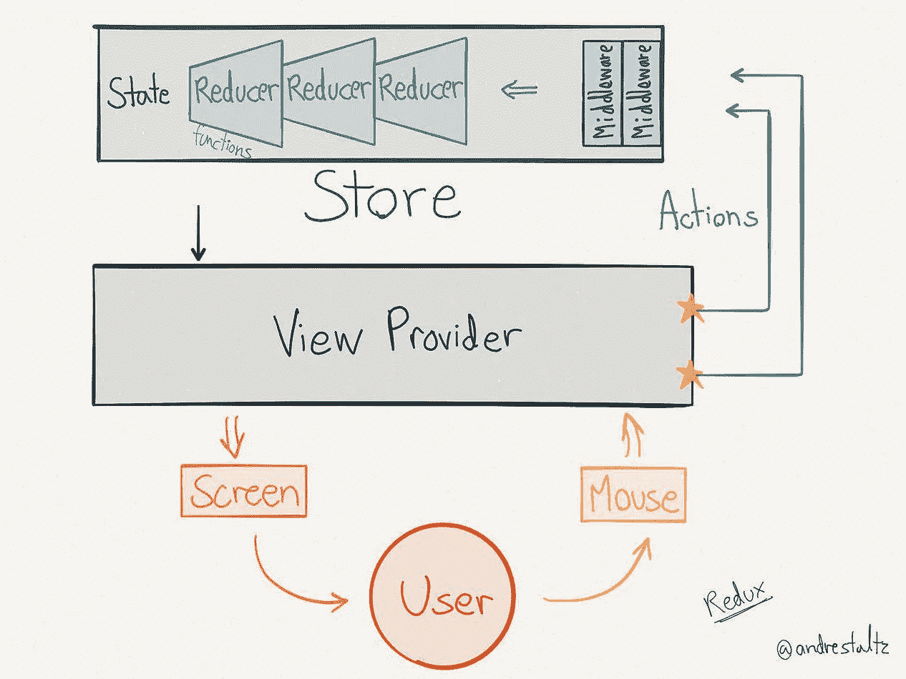

# Redux 逻辑流程——疯狂的简单总结

> 原文：<https://levelup.gitconnected.com/redux-logic-flow-crazy-simple-summary-35416eadabd8>

有无数冗长复杂的文章试图描述 Redux，但 Redux 本身其实就是一个简单的库。当需要的只是一个简单的逻辑过程的例子时，很容易迷失在深度中。因此，我创造了这个疯狂的简单总结。

 [## 学习 Redux -最佳 Redux 教程(2018) | gitconnected

### Redux 的 6 大课程。教程由开发者提交和投票，让你找到最好的冗余…

gitconnected.com](https://gitconnected.com/learn/redux) 

**Redux:** 这个库以最简单的方式保存和更新应用程序的整个状态，同时使用最少的样板代码。

**动作:**由纯函数返回的无副作用的普通对象。动作对象包含“类型”和更新状态所需的任何信息。使用 dispatch()将对象发送到存储区，存储区使用 action 对象中包含的信息更新状态。动作描述某事发生。

**Reducer:** 取当前状态和动作，并对状态进行更新的纯函数。它返回新的状态。通常使用读取`action.type`的 switch 语句，然后用这个动作创建新的状态，这个动作仍然只是一个普通的 JavaScript。

只有一个，它将整个状态保存在一个对象中。使用`createStore(combinedReducer)`将其赋给一个变量。存储将两个参数传递给 reducer——前一个状态和操作。

流量:

1.  需要更新的交互
2.  打电话给`store.dispatch(action)`
3.  Redux 存储调用 reducer
4.  根归约器可以将多个归约器的输出组合成单个状态树
5.  Redux 存储保存由根缩减器返回的完整状态树
6.  组件通过连接功能“订阅”并相应地更新

*如果您觉得本文有帮助，请点击*👏*。* [*关注我*](https://medium.com/@treyhuffine) *了解更多关于 React、Node.js、JavaScript 和开源软件的文章！你也可以在*[*Twitter*](https://twitter.com/treyhuffine)*和*[*git connected*](https://gitconnected.com/treyhuffine)*上找到我。*

