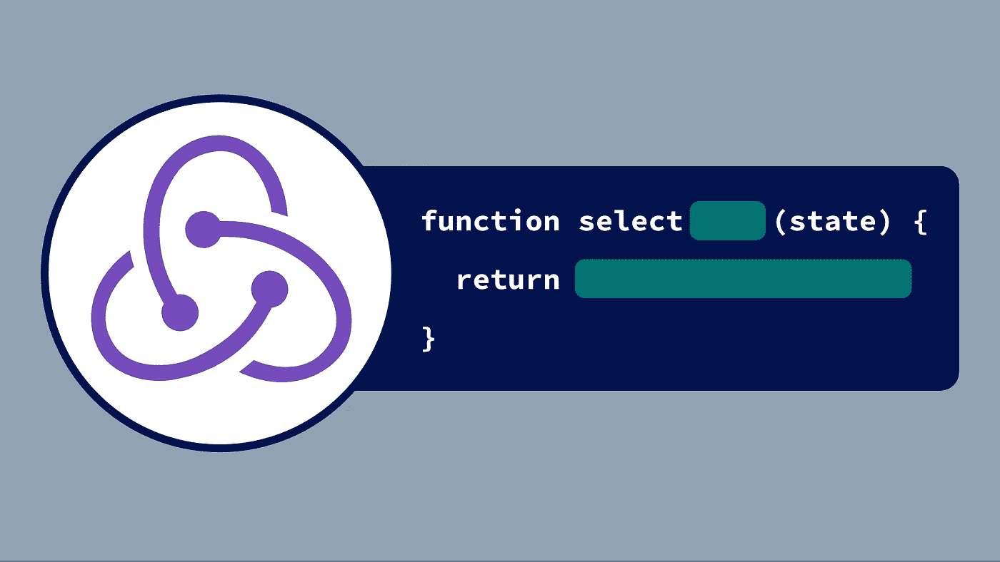

# 使用 Redux 选择器回答应用程序的问题

> 原文：<https://levelup.gitconnected.com/redux-selectors-logic-9d0335d1c0f1>



在 [Redux](https://redux.js.org/) 的所有概念中，*选择器*是最被低估的。最近，由于引入了 [React Redux 挂钩](https://react-redux.js.org/next/api/hooks)，它们变得越来越重要，这使得它们成为将 Redux 中的数据导入 React 组件的主要手段。但是，我注意到，选择器通常只被视为隐藏 Redux 状态形状的“状态获取器”,或者是防止不必要地重新计算状态派生值的性能优化。

在这篇文章中，我将展示选择器远不止这些。具体来说，我将展示它们不仅是访问 Redux 状态的好工具，也是以一种易于推理、扩展、重用和测试的方式封装应用程序逻辑的好工具。正如我们将要看到的，所需要的只是观念的转变。

# 关于选择器

在 Redux 中，**选择器**是一个函数，它获取存储的当前状态，并返回从中提取或导出的值。例如，考虑一个货币转换器应用程序，其 Redux 状态如下所示:

```
{
  sourceAmount: 123.45,  // the amount of money to convert
  sourceCurrency: 'EUR', // The currency of the source amount
  targetCurrency: 'USD'  // the currency to convert to
}
```

给定这种状态形状，我们可以编写以下简单的“状态获取器”选择器，分别用于访问源金额、源货币和目标货币:

```
function selectSourceAmount(state) {
  return state.sourceAmount;
}function selectSourceCurrency(state) {
  return state.sourceCurrency;
}function selectTargetCurrency(state) {
  return state.targetCurrency;
}
```

*(在这篇文章中，我在每个选择者的名字前加上* `*select*` *)。其他流行的约定是以* `*get*` *开头的名字或者以* `*Selector*` *结尾的名字。)*

由于选择器是函数，它们不必局限于直接从状态返回值。例如，我们可以编写一个选择器，返回货币转换后的金额，构建在我们之前定义的基本选择器之上:

```
const conversionRates = {
  'EUR': { 'US': 1.09, /* ... */ },
  // ...
}function selectConvertedAmount(state) {
  const sourceCurrency = selectSourceCurrency(state);
  const targetCurrency = selectTargetCurrency(state);
  const rate = conversionRates[sourceCurrency][targetCurrency];
  return getSourceAmount(state) * rate;
}
```

假设这是一个 React 应用程序，我们现在可以使用 React Redux 组件中的这些选择器:

```
import React from 'react';
import { useSelector } from 'react-redux';const ConversionResultView = () => {
  const sourceAmount = useSelector(selectSourceAmount);
  const sourceCurrency = useSelector(selectSourceCurrency);
  const targetCurrency = useSelector(selectTargetCurrency);
  const convertedAmount = useSelector(selectConvertedAmount); return (
    <p>
      {sourceAmount} {sourceCurrency} is
      {convertedAmount} {targetCurrency}
    </p>
  );
}
```

我们可以将所有的状态访问和货币转换代码直接放入`ConversionResultView`中。然而，将它提取到独立的选择器中有几个好处。

# 包装

使用选择器时，调用者不需要知道 Redux 状态是如何形成的，也不需要知道选择器需要它的哪些数据；它只是将状态作为一个整体传递，并返回所需的值。不管这个值是直接来自状态还是动态计算的，调用都是一样的。这意味着如果状态的结构发生变化，只需要更新选择器本身；他们的呼叫者不受影响。换句话说，选择器最小化了 Redux 商店和它的消费者之间的耦合。

# 复用性

一旦编写完成，就可以从任何一段代码中调用选择器来访问 Redux 状态。这不仅包括 UI 组件，还包括其他选择器:因为每个选择器都接收 Redux 状态作为参数，所以根据定义，它拥有调用任何其他选择器所需的全部内容。因此很容易重用现有的选择器来组成新的选择器。

# 纯度、可测试性和记忆性

选择器应该是[纯函数](https://medium.com/@jamesjefferyuk/javascript-what-are-pure-functions-4d4d5392d49c):给定相同的输入，它们总是返回相同的结果，没有副作用。这使得他们很容易孤立地进行推理。这也使得单元测试变得容易:我们只需要准备一个输入状态，调用选择器，并将返回值与我们所不希望的进行比较，就像下面的例子一样(使用 [Jest](https://jestjs.io/) ):

```
test('selectConvertedAmount()', () => {
  const state = {
    sourceAmount: 100,
    sourceCurrency: 'EUR',
    targetCurrency: 'USD'
  };
  const result = selectConvertedAmount(state);
  const expectedConversionRate = conversionRates['EUR']['USD'];
  expect(result).toBeCloseTo(100 * expectedConversionRate);
})
```

Purity 还支持*记忆化*:因为我们知道只有当选择器的输入——也就是 Redux 状态——改变时，它的返回值才会改变，所以我们可以通过缓存来避免重新计算相同的值，只有当传递的状态与之前的状态不同时才进行新的计算。

[Reselect](https://github.com/reduxjs/reselect) 库是这种思想的一个众所周知的实现。使用它，我们可以编写如下的`selectConvertedAmount`选择器:

```
import { createSelector } from 'reselect';const selectConvertedAmount = createSelector(
  // The first argument(s) of createSelector() define the
  // selector's *dependencies*, that is, the other selectors
  // whose values are needed for this one.
  selectSourceAmount,
  selectSourceCurrency,
  selectTargetCurrency, // The last argument is the selector's *implementation*,
  // which receives the return values of its dependencies
  // in the order given above. When the selector is first
  // called, its return value is cached, and the implementation
  // function is not re-run until the passed-in state AND at
  // least one of the dependencies' return values changes
  // (at which point the cache is updated).
  (amount, currency, targetCurrency) => {
    const rate = conversionRates[currency][targetCurrency];
    return amount * rate;
  }
);
```

*(尽管我建议对除了最基本的选择器之外的所有选择器使用 Reselect，但为了简单起见，我不会在本文的其余部分使用它。)*

# 作为小领域专家的选择器

到目前为止，我们已经看到 Redux 选择器可以抽象出状态的形状并避免多余的计算。但是还有更多。

为了看到选择器的全部潜力，思考调用一个选择器意味着什么是有帮助的。直觉上，我们可能认为它只是从状态中获取或计算一个值。然而，我意识到把它看作是*问一个问题*，由选择器根据应用程序世界的“事实”(状态和规则)来回答，会更有帮助。

例如，在上面的例子中，当`ConversionResultView`使用`selectConvertedAmount`时，它基本上是在问:“货币转换的当前结果是什么(给定用户的输入)？”请注意，调用者甚至不需要知道回答问题需要哪些信息——所有的知识都在选择器中，它只是从应用程序状态本身获取所需的信息，或者直接查找，或者询问其他选择器。

从这个角度来看，选择器就像你的应用程序的*小领域专家，专门回答关于你的应用程序世界的单个问题，并根据需要与其他选择器合作。*

这意味着，每当我们可以将一个应用程序逻辑框定为一个状态相关的问题时，我们就可以将答案表达为一个选择器，从而为我们带来所有提到的封装、可重用性、测试和优化优势。下面几节重点介绍一些说明这一点的示例用例。

# 确认

基本上，验证用户输入是这样的行为:“用户的输入有意义吗(根据应用程序的规则)？”这使得验证逻辑非常适合选择器，只要您在 Redux 状态下保存要验证的数据。

例如，想象一个从餐馆点餐的应用程序。用户只能在订单金额高于特定最小金额时下订单。如果我们将当前选择的订单项存储在 Redux 中，我们可以很容易地为这个规则编写一个选择器:

```
const minimumOrderAmount = 10;function selectOrderItems(state) {
  return state.order.items;
}function selectIsOrderValid(state) {
  const items = selectOrderItems(state);
  const price = items.reduce((x, item) => x + item.price, 0);
  return price >= minimumOrderAmount;
}
```

随着逻辑变得更加复杂，这种方法可以很好地伸缩。例如，如果后来决定饮料和甜点不计入最小数量，我们可以在选择器中进行局部更改，而不会影响任何用户。

# 过滤、排序和聚合

选择器非常适合使用任意复杂的规则处理项目集合。例如，要回答问题“哪些任务包含用户选择的所有标签？”，我们可以编写一个选择器，如下所示:

```
function selectAllTasks(state) {
 return state.tasks;
}function selectSelectedTags(state) {
  return state.filter.tags;
}function selectFilteredTasks(state) {
  const tasks = selectAllTasks(state);
  const tags = selectSelectedTags(state); return tasks.filter((task) =>
    tags.every((tag) => task.tags.includes(tag));
  );
}
```

随着新的过滤器种类的增加，`selectFilteredTasks`也可以被扩展来考虑这些，保持代码库的其余部分不变。排序可以用同样的方式处理。

我们还可以使用选择器进行其他类型的聚合。例如，在编写在线测验应用程序时，用于计算用户当前分数的选择器可能如下所示:

```
function selectCorrectAnswers(state) {
  return state.quiz.answers;
}function selectGivenAnswers(state) {
    return state.round.answers;
}function selectScore(state) {
  const correctAnswers = selectCorrectAnswers(state);
  const givenAnswers = selectGivenAnswers(state); return givenAnswers.reduce((answer, score, index) => {
    const isCorrect = answer == correctAnswers[index];
    return score + (isCorrect ? 1 : 0);
  }, 0);
}
```

# 将逻辑与副作用分开

许多应用程序使用 [thunks](https://github.com/reduxjs/redux-thunk) 、 [sagas](https://redux-saga.js.org/) 、 [epics](https://redux-observable.js.org/) 或类似的抽象将副作用集成到 Redux 流中。在某些情况下，尤其是复杂的情况下，它们需要参考应用程序状态来确定要执行哪些操作，或者要向它们传递哪些参数。

我们可以将这种逻辑提取到选择器中，使实际的副作用代码尽可能精简，而不是将这种逻辑与副作用混合在一起(测试通常很乏味，因为它们需要模仿实际的效果)。所有流行的副作用库都有一个简单的方法来做到这一点；例如，Redux Saga 提供了`[select](https://redux-saga.js.org/docs/api/#selectselector-args)` [效果](https://redux-saga.js.org/docs/api/#selectselector-args)，这有助于我们简化 Saga，如下例所示:

```
function selectCurrentStep(state) {
  return state.checkout.currentStep;
}function selectIsNewUser(state) {
  return state.checkout.isNewUser;
}function selectNextStep(state) {
  switch (selectCurrentStep(state)) {
    case 'shoppingCart':
      return 'login';
    case 'login':
      return selectIsNewUser(state) ? 'address' : 'summary';
   // ...
  }
}function* nextStepSaga() {
  const nextStep = yield select(selectNextStep);
  yield call(navigateToStep, nextStep);
}
```

这使得独立于传奇测试大多数逻辑变得容易，为此我们只需要检查由`select`返回的值是否被正确地转发到`navigateToStep`效果:

```
test('nextStepSaga()', () => {
  const generator = nextStepSaga();
  let effect; // Run until `yield select()`
  effect = generator.next();
  expect(effect).toEqual(select(selectNextStep)); // Continue as if the selector returned 'login'
  effect = generator.next('login');
  expect(effect).toEqual(call(navigateToStep, 'login'));
});
```

# 选择器的限制

虽然 Redux 选择器可以做很多事情，但是它们不能做所有的事情。

首先，选择器只能访问 Redux 存储中的状态，因此它们的能力受到 Redux 中保存了多少应用程序状态的限制。对于只对少量状态使用 Redux 的应用程序来说，它们就没那么有用了，例如，因为大多数数据都是使用一个 [GraphQL](https://graphql.org/) 库获取和管理的。缓解这个问题的一种方法是向选择器添加额外的参数，允许传递非冗余状态，但这降低了一致性(使选择器组合更加困难)并使记忆更加困难。另一种方法是编写*选择器工厂*，它获取所有必需的非冗余数据并返回一个选择器作为结果:

```
function makeSelectTask(taskId) {
  return (state) => state.tasks[taskId];
}function TaskItem({ taskId }) {
  const selectTask = useMemo(
    () => makeSelectTask(taskId),
    [taskId]
  );
  const task = useSelector(selectTask);
  return <li>{task.title}</li>;
}
```

其次，选择器是纯同步的，所以不能咨询后端 API 等外部资源。对于需要这样做的情况，像 sagas 这样的 Redux 副作用抽象是更好的选择。即使这样，您仍然可以选择将逻辑的纯部分提取到选择器中，就像我们之前看到的那样。

最后，使用选择器，我们只能表达“静态”逻辑，它只依赖于当前的应用程序状态。对于基于*事件* — [状态机](https://en.wikipedia.org/wiki/Finite-state_machine)的“动态”逻辑，例如— Redux 提供[减速器](https://redux.js.org/basics/reducers/)。

# 结论

将 Redux 选择器视为“小领域专家”，通过咨询应用程序的状态来回答应用程序的问题，可以发现它们不仅仅可以隐藏状态的形状或缓存值。我们可以使用它们来过滤和聚集数据、验证用户输入、针对副作用做出控制流决策，以及许多其他类型的应用程序逻辑。因为选择器在调用方式上是纯粹和统一的，所以它们使得应用程序逻辑易于推理、组合、重用和测试。

*本帖原载* [*于我的个人博客*](https://www.denisw.de/posts/redux-selectors-logic/) *。*

# 资源

*   [“计算派生数据”(Redux docs)](https://redux.js.org/recipes/computing-derived-data)
*   [重新选择](https://github.com/reduxjs/reselect)