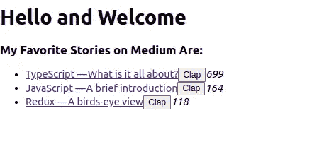

# redux Toolkit——一个简单的工作流示例

> 原文：<https://levelup.gitconnected.com/redux-toolkit-a-simple-example-workflow-20efcee54635>

这是上一篇名为[Redux——鸟瞰图](/redux-a-birds-eye-view-58925fc5ee8)的文章的延续，在那篇文章中，我对 Redux 进行了高层次的概述。

在本文中，我们将使用推荐的 [Redux 工具包](https://redux-toolkit.js.org/)来查看在 React 应用程序中使用 Redux 的一个非常简单的工作流程。


接下来，您可以克隆这个项目并导航到 starter 文件夹。

```
git clone [git@github.com](mailto:git@github.com):abongsjoel/redux-toolkit.gitcd redux-toolkit/cd starter/npm installnpm start
```

项目中实际上有 3 个文件夹:

*   开头的人
*   完成
*   使用 createSlice

starter 文件夹包含一个简单的 create react 应用程序，我已经删除了不必要的内容，并在 medium 上硬编码了我最喜欢的故事列表。“完整”文件夹包含已完成的项目,“带有 createSlice”文件夹包含使用切片的项目版本。

如果你已经按照上面的指示，那么你应该有一个网页打开显示我最喜欢的文章，我们将从那里继续。

让我们从使用@reduxjs/toolkit 安装将 redux 添加到我们的应用程序所需的东西开始:

```
npm i -D react-redux @reduxjs/toolkit
```

Redux 可以和其他视图库一起使用。所以我们需要“react-redux”包来连接 react 组件和 redux 存储。

我们从准备 Redux 商店开始。在`src`文件夹中，我们创建了一个`redux`文件夹，在该文件夹中，我们创建了两个文件:`store.js`用于我们的商店，而`stories.js`用于我们的 stories reducer。

在`src/redux/stories.js`中，我们使用来自`@reduxjs/toolkit`的 createReducer 创建我们的减速器，如下所示:

此时，减速器所做的只是返回初始状态。我们稍后将回到这个问题。

现在，我们导入刚刚创建的减速器，以及来自`@reduxjs/toolkit`的`configureStore`，并使用它来创建(配置)我们在`src/redux/store.js`中的商店，如下所示:

接下来，我们导入刚刚创建的`store`，并在`src/index.js`中将它与`react-redux`中的`Provider`一起使用，以包装我们的应用程序，从而将创建的存储提供给我们的 React 组件树，如下所示:

现在，redux 已成功添加到我们的应用程序中。`<Provider />`组件使用 React 上下文向子组件树提供存储。现在，我们可以使用 React 钩子从树中的任何组件获取状态并分派动作。

# 阅读状态

与其硬编码这些故事，不如让我们从新创建的商店中获取它们。我们通过在`src/redux/stories.js`中创建一个选择器函数，并把它作为一个参数从`src/components/Stories.js`中的`react-redux`传递给`useSelector`，如下所示:

`src/redux/stories.js`

`src/components/Stories.js`

`useSelector`钩子需要一个选择器函数作为第一个参数。我们创建选择器函数，为选择状态的不同部分提供可重用的 API。

现在，我们的应用程序将如下所示:



我们成功地从商店中读取了故事，并在我们的应用程序中显示它们，证明我们的 redux 目前工作正常。快点！

# 调度操作

点击一个故事名称会把我们带到 medium 中的故事，但是现在点击 clap 对我们没有任何好处。让我们继续编写代码，通过点击`Clap`按钮来增加拍手次数。

我们从使用来自`@reduxjs/toolkit`的`createAction`在`src/redux/storie.js`中创建一个`clapForStory`动作开始，如下所示:

`createAction`需要两个参数。第一个是动作类型，它是必需的。第二个参数是所谓的 *prepare* 函数，我们可以用它来接受来自结果动作创建者的参数，并将这些参数作为附加数据附加到动作对象上。*准备*功能是可选的。

接下来，我们使用来自`@reduxjs/toolkit`的`useDispatch`导入并调度来自`src/components/Stories.js`的动作，如下所示:

现在，单击 clap 按钮调度动作，但是什么也没有发生，因为我们的 reducer 函数仍然是空的，所以让我们继续，将`src/redux/stories.js`中的`clapForStory`动作减少如下:

现在点击`Clap`按钮会产生神奇的效果。

# 使用 Json-Server

现在，当应用程序启动时，我们将使用`json-server`从一个假服务器加载我们的故事并显示它们。

让我们从安装 json-server 开始:

```
npm i -D json-server
```

然后，我们在“脚本”部分的`package.json`中添加一个脚本来运行服务器，如下所示:

然后在应用程序的根目录下，我们创建了一个`db.json`文件，并将我们的故事数组复制到其中，如下所示:

这告诉服务器它应该提供什么数据。要启动服务器，我们运行:

```
npm run json-server
```

服务器应该在`http://localhost:3001`启动

在`src/redux.stories.js`中，我们清空了我们的故事数组，因为我们现在将从服务器获取我们的故事。

接下来，我们在`src/redux/stories.js`中添加一个`loadStories`动作，使用`@reduxjs/toolkit`中的`createAsyncThunk`,因为它是一个“thunk”动作——一个有副作用的动作——从服务器加载故事，如下所示:

`createAsyncThunk`将动作类型作为第一个参数，将回调函数作为第二个参数。回调函数应该返回一个承诺。promise 解决的任何问题都将被添加到 action 对象的`payload`属性中。

接下来，当应用程序开始使用`src/components/Stories.js`中的`useEffect`钩子时，我们调度动作，如下所示:

最后，我们将`src/redux/stories.js`中减速器的`loadStories`动作减少如下:

`createAsyncThunk`返回一个 thunk 动作创建者。当我们分派这个动作创建者时，基于我们从回调返回的承诺，它分派以下生命周期动作:`pending`、`fulfilled`和`rejected`。这些生命周期操作的类型作为操作创建者的属性可用(例如，`loadStories.pending`)。

注意，我们在状态中添加了，`storiesLoading`和`error`变量。我们的应用程序的根状态现在看起来像这样:

```
rootState = {
  stories: {
    stories: [...],
    storiesLoading: boolean,
    error: string
  }
}
```

现在让我们添加选择器函数来处理`src/redux/stories.js`中的`loading`和`error`状态，如下所示:

然后在`src/components/Stories.js`中，我们获得应用程序的不同状态，并按如下方式使用它们:

这里，我们优化了应用程序，在应用程序加载时显示加载消息，如果应用程序无法从服务器加载故事，则显示错误消息。

为了让一切按预期运行，我们需要打开两个终端。在第一个终端中，我们如下运行我们的服务器:

```
npm run json-server
```

在第二个终端中，我们如下运行我们的应用程序:

```
npm start
```

我们完整的`src/redux/stories.js`文件应该是这样的:

# 使用 createSlice

此外，我们可以将与单个特性(比如故事)相关的 Redux 功能分组到一个`slice`中。这可以通过使用`@reduxjs/toolkit`的`createSlice`功能来实现。

现在，我们将重新组织`src/redux/stories.js`中的冗余逻辑，以使用`createSlice`，如下所示:

我们使用`reducers`来创建动作和相应的减少器。`reducers`选项是一个将动作类型映射到相应缩减器功能的对象。`createSlice`获取此映射，并从中生成动作和减速器。

我们可以使用`extraReducers`为现有的动作和 thunk 动作创建 reducers。基本上，您可以从另一个片导入一个动作，并在这里处理它。

`reducers`和`extraReducers`的区别在于`createSlice`没有为`extraReducers`中的 reducers 自动生成动作创建者。

`createSlice`返回具有以下结构的对象:

```
{
  name: name of the slice
  reducer: combine reducer function
  actions: action creators extracted from the 'reducer' option
  caseReducers: reducer functions from 'reducers' option
}
```

在我们的例子中，我们从`storiessSlice.actions`中提取动作创建者，并分别导出它们，以便于在其他组件中导入和使用它们。默认情况下，我们导出 reducer 函数。

# 结论

我希望您能够跟上，并发现这篇文章是有用的。我试图尽可能简单明了，同时保持文章尽可能简短。

关于 Redux 工具包的更多信息，请查看本文。

— -

如果你喜欢这篇文章，请留下几个(或很多)掌声，如果你还没有，请确保在 Medium 上关注我。您也可以订阅，以便在我发布时收到电子邮件。谢了。

# 分级编码

感谢您成为我们社区的一员！在你离开之前:

*   👏为故事鼓掌，跟着作者走👉
*   📰查看[升级编码出版物](https://levelup.gitconnected.com/?utm_source=pub&utm_medium=post)中的更多内容
*   🔔关注我们:[Twitter](https://twitter.com/gitconnected)|[LinkedIn](https://www.linkedin.com/company/gitconnected)|[时事通讯](https://newsletter.levelup.dev)

🚀👉 [**加入升级人才集体，找到一份神奇的工作**](https://jobs.levelup.dev/talent/welcome?referral=true)