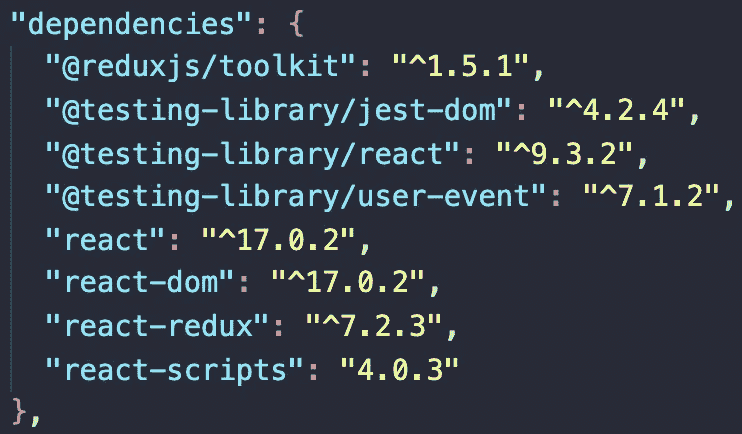
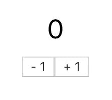
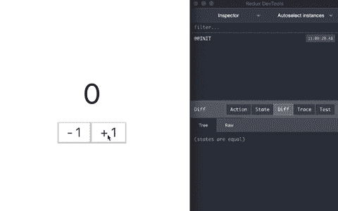

# Redux 工具包:设置 Redux 的一种更简单的方法

> 原文：<https://levelup.gitconnected.com/redux-toolkit-an-easier-way-to-set-up-redux-6782b4857f8>

## 如何在 React 应用程序中使用 Redux Toolkit 建立 Redux 存储


乔尔·罗兰在 [Unsplash](https://unsplash.com?utm_source=medium&utm_medium=referral) 上拍摄的照片

Redux 以复杂和需要大量样板代码来开始而闻名。这也是 Redux 团队创建 Redux Toolkit 的原因。它旨在解决关于 Redux 的三个常见问题:

*   *“配置 Redux 存储太复杂”*
*   *“我必须添加很多包才能让 Redux 做任何有用的事情”*
*   *“Redux 需要太多样板代码”*

在本文中，我们将了解如何将 Redux Toolkit 添加到现有的 React 应用程序中。我们将通过构建一个简单的应用程序来实现这一点。在本文结束时，您应该对如何执行以下操作有所了解:

*   将 Redux 添加到现有的 React 应用程序
*   使用 Redux Toolkit 配置新的 Redux 存储
*   使用 Redux Toolkit 创建一个状态切片
*   使用 React Redux 的`useSelector`和`useDispatch`挂钩

# 建立

如果您已经安装了 React 应用程序，那么您可以将 [Redux Toolkit](https://www.npmjs.com/package/@reduxjs/toolkit) 作为一个包安装。你还需要安装 [React Redux](https://www.npmjs.com/package/react-redux) 。

```
*// NPM*
npm install @reduxjs/toolkit react-redux*// Yarn*
yarn add @reduxjs/toolkit react-redux
```

如果你打开`package.json`文件，你应该看到`@reduxjs/toolkit`和`react-redux`作为依赖项被安装。



如果您正在创建一个全新的项目，您也可以使用`create-react-app`模板来创建一个样板项目，其中包含已经设置好的 Redux Toolkit 和 React Redux。

```
npx create-react-app my-app --template redux
```

如果你想了解这个例子，我们将从一个没有 Redux 的基本`create-react-app`应用开始。然后分别安装 Redux Toolkit 和 React Redux。

# 施基肥

有什么比构建一个计数器应用程序更好的方式来展示如何使用 Redux Toolkit？(抱歉，我希望我能想出一个更有创意的主意，但计数器应用程序是探索功能的完美示例。)

本文中的例子也类似于 Redux Toolkit 文档中的例子。只是一个更简洁的版本，希望更容易理解。

首先，我们将在`App.js`文件中创建一个基本的计数器应用程序，如下所示。这是一个简单的组件，用两个按钮显示一个数字:增量和减量。

```
function App() {
  return (
    <div *className*="App">
      <div>0</div>
      <div>
        <button>- 1</button>
        <button>+ 1</button>
      </div>
    </div>
  );
}
```



# 配置商店

我们将从创建一个 Redux 商店开始。存储保存应用程序的状态。在这个例子中，我们将使用存储来保存计数器的值。

在我们的项目中，我们将创建一个名为`src/app/store.js`的新文件。在这个文件中，我们将从 Redux Toolkit 导入`configureStore` API。

```
import { configureStore } from '@reduxjs/toolkit';
```

`configureStore`函数采用一个带有以下选项的对象参数:

*   **减速器** —单个减速器或片状减速器的对象。
*   **中间件(可选)**—Redux 中间件阵列。默认情况下包括 Redux Thunk。
*   **devTools(可选)** —一个布尔值，确定是否启用 Redux DevTools。默认为`true`。
*   **预加载状态(可选)** —初始状态。
*   **增强器(可选)** —要应用的存储增强器。

对于这个例子，我们将只添加 reducer 选项。缩减器选项可以是将用作根缩减器的单个缩减器函数，也可以是切片缩减器的对象。如果使用一个 reducers 对象，它将自动传递给`combineReducers()`函数。

```
export const store = configureStore({
  reducer: {},
});
```

为了在整个应用程序中使用商店，我们将用来自`react-redux`的`<Provider>`组件包装我们的应用程序。

打开`index.js`文件，从`react-redux`导入`<Provider>`组件以及我们创建的商店。`<Provider>`组件会拿店铺当道具。现在，我们的 Redux 存储可用于应用程序中的所有组件。

```
import { Provider } from 'react-redux';
import { store } from './app/store';ReactDOM.render(
  <*React.StrictMode*>
    **<*Provider* *store*={store}>**
      <*App* />
    **</*Provider*>**
  </*React.StrictMode*>,
  document.getElementById('root')
);
```

# 创建状态切片

接下来，我们将使用 Redux Toolkit 的`createSlice` API 创建一个新的状态片。

我们将创建一个名为`src/app/slices/counterSlice.js`的新文件。首先，从 Redux Toolkit 导入`createSlice`函数。

```
import { createSlice } from '@reduxjs/toolkit';
```

然后创建一个`initialState`变量，为该切片设置默认值。

```
const initialState = {
  value: 0,
};
```

我们将使用`createSlice`函数为我们的计数器创建一个新的状态片。一个切片将自动生成对应于减少器和状态的动作创建者和动作类型。

该函数接受带有以下选项的对象参数:

*   **名称** —用于动作类型的名称。
*   **初始状态** —减速器的初始状态。
*   **reducers** —旨在处理特定动作类型的函数对象。
*   **extraReducers(可选)** —一种处理未在此切片中生成的其他操作类型的方法。

在这个片段中，我们将向 reducers 选项添加两个函数:增量和减量。当调度 increment 时，它会将值加 1。当调度减量时，它将从值中减去 1。

```
export const counterSlice = createSlice({
  name: 'counter',
  initialState,
  reducers: {
    increment: *state* => {
      *state*.value += 1;
    },
    decrement: *state* => {
      *state*.value -= 1;
    },
  },
});
```

`createSlice`函数将返回一个具有以下属性的对象:

*   名字
*   还原剂
*   行动
*   病例减少者

在`reducers`参数中定义的每个函数都将生成一个动作创建器。我们将导出增量和减量动作。

```
export const { increment, decrement } = counterSlice.actions;
```

最后，我们还将导出减速器函数。

```
export default counterSlice.reducer;
```

我们将把这个缩减器添加到我们在上一节中创建的存储中。

```
*// src/app/store.js*import { configureStore } from '@reduxjs/toolkit';
**import counterReducer from './slices/counterSlice';**export const store = configureStore({
  reducer: {
    **counter: counterReducer,**
  },
});
```

# 使用状态和动作

最后，我们可以在应用程序中使用 Redux 状态和动作。为此，我们将需要来自`react-redux`的`useSelector`和`useDispatch`钩子。

在我们的`App.js`文件中，我们可以看到我们创建的计数器组件。在该文件中，从`react-redux`导入`useSelector`和`useDispatch`钩子，从`counterSlice.js`文件导入`increment`和`decrement`动作。

```
import { useSelector, useDispatch } from 'react-redux';
import { increment, decrement } from './app/slices/counterSlice';
```

然后在组件中，我们将调用`useDispatch`钩子和`useSelector`钩子。

`useDispatch`钩子从 Redux 存储中返回对分派函数的引用。我们可以用它来调度任何需要的动作。

`useSelector`钩子允许你从 Redux 存储状态中提取数据。使用这个，我们可以得到`counterSlice`值的值。

然后，我们需要做的就是呈现`count`值，并向按钮添加`onClick`监听器。这些将分派增量和减量操作。

```
function App() {
  **const dispatch = useDispatch();
  const count = useSelector(*state* => *state*.counter.value);**

  return (
    <div *className*="App">
      <div>**{count}**</div>
      <div>
        <button ***onClick*={() => dispatch(decrement())}**>- 1</button>
        <button ***onClick*={() => dispatch(increment())}**>+ 1</button>
      </div>
    </div>
  );
}
```

我们现在可以看到我们的计数器应用程序在运行。我还在旁边展示了 Redux DevTools，这样你就可以看到发生了什么。



# 结论

感谢阅读！我希望这篇文章对你开始使用 Redux Toolkit 有所帮助。

你可以在我的 GitHub 库[这里](https://github.com/chadmuro/medium-redux-toolkit)获得这个项目的完整源代码。我计划在不久的将来写更多关于 Redux 和 Redux Toolkit 的高级用例的文章。敬请关注更多即将到来的！

**更多阅读**

[](https://javascript.plainenglish.io/introduction-to-testing-in-react-with-jest-and-react-testing-library-c1c32bb11739) [## React with Jest 和 React 测试库中的测试介绍

### create-react-app 中的 App.test.js 和 setupTests.js 文件是用来做什么的？

javascript.plainenglish.io](https://javascript.plainenglish.io/introduction-to-testing-in-react-with-jest-and-react-testing-library-c1c32bb11739) [](/how-to-handle-errors-in-react-with-react-error-boundary-436cf423bdca) [## 如何用 React 错误边界处理 React 中的错误

### react-error-boundary 包介绍及示例

levelup.gitconnected.com](/how-to-handle-errors-in-react-with-react-error-boundary-436cf423bdca)