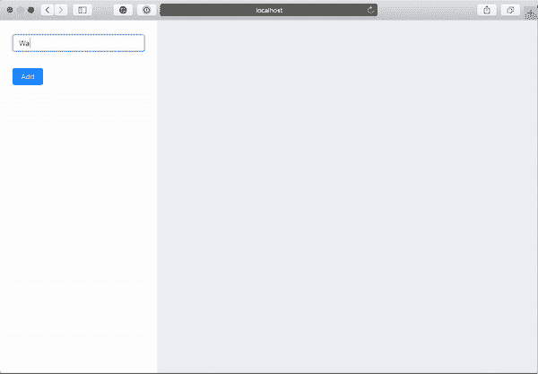
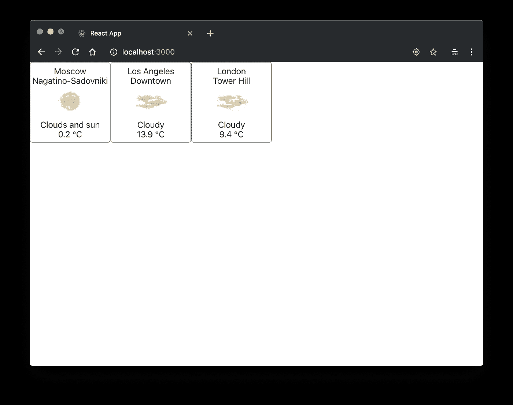

# 无冗余反应应用

> 原文：<https://levelup.gitconnected.com/reduxless-react-application-ed92fac854d1>

距离官方 React Hooks [发布](https://reactjs.org/blog/2019/02/06/react-v16.8.0.html)已经过去了一段时间，我终于有机会试用它们了。事实上，我无法让自己适应这个新功能。由于固定的依赖版本和架构决策批准过程，不可能将钩子集成到当前的项目中，在我的个人项目中，我现在正在学习另一种技术。然而，几周前我得到了一个参与新项目的机会，在这个项目中，React 钩子被从头开始使用。

我和我的团队做出的第一个决定是进行一项实验，拒绝使用 Redux，而使用另一种方法。但是让我们把一切都整理好🙂

# **Redux 是什么？**

众所周知，Redux 是 JavaScript 应用程序的可预测状态容器。我认为深入研究 Redux 如何与 React 应用程序一起工作的细节是没有意义的。文档中有很多例子，互联网上也有很多关于它的文章。我想引用 redux 的三个基本原则:

> **真理的单一来源。**您的整个应用程序的状态存储在一个单独的存储中的一个对象树中
> 
> **状态为只读。改变状态的唯一方法是发出一个动作，一个描述发生了什么的对象。**
> 
> **纯函数的变化。**为了指定状态树如何被动作转换，tou 使用了纯 reducers。

这三个原则很好地描述了 redux 应用程序的基本行为。

# **带有 Redux 示例的应用**

让我们简单分析一下最简单的应用程序——一个带有 redux 的 Todo 列表。

基本应用程序用法

该应用程序有四个组件，只有一个缩减器。当然，在这种情况下使用 redux 开销太大，但这只是为了演示🙂我还想说的是，我有意在任何地方编写类，只是为了强调区别。

所以，主要组件是`App`组件

如您所见，还有另外两个组件。让我们来看看它们。

第一个是`NewTodoItemForm` **，**我们已经发现了 react-redux 库集成。

> 注意:为了让演示更方便，我故意没有将一些组件分离到智能/愚蠢(容器/组件)中。

所以我在那里用了一些`ant.design`魔法来处理表单提交和值，没关系，但是那里最有趣的是`addTodoItem`动作。这是我改变商店的方式。

第三个和第四个组件是`TodoItems` 组件，它们`connect`用于 Redux，因此可以访问 Redux 存储。

并调用两个操作

以及`TodoItem` 组件，这是一个哑组件，除了表示 TodoItem 和调用一些处理程序之外，什么也不做。

最后，非常重要的是`todoItemsReducer`

以及应用缩减器，它被用作`App`组件中`createStore`函数的第一个参数

仅此而已。只需几个文件和一个 Todo 应用程序即可使用。你可以在这里找到源代码[。](https://github.com/paramoshkinandrew/reduxfull-react-app)

# 【Redux 有什么问题？

Redux 是非常有用的，真的，我不打算争辩这一点。然而，由于数据控制不足、架构决策或成熟度不足，当然还有应用程序中的多个页面，开发人员可能会面临一些真正的麻烦。我想强调其中的几个问题:

1.  通过应用程序商店和动作，应用程序的页面之间有很强的联系，这使得重构有风险，模块重用复杂，并且应用程序的某些部分行为不可预测。
2.  应用程序存储结构会使模块的重用变得复杂。例如，其中一个模块有自己的缩减器、选择器和业务逻辑。如此典型的案例！该模块可以连接到应用程序的任何位置，也可以用于存储的任何深度，这意味着关于父存储分支(绝对路径、选择器、计算存储等)的信息。)必须提供给模块。此外，控制实例之间的动作也很重要，因为我们真的不希望一个模块实例对另一个实例的动作做出反应。最后(但这个列表肯定是不完整的)，模块必须为消费者提供一个考虑了所有这些条件的 API。这听起来可能很混乱，但是在实践中，我们有一些基本的方法来处理它。然而，它必须得到执行。

正如我所说的，这只是我目前能回忆起来的 Redux 在实践中遇到的几个问题。

此外，我想说的是，有时 Redux 的开销对于某些应用程序来说太大了。让我们假设你有一个非常简单的 SPA，比如登陆页面，所以在这些情况下你真的不需要 redux。

# **避免 Redux 怎么办？**

总而言之，让我们将 web 应用程序(在我们的例子中是单页面应用程序)简化为一组页面。每个页面都可以有自己的存储分支，或者就数据而言，有一些要存储/收集/使用的数据。显然，这些页面可以共享一些数据，比如字典、授权信息等。这样的结构使得依赖页面一致性和最小化页面相关性变得很容易。当然，这不是一个适用于所有情况的通用解决方案，因为有些应用程序需要页面之间的数据流，从而绕过数据持久性。

最后，我们有两种通用类型的数据:

*   **共享数据。可以被不同的页面使用，很少更新，大部分在应用程序初始化阶段初始化。**
*   **本地数据。**是仅由一页使用的数据。一个页面的本地数据不能引用另一个页面的本地数据，但可以使用共享数据。

这样，人们可能会想，如果禁止使用数据，为什么一个页面应该可以访问它的兄弟页面的数据呢？怎样才能把整个状态分离出来，保留一个共享的部分，去掉多余的关联？当然，我不想打破我的开发经验，所以我真的想保留一个像 actions 和 reducers 这样方便的工具来处理状态。

有答案了——React 钩子和 React 上下文 API！

# 马克，有什么故事？

主要思想是:如果我创建两个上下文，一个用于状态，另一个用于状态突变，并将这些值提供给孩子，会怎么样？因此，我们可以创建单独的状态范围，每个子组件都能够获得状态并更改它。此外，我们将能够创建几个实例，甚至一个在另一个中，因为实例的状态是私有的！

好吧，但是国家控制怎么办？如何舒适地组织状态变化？这比你想象的还要简单，只要用一个`useReducer`钩子就可以了。类似于我们的减压器和动作，没什么新意——有效又方便。

让我们来看看一款全新的`TodoListProvider`

如您所见，我创建了两个上下文— `TodoItemsStateContext`和`TodoItemsDispatchContext`，默认值分别设置为初始状态和身份函数。最后，我创建了`TodoItemsProvider`，它使用了`useReducer`钩子，将当前状态传递给`TodoItemsStateContext`提供者，将调度函数传递给`TodoItemsDispatchContext`提供者。到目前为止看起来很简单。

哦，太好了，但是在实践中我怎样才能得到一个组件的状态呢？使用 React 钩子非常简单！您可以使用一个`useContext`钩子，它从最近的上下文提供者返回一个当前值。最后一步是将所有内容编译成一个整体。理想的方法是自定义 React 钩子。所以我有了 **useTodoItems** 自定义钩子

所以我们简单讨论一下这是怎么回事。`useTodoItems`是自定义钩子，两次调用`useContext`钩子从最近的`TodoItemsStateContext`获取当前状态，从最近的`TodoItemsDispatchContext`获取调度函数。最后，钩子返回这两个值。还是单纯？好了，让我们向前看一下钩子的用法。

你还记得`NewTodoItemForm`吗？我来介绍一下改造后的:

变化不大，是吗？我用了来自`useTodoItems`的`dispatch`而不是来自`react-redux`的`connect`。仅此而已！

但是`TodoItems`呢？

正如你所看到的，我去掉了`connect`并用`useTodoItems`代替。

最后，我应该将`TodoItemsProvider`添加到`App` 组件中。

*注意:这只是一个演示应用程序，在真实情况下，我建议您仅在需要使数据* ***共享*** *时才在主组件中放置提供者。在其他情况下，最好在要访问相关数据的组件之前使用它。*

你可能想知道为什么我省略了 reducer 和 actions。一切正常，只是没有改变。唯一执行的更改是——actions:现在，我只有一个包含所有可用操作的文件。

你可以在这里找到完整的源代码。

# **结论**

所以你读完所有这些文字后会想:这就是好处？怎么用？

目前来说，对我来说只是一个实验。我正在一家大型金融公司的一个系统中实现这个架构。这个系统就像一个经典的电子商务项目:页面之间没有关联，一些共享的数据，如购物车或通知，服务器端的数据在每一步都是持久的，不需要在前端存储数据超过客户使用它的时间。

对于后备解决方案，我们找到了[**redux-react-hook**](https://github.com/facebookincubator/redux-react-hook)**。**然而，在功能开发的活跃阶段，到目前为止，我们还没有遇到任何关键问题，也没有必要改变这个架构决策。正常飞行，填充圆锥，在耙子上跳跃，但是以适当的速度前进！

如果你仍然对用例感到好奇，我的朋友，你可以在这里再看一个例子。它是基于 Accuweather API 的可重复使用的天气部件。这种方法仍然存在开销，但是您可以看到重用整个模块是多么容易。

如果你有一些问题，你可以很容易地在推特上找到我的名字 [@AParamoshkin](https://twitter.com/AParamoshkin) ，在电报上找到我的名字 [@andrew_paramoshkin](https://t.me/andrew_paramoshkin) 。

 [## 学习 React -最佳 React 教程(2019) | gitconnected

### 排名前 49 的 React 教程-免费学习 React。课程由开发人员提交并投票，使您能够…

gitconnected.com](https://gitconnected.com/learn/react)