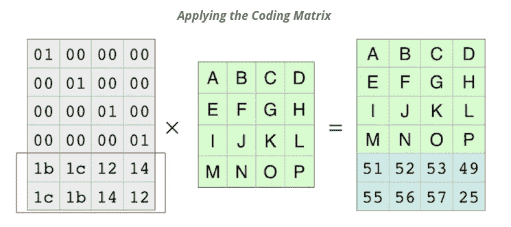

# 里德-所罗门码:不可靠网络上的数据恢复

> 原文：<https://levelup.gitconnected.com/reed-solomon-codes-data-recovery-over-unreliable-networks-cbdcf3f029b1>

今天我们将通过一个例子来说明里德-所罗门码是如何工作的。下面是一个链接，指向我将要引用的 colabs 文件。

[](https://colab.research.google.com/drive/1OC5eLjqNrtE9GKOFhB-Yway66rL6Gcuj?usp=sharing) [## 谷歌联合实验室

### 里德-所罗门码

colab.research.google.com](https://colab.research.google.com/drive/1OC5eLjqNrtE9GKOFhB-Yway66rL6Gcuj?usp=sharing) 

## 直觉

第一，问题。假设我想通过互联网给我的朋友发送一条消息“你好，世界魔豆”。将会发生的是，这个消息将被分成包，对于我们的例子，假设我们为每个单词发送 4 个包。我们的朋友在这些数据包通过某种网络传输后会收到它们，并能读取我们的信息。轻松点。

现在，让我们假设网络有 10%的数据包丢失率，那么 10%的时间你的信息可能会以“你好魔豆”或“世界魔豆”的形式出现，因为有一个数据包丢失了。我们可以将每个数据包发送两次，因为数据包丢失是独立的，所以丢失数据包两个副本的几率现在是 10% * 10% = 1%，我们认为这是可以接受的。

然而，我们现在已经将吞吐量从 4 个包增加到了 8 个包，而在拥挤的网络上这是不行的！现在，如果我告诉你，我们仍然可以用 6 个包实现相同的 1%总丢失率，会怎么样？怎么会？里德-所罗门是怎么了！



## 它是如何工作的

我们现在将一步一步地实现一个 Reed-Solomon 代码示例。

在前三个单元格中，我导入了我的库，创建了一个拼写为“hello world magic beans”的字符的 2d 数组(没有空格)，最后将字符转换为 int，以便更容易使用。

```
[[104, 101, 108, 108, 111], 
[119, 111, 114, 108, 100], 
[109, 97, 103, 105, 99], 
[98, 101, 97, 110, 115]]
```

然后，我创建我的编码矩阵，它包含前四行的单位矩阵，然后是两行额外的随机数字，以生成我们称为“奇偶校验”的额外数据包。

```
[[1, 0, 0, 0], 
[0, 1, 0, 0], 
[0, 0, 1, 0], 
[0, 0, 0, 1], 
[2, 3, 4, 5], 
[6, 7, 8, 9]]
```

如上图所示，我们将数据 X 编码矩阵相乘，得到 6 个数据包。

```
[[ 104  101  108  108  111]  
[ 119  111  114  108  100]  
[ 109   97  103  105   99]  
[  98  101   97  110  115]  
[1491 1428 1455 1510 1493]  
[3211 3068 3143 3234 3193]]
```

注意前 4 行是我们的原始数据，后 2 行是新的，看起来像垃圾(目前)。

哦不！现在我们失去了第 3 行和第 4 行的“魔法”和“豆子”

```
[[ 104  101  108  108  111]  
[ 119  111  114  108  100]  
[1491 1428 1455 1510 1493]  
[3211 3068 3143 3234 3193]]
```

让我们也删除编码矩阵的第 3 行和第 4 行。

```
[[1 0 0 0]  
[0 1 0 0]  
[2 3 4 5]  
[6 7 8 9]]
```

编码矩阵有一个特殊的性质，即任何 n 行(其中 n = num cols)都是可逆的，所以让我们继续进行反演。

```
[[ 1.00000000e+00 -2.96059473e-16  0.00000000e+00 -2.22044605e-16]  [-7.61295788e-16  1.00000000e+00 -0.00000000e+00  1.90323947e-16]  [-3.00000000e+00 -2.00000000e+00 -2.25000000e+00  1.25000000e+00]  
[ 2.00000000e+00  1.00000000e+00  2.00000000e+00 -1.00000000e+00]]
```

然后我们可以利用这样一个事实，矩阵乘以它的逆矩阵就是单位矩阵。

所以我们知道下面的等式是正确的

```
enc X data = data_with_parity
Inv(enc) X enc X data = Inv(enc) X data_with_parity
data = Inv(enc) X data_with_parity
```

因此，让我们对我们的“hello”“world”+2 奇偶校验数据包应用逆编码，看看我们会得到什么！

```
[[104\. 101\. 108\. 108\. 111.]  
[119\. 111\. 114\. 108\. 100.]  
[109\.  97\. 103\. 105\.  99.]  
[ 98\. 101\.  97\. 110\. 115.]]
```

翻译回字符是“你好，世界魔豆”

# 分级编码

感谢您成为我们社区的一员！更多内容见[级编码出版物](https://levelup.gitconnected.com/)。
跟随:[推特](https://twitter.com/gitconnected)，[领英](https://www.linkedin.com/company/gitconnected)，[通迅](https://newsletter.levelup.dev/)
**升一级正在改造理工大招聘➡️** [**加入我们的人才集体**](https://jobs.levelup.dev/talent/welcome?referral=true)