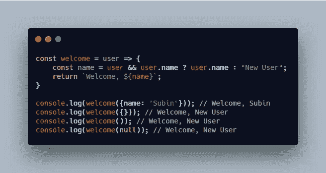
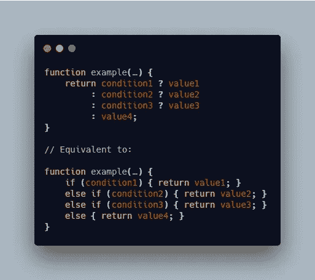
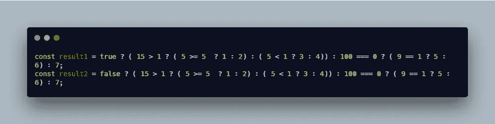
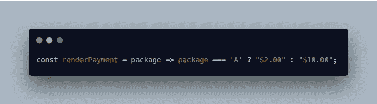
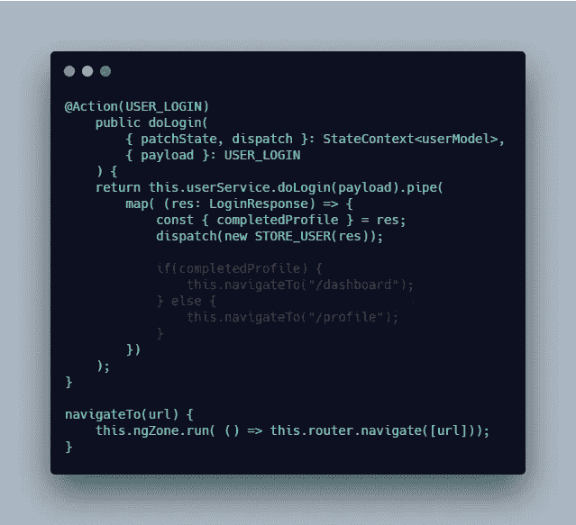
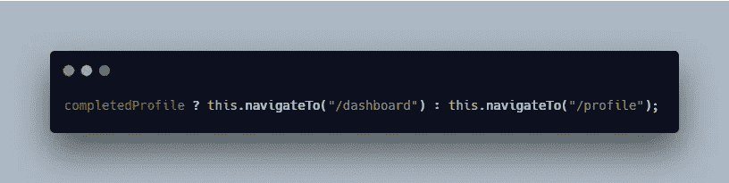
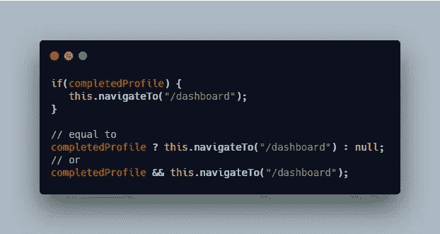
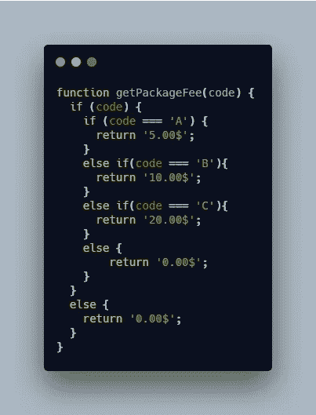
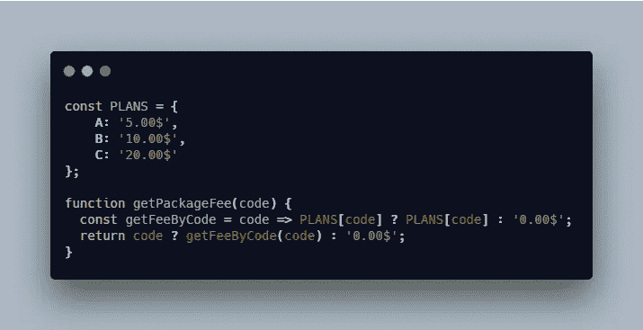
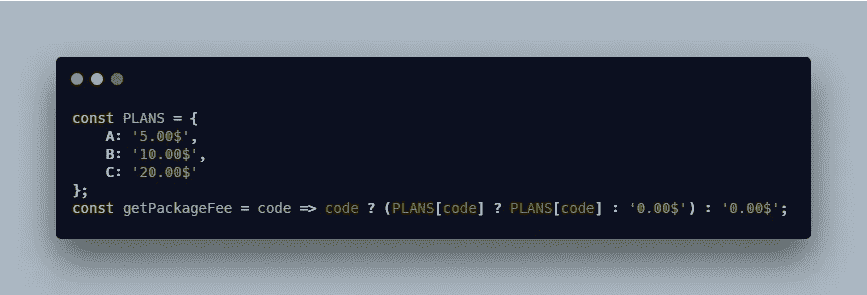

# 使用 JavaScript 中的三元运算符重构代码

> 原文：<https://levelup.gitconnected.com/refactor-code-by-using-the-ternary-operator-in-javascript-56ef0817d180>

## Java Script 语言

## 了解三元运算符如何工作，以及如何使用它来删除代码中复杂的“if”语句


照片由 [Math](https://unsplash.com/@builtbymath?utm_source=unsplash&utm_medium=referral&utm_content=creditCopyText) 在 [Unsplash](https://unsplash.com/s/photos/coffee?utm_source=unsplash&utm_medium=referral&utm_content=creditCopyText) 上拍摄

本文将描述 JavaScript 中的三元运算符，并在以下三个部分进行讨论:

1.  什么是三元运算符？
2.  三元运算符与现实生活中的“如果”语句
3.  用三元运算符简化代码

*更多类似内容，请查看*[*https://betterfullstack.com*](https://betterfullstack.com)

# 什么是三元运算符？

**条件(三元)操作符**是唯一一个接受三个操作数的 JavaScript 操作符。该运算符常用作`if`语句的快捷方式。

语法:

```
condition ? exprIfTrue : exprIfFalse
```

示例:

显示欢迎用户的消息:



三元运算符示例

三元运算符是右关联的，这意味着它可以用下面的方式“链接”,类似于一个`if … else if … else if … else`链。



条件链示例

# 三元运算符与现实生活中的“如果”语句

当我第一年从事软件开发时，我的第一位导师更喜欢写长而可读的代码。他认为《T2》比《T3》更具可读性。

所以我认为永远不要使用三元运算符，因为它太复杂了。类似于:



像地狱一样的三元算子

然而，几年后，我在下一家公司的代码审查中遇到了关于`if ... else ...`语句的麻烦。我的同事更喜欢使用三元运算符来缩短代码。他认为代码越短越简洁。

我读过干净的代码，我认为简单的代码总是更好。但是说起来容易做起来难。我将其归咎于复杂的功能，而不是我的`if`语句。

我对简单的三元运算符没有异议，比如:



简单的三元运算符示例

但是，对于这种复杂的情况，我不知道如何处理。我的同事让我尽量缩短代码，减少`if`语句的数量。

所以，我开始实现结构良好的三元运算符。这改变了我对编码的想法，让我成为了一名更好的开发人员，并思考了我的`if`语句的用法。

# 用三元运算符简化代码

在本节中，我想演示两个使用三元运算符的例子:

1.  简单案例
2.  复杂案例

## 简单案例

这是一个处理用户登录的场景:

*   如果缺少配置文件信息，请导航至配置文件屏幕。
*   如果配置文件信息完整，请导航至控制板。

下面是如何通过使用状态管理和 RxJS 在实际应用程序中实现这个应用程序



带有 if … else 的简单情况…

(警告:这段代码可能不会运行，因为我把它写在记事本上只是为了演示这个例子。)

这个简单的操作有五行。有一点我注意到了，当我写长代码时，我必须上下移动我的眼睛来检查条件，这影响了我们写程序的速度。

现在是三进制版本:



带有三元运算符的简单情况

我只有一行，我不需要上下移动来记住其他行的条件。这很严重，因为当我们看一个很长的`if...else...`语句时，你会对阅读和单元测试感到厌倦。

**注意:**条件运算符有一个缺点，它们总是接收两个条件，不管是真还是假。

我们可以使用`**&&**`操作符，或者在 false 的情况下尝试放置一个默认语句。



使用 and 运算符处理一个条件

## 复杂案例

这个场景是根据 UI 中选择的包代码收取费用。



getPackageFee 方法

这是一个复杂的`if...else if...else...`声明。开发人员需要记住并实现 5 个单元测试用例。

首先，我们需要检查代码是否被定义。然后，在 A、B、C 和无效代码的情况下比较代码。

应用三元运算符版本:



带有三元运算符的 getPackageFee 方法

这个代码更简单，我可以不加思考地阅读它，他们总是只有 3 种情况。

我们可以应用一个箭头函数来缩短它:



带有一行三元运算符的 getPackageFee 方法

与第一个版本相比，现在的`getPackageFee`方法更加简单。

# 摘要

我并不是说三元运算符比`if...else if ...else`语句有更好的性能。但是它使代码更短，可读性更好。此外，与`if`语句相比，三元运算符鼓励开发人员编写没有副作用的纯代码。

我希望这篇文章对你有用！可以跟着我上[媒](https://medium.com/@transonhoang?source=post_page---------------------------)。我也在[推特](https://twitter.com/transonhoang)上。欢迎在下面的评论中留下任何问题。我很乐意帮忙！

# 资源/参考资料

[1]:条件运算符[https://developer . Mozilla . org/en-US/docs/Web/JavaScript/Reference/Operators/Conditional _ Operator](https://developer.mozilla.org/en-US/docs/Web/JavaScript/Reference/Operators/Conditional_Operator)

[](https://betterfullstack.com/stories/) [## 故事-更好的全栈

### 关于 JavaScript、Python 和 Wordpress 的有用文章，有助于开发人员减少开发时间并提高…

betterfullstack.com](https://betterfullstack.com/stories/)