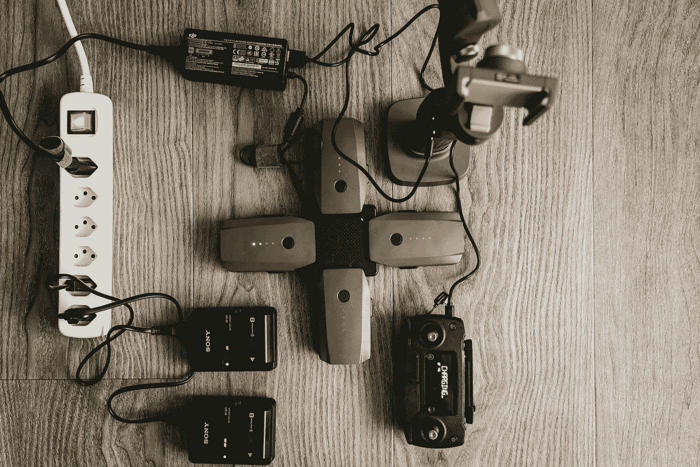
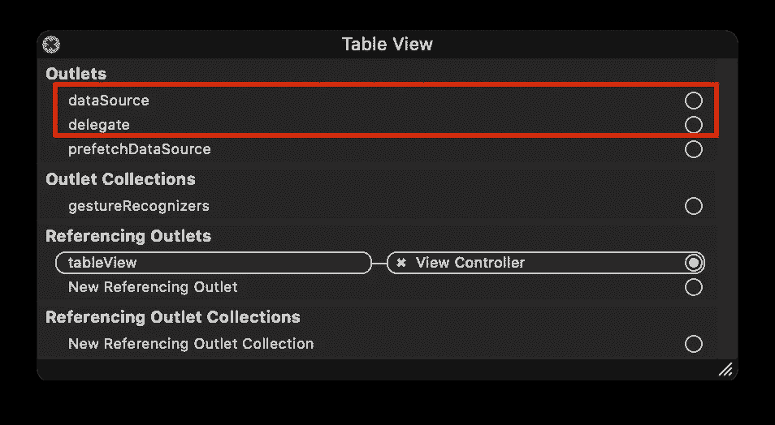

# 如何从 UIViewController 重构 UITableView

> 原文：<https://levelup.gitconnected.com/refactor-uitableview-from-the-uiviewcontroller-54053913588f>

🇨🇭 [克劳迪奥·施瓦茨](https://medium.com/u/90d4c82963db?source=post_page-----54053913588f--------------------------------)在 [Unsplash](https://unsplash.com/photos/_AE_i6zn5HI) 上的照片

## 使用适配器风格实现关注点的清晰分离

如果你是 iOS 开发者，你就直接或间接使用过 UITableView。没有它，任何 iOS 应用都不完整。有时表格视图代码可能是[海量视图控制器](https://www.hackingwithswift.com/articles/159/how-to-refactor-massive-view-controllers?utm_source=akshitzaveri-medium)问题的一部分。此外，给 UIViewController 增加一个责任似乎要求过高。

在本帖中，我们将看到如何将与表格视图相关的代码移动到一个单独的新 Swift 文件中，并尽可能减轻 UIViewController 的负担。

# 下载启动代码

 [## akshitzaveri/TableViewAdapterExample

### 在 GitHub 上创建一个帐户，为 akshitzaveri/TableViewAdapterExample 开发做贡献。

github.com](https://github.com/akshitzaveri/TableViewAdapterExample/tree/6c0d95fe90bd6ff42e685d36a31de928ba61652e) 

# 问题是

正如我们在下面的代码中看到的，表视图的委托和数据源方法就在 ViewController 内部。

一开始听起来问题不大。但是，考虑一下 ViewController 的职责。它负责用户的输入，向用户显示输出，并充当表视图代表和数据源。理想情况下，它不应该充当表视图的代理和数据源。ViewController 已经有很多工作要做了。我们可以很容易地将它分解成单独的文件，并免除 ViewController 的这一额外责任。

# 解决方案—适配器样式

适配器——给定一个输入，它改变输入，以便在系统的组件之间提供兼容的连接。— [维基百科](https://en.wikipedia.org/wiki/Adapter_(computing))

让我们创建一个新文件 TableViewAdapter.swift，并将委托和数据源代码移到那里。

## TableViewAdapter.swift

让我们看看我们在这里做了什么:

1.  我们在适配器文件中添加了一个 tableView 引用。
2.  我们添加了一个初始化器，以便在适配器初始化时获取 tableView。此外，我们将 tableView.register 移动到初始化器中，并将 tableView 的委托和数据源分配给适配器本身。

其余的都和以前一样！

## ViewController.swift

用下面的代码更新 ViewController。

让我们看看我们在这里做了什么:

1.  我们创建了一个属性来保存对 TableViewAdapter 的引用，并且不让它释放。
2.  我们用表视图引用初始化了适配器属性。

## 主要的。故事板

在运行应用程序之前，要做最后一件事来防止它崩溃。移除 UITableView 的数据源和委托。

在我们移除数据源和委托引用之后

现在，我们准备好了。运行应用程序，您应该能够看到带有一些数据的表视图行。

# 利弊

这不是银弹。有时用这种方式分离文件会令人沮丧。因此，在整个项目中开始这样做之前要小心。

## 赞成的意见

1.  您的 ViewController 文件变得更小，更易于管理。
2.  如果在一个 UIViewController 中有多个表视图，那么创建多个适配器文件并让每个适配器处理它的表视图就变得容易多了。

## 骗局

1.  如果您已经有了一个小的(< 100 行)ViewController，就不值得这样做。
2.  您必须使用闭包/委托将数据从适配器文件返回到 ViewController。

# 下载完成的代码

 [## akshitzaveri/TableViewAdapterExample

### 在 GitHub 上创建一个帐户，为 akshitzaveri/TableViewAdapterExample 开发做贡献。

github.com](https://github.com/akshitzaveri/TableViewAdapterExample) 

今天就到这里了，伙计们！感谢您的阅读。如果您有任何问题或意见，请留言。我很想听你亲口说。注意安全。