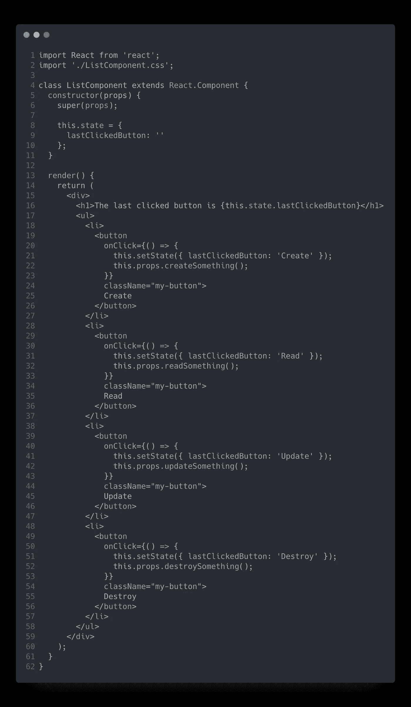
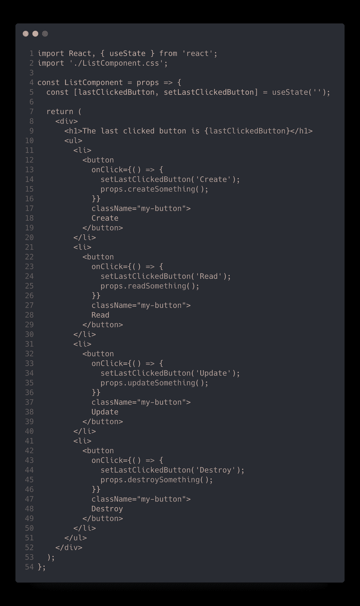
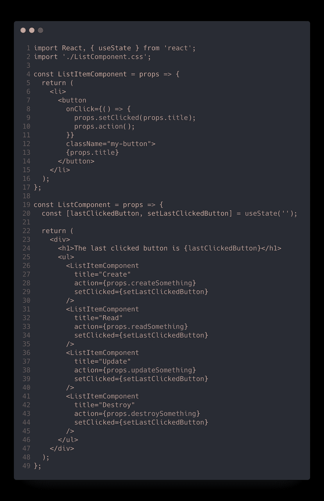
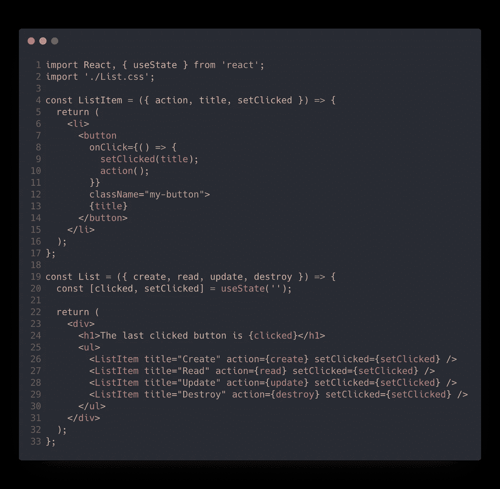
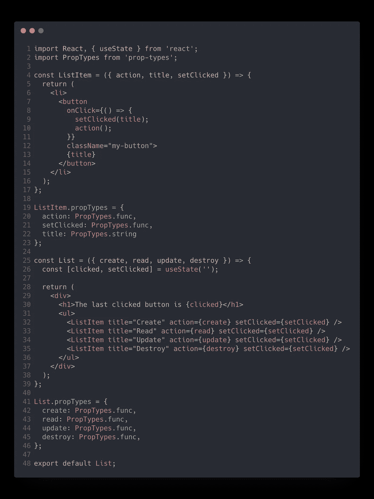
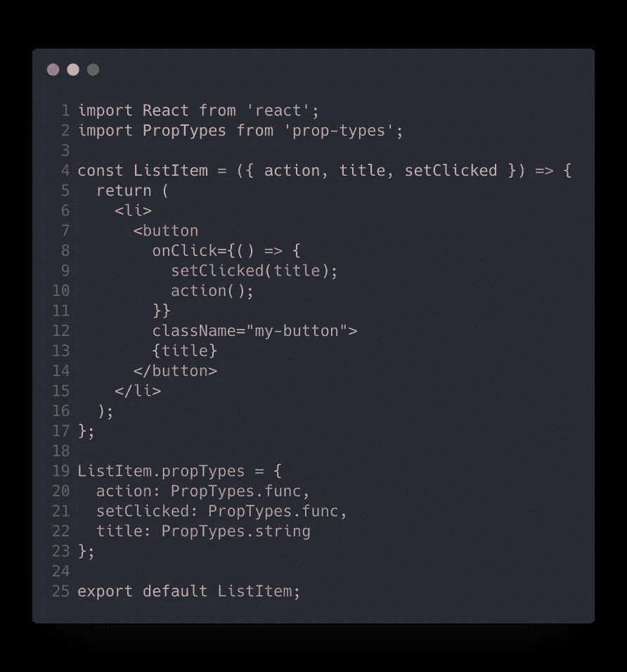

# 重构复杂的 React 组件——编写高效可读组件的 5 个最佳实践

> 原文：<https://levelup.gitconnected.com/refactoring-a-complex-react-component-5-best-practices-to-write-efficient-and-readable-components-b0d06f4f22b4>

萨法尔·萨法罗夫在 [Unsplash](https://unsplash.com?utm_source=medium&utm_medium=referral) 上拍摄的照片

# 这个问题

React.js 已经成为最受欢迎的 web 组件视图库，它跨越了多种特性，如今已成为创建令人惊叹的 web 应用程序的完整工具。

该社区呈指数级增长，尤其是在过去的 2-3 年里，网上充斥着数以千计的关于这项技术的教程。

所以，每个初学者在开始学习 React 时应该做的，正如我在[***Codeworks***](https://codeworks.me/?utm_source=medium&utm_medium=organic&utm_campaign=marco_ghiani_hackernoon_how_to_write_clean_react_components)开始我的道路时所做的，是阅读文档或教程来创建他们的第一个组件。

但是我的问题是:**你确定你的 React 组件遵循了最佳实践吗？或者简单地说，它们仅仅是工作吗？**

# 肮脏的组件是什么样子的

为了更好地解释我的观点，让我们看一下下面的 React 组件:

肮脏的反应元件

这是一个完全工作的 React 组件，可以在整个应用程序中多次使用，呈现一个按钮列表，该列表有一个用途，并显示最后单击的按钮是什么。很简单。

你可能会想"*嗯……如果它能工作，那就好了！*

但是，如果您知道如何用几行代码编写相同的组件，而不是现在的 62 行代码，会怎么样呢？ ***先从清理开始吧！*💎**

# 1.具有反作用钩优选功能部件

随着 React 16.8 中钩子的引入，我们通过在类声明上使用功能组件来实现有状态组件的能力(如果我们需要处理任何逻辑的话)。

在本文中，我们不会深入讨论类与功能组件或 React 挂钩。然而，众所周知，在 React 社区中，创建功能组件是更好的选择，尤其是现在我们可以使用钩子了。

> 钩子允许你在不改变组件层次结构的情况下重用有状态逻辑。

因此，让我们看看第一次重构后的组件是什么样的:

用 React 钩子重构功能组件。

好了，我们的组件已经更短了，我们放弃了*类*语法，但是仍然需要做很多优化。

# 2.擦干湿的！

我们能识别出这个组件中的任何模式吗？查看代码，似乎我们每次都呈现一个相似的按钮元素，每个元素都接受一些相似的道具，这是将这个长组件分成小部分的完美例子。

所以我们可以重构它，创建另一个小的功能组件来呈现按钮，传递一些属性，如`action` ***，*** `setClicked` ***，*** 和`title`:

好了，我们的组件开始有一个更好的形状，但仍有改进的余地，让我们继续！

# 3)恰当的命名和道具解构

`setLastClickedButton` 是我们的 setter 函数的描述性名称，但是我们需要保持代码的可读性和简短性，所以保持我们使用的名称简洁和必要是很重要的。我们将把它改名为`setClicked`。

同样，只要有可能，从道具对象中析构你所需要的可以避免不断重复`props` 单词。在我们的`ListItem`组件中，我们现在通过析构函数参数`{ action, title, setClicked }`中的名称来访问 props。

让我们来看看这两个变化:

太好了，我们大大减少了组件声明的长度，但是我们还可以做得更好！🚀

# 4.愿 PropTypes 与你同在！

清理之后，是时候在编写组件时应用绝对最佳实践了！有了 [**PropTypes**](https://www.npmjs.com/package/prop-types) ，我们就可以对接收到的道具进行验证，避免因数据类型不同而产生错误，比如接收到字符串“0”并试图将其与数字 0 进行严格比较(**“0”= = = 0->FALSE！！！**):

属性类型验证。

# 5.分成小块

猜猜看，我们的组件或多或少和初始版本一样长，但是仔细看看我们现在拥有的代码。

我们看到两个不同的组件，我们可以将它们分成两个模块，使它们可以在整个应用程序中重用。

List.js & ListItem.js

# 结论

应用于我们初始组件的这种清理展示了当您开始深入研究 React 组件时可以遵循的一些好的实践。

当然，我们可以对这个最终结果进行大量的其他优化，但是要一步一步来。要遵循的五个良好实践是一个很好的起点😉

关于这个话题的评论、分享和讨论总是很受欢迎，我很乐意回答你的任何问题！

> **随时联系我** [**Linkedin**](https://www.linkedin.com/in/marcoantonioghiani/)

 [## Javascript 技巧#4:数组平面和平面图实现

### 对新的 flat 和 flatMap 方法的潜力的有用介绍

medium.com](https://medium.com/better-programming/javascript-tips-4-array-flat-and-flatmap-implementation-2f81e618bde)  [## JavaScript 技巧#3:将错误优先回调函数转换为承诺

### JavaScript 异步概述和保证错误优先回调的实用程序

medium.com](https://medium.com/better-programming/javascript-tips-3-convert-error-first-callback-functions-to-promises-f2561d2aaefd)  [## JavaScript 技巧#2:对象/数组深度克隆实现

### JavaScript 中深度克隆方法的简单实现

medium.com](https://medium.com/better-programming/javascript-tips-2-object-array-deep-clone-implementation-2d6a43e43d2a)  [## JavaScript 技巧#1:对象属性的过滤方法

### 应用于对象属性的过滤器数组方法的简单 JavaScript 聚合填充

medium.com](https://medium.com/better-programming/javascript-tips-1-the-filter-method-for-object-properties-a2d6869b5127)