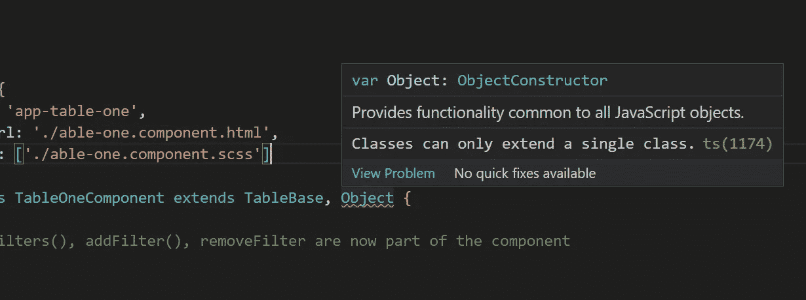

# 重构角度应用程序

> 原文：<https://levelup.gitconnected.com/refactoring-angular-applications-be18a7ee65cb>

[JESHOOTS.COM](https://unsplash.com/es/@jeshoots?utm_source=medium&utm_medium=referral)在 [Unsplash](https://unsplash.com?utm_source=medium&utm_medium=referral) 上拍照

重构是软件工程中最重要的技术之一，因为这是项目不会变成僵尸的唯一方法。如果你计划托管和维护任何类型的软件，有必要通过重新考虑旧代码来减少技术债务。每个代码都可以重构，但是往往很难发现最终可能是坏代码的细节。

在本指南中，我们将了解在 Angular 中经常出现的反模式，以及如何修复它们。

# 目录

## 1.复制

*   继承/构成
*   成分
*   内容投影
*   厚颜无耻

## 2.表演

*   延迟加载功能模块
*   变化检测
*   内存泄漏

## 3.命名

*   避免心理映射
*   别搞笑了

## 4.荣誉奖

*   神类
*   任何，任何，任何
*   模板中的服务

# 1.复制

> 重复代码是软件设计中所有罪恶的根源。当一个系统充斥着许多完全相同或几乎完全相同的代码片段时，这就意味着草率、粗心和完全不专业。无论何时发现重复，根除和消除重复都是所有软件开发人员的责任。

~罗伯特·c·马丁

复制不好的原因是因为软件的可维护性受到了极大的损害，因为现在更改也必须被复制，而我们人类有时会忽略一些事情。因此，避免重复自然是有意义的，这样，当我们在未来做出改变时，这种改变可以在一个地方进行，并自动影响其他地方。

复制的解决方案是**抽象**。重复可以发生在不同的地方。在模板中。在打字稿中。在造型上。幸运的是，这些领域都有抽象的方法。

## 继承/构成

假设我们有五个不同的组件，它们彼此相似，因为它们都是表。它们显示不同的数据，也有一些独特的附加功能，但它们都有一些共同点:

*   他们可以清除表格过滤器
*   他们可以删除表格过滤器
*   他们可以添加表格过滤器

我们可以将这些函数抽象成一个基类，由每个具体的表组件继承，而不是在每个组件中单独实现所有这些函数。

但是……有一个问题。继承是一个缺陷，而不是一个特性！嗯，也许这有点夸张，但是在软件工程社区中有一个反对使用继承的有效案例。原因是抽象和具体类之间的强耦合。因此，只有在需要这种强耦合的情况下，才应该使用它。另一个缺点是，具体类只能从单个类继承。

相反，使用组合来扩展类的功能通常是个好主意。我们可以创建一个 *FilterService* 来代替 *TableBase* ，并将 *FilterService* 注入到组件中。这样做的另一个好处是易于测试，因为这样很容易模仿 *FilterService* 。

## 成分

当谈到模板中的重复元素时，我们显然可以将组件分成多个更小的组件。关于这一点，唯一应该说的是不得违反**智能、非智能组件**的概念。

例如，日期选择器组件应该是哑的。它不应该关心它是否被用来选择生日、会议或其他什么的日期。使用日期选择器组件的组件将被认为是智能组件，可以感知上下文。这是一条必须遵守的重要规则，因为这是创建可重用代码的核心原则。

## 内容投影

让我们来看看另一种特定于模板的技术，这种技术用于使组件更加可重用。假设我们有一个列表组件，它只在每一行中列出一个动物的名字。该组件在多个模块中共享，在模块 A 中，我们完全乐意让它保持原样，但在模块 B 中，我们要求列表还在其名称旁边显示动物的小图像。好了，现在我们可以继续创建一个 *ngIf* 并输入一个布尔标志到组件中来决定是否显示图像。但是我们有 C 模块，它想显示图标而不是图像。如果我们继续并扩展 *ngIf* 逻辑，组件会变得很复杂，并且知道很多关于它的外部用例。

相反，我们使用内容投影将模板的一部分投影到组件中的特定区域。令人高兴的是，用 *ng-content* 制作这样的内容占位符相当容易。

哦不，原来现在所有的动物都有狮子的形象。这是因为这种简单的方法不提供任何数据，因此我们在选择图像时会更加智能。为了共享列表中动物的上下文，我们需要将 *ng-container* 制作成一个提供 animal 作为隐式上下文的模板出口。

现在成功了！每种动物都在展示自己的形象。我只是简单地介绍了一下这个话题，因此我建议你去看看史蒂文·库珀在*电视台*上的精彩演讲:

## 厚颜无耻

而不是像这样一遍又一遍地重复相同的属性:

利用 Sass，将公共属性抽象成 **mixins** ，然后将它们包含在具体的类中。

# 2.表演

照片由 [Unsplash](https://unsplash.com?utm_source=medium&utm_medium=referral) 上的[zdenk Macháek](https://unsplash.com/@zmachacek?utm_source=medium&utm_medium=referral)拍摄

在任何软件应用程序中，性能都是一个不容忽视的重要方面。尤其是对于将在单线程环境中的浏览器中运行的前端应用程序，而每个用户的硬件规格是不同的。因此，我们也应该开发低规格的硬件。另一个需要考虑的因素是网速，对于某些用户来说网速可能非常慢。

就我个人而言，每当我是任何网站的用户，而它很慢或不够反应，我往往会感到恼火。我想不仅仅是我的感觉，还有其他人的感觉。

## 延迟加载功能模块

你有一个包含许多模块和组件的大型应用程序吗？然后，当您在浏览器中加载应用程序时，可能需要几秒钟来加载这个包。几秒钟听起来不是很多，但实际上这可能是一个巨大的交易破坏者，因为它给人的印象是应用程序很慢。但是为什么会这样呢？

就是因为初始捆绑太大。当您在应用程序的某个地方导入每个模块/组件/服务时，就会发生这种情况。所有导入都将被编译成一个 Javascript 块文件，该文件在应用程序打开时加载。减少初始包大小的解决方案是将应用程序分成模块，这些模块不是在模块中导入的，而是在运行时延迟加载的。这并不意味着模块永远不会被导入，但这意味着它不是静态导入的，因此延迟加载的模块将被编译到一个单独的块文件中，该文件最初不会被加载。幸运的是，我们可以在运行时随时加载它。加载这种模块的通常情况是当某个路由被激活时。

现在， *LazyModule* 的块文件只在惰性路由被激活时加载一次。请注意，延迟加载不会减少总的块大小，而是将它分成多个更小的块，这些块会被多次加载，这样每次加载一个块时，加载时间都不会太长。

## 变化检测

更改检测是 Angular 中负责自动更新任何数据绑定的过程。例如，当您将变量 X 作为输入属性，并且在模板中，您在字符串插值中绑定到该变量以显示 X 时，只要 X 发生更改，更改检测就会自动更新字符串插值中的 X 值。但是有一个经常被初学者忽略的问题。**功能**。

模板中的函数将在每次变更检测时运行，即使它根本不影响函数。原因是 Angular 不知道函数是否有副作用或状态，因此它必须总是在任何变化事件上运行函数。如果你想一想 Angular 为什么不知道这一点，这是显而易见的，因为 Javascript 是面向对象的语言，而不是函数式语言。在函数式语言中，具有相同参数的函数调用总是产生相同的结果，而在面向对象的语言中却不是这样，因为函数可以有状态依赖，比如缓存或者只是一个简单的 getC *urrentTime()* 函数，它依赖于日期-时间，而无论何时调用函数，日期-时间都是不同的。

为了防止这一点，你应该总是绑定到变量，观察，或使用纯管道。这篇博客文章中有更多关于这个话题的内容:

 [## Angular:不要在模板中使用函数

### 在这篇简短的博文中，我将向你展示 Angular 的一个核心概念，这是每个 Angular 开发者都应该知道的…

levelup.gitconnected.com](/angular-dont-use-functions-in-templates-f33d67db18da) 

## 内存泄漏

> 内存泄漏通过减少可用内存量来降低计算机的性能。最终，在最坏的情况下，可能会分配太多的可用内存，系统或设备的全部或部分停止正常工作，应用程序失败，或者系统因系统颠簸而大幅变慢。

~维基百科

在计算机科学中，内存泄漏是纯粹的罪恶，因为它们锁定了内存，即使内存本应被释放。例如，如果您在 Java 中打开了一个数据流，但没有关闭它，那么所分配的内存就永远不会被释放，因此就产生了内存泄漏。或者你用 C++构造对象，但从不解构它们。**或者在 Angular 中你订阅了一个可观察对象而从不退订这个可观察对象**。

虽然，有些可观测量会自动完成，但那只是少数。如果我们不手动取消订阅，所有其他可观察到的内容都会造成内存泄漏。为了取消订阅，我们必须保存订阅，然后在 *ngOnDestroy* 生命周期挂钩中取消订阅。您可能会认为这很繁琐，因为一个组件可能有相当多的订阅需要处理，但是不要担心。RxJs 提供了*订阅*类，这是一个存储多个订阅的包装器，并提供了一个取消订阅所有已存储订阅的方法。

另一种更好的处理订阅的方式是在你的模板中使用**异步管道**。它既不卷积组件的代码，也没有任何内存泄漏，因为它自动订阅和取消订阅正在被管道传输的可观察对象。所以我通常做的是，将管道操作符链接起来，对可观察对象的一些变化做出反应，但只通过异步管道订阅。

# 3.命名

命名并不是 Angular 特有的**干净代码原则**，而是可以适用于任何语言。尽管如此，当创建一个必须长期维护的软件时，好的有意义的名字的重要性是必不可少的。人类确实会忘记一些事情，并且无论何时需要一个 bug 修复或特性，都需要重新阅读代码。为了理解代码，名字应该立刻告诉你某个东西正在做什么。一个经验法则是给所有东西命名，使其自然可读。

丹-克里斯蒂安·pădureț在 [Unsplash](https://unsplash.com?utm_source=medium&utm_medium=referral) 上拍摄的照片

## 避免心理映射

不要认为其他程序员会理解缩短的名字，即使你相信它们真的很明显。你应该考虑逻辑和数据流，而不是弄清楚某个变量意味着什么。明确命名，即使这意味着你的名字会更长。

## 别搞笑了

没什么好说的，除了:别那么搞笑。想象一下，有人正在搜索“rotate ”,却找不到函数，因此感到困惑。

# 4.荣誉奖

显然还有很多其他值得注意的反模式，但是没有办法在这篇博客文章中涵盖所有的反模式。因此，我将在本节中列出一些其他常见的陷阱。

## 神类

你是否曾经编写过一个组件，它注入 10 个服务，甚至可能做 10 种不同的事情，你对此感到非常自豪，因为你能够组合如此复杂的逻辑？我讨厌把它带给你，但是那被认为是违反了**单一责任原则**。一个类，不管它是一个组件、一个服务、一个指令还是别的什么，都应该只做一件事。例如一个计费类，应该只做计费，而不关心如何导入计费数据。因此，在这种情况下，帐单的导入是一个不必要的细节，应该被分离到它自己的类中。

通过查看构造函数可以很好地看出 god 组件。

这叫**反模式**！想象一下，必须对这个组件进行单元测试，并模仿所有这些服务。听起来工作量很大。因此，不要写这样的怪物，试着把类分成多个类，通过责任划分界限来分离逻辑。

## 任何任何任何

Angular 的一个巨大优势就是使用了 Typescript，而不是纯 Javascript。Typescript 带来了许多优势，而最大的优势是 Typescript 允许在编译时而不是运行时检测类型错误。随着应用程序的增长，这个关键特性变得非常方便，因为它节省了大量的时间，并且使代码更加整洁，因为在通常的 Javascript 函数中，在函数的开始部分，类型检查和类型保护经常是错综复杂的。但是糟糕的 Typescript 带有 **any** 类型，这使得动态键入成为可能。

显然，在一些用例中，在这里或那里使用 any 类型是可以的，但是不应该太频繁地使用它，因为它会破坏 Typescript 最初的优势。如果我们时间紧迫，并且有一个严格的截止日期，我们必须有自制力，不要到处使用任何类型。

如果你的代码中没有任何类型，那将是最好的。

## 模板中的服务

理论上，您可以注入一个服务并将其标记为 public，这样您就可以在模板中引用它。一方面，这可能会节省一些工作，因为您不必将函数调用包装在类函数中，也不必将可观察值和变量保存到类变量中，但另一方面，服务和组件之间会存在强耦合。

同样，想象一下测试这个组件。当服务只在类中使用时，单元测试也会更容易。此外，不直接在模板中使用任何服务也是一种更好的关注点分离。模板应该注意细节，而不是愚蠢的。

# 结论

重构是软件工程的重要组成部分，每个软件工程师都有责任生产和重构代码，这样就不会产生技术债务。因为 Angular 主要用于大型应用程序，所以这是每个 Angular 开发人员都应该熟悉的关键过程。

通过遵循上面提到的步骤，您现在能够识别反模式，并拥有重构它们的工具，以使您的代码更加整洁。