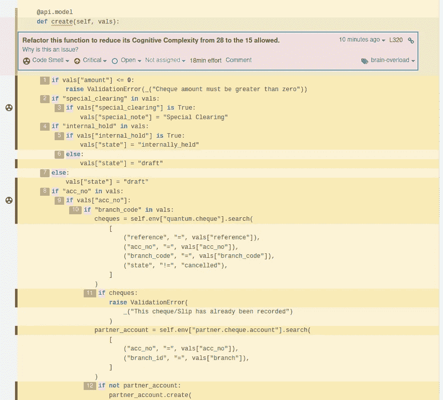

# 重构代码以通过 Sonar Qube 的认知复杂性检查

> 原文：<https://levelup.gitconnected.com/refactoring-code-to-pass-sonar-qubes-cognitive-complexity-checks-8433433d83a1>

## SonarQube 和类似的代码质量和安全工具真是太好了


在 [Unsplash](https://unsplash.com/s/photos/code-microscope?utm_source=unsplash&utm_medium=referral&utm_content=creditCopyText) 上拍摄的 [ThisisEngineering RAEng](https://unsplash.com/@thisisengineering?utm_source=unsplash&utm_medium=referral&utm_content=creditCopyText)

[sonar cube](https://www.sonarqube.org/)等质检软件是福。

没有它们，我们最终部署的代码会有很多错误、死代码、不可达代码、代码味道、安全漏洞等等。

许多开发人员对代码质量工具的最初印象和体验是，它们给开发和部署过程带来了不必要的摩擦和瓶颈。

我们认为引入到开发和集成工作流中的摩擦和瓶颈会降低开发人员的生产力。

现在，在你体验到这些工具带来的丰厚回报之前，你有理由坚持这种强烈的不成熟的想法。

将 SonarQube 之类的代码质量工具集成到您的开发过程中，从一开始就看起来令人沮丧，而且事与愿违，因为您突然要负责修复该工具标记的所有问题。通过 CI/CD 管道检查必须解决的问题。

这些问题中的许多会进入生产环境，并在以后产生运行时问题、代码理解和维护开销。有了 SonarQube 这样的工具，你可以提前解决这些问题，甚至不用尝试就知道它们。

SonarQube 和其他类似的工具运行代码质量检查，并确保您的代码库的质量和安全性是可靠的。

# 关注认知复杂性

SonarQube 执行的质量检查之一是分析您的代码库，找出具有高认知开销的代码。

SonarQube 的认知复杂性度量对代码构造的复杂性进行检查和评分。较高的分数表明，当你试图理解应用程序的控制流时，你会有更大的障碍。

认知复杂性增加了开发人员理解代码并进一步维护或扩展代码的工作量。

Sonar 有一套衡量代码复杂性的详细规则。看看这份[白皮书](https://www.sonarsource.com/docs/CognitiveComplexity.pdf)。任何打破应用程序线性流程的结构都会增加认知复杂性得分。

增加 SonarQube 认知复杂性的常见结构有

1.  嵌套条件和迭代
2.  迭代次数
3.  具有多个不同逻辑运算符的条件句

所有具有认知复杂性的函数和代码块都被 SonarQube 标记出来，报告如下



作者照片:声纳截图提高了声纳立方体的认知复杂性

在本文中，我们将介绍如何降低上面截图中的`create(...)`方法的认知复杂性。

我们将一起重构这个方法，将认知复杂度从 28 降低到至少可接受的最小值，即 15。

我们将采用马丁·福勒的书[重构:改进现有代码的设计](https://www.amazon.com/Refactoring-Improving-Existing-Addison-Wesley-Signature/dp/0134757599/ref=pd_lpo_14_t_0/136-1119044-0910438?_encoding=UTF8&pd_rd_i=0134757599&pd_rd_r=d58e3ba7-8f83-4fea-a8e1-24a4a1e1a4fd&pd_rd_w=YMTyK&pd_rd_wg=fzwKe&pf_rd_p=337be819-13af-4fb9-8b3e-a5291c097ebb&pf_rd_r=B9YK5S2MB0DD9FBA2ZKE&psc=1&refRID=B9YK5S2MB0DD9FBA2ZKE)中的一些重构。

在这一重构的最后，我们将无一例外地获得以下好处:

1.  一个干净，可读和全面的功能
2.  一个不太复杂的代码，几乎没有认知开销
3.  代码行更少的方法
4.  高度可维护和可扩展的方法

# 遇到认知复杂性问题的方法

下面的代码的 SonarQube 认知复杂性得分为 **25** ，如前面的报告所示。

**代码片段#1 —需要重构以通过 SonarQube 的代码认知**

## 这个方法在做什么

`create(...)`方法属于自定义 Odoo ERP 模块的`Cheque`类，用于处理支票清算。

如果银行分行代码`branch_code`出现在传递给方法的`vals`参数中，方法`create(...)`覆盖并创建一个**合作伙伴支票账户**。当账号`acc_no`和银行分支`branch`的**伙伴支票账户**不存在时，它检查并创建该账户

最终使用现有的**合伙人支票账户**或新创建的**合伙人支票账户**创建支票。

# 让我们从分析和重构开始

我们将通过首先分析功能并指出与认知相关的问题来开始这个重构练习，然后讨论它们的解决方案。

## 条件守卫

**第 3 行到第 7 行[**到**代码片段#1 **]** 实施条件保护，这是在不满足某些条件和应用程序状态时终止程序执行的理想方法。**

**行# 3****from**代码片段# 1**在`vals`字典中检查关键字`amount`。在缺少这两个键的情况下，`create(...)`方法的主要操作无法执行，因此该函数终止，并引发一个适当的“验证错误”异常。******

******考虑到两个条件守卫都评估`amount`的存在，并且还检查金额值是否大于零，如果反馈中的粒度重要到已经达到，我们可以将这两个条件守卫作为两个独立的条件。******

******如果没有，我们可以考虑将两者合并成一个，并将异常消息一般化。******

******将两个条件守卫合并为一个，**行#3 到# 7[**代码片段#1 **]** 中的**导致下面的条件更加简短易读。********

****代码片段#2****

## **简化和合并条件句**

****第 12 行到第 17 行****from**代码片段# 1**是我们可以简化以增加可读性的条件句。********

********第 12 行到第 17 行【来自代码片段# 1】********

******您注意到有一个对键`internal_hold`的存在及其值`vals['internal_hold']`的真实性的评估。******

******如果`internal_hold`存在并且是`True`，则`vals`字典用具有值`internally_held`的新密钥`state`更新******

******我们还注意到`elif`和`else`块将相同的状态`draft`分配给`vals['state']`，而不管它们的条件逻辑有何不同。******

******所以在这里，我们将合并这两个条件句。******

******重构**第 12 行到第 17 行**从代码片段# 1**用我们当前的基本原理将条件语句简化到下面********

********第 12 行到第 17 行[来自代码片段#1]被重构********

******我们也可以使用 Python 的三元运算符，用一条语句来实现上面的重构，如下所示******

********第 12 行到第 17 行[来自代码片段#1]使用三元运算符**进一步简化******

## ******合并和删除重复的逻辑******

******敏锐的观察力会让我们注意到在**第 19 行到第 63 行**到 **[ 【T19 来自代码片段#1 **]** 中嵌套的`if-else`语句中用于取回支票的代码的重复********

****第 19 行到第 63 行【来自代码片段# 1】****

**虽然从代码片段# 1**到代码片段# 63**的第**行#19 到第**行的第**行#3 和第#34** 行检索支票的域过滤器不同，但是机制是相同的，因此可以通过对 ORM `self.search(...)`方法的一次调用来实现。**********

```
cheques = self.search([<domain-filters>])
```

上述代码在`if`和`else`子句中都存在；这种重复是因为每个都必须用不同的域过滤器列表调用`self.search(...)`。

我们可以通过向上移动`self.search(...)`并传入一个基于`vals`中是否存在键`branch_code`而准备的域过滤器列表来简化这段代码

董这才端起本改版:

**第 19 行到第 63 行[来自代码片段#1 ]被重构**

在这个版本中，我们创建了通用域过滤器`cheque_exists_domain_filters`，并根据满足哪些条件来动态扩展过滤器。

这个版本现在显示了对`self.search(cheque_exists_domain_filter)`的单个调用

这样做使我们的控制流变得平坦，并从原始的`create(...)`方法****代码片段# 1**中移除了两层嵌套的`if`语句******

******现在我们已经将`self.search(cheque_exist_domain_filter`上移，我们也可以实现条件保护，如我们修改后的代码中的第 9 行所示，当`self.search(cheque_exist_domain_filter)`返回一些支票时引发`ValidationError`异常，这是我们不继续创建合作伙伴支票账户的前提条件。******

# ******最终重构方法******

******这个`create(...)`方法的最终修订版可以通过应用其他的重构来进一步重构，比如“方法提取”。******

******但是本文的目标是考虑我们可以进行的最小重构，以使该方法通过 SonarQube 的认知复杂性检查。******

********代码片段#5 —最终重构的方法********

******我希望你喜欢这个重构练习。******

******祝您的软件开发之旅一切顺利。******

## ******你可能也想看看我的其他文章******

******[](/please-refactor-these-blocks-of-code-c7d2b6f2e4ce) [## 请重构这些代码块

### 我知道它们有用，但是请让我们去掉这些代码的味道

levelup.gitconnected.com](/please-refactor-these-blocks-of-code-c7d2b6f2e4ce) [](/the-6-things-every-good-software-developer-i-know-religiously-does-fd6dd9c2c8f7) [## 我所知道的每一个优秀的软件开发人员都会认真做的 6 件事

### 我认识的每个优秀的软件开发人员都会做这些事情

levelup.gitconnected.com](/the-6-things-every-good-software-developer-i-know-religiously-does-fd6dd9c2c8f7) [](https://javascript.plainenglish.io/angular-top-4-front-end-developer-opinions-ef864876af59) [## angular:4 大前端开发者观点

### 前端开发人员对 Angular(重写)的主要看法。

javascript.plainenglish.io](https://javascript.plainenglish.io/angular-top-4-front-end-developer-opinions-ef864876af59) 

嘿，谢谢你花时间阅读这篇文章。在你走之前，我想让你知道一些事情。你可以用我的 [***推荐链接***](https://ofelix03.medium.com/membership) *通过* [***加盟中***](https://ofelix03.medium.com/membership) *作为付费会员支持我的写作。只需 5 美元* *您就可以拥有* ***完整访问内容*** *像您刚刚阅读的内容以及更多内容。如果你今天加入，我会从你的 5 美元会员费中收取一小笔佣金，而不会给你增加任何额外费用。*

[](https://ofelix03.medium.com/membership) [## 通过我的推荐链接加入媒体-费利克斯·奥托

### 作为一个媒体会员，你的会员费的一部分会给你阅读的作家，你可以完全接触到每一个故事…

ofelix03.medium.com](https://ofelix03.medium.com/membership)******