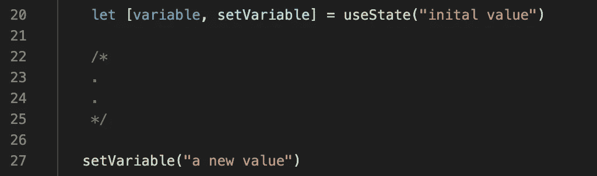

# 重构用钩子反应类组件

> 原文：<https://levelup.gitconnected.com/refactoring-react-class-components-with-hooks-d15abb7fe71a>

如果你像我一样，你被告知功能组件更有效、更干净，或者“更好”，你应该尝试使用钩子。但你一直在逃避。因为你非常习惯使用`setState()`和生命周期方法，而且它正在工作…

但是今天，伙计们。我们要去做了。因为我最终尝试了它，而且它非常容易重构，结果是令人耳目一新的干净和易于遵循的代码。我打算用一种非常简单的方式把所有东西都摆出来，这样就不会有什么损失了。

所以系紧鞋带，别抱怨了，我们走吧。

# 首先，简单介绍一下背景…

## 类别组件与功能组件

React 类组件是程序员喜欢称之为 ES6 带来的“语法糖”，它允许我们自动使用方便的东西，如状态和生命周期方法，如`componentDidMount()`和`componentDidUpdate()`。类组件*扩展了*React 组件，并被声明和使用如下:

当然，React 组件也可以声明为简单的函数(就像 JavaScript 中的其他东西一样)。与上面相同的组件将被声明为:

功能组件在转换后会产生更干净、更精简的代码，并且通常更容易跟踪、测试和使用，因为它们只是普通的旧 JavaScript 函数。但是，从历史上看，使用功能组件意味着我们不能使用像状态或生命周期方法这样对 React 组件如此方便的东西。所以我们会用一个功能组件来表示那些只需要道具，通常只是渲染一些东西的组件。然而，随着钩子的引入，事情发生了一些变化，我们现在可以为任何组件使用功能组件。

## 但是国家呢…

如果我们需要使用状态，这怎么可能呢？介绍一下 **useState()** 钩子！使用状态允许您定义一个状态变量、该变量的 setter 方法，并一次性初始化值。查看 [useState 文档](https://reactjs.org/docs/hooks-state.html)以获得更深入的解释，但是用法看起来像这样:

它取代了初始化状态，并在类组件中使用`setState()`:

## 和生命周期方法？

您会问，在组件的整个生命周期中需要发生的事情呢？在整个生命周期中，我们可以使用各种各样的钩子，其中一些有助于使代码更快更有效，但最常见的是 **useEffect()** 。默认情况下，在组件更新的任何时候运行回调函数，但是您也可以通过传递第二个参数作为依赖变量的数组，将它与特定依赖项的变化联系起来。

所以，`useEffect`可以用来代替`componentDidMount`和`componentDidUpdate`，还可以进一步定制，使其只在特定的场合触发。你可以查看文档，但这里有一些例子:

# 好吧，让我们来举个例子

有了这些背景知识，我发现钻研某件事最简单的方法就是开始做。

下面是一个非常基本的组件示例。我设置它从 props 中读取一个值，使用受控表单的状态，并使用 componentDidMount 进行初始 API 获取。出于这个例子的目的，让我们忽略当我们进行初始调用或提交表单时会发生什么，而把注意力集中在其余的语法上。

这是我们将要使用的类组件:

## 从哪里开始？

这看起来像是很多工作，但是如果你把它分解，它会变得非常有条理和简单。我会按照以下步骤将它转换成一个功能组件:

1.  更改我们的 React import 语句
2.  用函数语法替换声明
3.  将最初的国家声明替换为`useState`的实施
4.  用步骤 2 中创建的设置器替换 setState 用法。
5.  将`componentDidMount`替换为`useEffect`。
6.  去掉“`render()`功能
7.  将“const”放在所有函数声明之前
8.  去掉所有变量前面的 this.state
9.  在其他地方(在函数调用前)去掉“this”

所以，我们开始吧。下面，我将执行每一步，为了清楚起见，旧的类版本被直接注释掉了。

## 更改 React 的导入。

我们不再需要组件。相反，我们需要导入`useState`和`useEffect`:

## 2.更改声明语法。

这只是一个简单的语法调整。你知道这个…

## 3.用 useState 的实现替换初始状态声明。

这里，我们在一个数组中创建变量及其 setter(通常是“set”+“Variable name”)，然后为变量提供一个初始值作为参数给`useState`:

## 4.用步骤 2 中创建的设置器替换 setState 用法。

现在，只需遍历和任何时候 this.setState 出现，只需使用适当的 getter！这里有两个提示。一，用 CTRL+F 找到 setState！第二，对于受控表单，我们可以完全去掉`handleChange`函数，只在表单上使用内嵌的 setters:

## 5.将 componentDidMount 替换为 useEffect。

在这里，我们使用完全相同的函数体(禁止任何这种用法。或者 this.state)作为传递给`useEffect`的回调的主体。我们传递一个空数组作为第二个参数，使用 Effect 来表示我们希望这个函数只在初始挂载时运行。

*记住，我们可以在这里不传递任何东西来指示它应该在组件更新的任何时候运行，或者传递一个依赖变量的数组，我们希望它的变化触发函数*

## 6.去掉“render()”函数

这就像注释掉一行一样简单…

## 7.将“const”放在所有函数声明之前

我不认为你需要一个直观的例子！

## 8.去掉所有变量前面的 this.state

## 和

## 9.在其他地方(在函数调用前)去掉“this”

还是那句话，在这里用你的朋友 CTRL+F！

还有维奥拉。您有一个利用状态和生命周期方法的功能组件！

## 那又怎样？

那我们为什么要经历这一切？首先，它使代码更干净、更短、更简单。功能组件是 54 行代码，类组件是 67 行。更重要的是，如果你通过一个 [JS 编译器](https://babeljs.io/en/repl)运行每一个，类组件是 121 行，函数组件是 85 行长！但是除了代码行之外，跟踪功能组件更容易。变量设置器将状态更新为(甚至比以前更多)普通英语。我们还可以完全控制何时以及为什么运行我们的`useEffect`回调函数，并且我们可以优化组件的效率。

在这个例子中，我们处理的是一个非常简单的组件，所以我们甚至还没有开始接触钩子有多动态和漂亮。但是这几乎涵盖了开始将类组件转换成功能组件所需了解的一切。当你这样做时，你可以潜入其他钩子如`useCallback`和`useMemo`来使你的组件更加有效，但是如果你只是从一步一步开始(就像我们上面做的那样)，你很快就会开始烹饪。

尽情享受吧！