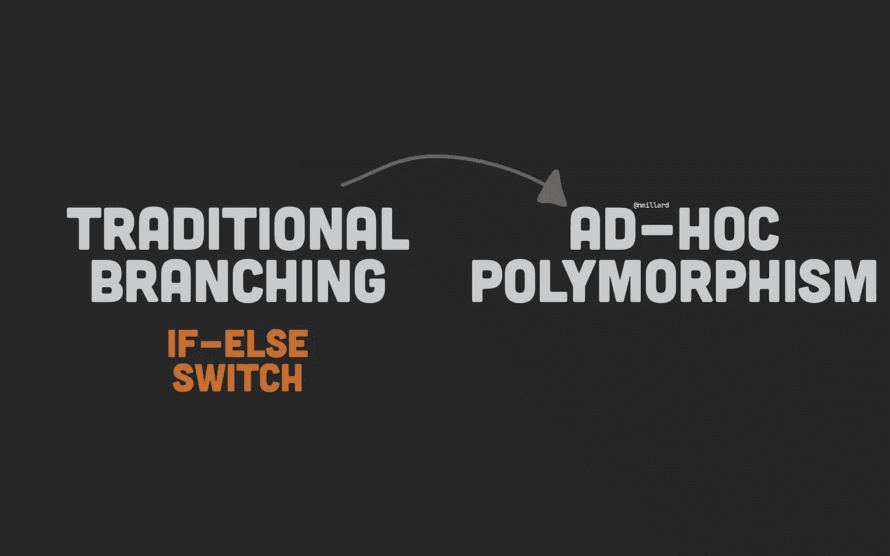
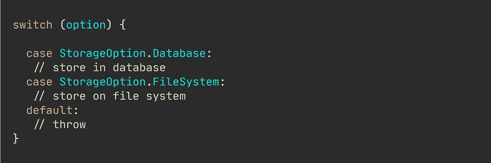
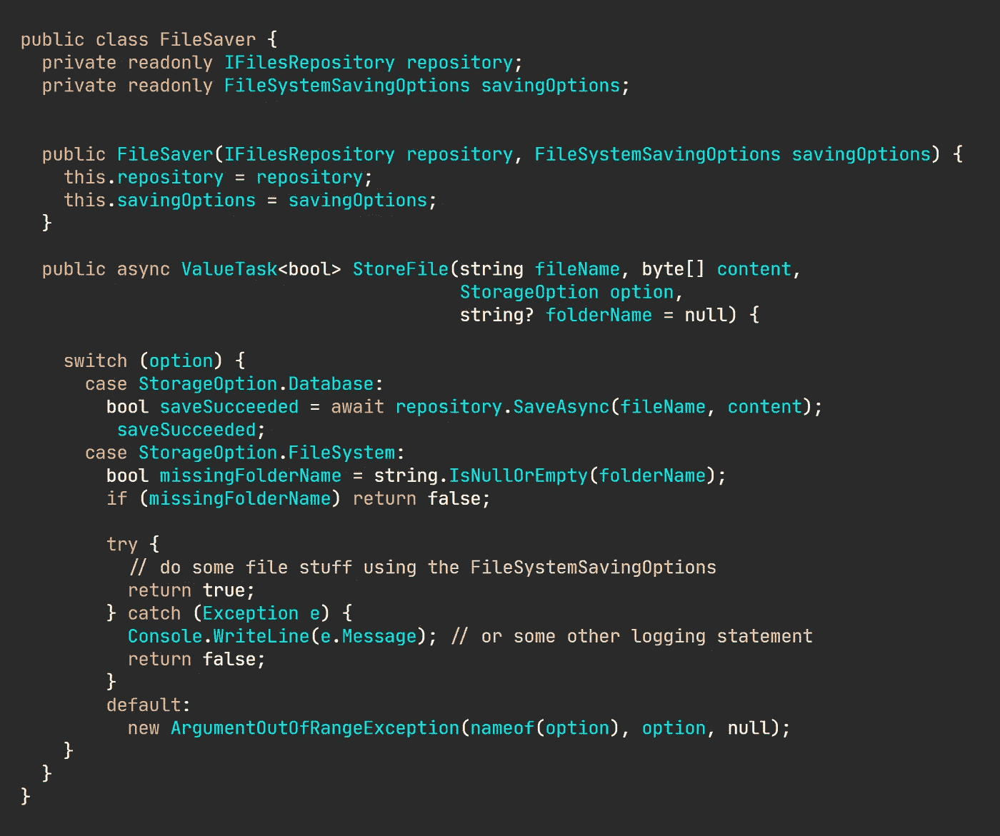
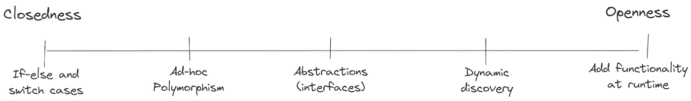
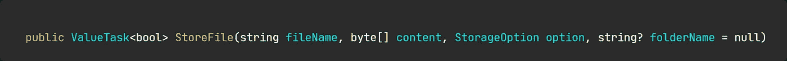
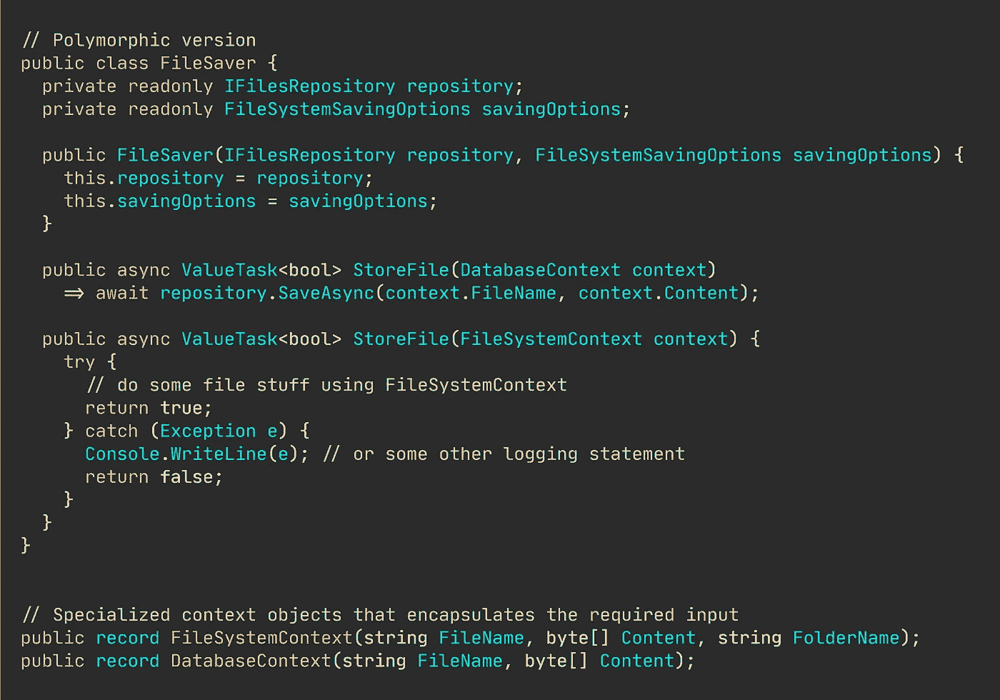

# 为了更好的代码质量，重构您到特别多态性的切换

> 原文：<https://levelup.gitconnected.com/refactoring-your-switch-to-ad-hoc-polymorphism-for-better-code-quality-cf70d9a27e65>

## 实际编程示例

## 你很少需要对一个离散值进行分支。

图片由[尼可拉斯·米勒德](https://medium.com/u/7c7a43b3d9de?source=post_page-----cf70d9a27e65--------------------------------)

我已经提到过很多次了，这不会是我的最后一次，但是使用 switch cases 和 if-else 语句对离散值进行分支通常是一个糟糕的想法。

每一个`if`、每一个`else`和每一个`case`都会给你的代码库增加[针认知和圈复杂度](/why-cognitive-and-cyclomatic-complexity-matters-in-software-development-5fce1efb56ab)。

开关示例。

如果你对[干净、可读的代码](/writing-cleaner-code-with-examples-69be2160b4c1)(像我一样)情有独钟，那么我敢肯定，每次你写传统的分支代码时，你已经感到厌恶了。

但是，找出如何避免原始分支技术并不总是容易的。即使有经验的开发人员有时也会发现这很困难。

在本文中，我将尝试为您提供一种替代方法来处理编写可扩展软件，而不使用传统的分支语句。

🔔想要更多这样的文章？在这里签名。

## 让我们检查一下重构候选对象。

现在，这是一个非常普通的、典型的例子，你会在许多代码库中遇到，我相信你会经常遇到这个问题:你想基于一些提供的输入执行不同的操作。

下面的代码是一个虚构的例子，展示了我们如何存储一个文件。它要么存储在数据库中，要么存储在文件系统中。依赖关系的实际实现并不重要。

设计很差的类。

花几秒钟时间研究代码，并想出为什么这很糟糕的想法。

添加新存储选项的流程是什么？如果其中一个分支的参数发生变化会怎样？测试这个单一的方法需要多少个单元测试？编写这些测试有多容易？

我想每个人都可以欣赏上面的例子，以及它如何很好地转化为你在日常工作中实施的许多其他任务。

## 近距离观察开-闭连续体。

在我们进入真正的重构之前，让我花点时间从我的角度解释一下，我是如何看待开闭原则的。

有不同程度的坚持开闭原则。我试图从我的角度来说明方法的位置。

在最左边，尽可能的封闭，我们有硬编码的，传统的分支，其中 if-else 和 switch cases 是前端和中心。在不修改现有代码的情况下，添加新功能的可能性为零。

开放和封闭的程度。

然后是特别多态性，这是一个我很少涉及的话题。大多数文章、教程、书籍、会议演讲等等，每当你问及开闭原则时，都聚焦于抽象——包括我自己。抽象为你提供了模块化，我们可以在不修改现有代码的情况下改变实现，只需要创建一个新的子类型。好东西——绝对是朝着正确方向迈出的一大步。抽象为所有后续程度的“开放”奠定了基础。

但是，您有时只想在不同的类型上定义方法，以不同的方式操作(特别多态性)，而不是在不同的类型上以相同的方式操作(参数多态性)。

乐趣不止于抽象。有了抽象的经验，你就可以编写更高级的代码，在运行时将新的包加载到你的应用程序域中。

在本文的剩余部分，我将重点关注从最“封闭”的多态向特别多态的过渡，以及它如何增加您的内部代码质量度量，比如认知和圈复杂度。

## 重构每个分支以获得更好的代码质量。

任何一个有经验的 OOP 开发人员都会立刻大叫“多态”，想要摆脱那种恐怖的 switch 语句。

花几秒钟时间研究方法签名。它看起来不优雅。我们有一个用于分支的枚举，这通常意味着灾难，而`folderName`只在保存到文件系统时使用(一个依赖于分支的参数)。

方法签名。

你需要多态的一个最明显的迹象是当你有只在特定场景中使用的参数时。在表示意图和目的的专门类中“捆绑”参数的更好方法。

正确的一步是将每个分支中不同的逻辑放在不同的方法中——然后，我们可以很容易地提取出符合意图的类，比如`DatabaseContext`和`FileSystemContext`。

重构切换到即席多态。

基于多态而不是`switch`的方法有很多好处，例如:

1.  降低认知和圈复杂度，以及
2.  它更容易阅读、维护和调试。
3.  您可以通过引入新方法而不是修改现有方法来添加新功能。
4.  操作是独立发展的，可以引入新的参数而不会混淆方法的意图

尽管这种新设计提高了内部代码的质量，但最初的痛苦依然存在；由分支耦合依赖引起的构造函数膨胀和笨拙— [我在这里有一篇关于这个主题的文章](/your-software-quality-is-ruined-by-branch-coupled-dependencies-d55833e17e74)，使用了相同的示例代码。

# 总之…

传统的分支，比如 if-else 和 switch cases，就像硬编码应用程序一样。更改现有代码容易出错，添加新功能可能令人望而生畏。

一种更容易但有时被忽视的方法是简单的特别多态性，这是一种相当原始但有效的方法，可以为不同的参数类型引入不同的实现。

开闭原则可以在不同的层次、不同的目的、以多种方式实施。选择您想要或需要的灵活性级别，并选择合适的策略。

# 让我们保持联系！

[点击这里](https://nmillard.medium.com/subscribe)订阅时事通讯，获得类似文章的通知，并查看新的 YouTube 频道[*(@ Nicklas Millard)*](https://www.youtube.com/channel/UCaUy83EAkVdXsZjF3xGSvMw)

*连接上* [*LinkedIn*](https://www.linkedin.com/in/nicklasmillard/)