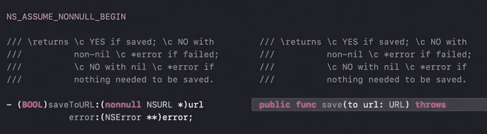
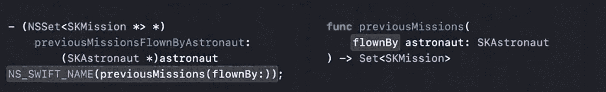

# 完善 Swift 的目标-C 框架

> 原文：<https://levelup.gitconnected.com/refine-objective-c-frameworks-for-swift-keynote-2d72ccbef7eb>

Objective-C 将逐渐被 Swift 取代。在此之前，有很多机会来提升您的 Objective-C 代码以支持 Swift。本文是 WWDC 为 Swift 提炼 Objective-C 框架的主题演讲。

# 摘要

```
**1\. Provide richer type information
**  1.1\. Describe nullability to control optionals
  1.2\. Nullability mistakes**2\. Follow Objective-C conventions
**  2.1\. Use Objective-C generics for Foundation types
  2.2\. Use Int for numbers
  2.3\. Strengthen stringly-typed constants
  2.4\. Specify initializer behavior
  2.5\. Follow the error handling convention**3\. Address missing APIs
  3.1\. Fix missing APIs****4\. Improve ergonomics in Swift
  4.1\.** Improve naming
  **4.2.** Improve error code enums
```

# 提供更丰富的类型信息

## **描述控制选项的可空性**

下图描述了没有可空性注释的默认生成行为。


通过添加可空性，使我们的代码更健壮，风格更敏捷。


常量、全局函数和块可以使用下划线限定符(_Nonnull/_Nullable)，并使其在 Swift 中成为可选或非可选的。


## **可空性错误**

如果您在 Objc 端使用 NSString 或 NSArray，当 Objc 为 Swift 认为不是可选的值返回 nil 时，非 null 注释是错误的。您将最终得到一个无效的对象，并且很难被注意到，因为 Objc 方法调用忽略 nil，但是在某些情况下，您将由于空指针取消引用而崩溃或者得到其他意外的行为。

编译器不保证会发生什么。因此，切换到发布模式或更改 Xcode 版本可以改变这种错误的症状。Swift 相信什么 Objc 头那个东西不能是 nil，Swift 不强制-解包，所以你不会在它返回 nil 的地方看到崩溃。

Objective-C 编译器和 clang 静态分析器来帮忙了，它会检查可空性注释并给你一些警告。


假设您看到一些警告或分析器结果，但不能确定它们是否真的会发生。您可以使用 **null_unspecified** ，这使得 Swift 将值作为隐式展开的可选值导入。如果您不确定 API 是否会返回 nil，请使用 null_unspecified，以防以后出现一些看似不可能的错误行为。


# 遵循目标 C 约定

## 对基础类型使用 Objective-C 泛型


指定集合元素的类型会让你编码更快捷。


## 对数字使用 Int


计数可以是负数，它以 NSUInteger 的形式返回，这意味着在 Swift 中它返回一个 UInt。这意味着这个函数打破了 Swift 的惯例。

在 Objc 和 Swift 中，当一个整数表示一组位时，通常使用无符号类型，并且您希望对这些位执行按位操作或进行其他一些算术运算。NSUInteger 的大小因架构而异，所以人们很少以这种方式使用它。

在 Objc 中使用 NSInteger 的原因是为了表明一个数字的值决不会是负数。Objective-C 通过自动转换和小心溢出行为实现了这种风格。这个特性会导致严重的安全漏洞，所以 Swift 没有包括它们。相反，如果您想要有符号运算，Swift 要求您显式地将无符号类型转换为有符号类型，如果无符号运算会产生负结果，则停止执行。传统的 Swift 风格是对从不为负的值使用 Int。


## 加强字符串类型的常量


使用 typedef 将常量组合在一起，并更改所有涉及常量的位置以使用该常量。typedef 在 Swift 中作为 typealias 导入。这只是开始的一步。


在 typedef 后添加 NS_STRING_ENUM 宏。它现在作为一个结构导入，常量嵌套在其中，看起来和感觉起来就像一个带有原始字符串值的枚举。重要的是，这意味着阶段计数函数不再接受增加健壮性的任意字符串。


## 指定初始值设定项行为


问题:

*   Swift 会让你覆盖它们，这似乎有点不必要
*   方法 init()是由编译器基于 NSObject 自动生成的

**指定初始化器约定**

使用 NS _ DESIGNATED _ INITIALIZER 使你的类成为子类。你可以看看实现文件，看看在重构的时候，你的类中指定的带有[super init]注释的初始化器，


使用关键字 NS_UNAVAILABLE 显式标记 init()方法不可用相当于不继承它们，如果您不覆盖指定的初始化器，Swift 会自动这样做。


## 遵循错误处理惯例



许多开发人员误解了错误处理约定。他们认为，如果一个方法想要发出失败信号，它必须返回 false 并将错误设置为非零值。一个错误的返回和错误是零不是失败。

错误处理惯例是，如果一个方法返回一个假值，那就是失败，即使错误值为零。


Swift 不允许抛出 nil，所以如果没有错误，Swift 抛出一个非公共的 Foundation 错误类型，Foundation。_GenericObjcError.nilError。如果您发现日志消息容器这种错误类型，这意味着一些 Objc 代码要么即使没有失败也返回 false，要么失败了但没有告诉您原因。


使用 NS _ SWIFT _ NOTHROW 告诉 SWIFT 你没有遵循约定，手动编写自己的错误处理代码。此外，您可以将此函数标记为不推荐使用，并编写一个更好的替代函数。


遵循错误处理约定的更好的替代方法是添加一个布尔输出参数来表示文件是否被保存。


**雨燕版**


通过添加关键字:NS_REFINED_FOR_SWIFT，使 Swift 包装功能仅在 Swift 上可见。所以 Objective-C 开发者看不到包装器函数，也就是 save(to:wasDirty:)。调用签名将通过添加两个下划线来更改。


# 解决缺失的 API

## 修复缺失的 API


第四个宏被抛弃了。为什么？

同一个宏在不同的地方使用时可能意味着不同的事情，Swift 没有办法弄清楚一个宏应该如何使用。Swift 确实能识别与某些常用于声明常量的模式相匹配的宏。当它看到其中一个时，它会将其作为 Swift 常量导入。如果该宏替换了另一个宏，那么它会将一个字符串文字连接到该宏。Swift 没有完全理解宏替换如何与其他 Objc 特性交互，所以跳过了它。

第四个宏应该如下图所示进行重构。


# 改进 Swift 的人体工程学

> Swift 的方法命名约定与 Objc 略有不同。Swift 名称往往比较短，并且省略了类型中显而易见的信息。在 Swift 中，每个方法都有一个基本名称，默认情况下，每个参数都有一个标签。Objc 选择器本质上只有参数标签，没有单独的基本名称，所以基本名称包含在第一个参数标签中。


Objc 函数由编译器自动拆分，结果通常很好，但您可以通过添加 NS_SWIFT_NAME 对其进行定制。



NS_SWIFT_NAME 不只是针对方法。它几乎可以应用于任何东西。例如，重命名枚举。


如果你有一个 SKFuel 类并且有 SKFuelKind 枚举。可以改成 SKFuel。善良，这可能就是你所说的 Swift


NS_SWIFT_NAME 也可以与全局常量、变量和函数一起使用。例如，重命名功能。


通过指定类型的 Objc 名称，后跟一个点，以及静态方法的名称，可以将全局函数转换为静态方法。


您可以通过将其中一个参数标签更改为“self”来将其转换为实例方法。


您可以通过在方法前面加上“getter:”来将方法转换成属性。


## 改进错误代码枚举


在为 SKErrorCode 生成的接口中没有明显的问题迹象。只有当您看到 SKErrorCode 将如何使用时，您才意识到还有改进的空间。记住，真正重要的是当你的客户试图使用它时，他们会写什么样的调用。


您可以使用 NS_ERROR_ENUM 来增强使用网站的体验。


编译器自动合成 SKError 代码。


现在，您可以很好地处理错误了。


感谢阅读😄祝你今天愉快。