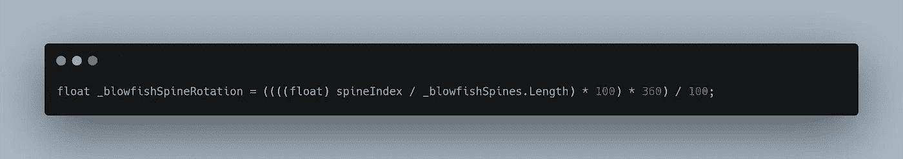
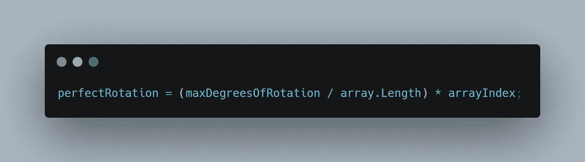

# 改进和压力测试我的点火算法

> 原文：<https://levelup.gitconnected.com/refining-and-stress-testing-my-firing-algorithm-a5bbc2e02321>

在我的上一篇文章中，我创建了一个发射机制，它接收指定数量的射弹，并围绕 360 度旋转均匀地实例化它们。我写这篇文章的**目标**是真的试驾一下！

更多关于数学是如何工作的。[https://level up . git connected . com/creating-new-enemy-types-the-porcupine-blowfish-part-3-fireing-projections-in-perfect-rotation-e1a 1755093 B4](/creating-new-enemy-types-the-porcupine-blowfish-part-3-firing-projectiles-in-perfect-rotation-e1a1755093b4)

虽然上面的代码运行得很好，但我在我的更短更精简的版本上遇到了输出问题。我失去了 360 度旋转的一个百分比，在发射圈的末端有一个明显的缺口。在我妻子捣鼓了一些高级数字来测试我的算法*(谢谢！！！)*，她向我保证这是可行的，所以我这边在 Visual Studio 中肯定发生了什么事情。

算法*将* **整数**数值*(整数)*相除，所以我*将这些数值作为**浮点**数值进行转换，以保持小数点后的*小数*数值，这一点非常重要。我的旋转*变量*是一个**浮点**值，我需要这些值来**匹配**。我以为我把值正确地转换成了一个浮点数*，但是经过进一步的检查……我在括号的错误一侧输入了浮点数。用户错误！最后，某处的余数被舍入到最接近的整数，我丢失了确保正确旋转所需的数据。

在正确地*转换*后，我的**浮点**值保留所需的十进制值以获得正确的旋转，我发现压缩算法工作得非常好！

这里是**最终算法**，带有描述性变量名。请随意在您的游戏中尝试，并让我知道它是如何工作的！

我不满足于停留在那里，所以我决定修补一下，看看这个东西能做什么！我喂它的*弹丸越多，*旋转的角度就会越小。我从来没有测试过超过 60 度的东西，所以我决定在实例化一个大于我的最大旋转角度*(360)**的投射量时，看看这个转换是否成立。***

俗话说，*“不做大就回家”*。首先，每当我按下*空格键*时，我会发射 431 到 753 之间的*随机数量的炮弹。*

投射实例化之前的延迟不是视频捕获错误。这是我的笔记本电脑暂时挂起，而 for 循环遍历数百个独立的抛射体旋转。

好吧，让我们退后一点，看看滞后在哪里下降。

让我们试试 200 到 300 发炮弹。感觉很光滑，我决定真的让独角鲸拥有它！

警告:接下来的两个视频有点花哨，我不确定这是否会引发癫痫或其他不良反应。

当我准备开心的时候，感觉还是有点滞后。让我们看看 100-200 的范围是什么样的。

这款手机感觉很流畅，处理数字时没有任何障碍。

让我们把它拨回给我出问题的原始设置。

我看不错！危险，但坚实的旋转。

我将在实际游戏中使用这些值。这样，发射的炮弹不会超过 8 枚。这些值也可以序列化为变量，设计者可以根据难度进行调整。

下面是更合理的攻击。

现在我的压力测试已经完成，我想测试最大旋转角度。到目前为止我只把 360 作为一个值。例如，如果我将该值更改为 180，会发生什么？让我们找出答案。我引入一个*局部* **浮动** *变量*称为 **maxDegreesOfRotation** 并*赋予*一个 180 的值。然后*将新变量*插入到*等式*中原来是 360°的地方。

如你所见，它确实可以工作，但是看起来不对称。最终的抛射体没有完美地向下移动*，所以我需要算法中的额外步骤来使这个 180°值对称。*

**

*如果你想把它转到另一个方向发射呢？只是在算法的末尾加一个值。这里我给每个抛射体加了 90 度。*

**

*现在整波射弹向下发射而不是向侧面发射！*

**

*嗯，我很乐意继续下一步，完成这个新的敌人类型。感谢阅读！*