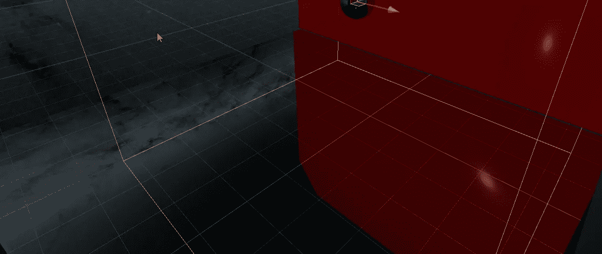
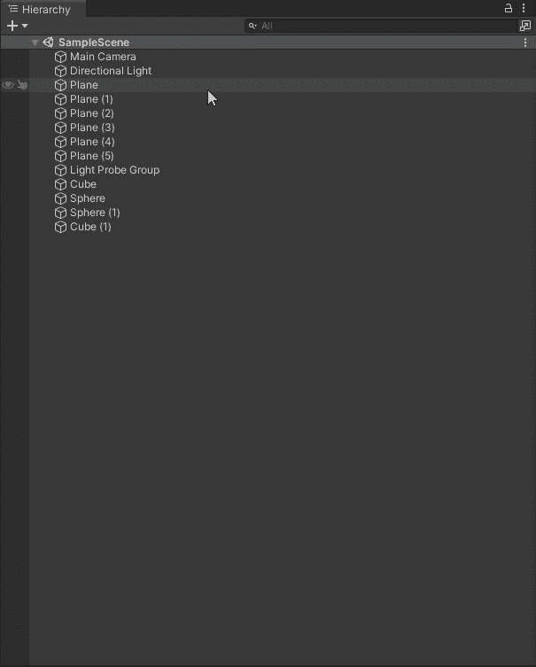
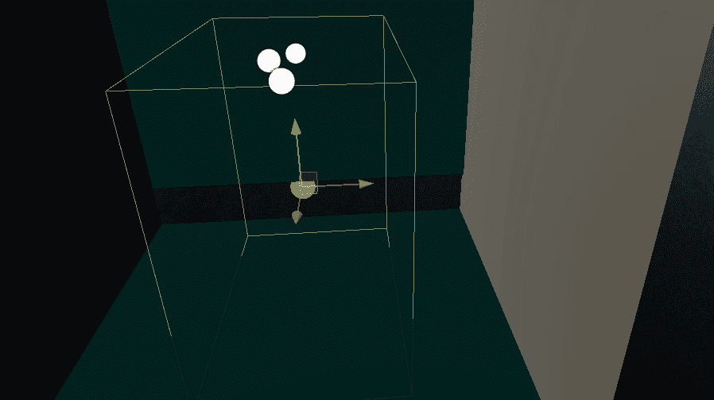
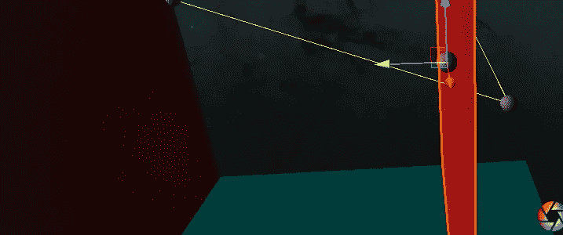
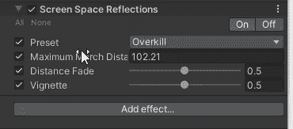

# Unity 中的反射探头与屏幕空间反射

> 原文：<https://levelup.gitconnected.com/reflection-probes-vs-screen-space-reflections-in-unity-a024b006eb4d>

反射探针

反射是我们可以用来赋予游戏更多生命的另一个工具。Unity 为我们提供了几种实现反射的方法，今天我们来看看其中的两种，反射探头和屏幕空间反射(后期处理)。

# 反射探针

首先让我们看一下**反射探头。**与我们几天前看到的光探头非常相似，反射探头比屏幕空间反射对性能的影响要小。这些探针确定反射是什么，并将它们应用到预定义的区域。

添加一个就像添加任何其他游戏对象一样简单。在 Unity 2021 中，执行以下操作。

1.  在层次中右键单击。
2.  光>反射探针

仅此而已。一个探针现在被添加到我们的游戏中，并准备设置。

值得注意的是，反射探测器只在它的边界内创建反射，这意味着您需要将它们放置在您希望发生反射的任何地方。

接下来，我们将查看并调整我们的探针，以便我们可以看到结果。我们的示例场景只是一对带有光探头的平面。我们的新反射探测器将根据光照图数据将光线反射到平面上。

反射探针的样本

在上图中，我们调整了探针的边界；当我们这样做时，光开始从表面反射。反射探头是固定反射。所以无论我们从哪个角度看它们，它们都保持不变。

## 屏幕空间反射

我们正在研究的第二种类型的反射需要更多的时间来建立。**屏幕空间反射**不像反射探针那样是游戏对象。相反，它们是后处理卷的一部分。

屏幕空间反射提供了更好的反射，但性能成本更高。下图显示了右边的红墙如何反射到左边的黑墙上。

屏幕空间反射

一个屏幕空间反射需要几样东西才能工作。

1.  后处理需要添加到您的程序中。您可以在 Unity 软件包管理器中找到它。
2.  呈现类型需要设置为延迟；我们可以在**中编辑>项目设置>图形**

一旦这两件事都做好了，你就可以给后处理器添加一个**屏幕空间反射**。

屏幕空间反射检查器。

屏幕空间反射更加耗费资源。同样重要的是要注意，屏幕空间反射提供了比光探头更好的反射，并适用于整个游戏，不像反射探头。

屏幕空间反射在起作用

## **结论**

选择正确的反射类型取决于您的目标平台和设计意图。在手机游戏中添加反射探针可能没问题，而在 PC 或游戏机上使用屏幕空间反射可能会更好看。

**更多阅读**

 [## 屏幕空间反射

### 屏幕空间反射(SSR)覆盖是一个高清晰度渲染管道(HDRP)功能，它使用深度和…

docs.unity3d.com](https://docs.unity3d.com/Packages/com.unity.render-pipelines.high-definition@11.0/manual/Override-Screen-Space-Reflection.html?q=screenspace)  [## 屏幕空间反射

### 屏幕空间反射效果创建模拟潮湿地板表面或水坑的细微反射。它反映了…

docs.unity3d.com](https://docs.unity3d.com/Packages/com.unity.postprocessing@3.1/manual/Screen-Space-Reflections.html)  [## 反射探针

### 切换到脚本反射探头很像一个捕捉其周围所有环境的球形视图…

docs.unity3d.com](https://docs.unity3d.com/2021.1/Documentation/Manual/class-ReflectionProbe.html)