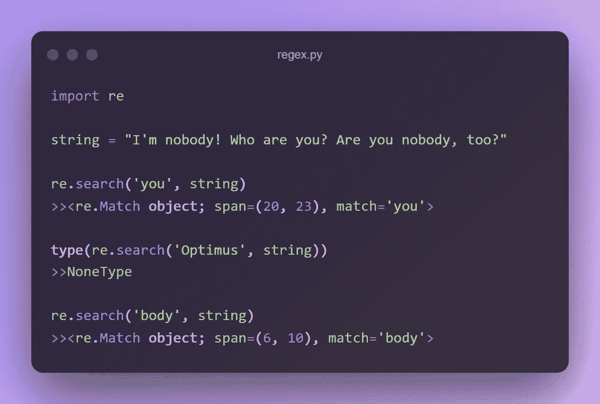
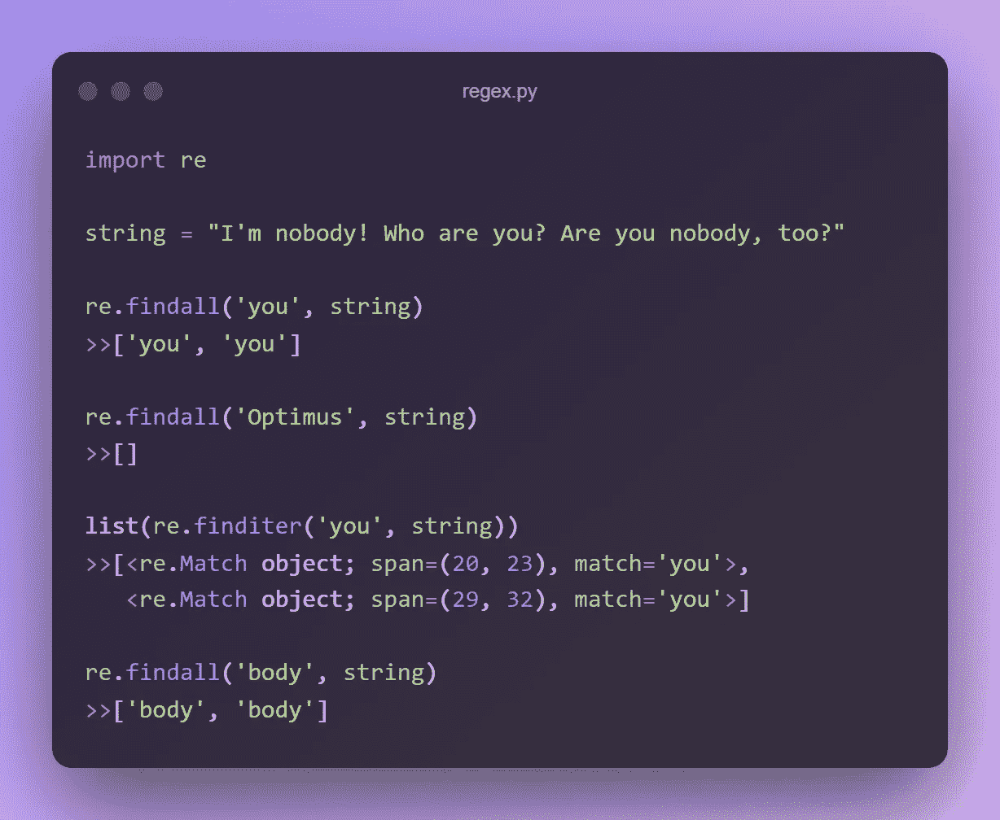
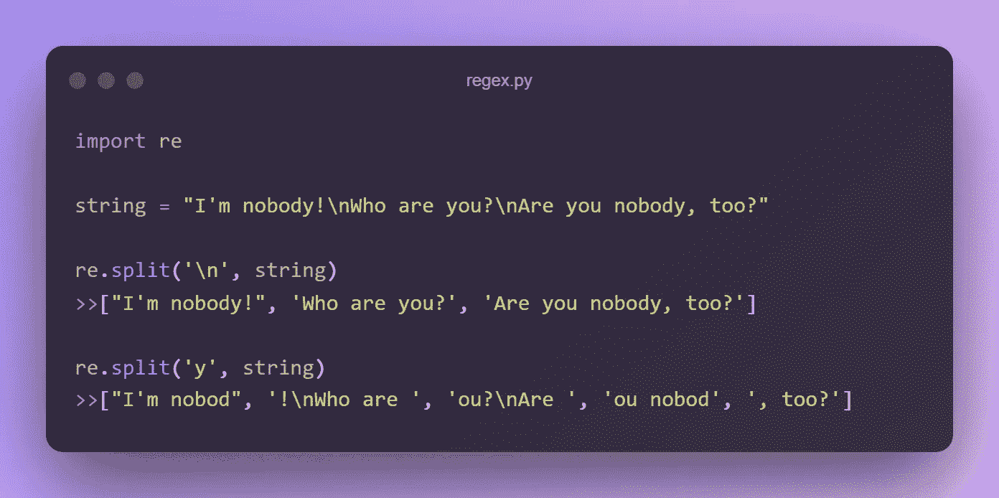
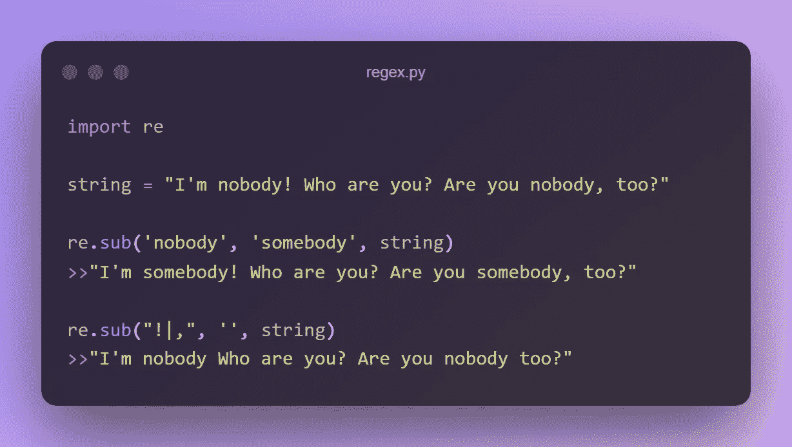
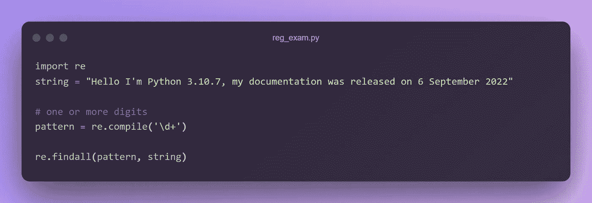
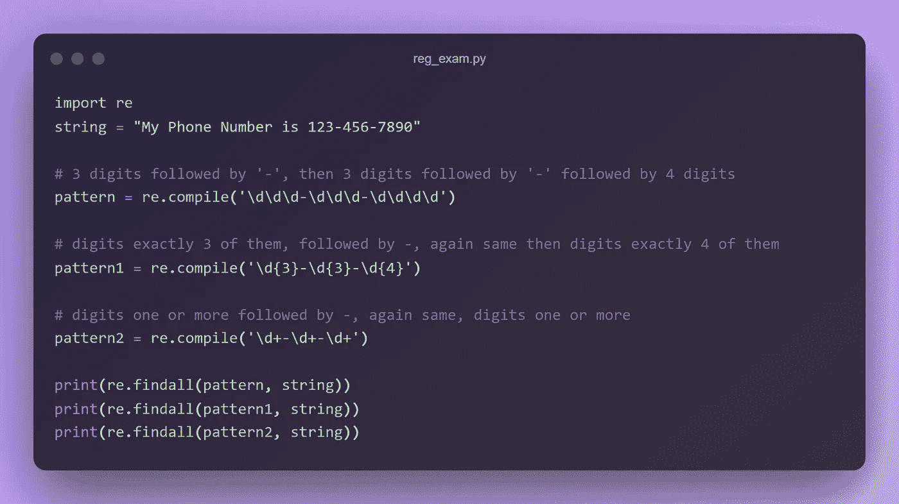
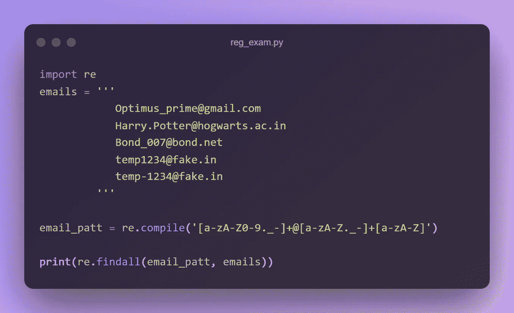

# 正则表达式——你唯一需要记住的表达式！

> 原文：<https://levelup.gitconnected.com/regex-the-only-ex-you-need-to-remember-5eb5e5e04af5>


**作者图片**

正则表达式(RegEx)是处理文本和数据的非常强大的工具。从搜索引擎到文本编辑器，再到编程语言，它们被广泛应用于各种应用中。在 Python 中，正则表达式可以通过内置的`***re***` 模块获得。

该模块提供了许多用于处理正则表达式的**函数**和**类**。当与 NLP 管道结合时，它成为从文本中提取**特征、字符串替换、**和其他**字符串操作**的强大资产。在这里阅读官方文件[](https://docs.python.org/3/howto/regex.html)**。**

**这篇博文将解释正则表达式的基础知识以及如何在 Python 中使用它们。阅读完本文后，您将能够使用正则表达式来解决各种现实世界的问题。**

# **正则表达式中的函数**

**`**re**`模块提供了一系列函数，允许我们在字符串中搜索我们定义的模式，但是这里只包含最常用的函数。**

```
**re.search(*pattern*, *string*):** Searches the string for a match, returns only the first occurrence of the match if there is a match None otherwise.**re.findall(*****pattern*, *string*****):**
Return a list of all non-overlapping matches in the string else None if no position in the string matches the pattern.**re.split(*pattern*, *string*):** It returns a list where the string has been split at each match.**re.sub(*pattern*, *replacement*, *string*):** This replaces the matches with the text of your choice.
```

## ****1。重新搜索(*模式*，*字符串* )****

**它将寻找第一次出现的**模式/正则表达式**，并返回一个**匹配对象**，否则，它返回 **"null"** 。它将验证目标字符串的所有行。**

****

****搜索:作者图片****

## **2.re.findall(模式，字符串)**

**该函数用于寻找 **"all"** 循环遍历目标字符串所有行的模式的可能非重叠外观。**

****

****re.findall:作者图片****

## ****3。re.split( *模式*、*字符串、*、** maxsplit **)****

**这个函数**按照 regex 模式的出现次数分割字符串**，从而返回一个包含**结果子字符串**的列表。Maxplit 定义了您想要执行的分割数量。**

****

****重新分割:作者图片****

## **4.re.sub(模式、复制、字符串)**

**该函数在字符串中搜索模式，并用替换符`**repl**`替换匹配的字符串。**

****

****回复:作者图片****

# **正则表达式中的元字符**

**元字符是具有特殊含义的字符。元字符本身不匹配。相反，它们表明了一些规则。这些是我们将在这里讨论的元字符👇**

```
**1\. []** - A set of characters class you wish to match. You can also specify a range of characters using **-** inside square brackets. **- [abc]** This will match(single character) any of the characters a, b or c this is the same as **[a-c]**. **- [1-4]** is the same as **[1234]****.** **Note:** *You can match the characters not listed within the class by complementing the set using* ***^*** *as the first character of the class.* **- [^5]** will match any character except **'5'**. **- [5^]** will match either a **'5' or a '^'**.**2\.** **\** - Signals a special sequence (can also be used to escape special characters). the backslash can be followed by various characters to signal various special sequences. It’s also used to escape all the metacharacters so you can still match them in patterns.**3\.** **.** - Any character (except newline character).**4\.** **^** - Starts with / matches the beginning of line.**5\.** **$** - Ends with / matches the end of line.**6\.** ***** - Zero or more occurrences of the pattern to its left(>=0).**7\.** **+** - One or more occurrences of the pattern to its left(>=0).**8\.** **?** - Zero or one occurrences of the pattern to its left (0>= & <=1).**9\.** **{}** - Exactly the specified number of occurrences.**10\.** **|** - Either or.**11\. ()** - To group sub-patterns.
```

## **贪婪模式:**

**在 python 正则表达式中，量词以贪婪模式工作。这意味着量词将尽可能地匹配它们前面的元素。首先，搜索找到模式最左边的匹配，其次，它试图用尽尽可能多的字符串，即 **+** 和 ***** 尽可能远。**

**`'*****'`、`**'+**'`、`'**?**'`限定符都是*贪心*；它们匹配尽可能多的文本。有时这种行为是不可取的；如果 RE `**<.*>**`与`'**<a> b <c>**'`匹配，它将匹配整个字符串，而不仅仅是`**'<a>'**`。在限定符后添加`**?**`使其以 ***非贪婪*** 或 ***最小*** 方式进行匹配；因为将匹配尽可能少的字符。使用正则表达式`**<.*?>**`将只匹配`'**<a>'**`。**

# **正则表达式中的特殊序列**

**正则表达式的强大之处在于它们可以指定模式，而不仅仅是固定的字符。以下是匹配单个字符的最基本模式。**

```
**\d** - Matches any decimal digit; this is equivalent to the class **[0-9]**.**\D** - Matches any non-digit character; this is equivalent to the class **[^0-9]**.**\w** - Matches any alphanumeric character; this is equivalent to the class **[a-zA-Z0-9_]**.**\W -** Matches any non-alphanumeric character; this is equivalent to the class **[^a-zA-Z0-9_]**.**\s -** Matches any whitespace character; this is equivalent to the class **[\t\n\r\f\v]**.**\S -** Matches any non-whitespace character; this is equivalent to the class **[^ \t\n\r\f\v]**.**\Z -** Returns a match if the specified characters are at the end of the string.
```

**正则表达式可以串联起来形成新的正则表达式；如果 ***A*** 和 ***B*** 都是正则表达式，那么 ***AB*** 也是正则表达式。一般情况下，如果一串 *p* 匹配 ***A*** 而另一串 *q* 匹配 ***B*** ，则该串 *pq* 会匹配 **AB** 。**

**让我们通过一些例子来测试我们的概念:**

## **1.从文本中抓取数字**

****

****示例:作者图片****

**它生成以下输出👇**

```
**['3', '10', '7', '6', '2022']**
```

## **2.抓取电话号码(美国国内格式 XXX-XXX-XXXX)**

****

****示例:作者图片****

**这三种方法返回相同的输出，但是您认为哪种方法是三种方法中最好的呢？当你知道你在寻找什么的时候，最好的做法是定义完全相同的模式，这样你就可以更好地控制它。在这里，**模式&模式 1** 比**模式 2** 给你更多的控制，因为由于它贪婪的本性，它可以获取比 3 更多的数字。**

```
**['123-456-7890']
['123-456-7890']
['123-456-7890']**
```

**这就是正则表达式的美妙之处，做一件事有很多方法。你只需要想想🧠！！！**

## **3.从文本中抓取电子邮件**

**让我们在这里生成一些真正真实的电子邮件👻**

```
**Optimus_prime@gmail.com
Harry.Potter@hogwarts.ac.in
Bond_007@bond.net
temp1234@fake.in
temp-1234@fake.in**
```

**我们的直觉会是👉一些字符(一个或多个)，接着是 **@** 然后是一些域，&我们最终会生成这样的东西👇**

```
**‘****\w+@\w+.\w+’**
```

**这能行吗？如上所述，`**\w**`抓取字母数字字符，因此它将无法检测任何`**‘-’**` 或`‘**.’**`**

```
**['Optimus_prime@gmail.com', 
 'Potter@hogwarts.ac', 
 'Bond_007@bond.net', 
 'temp1234@fake.in', 
 '1234@fake.in']**
```

**因此，让我们定制我们的模式，以便它获取完整的电子邮件地址**

****

****示例:作者图片****

**现在我们得到以下结果:**

```
**['Optimus_prime@gmail.com', 'Harry.Potter@hogwarts.ac.in', 'Bond_007@bond.net', 'temp1234@fake.in', 'temp-1234@fake.in']**
```

**这些是在处理 NLP 问题时非常基本但非常常用的概念。为了找到一个模式，可以有多个正则表达式，还有更多。我们只是触及了它的表面。**

**您可以在这里查看 RegEx 存储库，我将在这里用更多的例子更新笔记本。**

**恭喜👏！！！现在我们知道了一些关于正则表达式的东西&我希望这个表达式会非常有用😝。**

**我将尝试提出更多的机器学习/数据科学概念，并将尝试将听起来花哨的术语和概念分解成更简单的术语和概念。**

**我希望你喜欢这篇文章！您可以**关注我** [Afaque Umer](https://medium.com/u/430bc504f9d9?source=post_page-----ffbeb5f76a92--------------------------------) 获取更多**此类文章。****

## **感谢阅读🙏**

## **继续学习🧠继续分享🤝保持敬畏🤘**