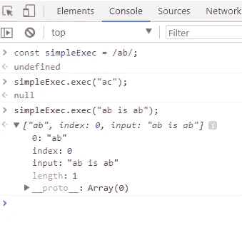
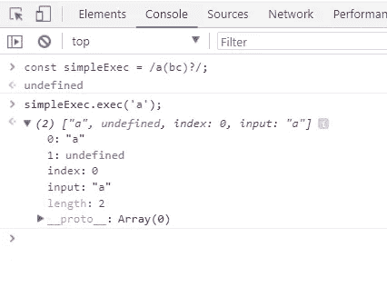
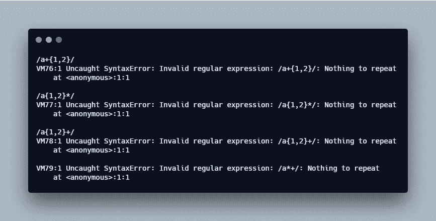

# JavaScript 中的正则表达式

> 原文：<https://levelup.gitconnected.com/regular-expression-in-javascript-2da9320bef67>

## RegEx 概述和如何为初学者编写表达式的技巧


安妮·斯普拉特在 [Unsplash](https://unsplash.com/search/photos/coffee?utm_source=unsplash&utm_medium=referral&utm_content=creditCopyText) 上拍摄的照片

在本文中，我将解释什么是正则表达式的基本原理，创建简单表达式的基本规则，以及根据我的经验得到的一些通用提示。因此，你可以创建自己的网站，而不需要通过谷歌搜索。

像大多数开发人员一样，每当我有一个可以通过简单的正则表达式完成的任务时，我就会开始在 Google 上搜索符合我需要的模式。然后随着项目的发展，验证需要更新，我以前的模式不再有效。我需要再搜索一遍，花很多时间才能找到合适的。

这个周期让我意识到我需要自己掌握这些，这样我就可以生成自己的正则表达式，而不需要谷歌的帮助。

*更多类似的内容，请查看*[https://betterfullstack.com](https://betterfullstack.com/stories/)

## 什么是正则表达式

正则表达式只是描述字符串数据模式的一种方式。

## 如何创建新的

创建正则表达式有两种方法:

1.  使用 RegExp 构造函数:`const sample = new RegExp('sample');`
2.  通过用正斜杠(`/`)字符:`const sample = /sample/;`将模式括起来，写成一个文字值

注意:

1.  一些字符，比如问号`?`和加号`+`在正则表达式中有特殊含义，如果你想直接匹配字符，必须在前面加一个反斜杠``` 。反斜杠对字符进行转义。示例:`const sample = /sample\+/;`
2.  正则表达式是一种对象类型`typeof sample // "object"`。
3.  正则表达式由非特殊字符组成。

## 如何使用正则表达式

使用`test()`测试字符串:`sample.test("sample project");`

这个方法将返回一个`boolean`值，让您知道字符串是否匹配表达式的模式。

另一个函数是`exec()`方法。如果没有找到匹配项，它将**返回** `null` **，否则**返回一个带有匹配项信息的对象**。**



exec 示例

这里是我在使用`exec`和分组以及问号时注意到的奇怪的事情。如果没有完全匹配，它将返回`undefined`。



未定义的值

## 规则组

当有些字母跟在反斜杠后面时，它们有不同的意思。

```
\d        Any digit character                            
\w        An alphanumeric character (“word character”)
\s        Any white space character (space, tab, newline)
\D        A character that is not a digit                          \W        A non alphanumeric character
\S        A non white space character
.         Any character except for newline
```

**需要记住的提示:**

`d`为数字的数字字符。`w`用于任何字母数字字符。`s`为空白字符。大写字符与数字、单词和空格的相反，它以相反的情况匹配。

**示例**

`const dateTime = /\d\d-\d\d-\d\d\d\d \d\d:\d\d/;`

注:`\w`包括字母数字(字母和数字)的 a - z 和 0 - 9。表示`/\w/.test("0")`返回`true`；

方括号 `[]`内的**有一些特殊字符有意义。**

```
-         Range of characters
^         Match any character except the ones in the set
```

**示例**

`const shouldHaveDigit = /[0123456789]/;`

`const notContainZero = /[^0]/;`

**注**

1.  使用`[]`时要小心，因为当一个字符串只有一个数字，其余都是像`shouldHaveDigit.test("ab2c")`这样的字母时，它将返回`true`。
2.  小心使用`^`,因为只有当字符串像`notContainZero.test("0")`一样为零时，它才会返回`false`。其余的像`notContainZero.test("01")`将返回`true`。

以上规则都是关于单个数字或字符的，那么**匹配一个字符或一个数字的整个序列**怎么样？

```
+         Repeated 1 -> n time
*         Repeated 0 -> n time
?         Optional. Nice to have
{}        Precise number of time
```

**示例**

我以`{}`为例，因为它很特别。我有时对此感到困惑，我认为其他开发人员可能会犯同样的错误。

`const atLeast4A = /a{1,4}/;`表示该元素必须至少出现一次，最多出现四次。`atLeast4A.test("abcdef")`和`atLeast4A.test("abcdabcdabcd")`返回`true`。

`const atLeast4A = /a{2,4}/;`这意味着元素必须至少出现两次，最多出现四次，并且在字符串中必须有`aa`。`atLeast4A.test("abcdabcdabcd")`返回`false`，同时`atLeast4A.test("abcdaabcdabcd")`返回`true`。

`const atLeast4A = /a{4,}/;`表示四次以上，字符串中必须有`aaaa`。`atLeast4A.test("ababababab")`返回`false`。但是`atLeast4A.test("aaaab")`返回`true`。

**注**

1.  您不能将`+`、`*`和`{}`放在一起。导致错误`Nothing to repeat`。



没有要重复的错误

使用圆括号和像`+`和`*`到**这样的操作符一次匹配多个元素**。

**示例**

`const appleTree = /(ap+le tree)+\s+/;`

第一个和第三个`+`字符分别仅适用于`p`和`\s`。第二个`+`适用于整个组`(ap+le tree)`，匹配一个或多个这样的序列。

**图案本身能有边界吗**

是的，我们可以添加标记`^`和`$`。插入符号匹配输入字符串的开头，而美元符号匹配结尾。

**示例**

`const onlyabc = /^abc$/;`仅与`"abc"`字符串完全匹配，这与当字符串中的任意位置包含`abc`时`/abc/`将返回`true`不同。

**注**

1.  使用不带方括号的`/^abc/`意味着它匹配任何以`abc`开头的字符串。
2.  使用`\b`作为`\w`图形的边界。例如:`/\bsample\b/`返回`true`只针对`sample`。

## 竖线字符|

管道字符`(|)`表示选择其左边的模式还是右边的模式

**例子**

`const bio = /\bI am (Java|Javascript|Php) developer\b;/`

## 练习题—验证电话号码

验证电话号码遵循格式**安-NNN-NNNN** ，其中 A 介于 2 和 9 之间，N 介于 0 和 9 之间。

我们将一步一步地创造它。

1.  首先初始化一个正则表达式文字`//`
2.  我们想要匹配整个字符串，所以我们将使用边界字符`/^$/`
3.  第一个元素的范围从 2 到 9。`/^[2-9]$/`
4.  n 应该是 0 到 9 之间的数字。`/^([2-9]\d{2})-\d{3}-\d{4}$/`

## 练习题—验证电子邮件

按照格式**_._@companyname.com.my**验证公司电子邮件，其中“_”仅由字母数字组成。“公司名称”应为“公司 a”、“公司 b”

下面是做这件事的步骤

1.  初始化`//`
2.  添加边界`/^$/`
3.  “_”是字母和数字，产生`/^\w.\w$/`
4.  加上`+`是因为`\w`之后，它可能不止一个。`/^\w+.\w+$/`
5.  “公司名称”只能与“公司 a”和“公司 a”一起使用。所以我们使用管道字符。`/^\w+.\w+@(companya|companyb).com.my$/`。

## 摘要

理解正则表达式是开发人员生存的关键。不如自己写 RegExp，充分理解它的作用。

我希望这篇文章对你有用！可以跟着我上[媒](https://medium.com/@transonhoang)。我也在推特上。欢迎在下面的评论中留下任何问题。我很乐意帮忙！

## 资源/参考资料

[1]:正则表达式[https://developer . Mozilla . org/en-US/docs/Web/JavaScript/Guide/Regular _ Expressions](https://developer.mozilla.org/en-US/docs/Web/JavaScript/Guide/Regular_Expressions)

[2]:第 9 章——本书雄辩的 JavaScript[https://eloquentjavascript.net/09_regexp.html](https://eloquentjavascript.net/09_regexp.html)

[3]:正则表达式库 http://regexlib.com/Search.aspx?k=phone

[](https://gitconnected.com/learn/javascript) [## 学习 JavaScript -最佳 JavaScript 教程(2019) | gitconnected

### JavaScript 是世界上最流行的编程语言之一——它随处可见。JavaScript 是一种…

gitconnected.com](https://gitconnected.com/learn/javascript) [](https://betterfullstack.com/stories/) [## 故事-更好的全栈

### 所有的故事故事为我们写指南提交故事到更好的编程博客 1。故事指南避免什么…

betterfullstack.com](https://betterfullstack.com/stories/)