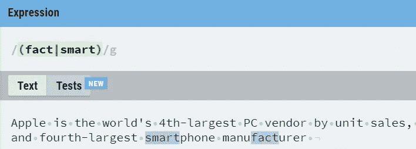

# 正则表达式

> 原文：<https://levelup.gitconnected.com/regular-expressions-22bbd24ac439>

## 处理 RE 时你需要的基本知识


照片由 [XPS](https://unsplash.com/@xps?utm_source=unsplash&utm_medium=referral&utm_content=creditCopyText) 在 [Unsplash](https://unsplash.com/?utm_source=unsplash&utm_medium=referral&utm_content=creditCopyText) 上拍摄

> ***正则表达式*** 是包含一系列字符的搜索模式。正则表达式对于通过搜索特定搜索模式的一个或多个匹配项从文本中提取信息非常有用。当我们使用正则表达式时，需要处理一些常见的事情。它们可以分类如下。

1.  ***基本模式***
2.  ***【操作员】***
3.  ***()符***
4.  ***人物类***
5.  ***否定***
6.  **^*和*美元**
7.  ***或*|**运算符
8.  ***运算符基础(*，+，？, .*)**
9.  ***数值范围***
10.  ***界限***

我用[***regexr.com***](https://regexr.com/)来练习正则表达式。你可以一个一个地练习，以获得如下关于 RE 的基本知识。

## 1.基本模式

它是最简单的正则表达式形式，即字符序列本身，用于匹配给定句子或段落中的字符序列。


带有全局标志，则只匹配给定的单词


带有不区分大小写标志的匹配词不区分大小写

## 2.[]操作员

方括号指定要匹配的字符的分离


匹配苹果或者苹果


匹配字母“x”或“y”或“z”


匹配任何数字

带 **[]** 的破折号 **(-)** 用于指定一个范围内的任意一个字符


将匹配一个位数

## 3.()运算符

它构造了一个分组结构来建立一个优先顺序，括号对于用竖线 **|** 字符对两个表达式进行 or 运算也很有用。



带有|运算符的()

## 4.字符类别

下表提到了对你处理 re 有用的基本字符类。

```
+---------------+----------------------------------------------+
| Metacharacter |                   Behavior                   |
+---------------+----------------------------------------------+
| **\d**            | Match any digit character [0-9]              |
| **\D **           | Match any non-digit character                |
| **\n**            | Match a new line                             |
| **\s**            | Match white spaces                           |
| **\S**            | Match non-white spaces                       |
| **\w**            | Match word characters (includes a-z and 0–9) |
| **\W **           | Match non-word characters                    |
|               |                                              |
+---------------+----------------------------------------------+
```


匹配任何数字字符[0–9]


匹配任何非数字字符


匹配空格


匹配非空格


匹配单词字符(包括 a-z 和 0–9)


匹配非单词字符

## 5.否认

如果 **^** 脱字符号是左方括号后的第一个符号，则指定求反操作。


^指定不是大写字母

## 6.^和美元

**^** 和 **$** 堪称正则表达式中最常见的锚点。 **^** 匹配一行的开始， **$** 匹配一行的结束。

此处示例匹配启用的多行标志。


^指定了句子的开头


$指定句子的结尾


^和$都被用来表示整个句子“苹果是世界第四大个人电脑供应商”

## 7.OR 运算符— |

**或**操作符允许我们指定不同的允许捕获组


匹配“第四大”和“第四大”

## 8.基于运算符(*、+、？, .)

***** ， **+** ，**？**和**。**是用来处理 re 的运算符。


它应该完全不存在字母“u”或“u”的存在


它应该有零个或多个字符“o”


它应该恰好出现一次或多次字符“o”


“h”和“oohh”应该零次或多次出现


在“r”和“n”之间可以有不同的字母，但只有一个字母

## 9.数值范围

用于使用**{低，高}** 指定数量范围

***{n，m}*** *—最小值为 n，最大值为 m*


最小值应该有 4 个数字，最大值应该有 6 个字母

***{n，}*** *—最小值为 n，最大值未定义*


最小值应为 4 位数，最大值未定义

## 10.边界

**\b** 匹配单词边界， **\B** 用于识别非单词边界


与“the”匹配，但不与单词“other”匹配


与作为非单词边界的“the”匹配，与单词“the”不匹配

好酷，伙计们🤗🤗🤗🤗

> 这是正则表达式文章的结尾，我希望你能抓住一些关于 RE 的重要事实。如果你喜欢这篇文章，并且有助于提高你对 RE 的认识，那就鼓掌吧。🙌

感谢您的阅读！！！😊