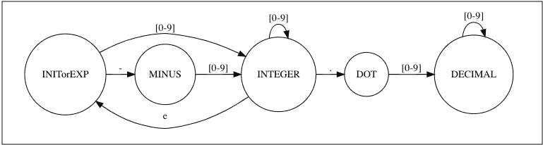

# 正则表达式和有效数字面试问题

> 原文：<https://levelup.gitconnected.com/regular-expressions-and-valid-numbers-e5757082d807>

正则表达式匹配为许多面试问题提供了快速有效的解决方案。在这篇短文中，我们将探讨正则表达式如何决定一个字符串是否代表一个有效的数字。

这个面试问题是 LinkedIn 问的。

# 问题:

给定一个字符串，返回它是否代表一个数字。以下是不同种类的数字:

*   “10”，一个正整数
*   “-10”，一个负整数
*   “10.1”，一个正实数
*   “-10.1”，一个负实数
*   “1e5”，科学记数法中的一个数

这里有一些非数字的例子:

*   " a "
*   " x 1 "
*   " a -2 "
*   “-”

# 解决方案:

像往常一样，让我们用几个例子来进一步阐明问题陈述:

1.  我们允许前导零吗，或者像“001”这样的模式有效吗？对于这个讨论，让我们假设它们是有效的。你的面试官应该给你一个满意的答复。
2.  同样，我们允许以“.”结尾的数字吗还是 e？例如像“10”这样的模式还是“10e”？对于这篇文章，让我们假设这些模式是不允许的。
3.  我们允许嵌套指数吗？即，是否允许类似“4e4e1”的模式？为了让事情变得有趣，让我们允许这些模式。在本例中，“4e4e1”等于 4⁴^ = 256
4.  尽可能多的想出问题中的其他死角！一旦你确定了问题的范围，你就可以开始考虑算法了。

首先要注意的是，这个问题中的规则是局部的，并且一次依赖于输入字符串的几个连续字符。这里有一些规则，

1.  表达式必须以数字(0–9)或字母“-”开头。(我们假设零填充字符串如“001”是可以的)。
2.  模式开头只能包含一个“-”字符。
3.  一个模式只能包含一个“.”任何地方的角色。一个“.”后面从来没有“-”。(所以，“10.3–1”是不允许的)。
4.  一个模式可以包含任意数量的“e”字符。出现在任何“e”字符之后的后缀本身就是一个有效的模式。(例如，“4e4e1”是代表 44 = 256 的有效模式。它的后缀“4e1”和“1”本身就是有效的模式)。

一般来说，这种匹配规则可以通过一个 [*正则表达式匹配器*](https://en.wikipedia.org/wiki/Regular_expression) 轻松实现。实现正则表达式匹配器的最好方法之一是使用状态机。让我们通过为这个问题实现一个状态机来探索这个状态机！我们首先在*枚举:*中定义状态机的不同状态

这些状态中的每一个都有一个含义。我们将遍历输入字符串，同时在状态机的这些状态中移动(或*转换)*。这些状态的含义如下:

1.  *INIT:* 每个算法都在这个状态下开始。这个状态也对应于一个空字符串。
2.  *EXP:* 该状态表示输入中看到的最后一个字符是“e”。
3.  *减号:*这个状态表示输入中看到的最后一个字符是“-”。
4.  *点:*这个状态表示输入中看到的最后一个字符是“.”
5.  *INTEGER:* 表示输入的 *integer* 部分的状态(例如，当迭代一个类似“10.001”的输入时，前两个字符“10”表示 *INTEGER* 状态)。
6.  *DECIMAL:* 表示输入的*小数*部分的状态(例如，当迭代一个输入如“10.001”时，最后三个字符“001”表示*整数*状态)。

一旦我们定义了状态，我们必须发现当你迭代输入时，你如何在多个状态之间转换。以下是一些过渡规则:

1.  当你处于 *INIT* 或 *EXP* 状态时，遇到“-”字符，进入*减*状态。
2.  当你处于整数状态时，你会遇到一个“.”人物，转到*点*状态
3.  当你处于一个*点*的状态时，你又遇到了另一个“.”人物，那是个错误！有效数字中不能有两个连续的点。

等等…

这是可接受的字符串模式的完整状态图。图中的圆圈标有单独的状态。带标签的箭头是状态转换。任何缺失的箭头都表示有错误，或者字符串模式无效。(请注意，没有标有“.”的输出箭头)从*点*状态，从而拒绝类似“10 ..”的模式).

可接受模式的状态图

一旦有了状态图，将其翻译成代码就相当简单了。下面是方法， *Invalid()* ，它使用一个巨大的 *switch* 语句来执行图中的状态转换。唯一额外的事情是终止:当你用尽输入并以有效状态结束时，我们如何决定接受字符串？嗯，我们指定两种状态，*整数*和*小数*作为*最终状态。*当一个模式以这些状态中的任何一个结束时，你认为它是有效的，(即，以数字“10”、“10.1”等结束的模式。)，并拒绝以任何其他状态结束的模式(例如“10”)以*点结束)。*下面是算法的实现:

用巨型 switch-case 语句实现状态机的算法

# 测试:

这个问题有很多有趣的测试案例，你面试的一部分必须致力于找到尽可能多的案例。

以下是一些例子:

1.  上述问题陈述中的所有正面(有效)测试用例
2.  上述问题陈述中的所有负面(无效)测试用例
3.  空字符串
4.  以“e”或“.”等无效字母结尾的字符串
5.  带有前导零的字符串。
6.  类似“4e4e1”的嵌套指数字符串。(根据我们的假设，这是一个有效的字符串，代表 4⁴^ = 256)。

*最初发表于*[*【https://cppcodingzen.com】*](https://cppcodingzen.com/?p=3107)*。*