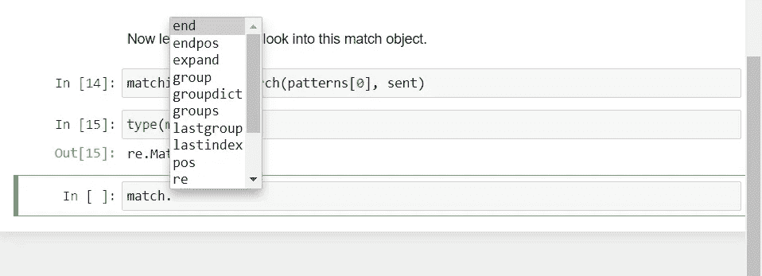

# Python 中的正则表达式

> 原文：<https://levelup.gitconnected.com/regular-expressions-in-python-60f4ee30d906>

## 在 Python 中高效轻松地实现正则表达式的指南。

正则表达式也称为 regex。它们是文本匹配模式，有正式的语法。将使用正则表达式 Python 模块“re”。

```
**>>> import** re
```

# 模式搜索

让我们从搜索文本中的模式开始。

```
>>> patterns **=** ['python', 'fun']>>> sent **=** 'This is a sentence which says python is easy'
```

要进行搜索，可以使用“re.search()”，其中第一个参数是要搜索的内容，第二个参数是从哪里搜索。

所以下面我们试着在“python 很有趣”中搜索“is”得到匹配。

```
>>> re.search('is', 'python is fun')
<re.Match object; span=(7, 9), match='is'>
```

利用这个我们将搜索模式。

```
**>>> for** pattern **in** patterns:
        print('Searching for "{}" in: \n"{}"'.format(pattern, sent)) **if** re.search(pattern,sent):
            print("\nPattern found\n")
        **else**:
            print("\nPattern not found\n")Searching for "python" in: 
"This is a sentence which says python is easy"Pattern foundSearching for "fun" in: 
"This is a sentence which says python is easy"Pattern not found
```

现在让我们仔细看看这个匹配对象。

```
>>> match **=** re.search(patterns[0], sent)>>> type(match)
re.Match
```

这个匹配对象有自己的方法可以调用。start()表示匹配开始的索引。end()告诉 index 匹配结束。



```
match.start()
30match.end()
36
```

# 剧烈的

```
>>> splitter **=** ','>>> text **=** 'Hey, is this your book, No'>>> re.split(splitter, text)
['Hey', ' is this your book', ' No']
```

# 查找模式的实例

传递的参数是要匹配的术语和文本。

```
>>> re.findall('python', 'python is fun and python is easy')
['python', 'python']
```

# 寻找特定的模式

使用元字符可以做到这一点。

后跟元字符*的模式重复了零次或多次。

后跟元字符+的模式必须至少出现一次。

使用？意味着模式出现零次或一次。

对于特定的出现次数，请在模式后使用{m}。m 是模式应该重复的次数。

使用{m，n}，其中 m 为最小值，n 为最大重复次数。({m，})表示该值至少出现 m 次，没有最大值。

```
**>>> def** re_find(patterns, phrase):
    '''
    Input: list of regex patterns
    Output: list of matches
    '''
        **for** pattern **in** patterns:
            print('Searching the phrase "{}"'.format(pattern))
            print(re.findall(pattern, phrase))
            print('\n')
```

# 重复

```
>>> txt **=** 'jdjd..jjjddd...jdddjddd...djdj...djjjjj...jdddd'
>>> patterns **=** ['jd*', 'jd+', 'jd?', 'jd{3}', 'jd{2,3}']
>>> re_find(patterns,txt)Searching the phrase "jd*"
['jd', 'jd', 'j', 'j', 'jddd', 'jddd', 'jddd', 'jd', 'j', 'j', 'j', 'j', 'j', 'j', 'jdddd'] Searching the phrase "jd+"
['jd', 'jd', 'jddd', 'jddd', 'jddd', 'jd', 'jdddd'] Searching the phrase "jd?"
['jd', 'jd', 'j', 'j', 'jd', 'jd', 'jd', 'jd', 'j', 'j', 'j', 'j', 'j', 'j', 'jd'] Searching the phrase "jd{3}"
['jddd', 'jddd', 'jddd', 'jddd'] Searching the phrase "jd{2,3}"
['jddd', 'jddd', 'jddd', 'jddd']
```

# 字符集

当我们想在某一点上匹配一组字符中的任何一个时，就使用它。括号用于构建这些字符集。

[ab]搜索 a 或 b 的出现。

```
>>> txt **=** 'jdjd..jjjddd...jdddjddd...djdj...djjjjj...jdddd'
>>> patterns **=** ['[jd]',
            'j[jd]+']  *# j followed by one or more j or d* >>> re_find(patterns,txt)Searching the phrase "[jd]"
['j', 'd', 'j', 'd', 'j', 'j', 'j', 'd', 'd', 'd', 'j', 'd', 'd', 'd', 'j', 'd', 'd', 'd', 'd', 'j', 'd', 'j', 'd', 'j', 'j', 'j', 'j', 'j', 'j', 'd', 'd', 'd', 'd']Searching the phrase "j[jd]+"
['jdjd', 'jjjddd', 'jdddjddd', 'jdj', 'jjjjj', 'jdddd']
```

# 排除

为了排除这些术语，我们在括号语法符号中使用^。

[^…]将匹配任何单个字符，不在括号中。

```
>>> txt **=** 'Hello! My name is liza, what is yours? Sir. '
```

检查不匹配的内容！。,?或者空间。加号用于检查匹配是否至少出现一次。这样我们可以去掉标点符号。

```
>>> re.findall('[^!,.? ]+', txt)
['Hello', 'My', 'name', 'is', 'liza', 'what', 'is', 'yours', 'Sir']
```

# 字符范围

它可以帮助您定义一个字符集，以包含从起点到终点之间的所有字符。

[b-j]将返回 b 和 j 之间任何字母实例的匹配。

```
>>> txt **=** 'Hey. I love coding in python. It is fun and easy.'
>>> patterns **=** ['[a-z]+', '[A-Z]+',
           '[a-zA-Z]+',    *# lower or upper case* '[A-Z][a-z]+']  *# one upper followed by lower case* >>> re_find(patterns, txt)Searching the phrase "[a-z]+"
['ey', 'love', 'coding', 'in', 'python', 't', 'is', 'fun', 'and', 'easy'] Searching the phrase "[A-Z]+"
['H', 'I', 'I'] Searching the phrase "[a-zA-Z]+"
['Hey', 'I', 'love', 'coding', 'in', 'python', 'It', 'is', 'fun', 'and', 'easy'] Searching the phrase "[A-Z][a-z]+"
['Hey', 'It']
```

# 转义码

它们用于在数据中寻找特定类型的模式。

\d —数字

\D —非数字

\s —空白(空格、制表符、换行符)

\S —非空白

\w —字母数字

\W —非字母数字

为了区分字符串转义字符和正则表达式转义字符，正则表达式转义字符前面有一个“r”。

```
>>> txt **=** 'Python is a #easy language and I am using it since 123 months'
>>> patterns **=** [r'\d+', r'\D+', r'\s+', r'\S+', r'\w+', r'\W+']
>>> re_find(patterns, txt)Searching the phrase "\d+"
['123'] Searching the phrase "\D+"
['Python is a #easy language and I am using it since ', ' months'] Searching the phrase "\s+"
[' ', ' ', ' ', ' ', ' ', ' ', ' ', ' ', ' ', ' ', ' ', ' '] Searching the phrase "\S+"
['Python', 'is', 'a', '#easy', 'language', 'and', 'I', 'am', 'using', 'it', 'since', '123', 'months'] Searching the phrase "\w+"
['Python', 'is', 'a', 'easy', 'language', 'and', 'I', 'am', 'using', 'it', 'since', '123', 'months'] Searching the phrase "\W+"
[' ', ' ', ' #', ' ', ' ', ' ', ' ', ' ', ' ', ' ', ' ', ' ']
```

此处参考笔记本[。](https://github.com/jayashree8/Python_guide/blob/master/Python%20modules%20and%20packages/Regular%20expression%20in%20Python.ipynb)

## 学习 Python 可以参考的入门书籍:

[](https://amzn.to/3yDY4To) [## Python 速成班，第二版:基于项目的编程入门实践

### 世界上最畅销的 Python 书籍的第二版。一个快速的，没有废话的 Python 编程指南…](https://amzn.to/3yDY4To) [](https://amzn.to/3vtvQZv) [## 艰难地学习 Python:一个非常简单的介绍可怕的美丽世界…

### 你会学习 Python！Zed Shaw 完善了世界上最好的学习 Python 的系统。遵循它，你会…](https://amzn.to/3vtvQZv) [](https://amzn.to/3urluYI) [## 思考 Python，2e:如何像计算机科学家一样思考

### 思考 Python，2e:如何像计算机科学家一样思考](https://amzn.to/3urluYI) 

## 学习 Python 可以参考的高级书籍:

[](https://amzn.to/3fMzVBn) [## 编程 Python:强大的面向对象编程

### 如果你已经掌握了 Python 的基础，你就可以开始使用它来完成真正的工作了。编程 Python 将…](https://amzn.to/3fMzVBn) [](https://amzn.to/34oFFMl) [## 高级 Python 编程:使用以下工具构建高性能、并发和多线程应用

### 关键特性使用 Dask 和 PySpark Master 技能在集群上设置和运行分布式算法，以准确地…](https://amzn.to/34oFFMl) 

> *联系我:* [*LinkedIn*](https://www.linkedin.com/in/jayashree-domala8/)
> 
> *查看我的其他作品:* [*GitHub*](https://github.com/jayashree8)