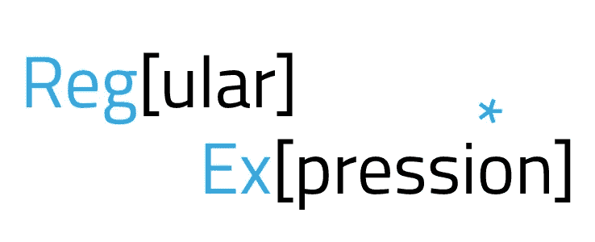

# 使用 Python 的正则表达式

> 原文：<https://levelup.gitconnected.com/regular-expressions-with-python-8bc59c439d23>



正则表达式在处理文本数据时提供了灵活性。

Regex(正则表达式)只是一个对字符串模式表示的文本的搜索查询。对一段文本进行搜索时，您在正则表达式中指定的任何模式都将作为搜索结果返回。

你可能想知道，在 python 中已经有几个操作字符串的*方法*了，Regex 还有什么用？

这个问题的答案在于正则表达式的强大和灵活性。

考虑以下解决方案；

**解决方案 1:**

解决方案 2:

这两种解决方案都是为了解决上述问题，例如为日志输出提取*进程 id* 。然而，对于更大的日志文件，我们几乎不知道*进程 id* 是什么。这可能会改变并导致我们的代码破坏。正则表达式有力地解决了这个问题。

# 与 Python 匹配的简单正则表达式:

正则表达式中，*搜索*函数中的*【r】*是什么意思？

“r”表示这是一个原始字符串，这意味着 python 解释器不应该试图解释任何特殊字符，而应该只是将字符串解析为给定的函数。

在 python 中，总是将 Rawstrings 与正则表达式一起使用是一个好主意。

*   **一个圆点(。)匹配任意字符**。

如果我们在正则表达式中包含一个点，那么这个点就是一个通配符，可以用来表示任何字符。请注意，在下面使用点，我们仍然匹配 *lwve* ，我们想要匹配爱情。*史诗失败*。

*   caret(^)和美元符号($)告诉我们正则表达式应该在一行的什么地方匹配。

抑扬符号表示行的开始，而美元符号表示行的结束。

注意:扬抑符和美元符号匹配一行的开始和结束，注意一个字符串。参见下面的例子。

*   **None** 是一个特殊的值，python 使用它来表示没有匹配返回给正则表达式。

*   如果希望匹配不区分大小写，请使用 re。IGNORECASE

*   如果我们需要正则表达式模式中的特定匹配，而不是通配符，例如使用点(.)在我们的模式中，我们可以实现字符类，例如，我们如何匹配单词 Python 并在匹配中允许小写和大写字母“P”。有几种方法可以做到这一点。

*   在字符类中添加抑扬符将返回不在指定组中的匹配字符。在下面的例子中，匹配返回一个点(。)因为它是该组中唯一未指定的字符。注意，该组有一个*空格*，它匹配句子中单词之间的空格。

*   您可以使用重复限定符来匹配任何重复多次的字符，包括零个字符。在第一个 print 语句中，点(。)将匹配扩展到整个单词 Pystagrandin。

# 使用正则表达式捕获组:

到目前为止，我们已经使用了 Regex *搜索函数*来检查一个字符串是否匹配某个模式，然后打印结果。大多数时候，我们希望获取匹配的信息并在代码中使用它。为了做到这一点，我们使用捕获组。

捕获组是用括号括起来的正则表达式模式的一部分。请参见下面的示例，其中捕获组用于颠倒名称的顺序。

```
import re

result= re.search(r"^(\w*), (\w*)$", "Lovelace, Ada")
print(result)
>>>> <re.Match object; span=(0, 13), match='Lovelace, Ada'>

print(result.groups())
>>>>('Lovelace', 'Ada')

print(result[0])
>>>>Lovelace, Ada

print(result[1])
>>>>Lovelace

print(result[2])
>>>>Ada

print("{} {}".format(result[2], result[1]))
>>>>Ada Lovelace
```

这可以用下面的函数来表示:

```
def rearrange_name(name):
    result= re.search(r"^(\w*), (\w*)$", name)
    if result is None:
        return name
    return "{} {}".format(result[2], result[1])

print(rearrange_name("Bruce, Lee"))
>>>Lee Bruce
```

以上介绍了正则表达式的强大功能。您可以通过访问以下 Python 文档的链接了解更多信息；

*   【https://docs.python.org/3/howto/regex.html 号
*   【https://docs.python.org/3/library/re.html 
*   [https://docs . python . org/3/how to/regex . html #贪婪与非贪婪](https://docs.python.org/3/howto/regex.html#greedy-versus-non-greedy)