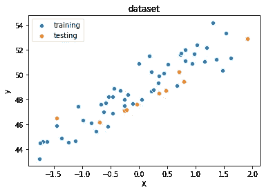
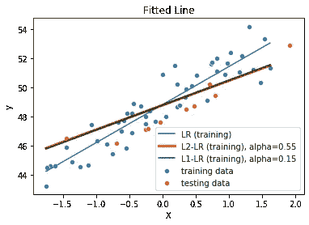
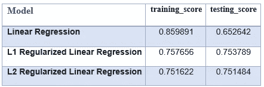
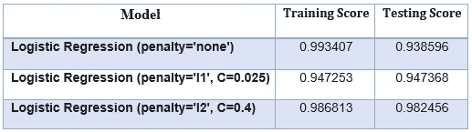
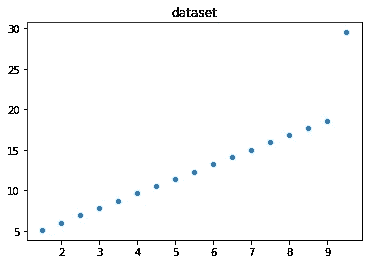
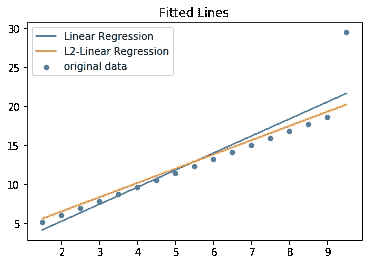

# 机器学习中的正则化

> 原文：<https://levelup.gitconnected.com/regularization-in-machine-learning-59c619da4537>

本文介绍了机器学习中使用的正则化技术及其各种类型。执行正则化是为了对模型进行概化，以便它能够对看不见的数据输出更准确的结果。本文将进一步探讨正则化机器学习模型的必要性、它的机制，以及它如何将泛化带到机器学习模型中。

## **什么是正规化？**

在机器学习模型中，我们有两个重要的属性，即误差项(损失函数)和模型参数(权重)。我们的目标是最小化损失函数。有时发生的情况是，为了使损失太小，或者换句话说，为了使精确度接近完美，模型不从数据中学习，而是记忆数据。这个模型不符合数据，它实际上过度拟合了数据。这导致参数值的幅度很大。

正则化是一种方法，其中我们将随着我们的权重变大而变大的*惩罚项*添加到损失中，以便我们可以正则化大量的参数。现在我们的目标变成了最小化总损失——**误差项加惩罚项**。我们越重视惩罚项，就越不鼓励我们的模型获得大的权重。正则化对具有高数量级的权重不利。使用的主要正则化类型有——L1&L2 正则化。

## **为什么需要正规化？**

1.  **回归示例** 我使用图 1 左图所示的玩具数据集构建了三个模型。我使用了 scikit-learn 实现线性回归。
    * [线性回归](https://scikit-learn.org/stable/modules/generated/sklearn.linear_model.LinearRegression.html#sklearn-linear-model-linearregression)
    * L1-正则化线性回归([拉索回归](https://scikit-learn.org/stable/modules/generated/sklearn.linear_model.Lasso.html#sklearn-linear-model-lasso))
    * L2-正则化线性回归([岭回归](https://scikit-learn.org/stable/modules/generated/sklearn.linear_model.Ridge.html#sklearn-linear-model-ridge))

**图 1:数据集(左)&拟合线(右)**

我们可以使用每个模型的系数值来验证简单线性回归和正则化线性回归之间的性能差异。

**图 2:回归—正则化线性回归—性能**

我们可以清楚地看到，简单的线性回归过度拟合了数据，因为训练和测试得分之间存在显著差异。在正则化回归的情况下，训练分数会下降，但模型在测试(看不见的)数据时会提高其性能。当我们应用正则化时，我们会稍微降低模型的拟合度，以使其更具普遍性。

需要注意的一点是， *alpha* 是一个超参数，我已经手动选择了它的值来说明正则化的效果，但是在实践中，我们使用交叉验证来为 *alpha 找到合适的值。*

2.**分类示例** 再次，我使用 scikit-learn 中的[乳腺癌](https://scikit-learn.org/stable/modules/generated/sklearn.datasets.load_breast_cancer.html#sklearn-datasets-load-breast-cancer)数据集构建了三个模型。为了执行分类，我使用了 scikit-learn 实现的[逻辑回归](https://scikit-learn.org/stable/modules/generated/sklearn.linear_model.LogisticRegression.html#sklearn-linear-model-logisticregression)。

在 scikit-learn 中，`[LogisticRegression](https://scikit-learn.org/stable/modules/generated/sklearn.linear_model.LogisticRegression.html)`类有 3 个驱动正则化的参数— `C`、`penalty`、`l1_ratio`。

a) `**C**` **:** 其值代表正则化强度的倒数。这意味着`C`的值越大，正则化越弱。`C`的较小值将对模型参数值(即系数和截距)施加更多限制，这反过来将导致参数的较小幅度。

b) `**penalty**` : 它表示我们想要执行的正则化类型，例如——L1、L2 和 elasticnet，即 L1 和 L2 的组合。

c) `**l1_ratio**`:当惩罚被指定为 elasticnet 时，使用它的值。它代表 L1 和 L2 之间的正规化比率。

**图 3:分类—正则化逻辑回归—性能**

图 2 和图 3 显示了正则化和非正则化模型的比较分数。为了在测试数据上提供良好的准确性，具有 L2 罚函数的模型往往拟合度较低。此外，L1 正则化模型通过将一些系数的值设置为零来进一步抑制训练分数，并提供可比较的测试分数。

同样，我们必须记住，这些结果是特定于超参数的选定值的，这些超参数是使用交叉验证调整的*和 ***C*** 。根据超参数的不同值，结果可能会有所不同。*

*3 **。离群值—** 存在离群值时，线性模型往往会偏离最佳拟合线。我们可以在图 4(右)中看到，简单的线性回归模型受到数据集(左)中异常值的干扰，无法给出最佳拟合线。另一方面，L2 正则化线性回归通过使系数值更小并且更不适合数据来克服这个问题，以便提供非常接近最佳拟合线的解决方案。*

***

**图 4:异常值的正则化*** 

*通过到目前为止的讨论，我们可以得出结论，需要正则化来拟合比没有正则化的模型更简单的模型，以便最终我们可以得到在测试数据上概括得更好的模型。*

## ***正规化是做什么的？***

***图 5:回归系数***

***图 6:分类—系数***

*通过观察图 5 和图 6 中的曲线，我们可以说正则化使系数变小。L2 正则化试图降低参数值，L1 使其中一些等于零。这样，L1 正则化有助于特征选择并创建稀疏模型。*

*在没有正则化的情况下，我们最大化训练分数，因此我们的模型在训练数据上表现良好。当我们添加正则化时，我们实质上修改了原始损失函数来惩罚大的系数。在 Scikit-learn 的 LogisticRegression 类中，`**C**`的值越小，正则化就越强。因此，我们的模型将相应地不太符合数据，这反过来降低了训练分数。*

*但是为什么正规化会提高测试分数呢？假设我们不想在培训中使用某个特定的功能。这相当于将该特征的相应系数值设置为零。正则化并因此使系数值更小在完全不使用该特征，即正则化系数(`**C=0**`)和完全使用它，即非正则化系数(`**penalty='none'**`)之间进行折衷。如果模型使用导致过度拟合的特征，则正则化缩小其系数值，因此模型不会受到大系数值的影响，并且预测更加准确的结果，这反过来提高了测试分数。*