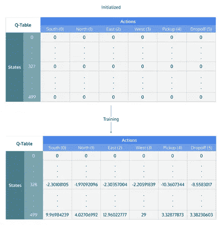
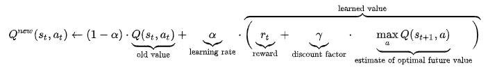
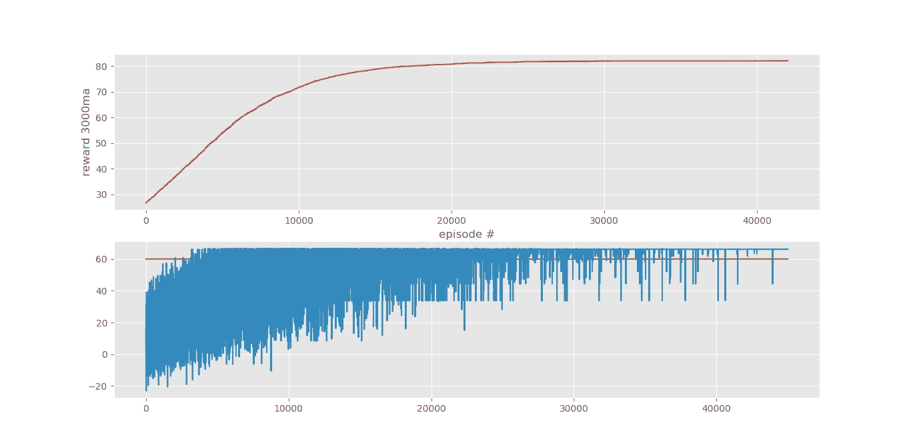

# 强化学习——教机器用 Q 学习赌博

> 原文：<https://levelup.gitconnected.com/reinforcement-learning-teaching-the-machine-to-gamble-with-q-learning-bc6790ee66c2>

增强学习是人工智能和机器学习的一个领域，它涉及模拟许多场景以优化结果。强化学习中最常用的方法之一是 Q 学习方法。在 Q-learning 中，创建了一个模拟环境，算法包括每个模拟场景的一组“S”状态、一组“A”动作和一个代理，该代理采取这些动作以渗透到状态中。

每当代理采取集合“A”中的动作“A ”,它就从一个状态转换到环境中的另一个状态。在环境中的特定状态下执行一个动作会给代理人返回一个奖励，这个奖励可以是好的也可以是坏的。该模型的目标始终是找到一组行动，使回报最大化，并以对环境最好的方式发展。在一组强化学习算法中有几种不同的技术，从具有定义的策略的数学模型到更复杂的模型，如进化模型和深度学习模型，如深度强化学习。

在上一篇文章中，你可以找到下面的链接，我写了如何使用机器学习来预测真实的足球比赛结果，现在我将写如何使用强化学习模型来对真实的足球比赛进行下注和优化。

[https://octaviobomfim . medium . com/predicting-real-football-matches-using-fantasy-game-scouts-a3b 388 EDB 8 aa](https://octaviobomfim.medium.com/predicting-real-soccer-matches-using-fantasy-game-scouts-a3b388edb8aa)


瓢虫

# q 学习

Q-learning 是一个基于策略的强化学习模型，旨在根据当前状态找到要采取的最佳行动，在这种情况下没有定义行动策略。这种模型被认为是一种非策略模型，因为 Q-learning 功能通过当前策略之外的动作来学习，换句话说，它的学习以探索的方式进行，通过采取随机动作来创建使该集的总回报最大化的动作策略。

**为什么问？这个政策是什么？**

字母 Q 代表质量，学习模型基于 Q 表(质量表), Q 表是模型可以在每个状态的环境中使用的动作策略。因此，我们有一个表[state，action]来表示一个策略，其中每个动作对于每个状态都有一个质量值(Q 值)。



动作是环境的一部分，在上面的例子中，我们有向北、向南、向东、向西等行走的动作。状态的概念是一组变量，表示模型在模拟环境中的演变。

随着所采取的每个动作，Q 值通过值迭代的概念来更新，该值迭代遵循被称为马尔可夫决策过程(MDP)和贝尔曼方程的决策过程。该等式由所采取的动作的旧 Q 值以及动作的奖励和新状态的最大 Q 值组成，两者都从“学习率”中扣除，该“学习率”衡量当前值和新值之间的质量。因此，该模型仅依赖于[状态，行动]和在环境中采取的行动中观察到的回报。



# 模型开发—代码

在经历了概念之后，我将继续代码部分和模型的结果。该解决方案的完整代码可以通过下面的链接在我的 GitHub 上找到:

[](https://github.com/octavio-santiago/Reinforcement_Learning_Bet/blob/master/RL%20Q%20learning%20value%20iteration.py) [## 奥克塔维奥-圣地亚哥/强化 _ 学习 _ 打赌

### 强化 _ 学习 _ 下注。通过创建一个社区，为 Octavio-Santiago/Reinforcement _ Learning _ Bet 的发展做出贡献

github.com](https://github.com/octavio-santiago/Reinforcement_Learning_Bet/blob/master/RL%20Q%20learning%20value%20iteration.py) 

用于开发的库，根据它们的导入:

```
import numpy as np
import matplotlib.pyplot as plt
import pickle
from matplotlib import style
import time

import pandas as pd
```

首先，我们定义了贝尔曼方程、情节和学习率的一些值，以及模拟下注环境的初始值，包括每局的投资值和初始投资组合值。

```
HM_EPISODES = 45000
epsilon = 0.9
EPS_DECAY = 0.9998
LEARNING_RATE = 0.1
DISCOUNT = 0.95
```

*   学习率定义了随着质量(Q)值的更新，探索中奖励的权重。
*   起初，我使用了 45000 集，这是模型将遵循的迭代次数。
*   ε和 eps 衰减表示初始开采系数及其随迭代的衰减
*   贴现表示行动后 Q 的未来价值的权重

在定义之后，如果必要的话，模型加载先前的 Q 表，或者启动新的 Q 表来开始迭代。

每一集都会经过之前选择的每一个游戏进行迭代。

## 创建模拟环境

模拟环境有 3 种不同的功能:

*   action()通过选择策略和赌注来执行模型定义的操作
*   strategy()从 action()函数接收动作，并有效地执行先前定义的策略。在这个模型中，我们有 3 个策略:“Min”选择具有最低 odd 的团队，“Max”选择具有最高 odd 的团队，“ML”根据另一个时间开发的机器学习模型选择团队。
*   bet()接收 action()和 strategy()值，并使用游戏的真实值应用数据集中的策略，从而返回赌注的结果值，无论它是成功还是失败。

紧接着，我们在剧集和游戏的循环中定义了剥削政策:

```
if np.random.random() > epsilon:
   action_n = np.argmax(q_table[obs])
else:
   action_n = np.random.randint(0,high=2)
```

我们有一个部分执行每一次下注的利润和回报计算，更新累计利润，并设置一个新的观察状态，一个由投资组合的价值和累计利润表示的状态。

```
j = result[0][0]
	        if j == -1:
	            erros += 1
	            l_tot = 0
	        elif j == 0:
	            l_tot = 0  
	        elif j == 1:
	            l_tot = result[1][0]

	        lucro = (l_tot*invest) - invest        
	        reward = lucro

	        lucro0 += lucro

new_obs = (carteira,lucro0) # get new state
```

最后，应用贝尔曼方程来更新该状态的 Q 值。

```
try:
	  max_future_q = np.max(q_table[new_obs])
except:
	  q_table[new_obs] = [0 for i in range(val)]
	  max_future_q = np.max(q_table[new_obs])

current_q = q_table[obs][action_n] 

new_q = (1 - LEARNING_RATE) * current_q + LEARNING_RATE * (reward + DISCOUNT * max_future_q)

q_table[obs][action_n] = new_q #update actual q
```

# 结果

该模型被执行，并通过 Matplotlib 库，生成一些图形来跟踪模型的性能和带有匹配结果的日志。

下图在顶部显示了每 300 集的平均利润，在底部，蓝色显示了每次下注的结果，红色显示了初始投资组合价值。



通过情节分析模型的性能，我们看到，在开始时，模型非常不稳定，因为它受探索的影响很大，它不知道如何做最好的押注，因此模型执行许多随机移动，并在一段时间内达到负面结果。沿着蓝线，我们看到波动性降低，赌注的总价值稳定在非常正的值，直到它超过最初的投资组合本身，从而使投资翻倍，并最终稳定在 80.00 美元的累计**利润范围内。**

最后，模型对这些匹配的决策策略是:

```
['ml', 'max', 'ml', 'ml', 'max', 'max', 'max', 'max', 'ml', 'max', 'max', 'ml', 'min', 'ml', 'min', 'ml', 'min', 'ml', 'ml', 'ml', 'ml', 'ml', 'ml', 'max', 'max', 'ml', 'ml', 'min', 'ml', 'ml']
```

模型 57%的时间使用 ML 算法建议，30%的时间使用最高 odd，13%的时间使用最低 odd。这向我们展示了所开发的 ML 模型的效率，以及最大值的第二个选择，它具有更大的风险，但提供了更高的回报，最终弥补了损失。

最终结果是:

```
Final Wallet: $ 142.15999999999997, Profit: $ 82.15999999999998
```

模拟环境有 30 个游戏，投资额为 2 美元，初始投资组合为 60 美元。累计的**利润是 82.16 美元**，这代表了**最初投资组合**的 136.93%，这个模型使这些智能下注的投资额增加了一倍多！

以下是对每场比赛结果和最后一集模型性能的下注详情:

```
Profit 1.9 Profit ac 1.9 erros 0 action 0 ...............
Profit 4.2 Profit ac 6.1 erros 0 action 0 ...............
Profit 4.4 Profit ac 10.5 erros 0 action 0 ...............
Profit 0.8399999999999999 Profit ac 11.34 erros 0 action 0 .......
Profit -2 Profit ac 9.34 erros 1 action 0 ...............
Profit 13.5 Profit ac 22.84 erros 0 action 1 ...............
Profit -2 Profit ac 20.84 erros 1 action 0 ...............
Profit 4.2 Profit ac 25.04 erros 0 action 1 ...............
Profit 5.0 Profit ac 30.04 erros 0 action 1 ...............
Profit 3.9000000000000004 Profit ac 33.94 erros 0 action 1 ........
Profit 2.3 Profit ac 36.239999999999995 erros 0 action 2 .........
Profit 0.79999999999999 Profit ac 37.03999999999999 erros 0 action 0 
Profit 2.40000000000000 Profit ac 39.43999999999999 erros 0 action 2 
Profit 0.799999999999999 lucro ac 40.23999999999999 erros 0 action 0 
Profit -2 Profit ac 38.23999999999999 erros 1 action 0 ............
Profit 5.0 Profit ac 43.23999999999999 erros 0 action 0 ............
Profit 1.2999999999999 Profit ac 44.539999999999985 erros 0 action 0 
Profit 3.3 Profit ac 47.83999999999998 erros 0 action 0 ............
Profit 3.4000000000000 Profit ac 51.23999999999998 erros 0 action 0 
Profit -2 Profit ac 49.23999999999998 erros 1 action 0 ............
Profit 0.56 Profit ac 49.79999999999998 erros 0 action 0 ..........
Profit 5.4 Profit ac 55.19999999999998 erros 0 action 0 ...........
Profit 2.3 Profit ac 57.49999999999998 erros 0 action 0 ...........
Profit 5.8 Profit ac 63.299999999999976 erros 0 action 1 ..........
Profit 5.0 Profit ac 68.29999999999998 erros 0 action 1 ...........
Profit -2 Profit ac 66.29999999999998 erros 1 action 0 .............
Profit 1.14000000000000 Profit ac 67.43999999999998 erros 0 action 0 
Profit -2 Profit ac 65.43999999999998 erros 1 action 1 .............
Profit 0.72000000000000 Profit ac 66.15999999999998 erros 0 action 0 
Profit 16.0 Profit ac 82.15999999999998 erros 0 action 1 ...........
```

看到详细的赌注我们看到模型错过了一些游戏，但总的来说，它结束得非常积极。解释模型不能完美匹配的主要原因之一是，我传递给它的策略是基于最小和最大的赔率或基于机器学习模型，这不允许它探索每场比赛的所有可能情况。

# 结论

根据给出的结果，可以得出结论，强化学习模型成功地学会了支配下注环境并为每场比赛选择最佳策略。对于我来说，在没有任何前期政策编程的情况下，使用机器学习对足球比赛进行投注，并且仍然在投注中大获成功地完成模拟，这是一件非常有趣的事情。对于真实的情况，我们将处理概率，因为在它发生之前我们没有匹配的结果，但是，由于模拟，我们可以找到一种更优化的方式来下注。

在 RL 领域还有几个更复杂的策略，我将在未来介绍，我写这篇文章的目的是将我在该领域的一些经验带给那些感兴趣的人，并为社区做出贡献，我希望我已经帮助理解了这个主题，并且我可以随时联系任何人。感谢阅读。

如果你想了解更多，请随时在 LinkedIn 联系我！[https://www.linkedin.com/in/octavio-b-santiago/](https://www.linkedin.com/in/octavio-b-santiago/)