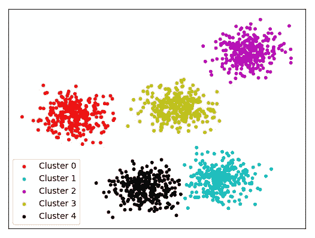

# 将机器学习技术与现实生活联系起来。

> 原文：<https://levelup.gitconnected.com/relating-machine-learning-techniques-to-real-life-4dafd626fdff>

尽可能简单地解释 ML 模型的类型。

# 机器学习

在这篇文章中，我们将介绍机器学习是如何工作的，以及有哪些不同类型的机器学习算法；对于每个算法的详细解释，我将开始一个系列，它将由“*知道关于<算法 _ 名称>* 的一切”。那么，我们开始吧。

为了简单起见，我将首先解释技术定义，然后尝试将该技术与我们的日常生活联系起来，以便更好地理解。

所以，我们知道什么是机器学习(如果不是查[)到底什么是机器学习？](https://medium.com/machine-deep-learning/what-exactly-machine-learning-is-1746c9d151ed)详细解释”)但还是让我们回顾一下；机器学习是我们提供给计算机的一种无需明确编程就能学习的能力；太正式了？所以用外行人的话说，把自己当成监护人，把你的机器当成你的孩子；现在，像往常一样，你必须教他如何做不同的家务？现在，要么你通过自己的经历来教育你的孩子，要么让他根据自己的起起落落来生存。

就像我们一样，我们对我们的机器训练得越多(人类的经验),精确度就会越好。

所以简单来说，机器学习就是简单地教会我们的计算机如何执行数据驱动的公式化，而不是一次又一次地被编程。

# 机器学习完成的任务

我们知道，数据科学行业正呈指数级增长，几乎没有哪个行业不选择未来技术来优化使用数据。因此有人说，“*数据是新燃料*”。

从预测房价、天气预报到自动驾驶汽车，机器学习的范围非常广泛。因此，总的来说，它可以根据相似性或差异性对数据进行预测、分类或聚类。

**预测:**

这类任务通常由回归算法完成。它包括预测，在给定数据的基础上，我们预测未来值，这是对隐藏数据的预测。

线性回归产生这样的输出。

线性回归

例如，记录过去 50 年中某一天的天气状况，并预测今年的天气状况。

**分类**:

这种类型的任务包括根据特征的不同将我们的点/数据分类成不同的类别。

支持向量机，朴素贝叶斯，神经网络产生这样的输出。

分类；超平面的左侧对聚类 1 有贡献，右侧对聚类 2 有贡献

例如将电影评论分为正面或负面，将照片分为不同的类别。

**聚类**:

这种类型的任务包括根据数据特征的相似性将数据聚类成不同的组。这主要涉及无监督学习。

k-均值，KNN 产生这样的输出。

使聚集

例如聚类不同的血型

# 机器学习算法的类型

机器学习算法的类型

**监督学习**

这些类型的算法需要输入-输出对，通过使用不同的函数，我们试图预测、分类和聚类未发现的输入。数据标注在这里。

简单来说，这就是被引导的部分。举例来说，你正在教你的孩子书中的一些问题，书中的问题范围是有限的，但在实践中，你可能会遇到一些不同的问题，如果你能够正确地回答这些问题，那么你就受到了适当的训练。这就是监督学习。你训练你的模型并提供问题和解决方案，然后一旦被训练，你在我们的模型中提出一个完全不同的问题并期望它正确地预测/分类。

线性回归、逻辑回归、支持向量机、朴素贝叶斯、决策树都是监督学习的例子。

**无监督学习**

这些类型的算法需要没有标签的数据，并且机器试图基于数据的相似性进行聚类；它需要最少的人工监督，也称为自组织，因为它允许对输入的概率密度进行建模。

目标是提取有意义的信息。这通常涉及数据的聚类。

K-Means、KNN、K-Means++和 DBSCAN 都是无监督学习的例子。

**强化学习**

这种类型的学习也被称为半监督学习，即我们给它很少的标记数据，并期望我们的机器在最少的人类合作下运行。每当我们的代理采取正确的行动，我们奖励它，但如果采取的行动是不正确的，我们惩罚我们的模型。

正如你在图像中看到的，我们试图教我们的代理人(狗)一个新的把戏(杂耍)；但是我们不能告诉它做什么，但是如果它做对或做错了，我们可以奖励或惩罚它。它必须弄清楚它做了什么，使它得到了奖励/惩罚，并期望在下一次迭代中表现得更好。

联系到我们的日常生活，这就像当我们诱惑我们的孩子取得好成绩时，我们会给他们买昂贵的玩具，但如果他们失败了，我们会让他们禁足。

自动驾驶汽车、自己玩游戏都是强化学习的例子。

# 结论

希望这篇文章不仅增加了你对机器学习的理解，还让你意识到机器学习并不难，并且已经在我们的日常生活中发生了。

一如既往，非常感谢您的阅读，如果您觉得这篇文章有用，请分享！:)

> ………………………………………………………………………

请随意连接:

> *LinkedIN ~*[*https://www.linkedin.com/in/dakshtrehan/*](https://www.linkedin.com/in/dakshtrehan/)
> 
> *insta gram ~*[*https://www.instagram.com/_daksh_trehan_/*](https://www.instagram.com/_daksh_trehan_/)
> 
> *Github ~*[*https://github.com/dakshtrehan*](https://github.com/dakshtrehan)

关注更多机器学习/深度学习博客。

> 中等~[https://medium.com/@dakshtrehan](http://medium.com/@dakshtrehan)
> 
> *干杯。*