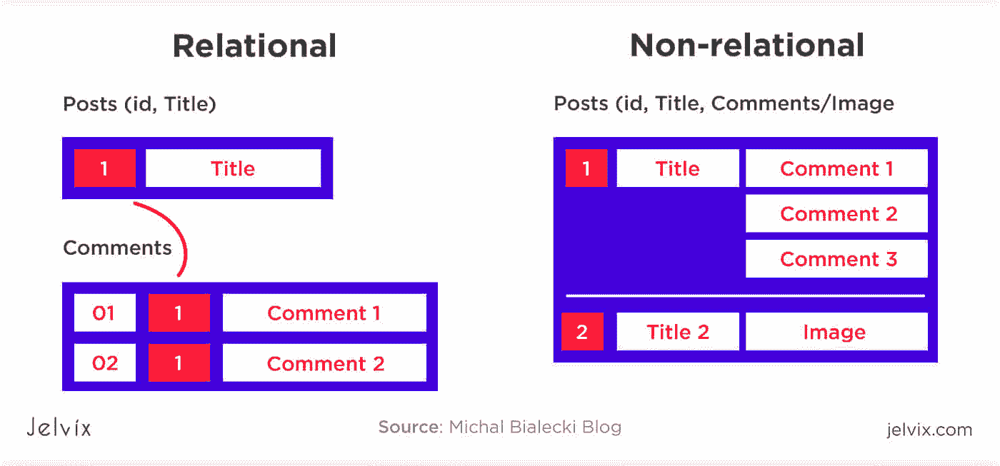

# 关系数据库与非关系数据库

> 原文：<https://levelup.gitconnected.com/relational-vs-non-relational-databases-6d9e08866ad0>

## 了解什么数据去哪里

简·安东宁·科拉尔在 [Unsplash](https://unsplash.com?utm_source=medium&utm_medium=referral) 上拍摄的照片

# 介绍

在我们深入研究关系数据库和非关系数据库之前，让我们了解一下什么是数据库。数据库是存储在计算机上的数据，当你需要时可以访问。

数据库以有组织的方式将数据组织成表、行和列。数据库的主要目的是存储大量数据，并在需要时检索相关信息。

# 数据库的历史

数据库已经存在 50 年了。数据库已经从基于平面文件的类型发展到今天的关系和非关系数据库。数据库可以理解为以下四种类型之一:

*   **基于平面文件的**:数据保存在文件系统的文件中。
*   **基于分层文件的**:类似于基于平面文件的系统，只是文件共享父子关系。
*   关系数据库:它们将数据管理成表格。
*   非关系数据库:它们是可定制的数据库。

[*来源*](https://jelvix.com/blog/relational-vs-non-relational-database)

# 关系数据库(又名 SQL 数据库)

关系数据库，也称为 RDBMS 或 SQL 数据库，将数据组织到多个表中，这些表在行中有记录，在列中有记录的属性。这些表彼此有关系。

您使用 SQL(结构化查询语言)与这些数据库进行交互。SQL 是在表、列和行中插入、修改和检索数据的一种定义良好且有用的方法。

**优点**:

*   RDBMS 可以处理大量的事务。
*   SQL 可以很好地处理涉及许多表的复杂查询。
*   它支持 ACID(原子性、一致性、隔离性、持久性)，这确保了可靠的数据库事务。

**缺点**:

*   不支持/有限支持 blob 数据，如图像和文档。
*   不适合键值对。

# 在哪里使用

关系数据库适合存储大量结构化数据。它们保护事务的安全，并使用 SQL，SQL 允许您使用复杂的查询来检索信息。

# 流行的关系数据库

市场上有很多免费的企业解决方案。下面是几个受欢迎的:

**甲骨文**

[Oracle](https://www.oracle.com/database/12c-database/) 为企业资源规划、客户体验、供应链管理等多个领域提供各种数据库解决方案。

Oracle 提供数据库云，帮助客户降低 IT 成本，并在云上托管可靠的数据库服务。

**微软 SQL 服务器**

一个来自[微软](https://www.microsoft.com/en-in/sql-server/sql-server-downloads)的关系数据库传统上只在 Windows 上运行。

在 2017 版本中，SQL Server 首次开始支持 Linux 和 Docker 容器。这使得开发人员能够使用他们喜欢的环境来构建应用程序。

SQL Server 具有良好的性能，是业界最安全的数据库管理系统之一。

**MySQL**

MySQL 是一个免费的开源关系数据库，在开源社区中被广泛使用。MySQL 是以 GNU(通用公共许可证)发布的。MySQL 有几个分支。其中一些拥有专利许可。

**PostgreSQL**

PostgreSQL 是这个列表中最通用的工具之一。那么，[什么是 PostgreSQL](https://www.openlogic.com/blog/what-is-postgresql) ？它也是一个免费的开源关系数据库。它被称为 Postgres，因为它是 Ingres DB 的继承者。Postgres 可以一次处理很多事务。它可以用来管理从 web 应用程序到数据仓库的任何数据。亚马逊红移是建立在 Postgres 之上的。

# 非关系数据库(又名 NoSQL 数据库)

就存储数据的结构而言，非关系数据库更加灵活。尽管很少有 NoSQL 数据库以表、行和列的形式存储数据，但它们与 RDBMS 有着根本的不同。

根据数据的存储方式，有各种类型的 NoSQL 数据库:

*   **文档数据存储**:顾名思义，文档可以存储在这些数据库中。文档可以是任何形式，如 XML、YAML 或 JSON。JSON 是最流行的格式。您可以对文档中的数据字段进行查询和过滤。在其中，您不必在存储的文档中维护相同的数据结构，这提供了很大的灵活性。
*   **面向列的数据库**:除了面向列的数据库将数据组织成列之外，它们与关系数据库没有太大的不同。它们提供了以列的形式向表中添加新属性的灵活性。
*   **键值存储**:键值存储在字典或散列中维护数据，其中键是字符串，值可以是字符串、数组、集合等。
*   **图形数据库**:图形数据库以节点和边的形式存储数据，形成一个图形。节点代表实体，边代表实体之间的关系。

**优点**:

*   可以用很少或没有结构的方式存储大量数据
*   无模式
*   适合文档存储
*   灵活的数据模型

**缺点**:

*   相对较新，因此支持可能是一个问题
*   不如关系数据库成熟
*   可能需要学习新的 API 来与数据交互

# 在哪里使用

NoSQL 数据库主要用于没有/很少结构的数据。由于可伸缩性和效率，NoSQL 数据库在创业社区中被广泛使用。像 Memcached 和 Redis 这样的数据库很少被用作缓存。

# 流行的非关系数据库

NoSQL 数据库阵容强大。有各种不同用途的数据库。一些受欢迎的是:

**雷迪斯**

[Redis](https://redis.io/) 代表远程词典服务器。Redis 是内存中的数据存储，具有各种数据结构，如键值对、散列、列表、集合、排序集等。Redis 也被用作缓存和消息代理。

**MongoDB**

[Mongo](https://www.mongodb.com/) 是一个面向文档的商店。MongoDB 可以在表中存储 JSON 文档，并且可以查询 JSON 中的字段。如果您希望在灵活的数据字段中存储文档，MongoDB 非常有用。MongoDB 作为主数据存储在开发社区中很受欢迎。

卡桑德拉

**[Cassandra](https://cassandra.apache.org/) 是来自 Apache 的免费、开源的基于列的数据存储。Cassandra 可以部署在多节点分布式设置中，以获得更高的可用性和可靠性。Cassandra 使用 CQL 语作为查询语言。CQL 代表 Cassandra 查询语言，其语法类似于 SQL。**

****亚马逊 DynamoDB****

**[DynamoDB](https://aws.amazon.com/dynamodb) 是亚马逊的一个完全托管的数据存储，是 AWS 产品的一部分。它是一个键值和文档存储。AWS 根据您希望从数据存储中获得的吞吐量，在 DynamoDB 上提供自动扩展。此外，Amazon 将数据存储在多个服务器上，以提供您需要的性能。**

****Neo4j****

**Neo4j 是一个图形数据库。数据以边、节点和属性的形式存储。当您想要理解或获取实体之间的关系时，这非常有用。**

# **包装它**

**关系数据库和非关系数据库以不同的结构存储数据。如今，大多数应用程序使用多个数据库来存储不同种类的数据。**

**大多数组织更喜欢 SQL 数据库，因为它们提供了高级别的安全性，并且是为扩展而构建的。另一方面，初创公司倾向于在其应用程序中使用所有类型的数据库。一些原型和概念验证是仅使用 NoSQL 数据库构建的，因为它们加速了开发过程。许多应用程序使用关系数据库作为主存储，使用 NoSQL 数据库存储间歇数据，并用作缓存。**

**就寻找人才而言，找到关系数据库专家要容易得多，因为 SQL 已经存在了几十年。新时代的开发者也开始使用 NoSQL 的数据库。**

***喜欢自己体验媒介？考虑通过注册会员* *来支持我和其他作家* [***。会员每月只需 5 美元，它支持我们，作家，没有额外的费用。如果你这样做，我会收到一部分费用，不会多花你多少钱。谢谢大家！***](https://singhamrit.medium.com/membership)**