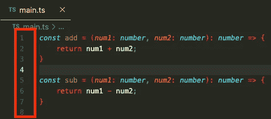
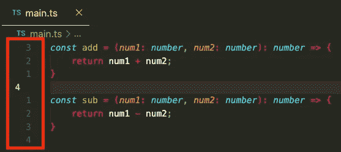
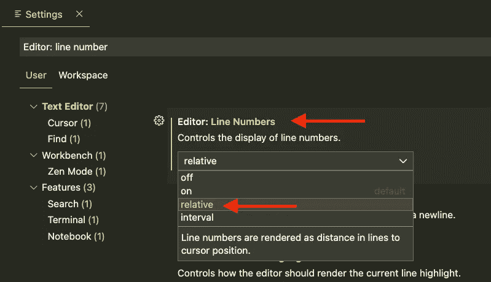
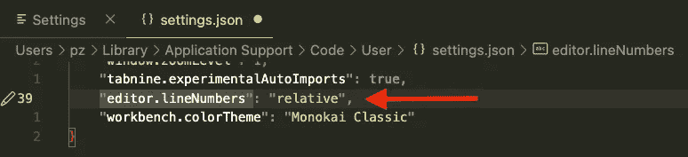

# Visual Studio 代码中的相对行号(VSC)

> 原文：<https://levelup.gitconnected.com/relative-line-numbers-in-visual-studio-code-vsc-97faceca5464>

在 Visual Studio 代码(VSC)中启用相对行号而不是“普通”行号。

卡斯帕·卡米尔·鲁宾在 [Unsplash](https://www.unsplash.com/) 上拍摄的照片

## 为什么是相对行号？

通常，“普通”开发人员不需要也不想要相对行号。因为如果你要跳到特定的行号，你仍然可以使用快捷方式跳到绝对行号。

假设你来自一个充满活力的世界。在这种情况下，您可能已经习惯了快速导航的相对行号，并希望在您的 Visual Studio 代码中也获得这种体验，尤其是如果您已经启用了 Visual Studio 代码 Vim 插件。

## 它看起来像什么？

下面两张图片显示了相对行号与绝对行号的对比。

您会注意到，在两幅图像中，光标都在第 4 行。这是因为在相对行号图像(#2)中，您仍将看到当前行的绝对行号，但对于所有其他行，您看到的是基于当前光标位置的距离，而不是它们的绝对行号。

绝对行号

相对行号

## 在哪里启用它？

幸运的是，Visual Studio 代码有内置的支持来启用这个特性。所以你不需要为它安装另外一个插件。

通过`cmd` + `,`(在 macOS 上)或`Preferences > Settings`打开设置。然后搜索“行号”，你应该在“文本编辑器”的“编辑器:行号”部分找到需要的设置。请参见下图。

通过设置 UI 启用相对行号

或者，您也可以转到`settings.json`文件，而不是使用 UI 并将键`editor.lineNumbers`从`"on”`更改为`"relative"`。

## 你想联系吗？

如果你想联系我，请在 LinkedIn 上联系我。

另外，请随意查看我的书籍推荐📚。

 [## 我的书籍推荐

### 在接下来的章节中，你可以找到我对所有日常生活话题的书籍推荐，它们对我帮助很大。

mr-pascal.medium.com](https://mr-pascal.medium.com/my-book-recommendations-4b9f73bf961b)  [## 通过我的推荐链接加入 Medium—Pascal Zwikirsch

### 作为一个媒体会员，你的会员费的一部分会给你阅读的作家，你可以完全接触到每一个故事…

mr-pascal.medium.com](https://mr-pascal.medium.com/membership)