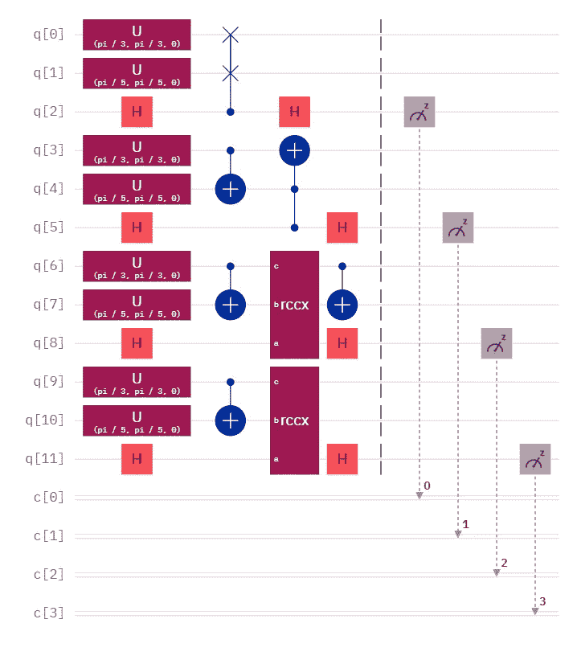
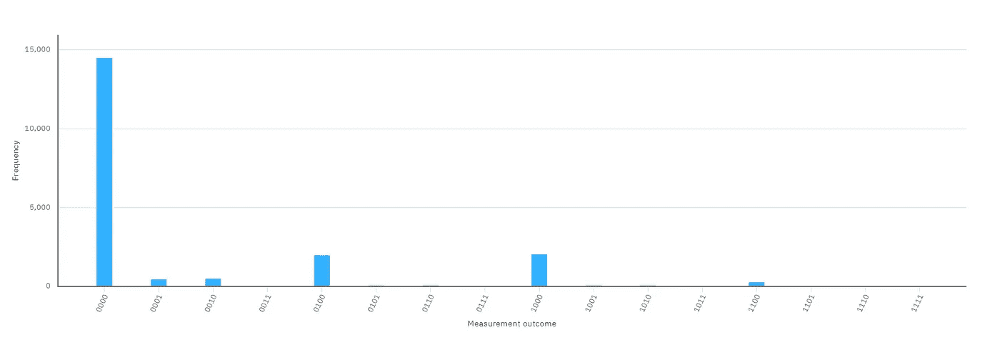
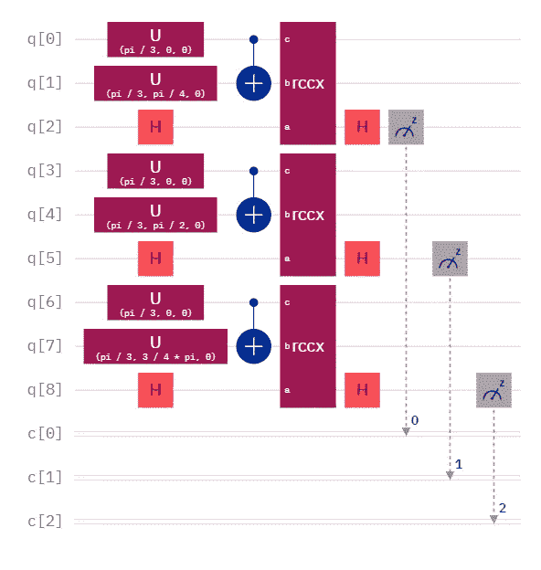
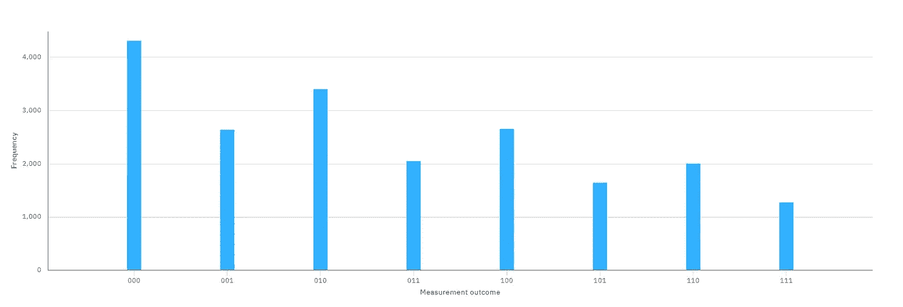
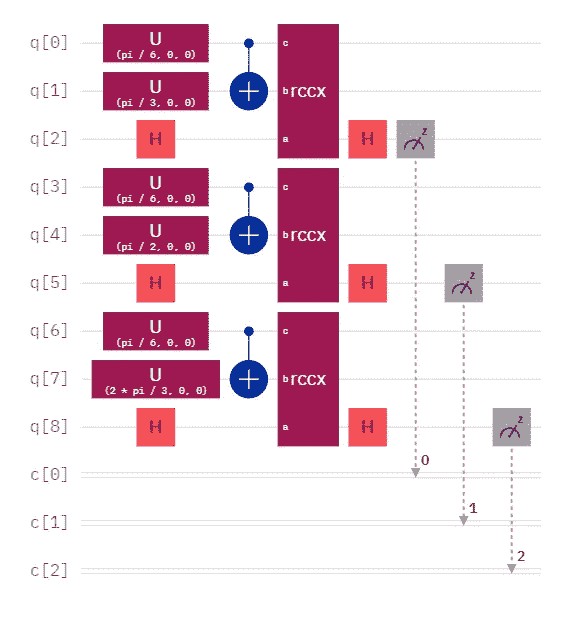
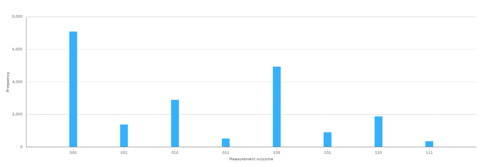

# 相对相位交换测试？

> 原文：<https://levelup.gitconnected.com/relative-phase-swap-test-f4a718f4f4b5>

互换测试的 4 种变化

# 有用吗？

就像我在我的第一本书《地下城量子比特，超越量子计算教程的冒险家的故事》(顺便说一下，这本书正在更新中)中所说的那样，有时候你只需要进行实验。我最近写了一篇关于[相对相位 Toffoli 门](/classiqs-toffoli-problem-54b7e5084833)如何可以减少电路深度的文章，尽管有一个警告，但它让我想到了简化 Fredkin 门的可能性。毕竟，一个弗雷德金门可以分解成 CX-托夫里-CX。

我唯一一次使用弗莱德金盖茨是作为[互换测试](/comparing-quantum-states-c6445e1e46fd)的一部分。因此，您在本页顶部看到的是交换测试的四种变体:

1.  量子位 0–2:具有弗雷德金门的规范交换测试
2.  量子位 3–5:一个分解的弗雷德金门，拖尾 CX 被移除
3.  量子位 6–8:一个分解的弗雷德金门，用一个相对相位托夫里门代替了规范的托夫里门
4.  量子位 9–11:一个分解的弗雷德金门，用一个相对相位的托夫里门代替了规范的托夫里门，并去掉了拖尾的 CX

所有四个实现都比较相同的两个量子态。

不是意外的结果

直方图显示了两件事。首先，两个 Toffoli 实现产生相同的结果，并且两个相对相位 Toffoli 实现产生相同的结果。然而，第二，Toffoli 实现和相对相位 Toffoli 实现不会产生相同的结果。

到目前为止，这是我所期望的。毕竟，相对相位 Toffoli，顾名思义，改变了控制量子位的相位。作为交换测试的一部分，使用相对相位托夫里的量子态看起来比使用托夫里的更远。

然而，这既没有证明也没有反驳——目前为止——相对相位互换测试正在起作用。至少，相对相位交换测试结果必须有不同的解释。但是，当实际比较量子态时，相对相位交换测试表现如何？

相对相位交换测试正在进行

上面的电路显示了相对相位交换测试的三种实现，都没有拖尾 CX。为什么？因为拖尾 CX 影响目标量子位的最终状态，但不影响测量结果。所有这三种实现都将一个特定的量子态与另一个量子态进行比较。对于顶层实现，这两种状态比较接近。对于中间的实现，这两个状态相距稍远。并且，对于底层实现，这两个状态甚至相距更远。

嗯…这里有些不对劲…

好吧，那没用。尽管这并不构成详尽的测试，但近状态和远状态测量的距离相等，而中间状态测量的距离最远。

就这样吗？一个相对相位互换测试一文不值？

不一定。Hadamard 测试不像 SWAP 测试那样通用，但仍然有用。而且，在有用的情况下，其电路深度只有 2，与完全分解的交换测试相比，这是一个明显的减少。

有趣的事实:哈达玛测试是我最喜欢洪欧曼德尔干涉仪的原因。前者用于超导器件，后者用于光子器件，但功能相同。

我们再试一次，好吗？

那么，这次有什么不同呢？被比较的量子态只绕 y 轴旋转。它们不绕 z 轴旋转，因此它们都具有相同的相位。同样，相对相位托夫林对相位有影响，所以我消除了相位差。

这个看起来好一点。

直方图显示，最近的两个量子态靠得最近，最远的两个态离得最远，中间实现适当地歇在中间。除了我们似乎不能使用阶段这一事实之外，最初的测试表明，相对阶段交换测试有点像规范交换测试。

## 结论

注意，这个实验显然不是详尽无遗的，我由此得出结论，相对相位交换测试不一定是没有价值的。像哈达玛测试一样，它不像规范互换测试那样通用。但是，哈达玛检验似乎仅限于最简单的比较。如果我们比较仅围绕 y 轴旋转的多量子位状态，比如用一些[振幅编码](/amplitude-encoding-dd89dc84170d)的实现，会怎么样？哈达玛测试似乎不能做到这一点，但相对相位交换测试怎么样？

未来的工作可能会朝着两个方向发展。显然，相对相位交换测试可以在振幅编码状态上进行测试。这将不得不等待另一篇文章，因为这篇文章的目的只是确定相对相位交换测试是否有任何效用。老实说，我没想到会这样。其次，一个完全分解的 Fredkin 可能会提供对其他可能执行得更好的优化的洞察。