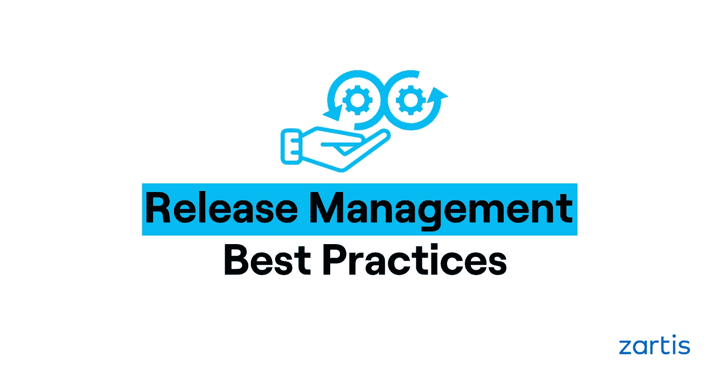
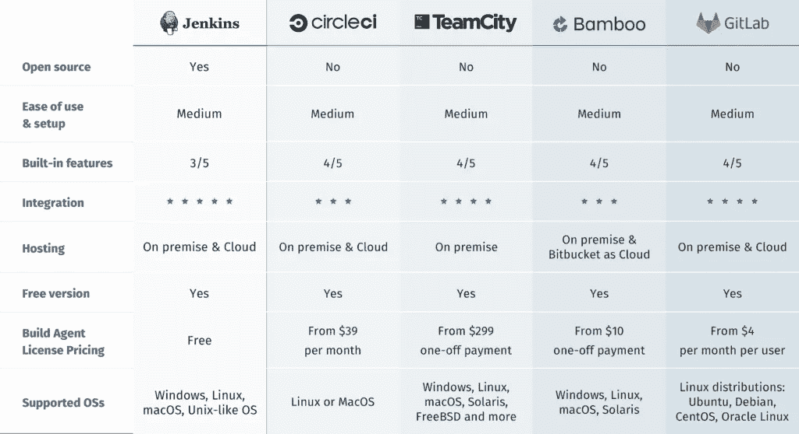
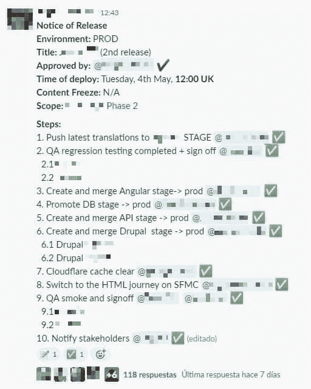

# 发布管理最佳实践

> 原文：<https://levelup.gitconnected.com/release-management-best-practices-9dab9d09b2d8>

## 在软件发布之前、期间和之后做什么来保证成功

因此，您的团队已经完成了 sprint，为重要的日子:发布日做好了一切准备。希望这最后一步会像在公园散步一样平静，但是也许你在光谱的完全相反的一边。也许对你的团队来说，部署日不是一个快乐的日子，而是一个充满压力、痛苦和折磨的日子。

在本文中，我们将尝试向您展示我们(固执己见的)对整个过程的看法，以便尽可能地简化部署工作。请注意，本文将尽可能全面地介绍这一过程，您可能需要针对您的特定系统调整一些步骤。

# 预发布:做蚂蚁，而不是蚱蜢

这个标题已经说明了我们希望你记住的最重要的概念:做一只蚂蚁，在实际发布之前，花时间在能简化过程的行动上，并使它尽可能不出错。因此，预发布部分是最重要的一步，你应该在第一次发布之前就开始投资。

我们不知道你的具体构建系统，也不知道你遵循的过程，但是我们会尝试给你一些通用的操作，这肯定会改进你的发布(除非你已经在使用它们)。

在很大程度上，有两个主要的动作可以确保过程的成功:**自动化**和**发布脚本**。

## 自动化一切:

先说第一个，自动化。任何手动任务都容易出错，正如我们的朋友墨菲所说，任何可能发生的事情都会发生，所以任何手动任务都会失败。我们要么完全忘记去做，要么只是做错了，但是会失败。因此需要自动化。

关于自动化，如果你还没有进行持续集成，你应该考虑一下。构建和测试你的产品应该尽可能的自动化。有很多 CI 工具，现在最常用的云存储库包括管道。在创建一个好的 CI 基础设施上投入时间和精力将节省发布过程中的时间和错误。下面，您可以看到市场上最常用的 CI/CD 工具列表:

我们还建议使用不同的环境，至少是主要的 3 个:开发、测试/试运行和生产。将您的产品部署到任何这些环境的步骤也应该是自动化的，并且从开发升级到测试/试运行的步骤应该与从测试/试运行升级到生产的步骤相同。这将帮助你更快地发现问题。

## 发布脚本:

发布脚本只是发布之前、期间和之后要遵循的一系列步骤。听起来很简单，但它会是你最珍贵的神器，保证你发布的成功。

它应该包含发布过程中需要的每一个步骤，不管多么微不足道。这里适用的原则与自动化的原则是一样的:任何没有写下来的东西都容易在最激动的时候被忘记，所以最好把它写下来。

发布脚本必须:

*   团队的每个成员都可以接触到
*   必要时进行维护和更新(不能一成不变)
*   包括回滚计划(灾难恢复在生产版本中非常重要)

尽管发布脚本可以适用于所有版本，但它应该包括每个特定部署(配置、数据、新服务器、第三方系统、网络更改等)所需的任何特定步骤。

# 有益的行动

在这一节中，我们将包括其他有用的准备工作，以便简化发布过程。

大概最有利的一个就是实行一个 [**蓝绿部署体系**](https://martinfowler.com/bliki/BlueGreenDeployment.html) 。它将极大地简化部署过程，允许您部署新版本(并在生产中测试它)，同时维护以前的版本以供您的客户端运行。任何可能出现的问题都不会被你的客户发现或遭受。

我们已经讨论了蓝绿色部署，但是还有许多其他的发布方法可以帮助您降低部署时的风险:[金丝雀部署](https://martinfowler.com/bliki/CanaryRelease.html)，[功能切换](https://martinfowler.com/articles/feature-toggles.html)，以及任何其他可能出现的方法。

**轮换部署者角色**。团队中不应该有部署者，团队的每个成员都应该知道如何部署(发布脚本在这方面很有帮助)。这将改善这个过程，因为参与的人越多，你得到的想法和错误检测就越多。它还将保护您在“部署者”生病时无法部署(因为他们会生病)。

**在发布日期之前，将您的发布计划和时间表**分享给您的部署可能会影响到的任何人(利益相关者、其他团队、QA 等)。这将帮助您发现您可能遭受或产生的任何副作用，甚至您可能都没有意识到(可能已经计划了一个巨大的基础架构更改，推迟部署可能会更好)。在你选择的消息应用中有一个专门发布这类事情的频道真的很有用。

**与质量保证团队一起准备冒烟和验收测试**。他们应该与 POs 和利益相关者协调，准备最好的测试，以确保部署完成后，一切都按预期进行。

避免周五和周末。还记得我们的朋友墨菲吗？你不希望你的发布在周五悲惨地失败，你只是不想在周末部署。你会有一个精简的团队，任何可能出现的问题都将更难处理(也许唯一知道如何解决的方法就是爬山)。

**直接实行连续交货制。**正如持续集成将通过在整个开发过程中不断构建、集成和测试您的软件来降低风险一样，持续交付也将把您的发布过程减少到最低限度。当然，创建过程的努力是存在的，但是好处是将发布风险几乎降低到零。你可以在这里看到更多的。

**使用语义版本。**这是一件非常简单的事情，但是对于维护您实际部署的良好历史非常有帮助。你可以在这里[详细查看](https://semver.org/)，但是让我们总结一下:你部署的任何东西都必须有一个格式为 MAJOR 的关联版本。次要补丁，将随着不同的部署而增加。当我们说到您部署的任何东西时，我们指的是任何东西。即使部署只包含一行代码。如果您部署了版本 1.0.0，突然您必须更改一行并再次部署，那么您应该部署版本 1.0.1。这样，您将拥有所部署内容的历史信息。

# 最后，发布日

所以最后我们到了发布日，你也到了预定的时间。如果你是一只好蚂蚁，并且做了功课，那么今天应该没什么事可做。一些建议:

*   **啰嗦一下**。在发布频道上再次通知。事情可能从昨天开始就发生了变化，突然你的部署应该因为谁知道什么原因而被推迟。
*   **遵循发布脚本**。你已经花了时间来编译它，现在不要忘记遵循它，否则你只会浪费你的时间。在发布频道上分享它，并在您完成这些步骤时更新它。
*   **警惕**错误并随时准备回滚。

# 发布后:我们还没有完成

嗯，看起来一切顺利，新版本已经部署到生产中了。QA 团队要做的第一件事应该是开始冒烟和验收测试。如果您使用蓝绿色部署，这可以在切换之前在新环境中完成(这将在出现错误的情况下节省很多问题)。

只有在您的 QA 团队同意之后，您才应该接受部署实际上是成功的，并继续通知涉众和庆祝。

最坏的已经过去了，所以花点时间，维持发布脚本。部署过程中是否发生了意想不到的事情？写下来。发布时有人有好主意吗？写下来。

此外，不要忘记执行部署后任务:

*   将主分支合并到下游，或者在此时合并到存储库工作流的预期步骤。
*   关闭任务跟踪软件的版本。
*   无论你的团队在发布后需要做什么(也许去喝啤酒？)

## 修补还是不修补？

我们还想谈最后一点。所以，假设你已经部署了你的新版本，它已经被用户使用，突然有人发现一个非常小的错误。这很容易解决，只需要几行代码。您是否应该立即着手修复并部署它？

简短的回答是**没有**。你可能会认为它很小，很容易修复，但是说实话，你真的不知道。我们的建议是，要么分析错误是否可以在您的团队修复它时留在产品中(在这种情况下，您不需要回滚)，要么在必要时直接回滚并重新开始。

一如既往，最长的答案是可能。最后，你更了解你的产品和你的团队，所以也许在你的情况下，你可以做热修复。

# 结论

总结一下:

*   **做一只蚂蚁**，做好准备，提前投资，会带来投资回报
*   **自动化**，使用任何可能对你有帮助的技术/工作流程，这将带来投资回报
*   创建、维护并遵循**部署脚本**，这是您最好的武器
*   通知，通知，让人们了解情况，这会让你远离意外
*   在你完成部署后，除非他们同意，否则部署并没有真正完成
*   小心快速修补程序

现在享受吧，你已经成功部署了你的下一个版本。下次部署时再见。

-

**如果您对该主题有任何疑问或需要更多信息，请随时联系******！****

# **分级编码**

**感谢您成为我们社区的一员！[订阅我们的 YouTube 频道](https://www.youtube.com/channel/UC3v9kBR_ab4UHXXdknz8Fbg?sub_confirmation=1)或者加入 [**Skilled.dev 编码面试课程**](https://skilled.dev/) 。**

** [## 编写面试问题+获得开发工作

### 掌握编码面试的过程

技术开发](https://skilled.dev)**