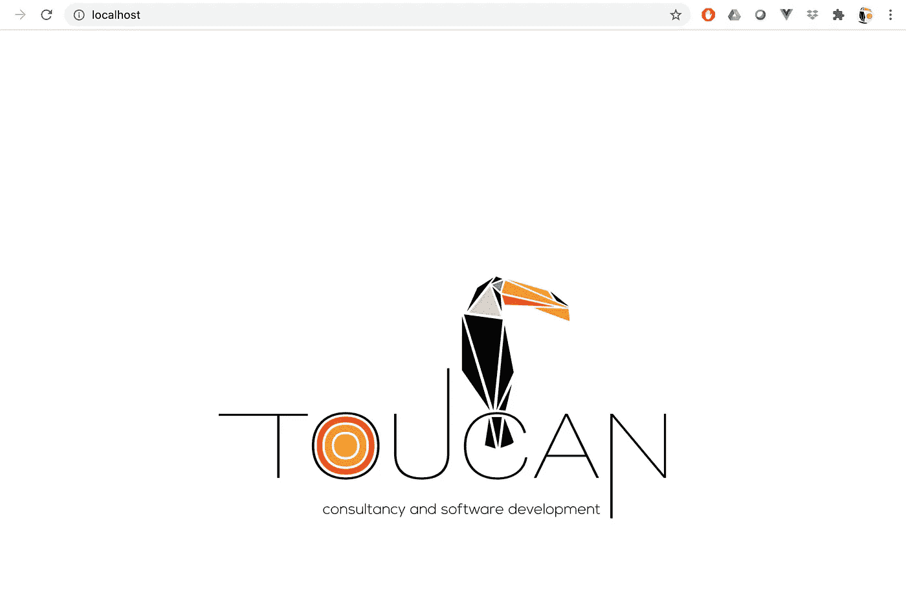
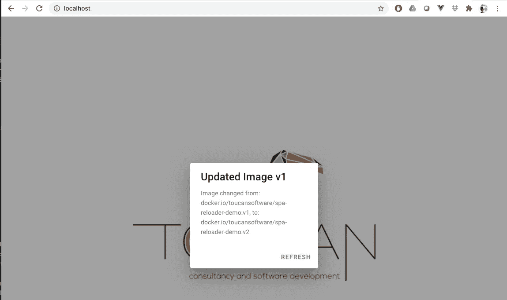

# 部署后重新加载单页应用程序

> 原文：<https://levelup.gitconnected.com/reloading-single-page-applications-after-deploying-ec96e78e7016>

当今的许多企业级应用程序都使用最先进的技术，如微服务、持续集成和持续部署(CI/CD)。这些技术通过自动化组织使用的构建/测试/部署周期，有助于加速变革或缩短上市时间。此外，应用程序通常打包在容器映像中，并使用容器编排工具(如 Kubernetes)进行部署，这些工具允许将服务中的更改从源代码轻松部署到不同的环境，甚至使用更复杂的部署策略，如 A/B 测试或 canary 部署。

对于单页面应用程序(SPA)来说，情况并非总是如此，因为这种应用程序通常呈现在客户端，并且驻留在客户端的浏览器上。使用单页面应用程序有明显的优势，如可用性、网络速度和计算机资源的分配，但这项技术也有一些缺点。

在本文中，我将回顾当前的解决方案，当部署的应用程序发生变化时，重新加载 SPA。然后，我将提出一个基于 Kubernetes 控制器的解决方案，以检测部署中的变化，并使用 WebSocket 向客户端发送通知，以便采取行动。

# 解决方法

本节回顾了当前在发生变化时重新加载 SPA 的解决方案。

## 强力

这个解决方案不包括在客户端缓存应用程序和定期重新加载。

**优点**:易于实施，无需服务器端组件。

**缺点**:对用户体验没有好处，因为如果重新加载周期很短，用户在使用应用程序时可能会不必要地重新加载，或者如果重新加载周期太长，它不会获得新的更改。

## 在我们的 js 文件中包含散列

这种替代方法包括生成一个文件，该文件带有一个标识构建的哈希值，然后在一个众所周知的位置提供它。这种替代方案的一些例子如下:

*   [https://medium . com/@ code monk/automatic-reload-of-client-after-deployment-in-vue-js-91c 120 f 85 f 0e](https://medium.com/@codemonk/automatic-reload-of-client-after-deploying-in-vue-js-91c120f85f0e)

**优点**:简单快速的实现，我们只需要一些 webpack 配置来生成 hash，以及在客户端存储当前 hash 并与服务器 hash 进行比较的一些代码。

**缺点**:需要客户端主动监控，设置超时功能，用于检查一个众所周知的 URL，并与当前 URL 进行比较。

## 在 HTTP 头中包含应用程序版本

由于大多数 SPA 将使用后端 API 来对应用程序执行操作，因此请求 HTTP 标头和响应 HTTP 标头都可能包含一个额外的字段，用于指示应用程序的当前版本和服务器版本。与以前的解决方案类似，客户端将存储当前版本或哈希，并将其与收到的版本或哈希进行比较，以检测部署的 SPA 中的更改，以便它可以通知用户或强制重新加载页面以进行升级。

**优点**:在客户端和服务器端都相当容易实现。

**缺点**:这需要服务器端知道 SPA 版本以将其包含在 HTTP 头中，或者它们由相同的代码库提供服务。它还要求在客户端进行主动监控，将每个 HTTP 请求与当前存储的版本进行比较。

## WebSocket 通知

在这个解决方案中，将有一个 websocket 后端服务，它监视已部署的 SPA 中的机会，并通知所有订阅的客户端更改。SPA 需要订阅此服务，并在收到通知时通知用户或重新加载页面进行升级。

**优点**:这是一个事件驱动的解决方案，只有当服务器端发生需要 SPA 参与的变化时，客户端才会得到通知。

缺点:服务器端和客户端的实现都更加复杂。它需要服务器端的一个组件来监听或检查 SPA 的已部署代码的变化。

# Kubernetes 控制器和 WebSocket 解决方案

[Toucan Software](https://toucansoft.io) 的 SPA 重载器由一个[服务器端](https://github.com/ToucanSoftware/spa-reloader)组件和一个[客户端](https://github.com/ToucanSoftware/spa-reloader)组件组成，用于检测部署的应用程序中的变化，通知客户端并向用户发送通知以采取行动。

## 服务器端组件

SPA Reloader 的服务器端组件实现了一个 Kubernetes 控制器，该控制器监视部署中的变化，并检测容器映像的 SHA-256 是否发生了变化。当这种情况发生时，它向客户端所有连接的用户发送一个 WebSocket 通知。

SPA Reloader 可以与您的应用程序一起部署，也可以作为独立组件单独部署。它将以下需要作为环境变量传递的参数作为环境变量，以便了解要监视哪些变化:

*   **SPA_NAMESPACE** :用于监视名称空间变化的环境变量的名称。
*   **SPA_NAME** :用于监视部署名称变化的环境变量的名称。

## 客户端组件

在这种情况下，客户端组件是一个 Vue 插件，它将 SPA 的服务器端组件公开的 WebSocket 服务器的 URL 作为参数。您还可以注册一个回调函数，以便在检测到部署中的更改后立即执行。

您还需要在您的应用程序中注册一个回调函数，以便您可以在部署发生变化时接收通知。

# 实际演示

为了演示 SPA Reload 的使用，我们将使用位于[https://github.com/ToucanSoftware/spa-reloader-demo](https://github.com/ToucanSoftware/spa-reloader-demo)的演示项目。这是一个非常简单的 VueJS 应用程序，我们之前已经构建并发布了 2 个版本。所以它的第一个版本被标记为:

```
toucansoftware/spa-reloader-demo:v1
```

应用程序的第二个版本是

```
toucansoftware/spa-reloader-demo:v2
```

该应用程序是使用 vue-cli 和标准设置创建的，之后我们添加了 ***spa-reloader-vue*** 组件，使用:

```
npm i spa-reloader-vue
```

一旦添加了组件，我们必须注册插件，并提供 WebSocker 服务的 URL，我们将在那里注册通知。

之后，我们需要使用原型函数 **$spaSubscribe** 注册我们想要接收通知的回调函数

对于这个演示，我使用的是 Docker Desktop for Mac 的 Kubernetes，因此为了展示 web 应用程序和 SPA Reloader WebSocket 服务，我需要安装一个入口控制器，比如 NGINX 入口控制器

```
kubectl apply -f [https://raw.githubusercontent.com/kubernetes/ingress-nginx/controller-v0.41.1/deploy/static/provider/cloud/deploy.yaml](https://raw.githubusercontent.com/kubernetes/ingress-nginx/controller-v0.41.1/deploy/static/provider/cloud/deploy.yaml)
```

部署完成后，我们将使用以下脚本部署 SPA 加载程序

```
kubectl apply -f [https://raw.githubusercontent.com/ToucanSoftware/spa-reloader-demo/main/deploy/01-spa-reloader.yaml](https://raw.githubusercontent.com/ToucanSoftware/spa-reloader-demo/main/deploy/01-spa-reloader.yaml)
```

将为 SPA 控制器创建命名空间、部署和服务。然后，我们将使用以下工具部署演示 SPA 应用程序:

```
kubectl apply -f [https://raw.githubusercontent.com/ToucanSoftware/spa-reloader-demo/main/deploy/02-demo.yaml](https://raw.githubusercontent.com/ToucanSoftware/spa-reloader-demo/main/deploy/02-demo.yaml)
```

之后，您可以检查您的入口外部 IP 地址以访问演示应用程序，您应该会看到类似下图的内容



为了测试演示，我们需要更改容器映像，以便 SPA 可以检测到更改并通知客户端。我们可以使用这样的命令:

```
kubectl set image deployment/spa-demo spa-demo=docker.io/toucansoftware/spa-reloader-demo:v2 -n spa-demo
```

由于这一更改，SPA Reloader 将生成如下消息，并将其发送给连接的客户端:

一旦该消息被发送到客户端，***spa-reloader-vue***将会收到一个回调调用，在本演示中，会显示一条弹出消息，提醒用户该情况。确认后，***window . location . reload(true)；发出*** 命令，使用当前修改强制重新加载页面。



# 结论

SPA Reloader 使用 Kubernetes 控制器来检测应用程序容器映像的变化，并通过 WebSocket 发送通知。该解决方案可以有效地用于通知单页面应用程序部署中的变更，实现事件驱动方法。

尽管没有具体的细节说明如何使用 Kubernetes 控制器来检测消息并将其传递给客户端，但后面的文章将讨论 SPA 实现的内部机制。