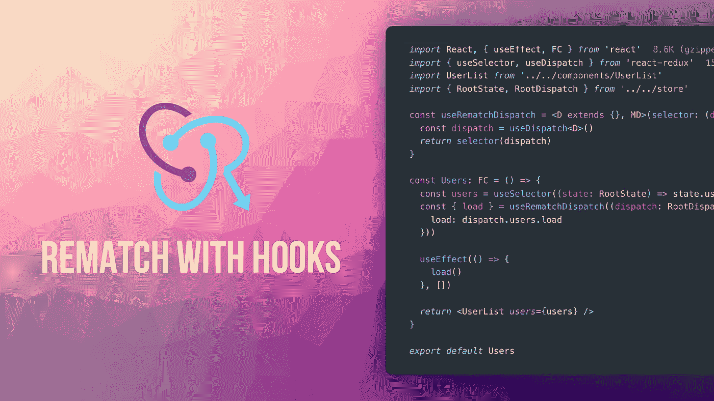

# 用钩子重赛

> 原文：<https://levelup.gitconnected.com/rematch-with-hooks-50a8380c46e4>

如果您一直在使用 Rematch 来管理应用程序中的状态，那么最新发布的添加了钩子支持的`react-redux`应该会让您非常兴奋。

Rematch 一直试图保持与现有的`react-redux` API 的兼容性，对于新发布的支持钩子的版本也是如此！

> *除了有更多可读和可重用的代码，钩子允许我们在用 TypeScript 添加类型安全时做更少的工作。*

我们来看一个“老办法”做事的例子。下面是一个组件，它将用户列表存储在 Redux store 中，并在安装组件时加载用户:

这段代码看起来和运行起来都很好，但是有几个问题是我们在 hook 出现之前无法解决的。其中之一就是与打字有关的`connect`组件。众所周知，高阶组件很难正确地输入类型，因为很难推断传递给内部组件的属性的类型。为了解决这个问题，我们必须单独定义传递给组件`(type UsersProps)`的道具的类型，然后为组件`(FC<UsersProps>)`手动设置它们。

有了钩子，我们可以用`useSelector`钩子代替`mapState`函数，用`useDispatch`代替`mapDispatch`函数，并且我们可以完全放弃难以键入的`connect` HOC，留给我们简洁且完全类型化的代码:

如果我们需要处理多个动作，我们可以创建一个定制的`useRematchDispatch`钩子，这样我们就可以使用我们编写`mapDispatch`函数时所熟悉的语法:

`useRematchDispatch`如果我们想要重构现有的重匹配应用程序，hook 也可以派上用场，因为它允许我们以最小的改动复制`mapDispatch`函数。

如果你想了解更多关于复赛的知识，可以看看我在 YouTube 上的[免费课程。](https://www.youtube.com/playlist?list=PLNG2YBDrzK-w1VSeDpMxdGwkb4L6hDy8Z)

*原载于 https://konstantinlebedev.com***。**