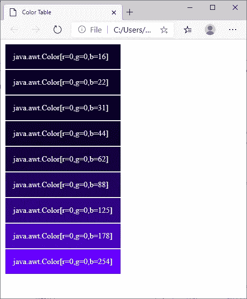

# 提醒:Java For loops 几乎可以迭代任何东西

> 原文：<https://levelup.gitconnected.com/reminder-java-for-loops-can-iterate-over-almost-anything-17f66f24b371>


由 [Max Bender](https://unsplash.com/@maxwbender?utm_source=medium&utm_medium=referral) 在 [Unsplash](https://unsplash.com?utm_source=medium&utm_medium=referral) 上拍摄的照片

有一次我居然忘了怎么用 Java 写 For 循环。我得去查一下。幸运的是，现在这样的东西很容易找到。典型的例子是这样的:

```
for (**int i = 1; i < 11; i++**) {
    System.out.println(i);
}
```

这会将数字 1 到 10 分别写入控制台的不同行中。

当然迭代器`i`通常会从 0 而不是 1 开始，但是它可以从任何其他的`int`开始；有些人喜欢使用小于或等于而不是严格小于作为布尔条件，但是你可以在整数上使用任何布尔条件；而且增量不一定是 1，可以是任何正整数，也可以是减量，变化甚至不一定是加法，可以是任何`int`运算。

Java 语言规范中没有要求迭代器是一个`int`。它可以很容易地是任何其他数字基本类型。比如，你可以用`double`:

```
double phi = (1.0 + Math.sqrt(5.0)) / 2;
for (**double phiPower = 1.0;
     phiPower < Double.POSITIVE_INFINITY;
     phiPower *= phi**) {
    System.out.println(phiPower);
}
```

多亏了备受争议的分号，我们可以在多行中整齐地格式化 For 循环声明。

初始化在 1.0 时开始`phiPower`；布尔条件是`phiPower`小于`Double.POSITIVE_INFINITY`(不是实际的无穷大，而是非常特殊的浮点值)；而变化就是`phiPower`乘以`phi`。

这将计算黄金比例的幂(大约 1.618)，从 1.0 开始，然后是黄金比例本身，接着是黄金比例的平方(大约 2.618)，立方(大约 4.236)，等等，直到大约 1.1163 × 10 ⁰⁸.为止

除此之外，黄金分割比的幂对于 64 位浮点数来说太大了，以至于无法以任何精度来表示，所以它们会作为“正无穷大”而丢失。

Java For 循环甚至比我目前描述的更加灵活。迭代器不一定是一个原语，它也可以是一个对象。例如，`java.time`包中的日期时间对象。

for 循环声明的重要之处在于它具有:初始化(典型示例中的`int i = 1`)；最初为真但最终将变为假的布尔条件(`i < 11`)；以及最终使布尔条件为假的增量或减量(`i++`)。

实际上，初始化的时候。条件；和更改，这些元素中的任何一个或全部都可能被省略，很可能导致无限循环。

假设出于某种原因，我们想知道从 2020 年 2 月 29 日到 2096 年 2 月 29 日的每个闰日是星期几(注意 2100 年 2 月 28 日，不是 29 日)。

至于你是想从`java.time`和`java.time.format`进行一揽子进口还是更有针对性的进口，我由你决定。我们这样设置我们的各种时间对象:

```
DateTimeFormatter formatter = DateTimeFormatter.RFC_1123_DATE_TIME;
LocalDate leapDay2020 = LocalDate.of(2020, 2, 29);
LocalDateTime leapDay2020AtNoon =
        LocalDateTime.of(leapDay2020, LocalTime.NOON);
OffsetDateTime leapDay2020UTC =
        OffsetDateTime.of(leapDay2020AtNoon, ZoneOffset.UTC);
OffsetDateTime notLeapDay2100 = leapDay2020UTC.plusYears(80);
```

现在是 For 循环:

```
for (**OffsetDateTime leapDay = leapDay2020UTC;
     leapDay.isBefore(notLeapDay2100);
     leapDay = leapDay.plusYears(4)**) {
       System.out.println(formatter.format(leapDay));
}
```

这个 For 循环有:将日期时间对象初始化为 2020 年 2 月 29 日，UTC 中午；指定日期早于 2100 年 2 月 28 日的布尔条件；以及日期时间对象的四年增量。

如果我们做的一切都正确，我们应该得到以下输出:

> 2020 年 2 月 29 日星期六 12:00:00 GMT
> 2024 年 2 月 29 日星期四 12:00:00 GMT
> 2028 年 2 月 29 日星期二 12:00:00 GMT
> 
> …以此类推，直到…
> 
> 2096 年 2 月 29 日星期三 12:00:00 GMT

我对 For 循环之前的设置并不完全满意——我会考虑重构建议。也许用 lambda 更优雅，但这不是这次演示的重点。

我相信这也可以用被弃用的`java.util.Date`类来实现，但是我不在乎测试这个理论。

对于循环迭代器来说，日期-时间对象的一个更实际的应用是在工资处理程序的测试套件中。

您可以让测试类构造器设置一个虚构的员工考勤卡，从周一开始，让他们在两周内的每个工作日打卡上下班，领取固定工资，也许还可以在这里或那里添加一些随机的加班时间。

然后，测试程序检查程序是否正确计算了员工的工作时间和税前工资。

如果这些日期-时间对象没有`isBefore()`函数，我们可以使用`compareTo()`函数，尽管它有点笨拙。我们仍然可以使用没有实现`Comparable<T>`接口的类`T`的 For 循环迭代器对象，比如`java.awt.Color`。例如，鉴于

```
Color veryDarkBlue = new Color(16);
System.out.println("<table style=\"color: white\">");
for (**Color color = veryDarkBlue;
     !color.equals(Color.BLUE);
     color = color.brighter()**) {
     System.out.println("<tr><td style=\"background-color: #0000"
             + Integer.toString(color.getBlue(), 16) + "\">"
             + color.toString() + "</td></tr>");
}
System.out.println("</table>");
```

将输出放入一个 HTML 文档中，可能会应用一些 CSS 填充，您应该会在 Web 浏览器中看到类似这样的内容:



从 Microsoft Edge 87.0 中看到的 Java 程序生成的 HTML 文档。表格的第一行显示“java.awt.Color[r=0，g=0，b=16]”，背景看起来基本上是黑色的。表格的最后一行在浅蓝色 bckground 上显示“java.awt.Color[r=0，g=0，b=254]”。

尽管在这里使用`int`迭代器可能更有意义，因为我们只改变了蓝色通道…

在许多其他情况下，通常最好将对象放入数组或集合中，然后使用“For Each”循环依次处理对象。这是更现代的 Java 虚拟机编程语言所采用的方法，比如 Scala 或 Kotlin。

很容易将 Java 中的循环标准视为第一代或第二代编程语言的遗迹。但是它们仍然非常有用，不管是以整数迭代器的典型形式还是以不同的迭代器的形式。