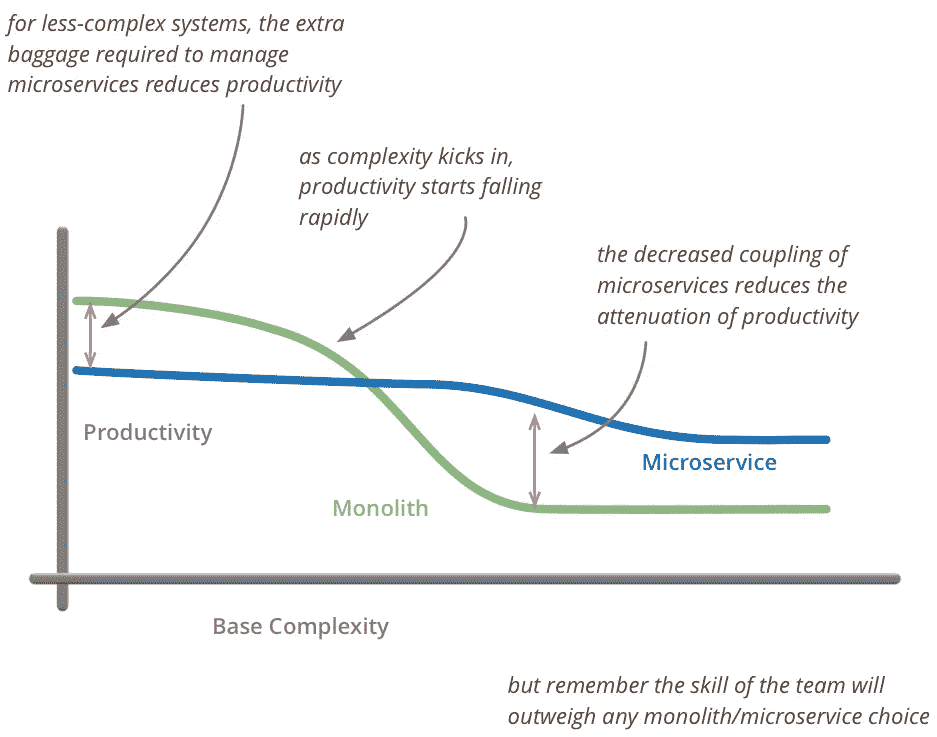

# 提醒:微服务不是免费的午餐

> 原文：<https://levelup.gitconnected.com/reminder-microservices-are-not-a-free-lunch-78daab7882ea>

[斯科特·格雷厄姆](https://unsplash.com/@homajob?utm_source=unsplash&utm_medium=referral&utm_content=creditCopyText)在 [Unsplash](https://unsplash.com/?utm_source=unsplash&utm_medium=referral&utm_content=creditCopyText) 上拍照

我们看到越来越多组织将其传统的整体应用程序迁移到微服务架构。像所有趋势一样，微服务架构正在被滥用。每个人都想使用微服务，我真的见过有人使用可以被 monolith 轻松处理的微服务。我不是说微服务不好，它们真的很好，并且带来了很多好东西。另一方面，微服务也给你的系统带来了更多的复杂性。今天，让我们一起来探索微服务可能不是一个好选择的场景。

# **你才刚刚开始。**

照片由[安德鲁·尼尔](https://unsplash.com/@andrewtneel?utm_source=unsplash&utm_medium=referral&utm_content=creditCopyText)在 [Unsplash](https://unsplash.com/s/photos/startup-2-people?utm_source=unsplash&utm_medium=referral&utm_content=creditCopyText) 上拍摄

如果你刚刚开始创业，也许你的团队只有 2 到 3 个人，那么使用微服务可能不是一个好主意。微服务需要额外的努力，而这些额外的努力会显著降低团队的速度。为了在生产中部署，微服务也需要大量的自动化，您必须开发某种平台来为您完成所有部署工作。在简单的整体应用程序中，部署应用程序更容易。老实说，如果你通过关注模块化来仔细设计你的应用程序，那么当时机成熟时，切换到微服务架构就太容易了。

尽管现在我们有一些现成的 CI/CD 渠道，比如 AWS 提供的渠道。同样，它们也给你的系统增加了更多的复杂性，系统的每一个复杂性都会将你的发布日期推后几周。你应该在创业的时候诚实地问一句:为了这个项目，微服务在这个时候值得吗？

# 简单的应用。

假设您正在设计一个简单的应用程序，它可能永远不需要扩展，也不涉及复杂的业务。在这种情况下，使用微服务有点过头了。您将花费大量宝贵的时间来构建微服务，并准备某种平台来部署它们。当微服务永远不会被大规模使用时，浪费这么多时间有什么意义呢？此外，微服务架构需要一些额外的资源才能存在。如果您的应用足够简单，那么由于引入微服务架构而需要的额外资源甚至可能超过应用本身所需的资源。

来源:https://martinfowler.com/bliki/MicroservicePremium.html

假设您正在创建一个应用程序，用于保存在大学学习的学生的数据。现在，您真的认为您将需要微服务架构的可扩展性吗？我不这么认为。此外，并不是所有的应用程序都足够大，可以分解成更小的服务，在这种情况下，不应该使用微服务架构。

# 微服务体验不够。

微服务只有设计好了才能发挥作用。如果微服务设计不当，很容易适得其反。有很多书都是关于微服务应该如何设计的。尽管如此，人们在设计微服务时还是会犯很多错误。开发微服务不仅需要设计，还需要很多技巧。开发人员应该了解生产，也应该了解运营。开发人员不能将任何东西交给运营团队来部署到生产中。

即使其中一个开发人员不够熟练，也不会降低一个微服务的速度，而是会对整个应用产生连锁反应。大多数开发人员喜欢学习新东西，这也是事实，但并不是所有人都是这样。学习微服务架构也需要时间和精力，管理层应该意识到，在应用程序的第一个版本中可能会出现一些大错误。有时候错误太大，你不得不从头开始。管理层应该给开发人员足够的空间来完成他们的工作，如果他们不能，那么微服务架构就不适合你。

> 经常失败。早点失败。快速失败。拥抱失败是通向成功的一种手段。与其害怕失败，不如被失败所激励。
> 
> *加里·伯恩森，* [*光辉国际的首席执行官*](https://www.kornferry.com/institute/fail-fast-learn-fast)

管理层应该知道风险，如果他们不愿意承担风险，就不要使用微服务。

# 尝试新事物。

如果你基于某个想法构建一个应用程序，而你真的不太相信那个想法。在这种情况下，几乎总是使用微服务是一个坏主意。你真的不想增加解决方案的复杂性，你只想创建一个简单的应用程序来测试你的想法。如果你的想法可行，也许你以后可以转向微服务架构。如果您正在构建一个简单的应用程序来测试您的想法，尽快启动您的应用程序是非常重要的。微服务架构只会让你慢下来。

而且不仅这种微服务更难调试，测试也不简单。当您破坏一个整体应用程序时，不同服务之间的通信成本也会增加，从而增加延迟。如果您的应用程序需要跨服务频繁更新多种资源，那么这可能会在微服务领域引发许多问题；因为你会使用类似于传奇模式的东西，这只会带来更多的复杂性。

> 微服务引入了最终的一致性问题，因为它们值得称赞地坚持分散的数据管理。使用 monolith，您可以在单个事务中一起更新一堆东西。微服务需要多个资源来更新，分布式事务是不被允许的(理由很充分)。所以现在，开发人员需要意识到一致性问题，并找出如何在做任何代码会后悔的事情之前检测到事情不同步。

如果您的应用程序不需要这样的复杂性，那么应该尽可能避免这些复杂性。

# **结论。**

微服务为您的组织带来了许多好处，但在采用它们之前，您还应该意识到它们也带来了一些新的复杂性。人们还应该记住，也许像网飞和优步这样的组织会成功，因为他们可以通过微服务架构实现足够的扩展，但他们也不是一天就能完善的。像网飞和优步这样的公司已经经历了各种改进微服务的迭代，他们也是从 monolith 开始的。

仅仅因为你的应用程序使用了所有最新的技术，并不意味着你的应用程序就是好的。如果你能用几行代码完成一个简单的 shell 脚本，那么就没有必要在 spring 批处理中编写一个应用程序，因为它很酷。只有当你的应用程序按照预期运行，并且只使用需要的资源时，你的应用程序才是好的。开发者不应该忘记任何软件设计的基本原则: [YAGNI](https://en.wikipedia.org/wiki/You_aren%27t_gonna_need_it) 和[接吻](https://en.wikipedia.org/wiki/KISS_principle)。

最后但同样重要的是，一个人应该一直学习所有这些新技术，因为你不知道什么时候你必须使用这些技术来使你的生活变得更容易。

# **参考文献**

 [## 独石第一

### 当我听到关于团队使用微服务架构的故事时，我注意到了一个常见的模式。几乎所有的…

martinfowler.com](https://martinfowler.com/bliki/MonolithFirst.html)  [## 停下来。！不需要微服务。

### 现在是 2020 年。如果我必须告诉你什么是微服务，这可能不适合你，请不要介意你宝贵的…

medium.com](https://medium.com/swlh/stop-you-dont-need-microservices-dc732d70b3e0)  [## 何时不使用微服务

### 在过去的 4 年里，我工作过的大多数团队都表达了对重构的某种兴趣…

www.feval.ca](https://www.feval.ca/posts/microservices/)