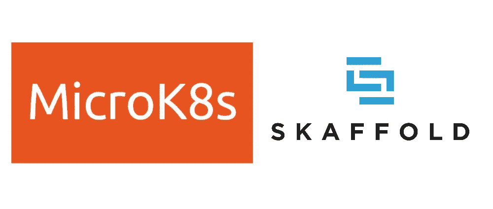

# 使用多节点 MicroK8s 集群和 Skaffold 进行远程开发

> 原文：<https://levelup.gitconnected.com/remote-development-with-a-multi-node-kubernetes-cluster-f131aa48d82>



*图片属于其各自的所有者*

作为实现环境间对等的努力的一部分，我的团队最近在[ska fold](http://skaffold.dev)的帮助下，转而使用 [Kubernetes](https://kubernetes.io) 进行开发和生产编排。

虽然这减少了维护开销，总体来说是个好主意，但这也意味着应用程序很快就超出了我的笔记本电脑。幸运的是，我们有一个企业虚拟机配置环境，我决定卸载我的开发环境。

现在，建立一个具有足够大的虚拟机的单节点集群会更容易，但是这有多基础呢？所以，我选择了多节点集群。如果你也想这样做，请继续阅读！

# 先决条件

*   一套 Ubuntu 虚拟机。我使用了四台 16 GB 内存和 4 个 CPU 内核的机器。
*   选择其中一个实例作为主节点，其余的将被视为辅助节点。让我们假设主节点有 IP 地址`10.0.0.1`。
*   节点之间的共享磁盘，以便永久卷可以在它们之间共享。接下来，我们将假设在所有节点上的`/data`处安装了一个合理大小的磁盘。

# 要公开的端口

主节点应该公开以下端口:

*   `25000`(这样辅助节点可以加入集群)
*   `32000`(这样容器注册表就可以被二级节点访问)
*   `16443`(如果您想从远程机器使用`kubectl`)
*   其他需要的

# 要安装的软件

按照标准步骤安装以下服务/应用程序:

*   [Docker](http://www.docker.com/) —在所有节点上
*   [Skaffold](http://skaffold.dev/) —仅在主节点上

我的虚拟机从 Ubuntu Server 16.04 开始，然后我升级到了 18.04。这不是必须的，但是如果它改变了下面的一些步骤，这一点很重要。

# 安装 MicroK8s

让我们从在所有节点上安装 MicroK8s 开始:

```
sudo snap install microk8s --classic --channel=1.18/stable
# check status
sudo microk8s status --wait-ready
```

现在不需要启用任何插件，因为我们将在后面的步骤中这样做。

**警告:**你可能会与 [NFS 发生争执，并与](https://bugs.launchpad.net/ubuntu/+source/snapd/+bug/1662552)发生争执。我只能以 root 身份运行 MicroK8s 命令。

## 库贝特尔

MicroK8s 自带命名空间`kubectl`，可以用`microk8s kubectl`调用。如果你习惯于直接和`kubectl`一起工作，这可能会变得乏味。有几种方法可以解决这个问题:

*   通过运行以下命令将现有的`kubectl`连接到您的 MicroK8s 实例

```
sudo microk8s kubectl config view --raw > $HOME/.kube/config
```

*   只要可以访问适当的端口，就可以使用相同的文件从远程机器访问集群。更多信息参见[文档](https://kubernetes.io/docs/concepts/configuration/organize-cluster-access-kubeconfig)。我应该指出，这是我已经测试过的选项，但是接下来的两个也可能有效。
*   使用一个古老的别名:`alias kubectl='microk8s kubectl'`
*   使用快照别名:`sudo snap alias microk8s.kubectl kubectl`

# 安装和配置 MicroK8s 插件

首先，启用一些我们将需要的基本的 [MicroK8s 插件](https://microk8s.io/docs/addons):

```
sudo microk8s enable dns ingress storage
```

如果您需要[舵](http://helm.sh)支持，请务必将`helm`添加到上面的列表中。

## 配置存储位置

默认情况下，存储插件将所有卷保存在`/var/snap/microk8s/common/default-storage`中。因为我们将在不同的节点上共享存储，所以我们需要更新它以写入我们的`/data`挂载磁盘。您可以通过编辑`hostpath-provisioner`部署来做到这一点:

```
sudo microk8s kubectl get -o yaml -n kube-system deploy hostpath-provisioner | \
  sed 's~/var/snap/microk8s/common/default-storage~/data/snap/microk8s/common/default-storage~g' | \
  sudo microk8s kubectl apply -f -# restart microk8s for good measure
sudo microk8s stop && sudo microk8s start
```

## 启用内部注册表

当您拥有一个多节点集群时，共享开发映像的最简单的方法是将它们推送到一个私有注册中心。Skaffold 知道如何在需要的时候从私有注册中心推送和获取，但是我们需要建立一个。幸运的是，MicroK8s 让这变得相对容易:

```
sudo microk8s enable registry
```

这将在端口`32000`上启动一个注册表，集群中的其他节点可以通过`10.0.0.1:32000`访问该注册表。

## 使用不安全的注册表

如果没有额外的配置，在上述步骤中启动的注册表是不安全的。如果你对此不满意，你可以考虑保护它。出于本教程的目的，我们将继续按原样使用它，这仍然需要一些—尽管不太复杂—的更改。

首先，我们需要确保 Docker 不会因为这个注册表不安全而有任何问题。这可以通过[在`/etc/docker/daemon.json`编辑 Docker 守护进程配置](https://docs.docker.com/registry/insecure/)来完成，以添加以下行:

```
{
  "insecure-registries" : ["10.0.0.1:32000"]
}
```

请记住，如果这个文件不存在，可能需要创建它。完成后，重新启动守护程序以使更改生效:

```
sudo systemctl restart docker
```

第二，需要说服 MicroK8s 在从这个不安全的注册表中拉取时不要抱怨。要先发制人地解决这个问题，找到文件`/var/snap/microk8s/current/args/containerd-template.toml`并在`[plugins] -> [plugins.cri.registry] -> [plugins.cri.registry.mirrors]`下添加:

```
 [plugins.cri.registry.mirrors."10.0.0.1:32000"]
          endpoint = ["http://10.0.0.1:32000"]
```

重启 MicroK8s:

```
sudo microk8s stop && sudo microk8s start
```

这需要在所有节点上完成。详见[官方说明](https://microk8s.io/docs/registry-private)。

# 形成集群

最后，我们准备组建一个集群。在主节点上运行以下命令:

```
microk8s add-node
```

您将得到类似于以下内容的内容:

```
Join node with: microk8s join 10.0.0.1:25000/<some-token> 
```

复制`microk8s join...`命令，并在一个辅助节点上运行它。需要为您希望添加到群集的每个辅助节点生成一个新令牌。

现在，您可以在主服务器上运行`kubectl get nodes`，看到所有节点都已加入。就这样，您现在拥有了自己的全功能 Kubernetes 集群！

# 使用 Skaffold 进行构建和部署

教程的这一部分假设了一些关于 [Skaffold](http://skaffold.dev) 的知识。如果你不熟悉它，这是一个非常有用的工具，我强烈推荐你去看看。在我的例子中，我们使用 Skaffold 来简化构建 Docker 映像和在开发期间部署我们的 [Helm](http://helm.sh) 图表。

上面的设置就绪后，我们需要对我们的`skaffold.yaml`文件做一些小的调整，以使它们能够与多节点集群和私有注册中心一起工作。我还假设您的代码已经被克隆到主节点上的某个位置。

首先，在`build.insecureRegistries`下面列出你的私有注册表:

```
build:
  insecureRegistries: ["10.0.0.1:32000"]
```

第二，在`build`下为您的所有工件的图像名加上您的注册地址前缀，如下所示:

```
build:
  artifacts:
  - image: 10.0.0.1:32000/my-image
```

这同样适用于你使用图像的地方。这可能因您自己的设置而异。例如，如果您使用 Helm，您可能会得到类似于以下内容的结果:

```
deploy:
  helm:
    releases:
    - values:
        imageName: 10.0.0.1:32000/my-image
```

现在您可以像往常一样使用`skaffold dev`或`skaffold run`进行构建和部署。发展再也不会一样了！

# 解决纷争

在这个过程中，我遇到了一些问题，这些问题可能是我的系统特有的，但是值得一提。

## 出现“禁止:被群集策略禁止”错误

我在尝试安装 Elasticsearch 图表时遇到了[这个问题](https://github.com/ubuntu/microk8s/issues/749)。解决方法是在主节点上执行以下操作:

```
echo "--allow-privileged" | sudo tee -a /var/snap/microk8s/current/args/kube-apiserver# restart microk8s for changes to take effect
sudo microk8s stop && sudo microk8s start
```

## 无法从 pod 连接到互联网

默认情况下，内部 DNS 服务器指向 Google 的 DNS 服务器。如果，不管什么原因，这对你不起作用，你将需要[更新 CoreDNS 配置](https://microk8s.io/docs/addon-dns)以允许你的 pod 访问互联网。

```
kubectl edit -n kube-system configmaps coredns# edit the configmap by replacing the line that starts with "forward" under data.Corefile with "forward . /etc/resolv.conf"
# if this doesn't work, you might try manually replacing Google's 8.8.8.8 and 8.8.4.4 servers with your own DNS servers
# save and close, the configuration should get reloaded
```

# 后续步骤

这里有一些我没有提到的对这个系统的改进:

*   如果 [VS Code](https://code.visualstudio.com) 是您的首选 IDE，那么[远程 SSH 开发](https://code.visualstudio.com/docs/remote/ssh)让与您的远程代码交互变得轻而易举！
*   在本地机器上配置 Helm 和 kubectl 客户机，通过导出前面[描述的 kubeconfig 文件](https://dev.to/musabhusaini/remote-development-with-multi-node-microk8s-cluster-and-scaffold-4o1d#kubectl)连接到远程集群。这将允许您在不离开本地机器的情况下存储代码并与集群交互。
*   您甚至可以尝试将您的构建卸载到远程 Docker 主机，而不是本地构建

希望你玩得开心！

*原载于 2020 年 4 月 15 日*[*https://dev . to*](https://dev.to/musabhusaini/remote-development-with-multi-node-microk8s-cluster-and-scaffold-4o1d)*。*