# 用 Docker WSL2 和 Visual Studio 代码进行远程开发

> 原文：<https://levelup.gitconnected.com/remote-development-with-docker-wsl2-and-visual-studio-code-36fc3ff303c6>

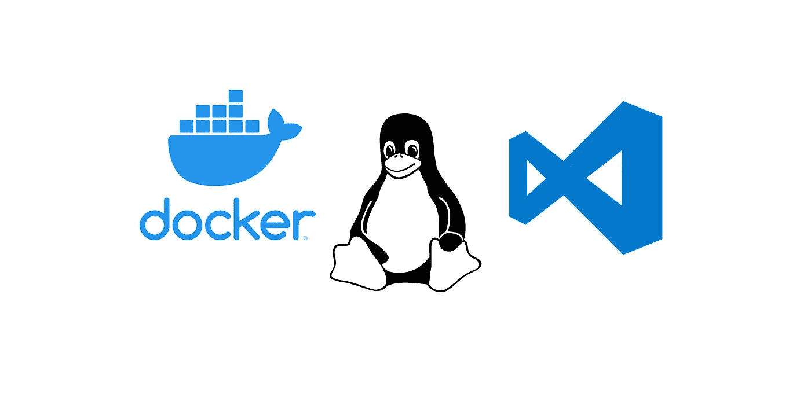

如果您是 Windows 用户，本教程将帮助您在 Linux 环境中设置 docker 容器，并通过 Visual Studio 代码的本地安装连接到它。如果您需要运行 Docker for Linux，但不想使用虚拟机(VM)或进行双引导，这种设置非常适合您。

# 设置 WSL2

为了访问 Linux 机器，我们将使用 WSL2——但是什么是 wsl 2，我们为什么要使用它？

WSL 代表 Linux 的 Windows 子系统。传统上，要访问一台 Linux 机器，Windows 用户必须安装一台虚拟机，如 [VirtualBox](https://www.virtualbox.org/) 或进行双引导设置。这两种选择都需要分配资源——比如 CPU 和存储——但是 WSL 消除了这种开销。顾名思义， [WSL2](https://docs.microsoft.com/en-us/windows/wsl/about) 是 WSL 的升级版本，旨在提高文件系统性能并增加完整的系统调用功能。

## 安装 WSL2

第一步是安装 WSL2。更详细的安装说明可以通过[微软的文档](https://docs.microsoft.com/en-us/windows/wsl/install-win10#manual-installation-steps)找到，但是下面总结了步骤。

1.  以管理员身份打开 Powershell 终端
2.  运行以下命令来启用 WSL。

```
dism.exe /online /enable-feature /featurename:Microsoft-Windows-Subsystem-Linux /all /norestart
```

2.接下来，启用虚拟机平台功能。

```
dism.exe /online /enable-feature /featurename:VirtualMachinePlatform /all /norestart
```

3.重启你的机器。

4.下载 [WSL2 Linux 内核更新包](https://wslstorestorage.blob.core.windows.net/wslblob/wsl_update_x64.msi)并运行。

5.将 WSL2 设置为默认版本。

```
wsl --set-default-version 2
```

6.从[微软商店](https://aka.ms/wslstore)安装 Linux 发行版。在本教程中，我们使用的是 Ubuntu 18.04 LTS 版本。

7.返回到 Powershell 终端。安装 Linux 发行版后，通过运行以下命令检查它的 WSL 版本。

```
wsl --list --verbose
```

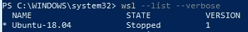

在上图中，Ubuntu 18.04 的 WSL 版本是 1。如果您安装的发行版的 WSL 版本是 1，请通过运行以下命令将其更新为 WSL2。

```
wsl --set-version <distribution name> 2
```

现在，验证 WSL 版本已经更新到 2。

```
wsl --list --verbose
```

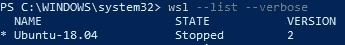

# 通过 Docker 桌面安装 Docker

在创建容器之前，我们需要在新的 Linux 主机上设置 Docker。我们将使用 [Docker 桌面](https://www.docker.com/products/docker-desktop)，因为它为运行 Docker 提供了一个易于使用的开发环境。

1.  安装 [Docker Desktop for Windows](https://docs.docker.com/desktop/windows/install/) ，通过 Windows 开始菜单打开应用。在*设置- >常规*下，确保选择“使用基于 WSL 2 的引擎”。

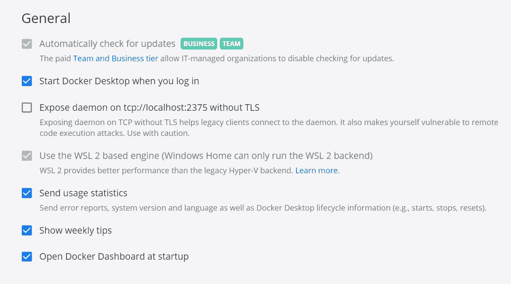

2.在*设置- >资源- > WSL 集成*下，确保您下载的 Linux 发行版(在我们的例子中是 Ubuntu 18.04)已启用。

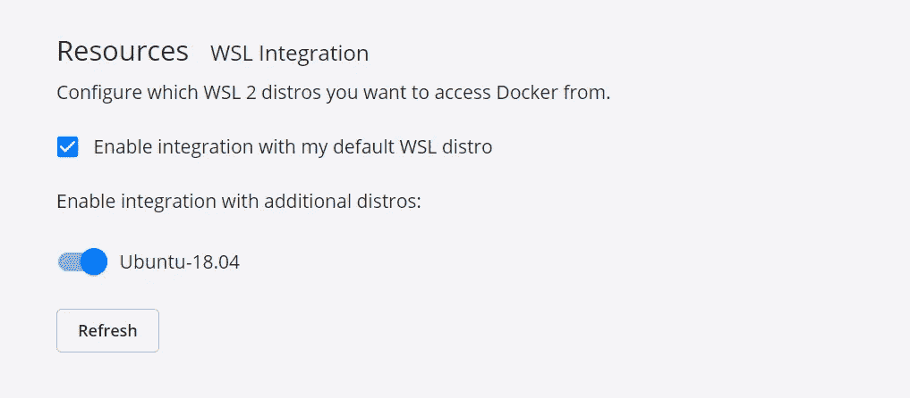

3.从 Windows“开始”菜单打开您之前从 Microsoft Store 下载的 Linux 发行版。当你打开应用程序时，会出现一个终端窗口。


要确认 docker 已安装，请运行:

```
docker --version
```

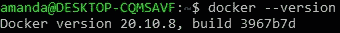

4.现在运行 [hello-world](https://hub.docker.com/_/hello-world) 来确认 Docker 安装正确。

```
docker run hello-world
```

如果您的安装工作正常，您将看到以下输出:

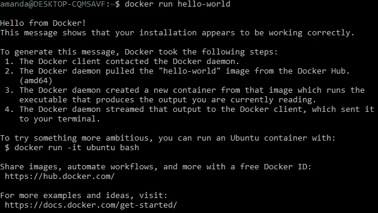

# 创建 Docker 容器

现在我们已经安装了 docker，让我们创建一个容器。首先，我们需要创建一个图像(用于构建容器的模板)。虽然我们可以手动构建我们的映像，但最有效的方法是使用 Dockerfile，因为它可以自动完成这个过程。它是一个简单的文本文件，包含了组装图像所需的命令列表。

1.  首先创建一个名为“myproject”的目录，我们的项目存储库将存储在这个目录中，并导航到这个目录中。

```
mkdir myproject && cd myproject
```

2.现在使用 nano 文本编辑器创建一个 Dockerfile 文件。要安装 nano，请运行以下命令。

```
sudo apt updatesudo apt install nano
```

现在创建 Dockerfile 文件。

```
nano Dockerfile
```

nano 文本编辑器将打开您刚刚创建的 docker 文件。有许多方法可以创建一个 [Dockerfile](https://docs.docker.com/engine/reference/builder/) 来指定你的需求，但是我们将创建一个简单的。用下列内容填充它。

```
FROM python:3 # the base image WORKDIR /<username>/myproject # set the project directoryCOPY . . # copy all the project files to the container
```

使用 CTRL + X 和 CTRL + Y 退出编辑器并保存文件。

4.现在我们有了 docker 文件，让我们用它来创建我们的形象。我们将运行带有-t 选项的 [docker build](https://docs.docker.com/engine/reference/commandline/build/) 命令来添加一个标签。

```
docker build -t <username>/myproject .
```

5.验证映像是否构建正确。

```
docker images
```

您应该看到您的图像被列出，在 REPOSITORY 字段下有 <username>/myproject。</username>

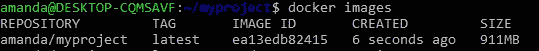

6.现在通过运行映像创建一个容器。记下上一步中显示的图像 id，并在下面的命令中使用它。

```
docker run -i -t <image id> /bin/bash
```

如果您的映像启动正常，您应该以 root 用户的身份进入 docker 容器。

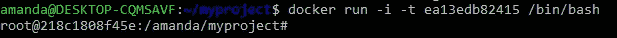

7.打开一个新的终端窗口并运行

```
docker ps
```

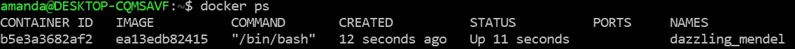

将列出所有正在运行的容器。通过查找图像的 id 来验证您的容器正在运行。记下 Docker 为您的容器指定的名称。在上面的例子中，它是“耀眼的孟德尔”。

# 在 Visual Studio 代码中设置远程开发

现在我们已经运行了我们的容器，我们需要一个 IDE。我们将使用 Visual Studio 代码，因为它为远程开发提供了扩展。

1.  为 Windows 安装 [Visual Studio 代码。](https://code.visualstudio.com/download)

2.打开 Visual Studio 代码并安装远程开发扩展。这将允许我们连接到运行在我们的 Linux 主机上的容器。

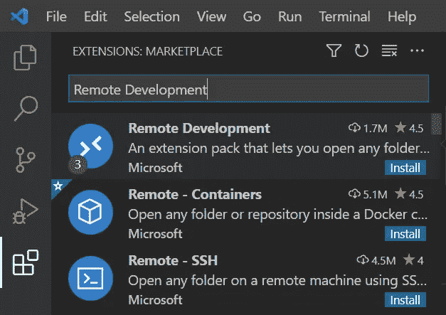

2.如果安装了远程开发，左下角会出现一个绿色图标。点击它连接到我们的容器。

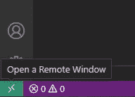

3.将出现一组选项。点击“附加到运行容器”。

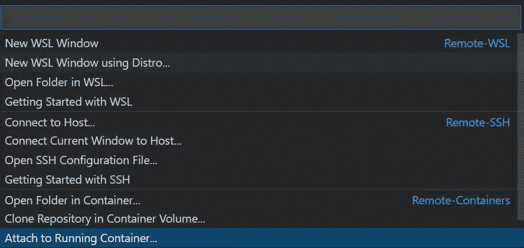

4.将显示正在运行的容器列表。单击您创建的那个。您可以通过运行 docker ps 找到的容器名来识别它。在本例中，我们的容器名称为“炫目 _mendel”。

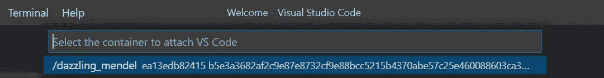

当您选择希望连接到新的 Visual Studio 代码窗口的容器时，将会打开。左下角的绿色栏将显示您的容器名称。

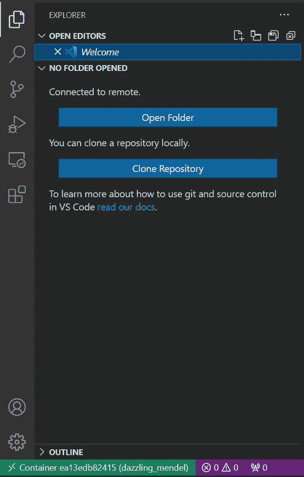

祝贺您，您已经完成了开发环境的设置！现在，您可以在 Visual Studio 代码的本机安装上直接在 docker 容器中编辑文件。

# 在新的开发环境中工作

既然开发环境已经设置好了，这里有一些关于从哪里开始的基本提示。

要打开你的项目文件夹，点击*文件- >打开文件夹* ，搜索 */ <用户名> /myproject* 。

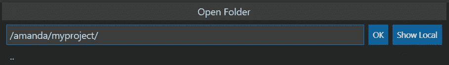

该窗口将重新加载并打开您的项目文件夹，其中包含我们之前创建的 Dockerfile。您可以在此添加项目文件。

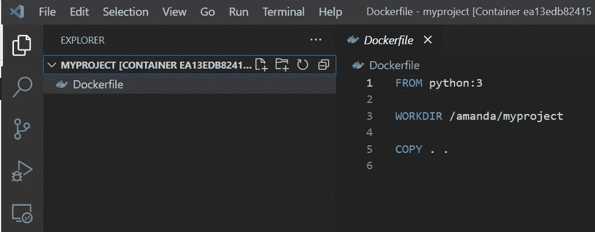

若要直接在 Visual Studio 代码中访问容器的命令行，请打开一个新的终端。只需进入*终端- >新建终端*。

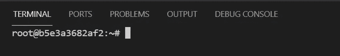

如果您想在 docker 容器之外打开本地文件，您仍然可以这样做。只需导航到*文件- >打开文件- >显示本地*。

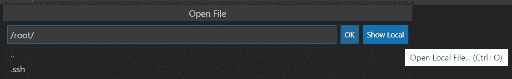

要停止您的 docker 容器，请使用您的容器名运行 [docker stop](https://docs.docker.com/engine/reference/commandline/stop/) (在本例中为 stalling _ Mendel)。

```
docker stop <container name>
```

要验证容器是否已退出，请运行。

```
docker ps -a
```

将显示所有容器(运行或未运行)的列表。您的容器的状态应该是“已退出”

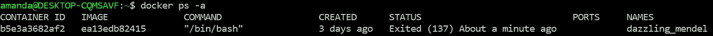

要再次启动容器，请运行以下命令。

```
docker run <container name>
```

# 结论

现在您知道了如何在 Linux 主机上设置 Docker 容器，并通过 Visual Studio 代码远程连接到它——所有这些都不需要向 VirtualBox 分配资源或双引导设置。下一步是开始开发应用程序，并在隔离的 docker 容器上安装任何依赖项。编码快乐！